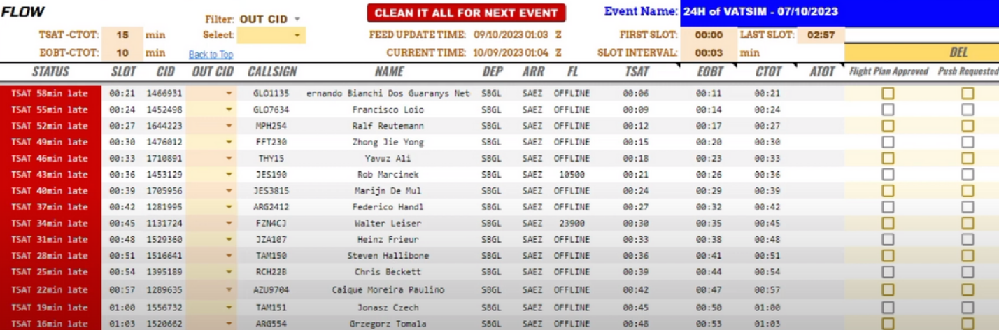
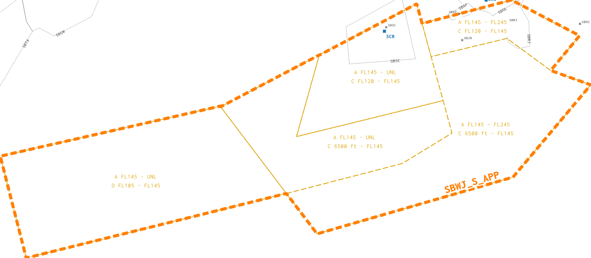
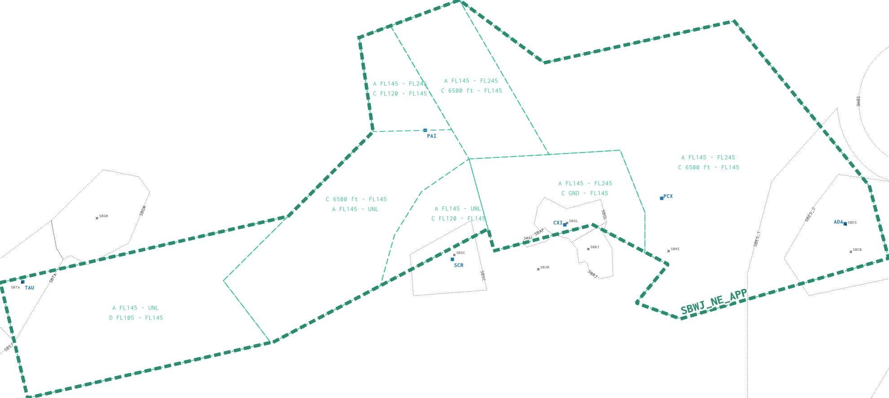
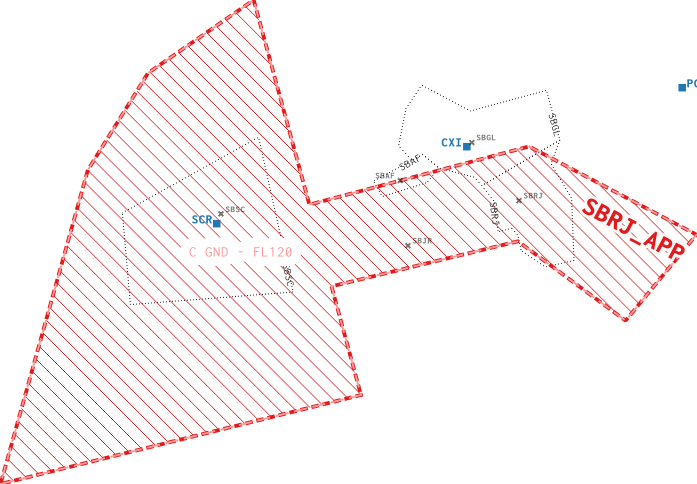

--8<-- "includes/abreviacoes.md"

<figure markdown="span">
  { : style="height:300px" }
  <figcaption>Check out the event briefing by <a href="https://my.vatsim.net/events/vatsim-elite-wings" target="_blank">clicking here</a>.</figcaption>
</figure>

## Flow Control (`SBSP_TMU`)

???info "Important"
    For this event, slot control will be handled by the VATBRZ Event Manager (made by Alan Zeidan).

    { : style="height:300px" }

Because of slot control, this event will have a coordinator, who will be online on the network as `SBSP_TMU`.

The coordinator will be responsible for filling in the slot control, managing the pushback queue and coordinating traffic management initiatives (TMI), such as ground stops or delays of any kind. Flow control measures will only be adopted by the `TMU`, either on its own initiative or at the request of any ATC involved in the event.

## Clearance Delivery (`SBSP_DEL`)

Responsible for checking flight plans and issuing clearances to all traffic, whether participating in the event or not.

### Key Checkpoints

When handling event traffic, pay close attention to the following items:

* **Route**: Must contain the official event route, `NIBRU UZ171 KEVUN`.
* **FL**: Must contain an odd level, suited to the short distance of the route.

## Ground Control - São Paulo (`SBSP_GND`)

## Tower Control - São Paulo (`SBSP_TWR`)

## São Paulo Control (`SBXP_APP`)

## Rio Control (SBWJ)

### Sectorization

#### RJ Feeder (`SBWJ_S_APP`)

#### GL Feeder (`SBWJ_NE_APP`)

#### RJ Final (`SBWJ_RJ_APP`)

## Tower Control - Rio de Janeiro (`SBRJ_TWR`)

## Ground Control - Rio de Janeiro (`SBRJ_GND`)
