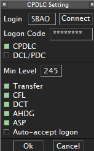

--8<-- "includes/abreviacoes.md"

Three subsystems need to be right at the same time: the client with the correct sector, audio with the right transceivers, and the datalink. A failure in any of them only shows up when the first aircraft calls.

The version to check on the spot is in [Checklists](checklists.en.md#abertura-da-posicao).

## Authorization { #autorizacao }

| Requirement    | Value                                                        |
| -------------- | ------------------------------------------------------------ |
| ATC Roster     | Be on the VATSIM Brasil roster[^1]                           |
| Minimum rating | **C1**, required for oceanic `_FSS` positions[^2]            |
| Endorsement    | **Tier 2 "Oceanic Positions"**, which covers `SBAO_*_FSS`[^3] |

!!! warning "No endorsement, no connection"
    There is no *top-down* coverage that authorizes taking the Atlântico FIR without the endorsement. The policy only provides for the reverse: whoever is on a higher position without the endorsement must disconnect as soon as the endorsed controller leaves[^4].

## Client and sector

1. Confirm that the installed **SBAO** package is on the current AIRAC cycle. An outdated sector produces boundaries and fixes that do not match the pilot's flight plan.
2. Open the **radar profile**, not the ground profile[^5].
3. If coming from another FIR, **restart EuroScope**. Changing only the sector or the ASR is not enough[^5].
4. Spread the visibility points across the extent of the sector, paying attention to the entry boundaries: the boundary with Recife ACC to the west, the 010° W meridian to the east and the AORRA gates to the south.

Installation is described in [Fundamentals, EuroScope Installation](../../../fundamentos/softwares/euroscope/instalacao.en.md).

## Connection and audio

1. Connect with the exact callsign of the position, as per [the positions table](estrutura.en.md#posicoes-na-vatsim).
2. Use the position's VATSIM frequency as primary. Only one primary frequency is allowed[^6].
3. Open **TrackAudio after** EuroScope is connected and click `CONNECT`[^7].
4. **Manually** tick `RX` and `TX`. TrackAudio does not enable frequencies on its own[^7].
5. **Enable `XCA`.** Without cross-coupling, two aircraft on the same frequency at distant points of the FIR may not hear each other[^7].
6. Remove from the interface the frequencies you are not going to operate[^7].

!!! info "Real world and simulation"
    In real-world aviation, voice with the Atlântico ACC is on HF, with variable propagation. On the network it is a stable VHF channel, whose range comes from the transceivers in the sector file and from `XCA`, not from the ionosphere. Use the VATSIM frequency for all contact; mention the HF frequency to the pilot only as context.

## Datalink

The published logon address is **`SBAO`**[^8]; for split sectors, use the code from the [positions table](estrutura.en.md#posicoes-na-vatsim).

In the configuration currently adopted by the division, the datalink is operated by the **TopSky** plugin that comes with the sector package, with a personal code obtained from **Hoppie ACARS**. Confirm this in the installed package before relying on it. Keep the message window visible during the session.

<figure markdown="span">
  { loading=lazy }
  <figcaption>Datalink configuration with the <code>SBAO</code> logon.</figcaption>
</figure>

!!! warning "The datalink is desirable, not essential"
    Without it the position remains operable: monitoring relies on [position reports](fluxo.en.md#reportes-de-posicao) and separations are the procedural time-based ones. State the unavailability in the *controller information* and on first contact.

## Controller information

One automatic network line plus **up to four lines of 76 characters**, in English, containing only information needed for the operation. Name, personal data and rating must not be included[^9].

```text
ATLANTICO CENTER | PROCEDURAL CONTROL | NO RADAR SURVEILLANCE
CPDLC/ADS-C LOGON SBAO | POSITION REPORTS IF NO DATALINK
REPORT: CALLSIGN, POSITION, TIME, LEVEL, NEXT POSITION/ETO, ENSUING
ONLINE UNTIL 2359Z | atc.vatsim.com.br/MOP/oceanico/
```

!!! example "Example"
    `2359Z` is illustrative; replace it with your expected disconnection time. Without datalink, replace the second line with `NO DATALINK | POSITION REPORTS MANDATORY`.

## Before announcing the position

1. **Check who is online**, especially `SBRE_CTR` and `SBCW_CTR`.
2. **Coordinate the opening** with each connected adjacent unit and agree on the transfer point.
3. **Survey the traffic** already inside the FIR or entering within the next 30 minutes.
4. **Rebuild the picture** for those who crossed with no ATC online: ask each one for a position report before issuing any clearance. The procedure is in [Operational flow](fluxo.en.md#entrada-sem-atc-online).
5. **Define the split**, if another qualified controller is available.

[^1]: **VATSIM, GCAP v2.0, item 6.1**.
[^2]: **VATSIM, GCAP v2.0, item 6.3**.
[^3]: **VATSIM, GCAP Designated Positions Overview**, AMAS region, VATBRZ division.
[^4]: **VATSIM, GCAP v2.0, item 6.1(a)**.
[^5]: **ATC Portal, Fundamentals, EuroScope Installation**.
[^6]: **VATSIM, ATC Frequency and Information Management Policy v1.2, item 5.1**.
[^7]: **ATC Portal, Fundamentals, Using TrackAudio**.
[^8]: **AIP-Brasil, ENR 3.5, item 9.2.1**.
[^9]: **VATSIM, ATC Frequency and Information Management Policy v1.2, items 5.4.2 to 5.4.6**.
