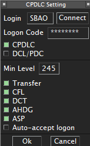

--8<-- "includes/abreviacoes.md"

Três subsistemas precisam estar certos ao mesmo tempo: cliente com o setor correto, áudio com os transceptores certos e enlace de dados. Falha em qualquer um só aparece quando a primeira aeronave chama.

A versão para conferir na hora está em [Checklists](checklists.pt.md#abertura-da-posicao).

## Autorização

| Requisito     | Valor                                                        |
| ------------- | ------------------------------------------------------------ |
| ATC Roster    | Constar do roster da VATSIM Brasil[^1]                       |
| Rating mínimo | **C1**, exigido para posições `_FSS` oceânicas[^2]           |
| Endorsement   | **Tier 2 "Oceanic Positions"**, que cobre `SBAO_*_FSS`[^3]   |

!!! warning "Sem endorsement, sem conexão"
    Não existe cobertura *top-down* que autorize assumir a FIR Atlântico sem o endorsement. A política prevê apenas o inverso: quem está em posição superior sem o endorsement deve desconectar assim que o controlador endossado sair[^4].

## Cliente e setor

1. Confirme que o pacote **SBAO** instalado está no ciclo AIRAC vigente. Setor desatualizado gera limites e fixos que não conferem com o plano de voo do piloto.
2. Abra o **perfil radar**, não o perfil solo[^5].
3. Vindo de outra FIR, **reinicie o EuroScope**. Trocar só o setor ou o ASR não basta[^5].
4. Distribua os pontos de visibilidade pela extensão do setor, com atenção às fronteiras de entrada: limite com o ACC Recife a oeste, meridiano 010° W a leste e portões da AORRA ao sul.

A instalação está descrita em [Fundamentos, Instalação do EuroScope](../../../fundamentos/softwares/euroscope/instalacao.pt.md).

## Conexão e áudio

1. Conecte com o indicativo exato da posição, conforme [a tabela de posições](estrutura.pt.md#posicoes-na-vatsim).
2. Use a frequência VATSIM da posição como primária. Só é permitida uma frequência primária[^6].
3. Abra o **TrackAudio depois** do EuroScope conectado e clique em `CONNECT`[^7].
4. Marque **manualmente** `RX` e `TX`. O TrackAudio não habilita frequências sozinho[^7].
5. **Ative o `XCA`.** Sem cross-coupling, duas aeronaves na mesma frequência em pontos distantes da FIR podem não se ouvir[^7].
6. Remova da interface as frequências que você não vai operar[^7].

!!! info "Real e simulação"
    Na aviação real a voz com o ACC Atlântico é em HF, com propagação variável. Na rede é um canal VHF estável, cujo alcance vem dos transceptores do arquivo de setor e do `XCA`, não da ionosfera. Use a frequência VATSIM para todo o contato; cite a HF apenas como contexto ao piloto.

## Enlace de dados

O endereço de logon publicado é **`SBAO`**[^8]; para desmembramentos, use o código da [tabela de posições](estrutura.pt.md#posicoes-na-vatsim).

Na configuração hoje adotada pela divisão, o enlace é operado pelo plugin **TopSky** que acompanha o pacote de setor, com código pessoal obtido no **Hoppie ACARS**. Confirme no pacote instalado antes de contar com isso. Mantenha a janela de mensagens visível durante a sessão.

<figure markdown="span">
  { loading=lazy }
  <figcaption>Configuração do enlace de dados com o logon <code>SBAO</code>.</figcaption>
</figure>

!!! warning "O enlace é desejável, não indispensável"
    Sem ele a posição continua operável: o acompanhamento passa a depender de [reportes de posição](fluxo.pt.md#reportes-de-posicao) e as separações são as procedurais por tempo. Informe a indisponibilidade no *controller information* e no primeiro contato.

## Controller information

Uma linha automática de rede mais **até quatro linhas de 76 caracteres**, em inglês, só com informação necessária à operação. Nome, dados pessoais e rating não podem constar[^9].

```text
ATLANTICO CENTER | PROCEDURAL CONTROL | NO RADAR SURVEILLANCE
CPDLC/ADS-C LOGON SBAO | POSITION REPORTS IF NO DATALINK
REPORT: CALLSIGN, POSITION, TIME, LEVEL, NEXT POSITION/ETO, ENSUING
ONLINE UNTIL 2359Z | atc.vatsim.com.br/MOP/oceanico/
```

!!! example "Exemplo"
    `2359Z` é ilustrativo, troque pelo seu horário previsto de desconexão. Sem enlace, substitua a segunda linha por `NO DATALINK | POSITION REPORTS MANDATORY`.

## Antes de anunciar a posição

1. **Veja quem está online**, em especial `SBRE_CTR` e `SBCW_CTR`.
2. **Coordene a abertura** com cada adjacente conectado e combine o ponto de transferência.
3. **Levante os tráfegos** já dentro da FIR ou que entram nos próximos 30 minutos.
4. **Reconstrua a situação** de quem atravessou sem ATC online: peça reporte de posição a cada um antes de emitir qualquer autorização. O procedimento está em [Fluxo operacional](fluxo.pt.md#entrada-sem-atc-online).
5. **Defina o desmembramento**, se houver outro controlador habilitado.

[^1]: **VATSIM, GCAP v2.0, item 6.1**.
[^2]: **VATSIM, GCAP v2.0, item 6.3**.
[^3]: **VATSIM, GCAP Designated Positions Overview**, região AMAS, divisão VATBRZ.
[^4]: **VATSIM, GCAP v2.0, item 6.1(a)**.
[^5]: **Portal ATC, Fundamentos, Instalação do EuroScope**.
[^6]: **VATSIM, ATC Frequency and Information Management Policy v1.2, item 5.1**.
[^7]: **Portal ATC, Fundamentos, Utilização do TrackAudio**.
[^8]: **AIP-Brasil, ENR 3.5, item 9.2.1**.
[^9]: **VATSIM, ATC Frequency and Information Management Policy v1.2, itens 5.4.2 a 5.4.6**.
