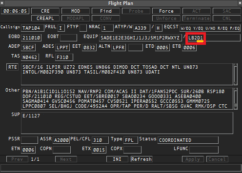
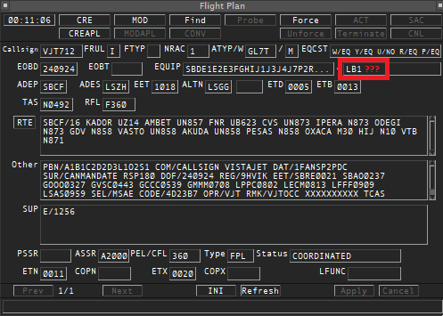
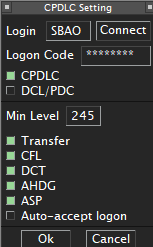
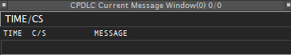

Pela cobertura extensa sobre o Oceano, o ACC Atlântico carece da existência de controle radar e de comunicação rádio de alta qualidade, pela impossibilidade de instalação de antenas. Por conta disso, controlar o Atlântico exige o conhecimento de procedimentos alternativos de controle e comunicação, que dependem da capacidade operacional da aeronave que voa no espaço aéreo.

É necessário que o controlador conheça todos esses procedimentos e os utilize conforme a necessidade operacional.

## Procedimentos de Controle

O Atlântico não opera usando controle radar. A posição vertical e lateral da aeronave é estimada por meio de dois métodos: via **ADS-C** ou via **reporte de posição**.

### ADS-C

Está cada vez mais comum o uso da **Vigilância Dependente Automática por Contrato**[^1] (ADS-C) como suporte para o exercício do Controle no Atlântico. O ADS-C é um sistema em que o equipamento a bordo das aeronaves transmite, automaticamente, informações do sistema de navegação para o sistema instalado em terra por meio de um enlace de dados (datalink) e em conformidade com certas regras (contrato) quanto à periodicidade das transmissões e conteúdo das informações. Essas informações são apresentadas ao controlador de tráfego aéreo de forma semelhante aos dados obtidos pelo radar.

[^1]: Tradução de *Automatic Dependent Surveillance - Contract*.

#### Pré-Requisitos

Para confirmar a viabilidade do serviço via ADS-C a uma aeronave que irá voar no Atlãntico, o Controlador deve:

**1. Verificar a existência do equipamento a bordo da aeronave.**

Confira no plano de voo da aeronave, especialmente no item 10b, a existência do grupo `D1`.

<table>
<tr>
<td>
<figure markdown="span">
    
    <figcaption>Aeronave habilitada a operar ADS-C no Atlântico (presença do grupo <b>D1</b> no item 10b).</figcaption>
</figure>
</td>
<td>
<figure markdown="span">
    
    <figcaption>Aeronave não-habilitada a operar ADS-C no Atlântico (ausência do grupo <b>D1</b> no item 10b).</figcaption>
</figure>
</td>
</tr>
</table>

**2. Confirmar a conexão do CPDLC da aeronave com o controle.**

Como os dados são transmitidos via satélite mediante contrato, só é possível adotar esse método de controle quando a conexão CPDLC estiver ativa.

Para tal, ao usar o [TopSky](https://forum.vatsim-scandinavia.org/d/34-topsky-plugin-241), certifique-se que:

 1. Crie seu código de login no [site do Hoppie](https://www.hoppie.nl/acars). 
 2. No TopSky, faça sua conexão, usando um dos códigos oficiais em *Login* e sua chave em *Logon Code*, marcando as caixas conforme a imagem abaixo.

    <figure markdown="span">
        { height=100% }
        <figcaption>Tela de conexão do CPDLC no TopSky.</figcaption>
    </figure>

 3. Monitore o conteúdo da tela *CPDLC Current Message Window* *(Menu Tools > CPDLC > Current Messages...)*, para lidar com os pedidos de conexão e troca de mensagens.
    
    <figure markdown="span">
        { width=100% }
        <figcaption>Tela de Mensagens no TopSky.</figcaption>
    </figure>

#### Operacionalização

???+ warning "Atenção!"
    O pedido de conexão ao CPDLC deve vir de 5 a 20 minutos ANTES da entrada da FIR, a não ser se for feita uma transferência de outro ACC operando em CPDLC.

1. Ao receber o pedido de login de CPDLC, **avalie** e **aceite**, aguardando a mensagem `CONNECTED`, confirmando a conexão.
2. Verifique na tag se o callsign está entre colchetes (por exemplo, `[UAE262]`), confirmando a carga de dados via CPDLC.
3. Execute um **Cheque de Selcal**.

### Reportes de Posição

Em Construção

## Procedimentos de Comunicação

Em Construção

<!-- - Centro Atlântico / Atlântico Center
- CPDLC AVBL IN [SBAO] / ADS-C SIMUL / RADAR NOT AVBL / Oceanic Clearance not required
- When ADC-C is not available, position reports are mandatory and shall include: waypoint you're passing now, time when you passed it, flight level and mach speed, next waypoint and ETA and the following waypoint.

- Hello. You're bound to enter SBAO FIR. Please, on initial contact, perform a position report. If you'd like to simulate ADS-C, login to SBAO on CPDLC. Thanks a lot. -->

<!-- <AEA122>
DAKAP ----- 2208Z FL390 .84
VAMUS 2232Z 2232Z FL390 .84
MOTBU 2256Z 2256Z FL390 .84
MOVGA 2312Z
AMDOL -->