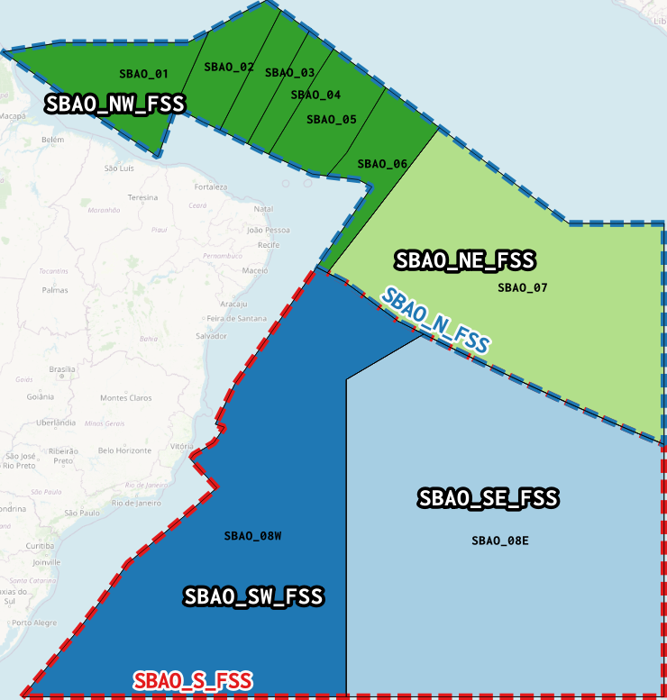

## Classificação

| Espaço Aéreo  | Classificação | Limites Verticais | Serviço Prestado      |
|:-------------:|:-------------:|:-----------------:|:---------------------:|
| UTA Atlântico | `A`           | FL245 - UNL       | ATCS sem radar        |
| FIR Atlântico | `G`           | GND - FL245       | FIS/ALRS Limitado O/R |

## Setorização

A FIR Atlântico está atualmente dividida da seguinte forma:

### Posição Geral

| Identificação | Código CPDLC                                       | Frequência (kHz) | Frequência (*alias*) |
|:-------------:|:--------------------------------------------------:|:----------------:|:--------------------:|
| **SBAO_FSS**  | :material-checkbox-marked-circle:{ .corok } `SBAO` | 4669             | 133.500              |

### Supercombinados

| Identificação  | Código CPDLC                                       | Setores             | Frequência (kHz) | Frequência (*alias*) |
|:--------------:|:--------------------------------------------------:|:-------------------:|:----------------:|:--------------------:|
| **SBAO_N_FSS** | :material-checkbox-marked-circle:{ .corok } `SJAN` | 1, 2, 3, 4, 5, 6, 7 | 13315            | 133.025              |
| **SBAO_S_FSS** | :material-checkbox-marked-circle:{ .corok } `SJAS` | 8                   | 10096            | 133.125              |

### Combinados

| Identificação   | Código CPDLC                                       | Setores          | Frequência (kHz) | Frequência (*alias*) |
|:---------------:|:--------------------------------------------------:|:----------------:|:----------------:|:------------------:|
| **SBAO_NW_FSS** | :material-checkbox-marked-circle:{ .corok } `SJNW` | 1, 2, 3, 4, 5, 6 | 8861             | 133.275            |
| **SBAO_NE_FSS** | :material-checkbox-marked-circle:{ .corok } `SJNE` | 7                | 17955            | 133.075            |
| **SBAO_SW_FSS** | :material-checkbox-marked-circle:{ .corok } `SJSW` | 8W               | 8855             | 133.450            |
| **SBAO_SE_FSS** | :material-checkbox-marked-circle:{ .corok } `SJSE` | 8E               | 5565             | 133.325            |

## Mapa Geral dos Combinados

<!-- { align=left } -->

!!! info "Uma informação"

    Selecione o combinado no canto superior direito do mapa para visualizar o limite lateral no mapa.

<!--
Daqui pra baixo, são os mapas.
-->
<link rel="stylesheet" href="https://unpkg.com/leaflet@1.9.4/dist/leaflet.css"
   integrity="sha256-p4NxAoJBhIIN+hmNHrzRCf9tD/miZyoHS5obTRR9BMY="
   crossorigin=""/>

<!-- SB
SD - RE
SJ - AO
SN - AZ
SS - CW
SW - BS -->