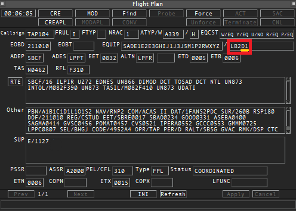
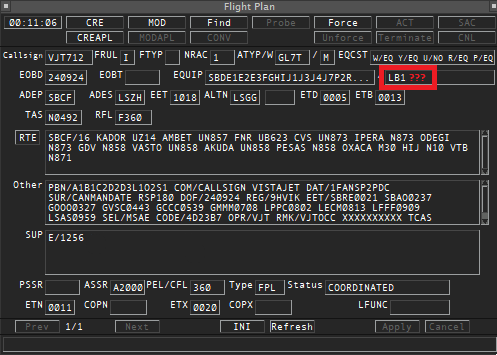

--8<-- "includes/abreviacoes.md"

Without radar, the flight plan is the only description you have of the aircraft's intentions, and the declared capabilities determine which separation minimum can be applied.

## What to check, in order

| # | Field                               | What it is for                                        |
| - | ----------------------------------- | ----------------------------------------------------- |
| 1 | Route                               | Reporting points and the adjacent unit on exit        |
| 2 | Level                               | Compatibility with the applicable table of levels     |
| 3 | Speed as a Mach number              | Basis of the Mach number technique                    |
| 4 | Entry point and estimate            | Basis of all longitudinal separation                  |
| 5 | Item 10a                            | CPDLC, PBN approval and RVSM approval                 |
| 6 | Item 10b                            | ADS-C                                                 |
| 7 | Item 18                             | PBN, SELCAL, RSP and FIR estimates                    |

Items 1 to 4 tell you **where and when**. Items 5 to 7 tell you **with what capability**. Without both groups there is no way to choose the separation.

## Speed and estimate

The cruising speed is given in item 15 with the letter `M` followed by three digits, for example `M082` for Mach 0.82[^1]. **Without a declared Mach number, the Mach number technique cannot be planned** and the value will have to be requested from the pilot.

The estimate over the entry point arrives through three channels, in this order of reliability:

1. Coordination from the adjacent unit.
2. Item 18, indicator `EET/`, for example `EET/SBAO0234`.
3. Your own calculation, which is an assumption and must be confirmed on first contact.

## Capabilities that change separation

These three are the ones that decide the minimum. Confirm all three before planning around any conflict.

| Capability | How it appears                                 | If absent                                                        |
| ---------- | ---------------------------------------------- | ---------------------------------------------------------------- |
| **RVSM**   | Letter `W` in item 10[^2]                      | Vertical separation of 2,000 ft between FL 290 and FL 410[^3]    |
| **RNP 10** | Letter `R` in item 10, with `PBN/` in item 18[^4] | Lateral separation of 100 NM[^5]                              |
| **ADS-C**  | Group `D1` in item 10b[^6]                     | Mandatory position reports by CPDLC or voice                     |

An aircraft not approved for RVSM carries `STS/NONRVSM` in item 18; one not certified RNP 10 carries `RMK/NONRNP10`[^3] [^5].

## Item 10: what to look for

**Left-hand side**, communication and navigation[^7]:

| Code          | Meaning                              |
| ------------- | ------------------------------------ |
| `J2` to `J7`  | CPDLC FANS 1/A                       |
| `J5` `J6` `J7` | CPDLC FANS 1/A via **SATCOM**       |
| `J1`          | CPDLC ATN, does **not** serve this FIR |
| `P2`          | CPDLC RCP 240                        |
| `R`           | PBN approved                         |
| `W`           | RVSM approved                        |
| `H`           | HF RTF                               |

**Right-hand side**, surveillance[^6]: `D1` is ADS-C FANS 1/A, which is the capability used in this FIR. `G1` is ADS-C ATN.

!!! info "FANS 1/A via SATCOM is the requirement"
    To use ADS-C and CPDLC in the Atlântico FIR the aircraft needs FANS 1/A, and the required subnetwork is **SATCOM**[^8]. A `J1` on its own indicates an ATN link, which does not serve.

<figure markdown="span">
  { loading=lazy }
  <figcaption>With ADS-C: the <code>D1</code> group is present.</figcaption>
</figure>

<figure markdown="span">
  { loading=lazy }
  <figcaption>Without ADS-C: the <code>D1</code> group is absent.</figcaption>
</figure>

!!! warning "Item 18 does not replace item 10b"
    It is common to see `SUR/RSP180` in item 18 without `D1` in item 10b. The `SUR/` indicator is for RSP specifications and for surveillance **not specified in item 10**[^9], and it does not stand in for an ADS-C declaration. Treat the aircraft as having no ADS-C until the pilot confirms otherwise.

## Item 18: useful indicators

| Indicator | Content                           | Example         |
| --------- | --------------------------------- | --------------- |
| `PBN/`    | Navigation specifications[^4]     | `PBN/A1B1C1D1`  |
| `SUR/`    | RSP specifications[^9]            | `SUR/RSP180`    |
| `SEL/`    | SELCAL code[^10]                  | `SEL/FKLM`      |
| `EET/`    | Accumulated estimates to the FIR  | `EET/SBAO0234`  |
| `DAT/`    | Data link capabilities            | `DAT/1FANS2PDC` |

Without `SEL/`, no selective calling is possible: the only way to recover a silent aircraft becomes a voice call.

## Declared is not available

!!! danger "The most important distinction on this page"
    Nothing on VATSIM verifies certification. A `D1` in the flight plan does **not** guarantee a data link logon, and the pilot may not even know how to operate the feature.

    **Confirm on first contact.** Until the capability shows itself in practice, apply the separation corresponding to the capability you **observe**, not the one that was declared.

If the aircraft reports a navigation, communication or surveillance degradation at any time, the minimum that depended on that capability no longer applies: reassess the affected pairs and establish another form of separation before the previous one is infringed[^11]. The procedure is in [Coordination and contingencies](coordenacao.en.md).

[^1]: **MCA 100-11, item 2.2.6.1**.
[^2]: **AIP-Brasil, ENR 2.2, item 1.8.1**.
[^3]: **AIP-Brasil, ENR 2.2, items 1.6 and 1.9.3**.
[^4]: **MCA 100-11, item 2.2.4.2.6**.
[^5]: **AIP-Brasil, ENR 3.5, items 6.2.2 and 8.6.4**.
[^6]: **MCA 100-11, item 2.2.4.3.4.2**.
[^7]: **MCA 100-11, item 2.2.4.2.2**.
[^8]: **AIP-Brasil, ENR 3.5, item 9.1.2**.
[^9]: **MCA 100-11, items 2.2.4.4 and 2.2.8.1.6**.
[^10]: **MCA 100-11, item 2.2.8.1.12**, and **AIP-Brasil, ENR 3.5, item 9.4.3.2**.
[^11]: **ICA 100-37, Arts. 337 and 382**.
