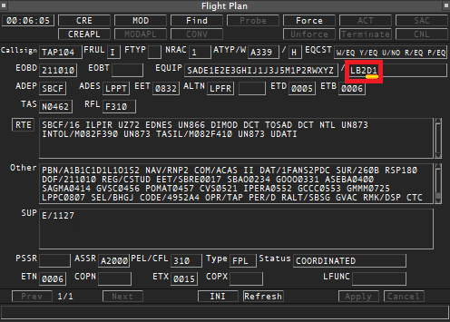
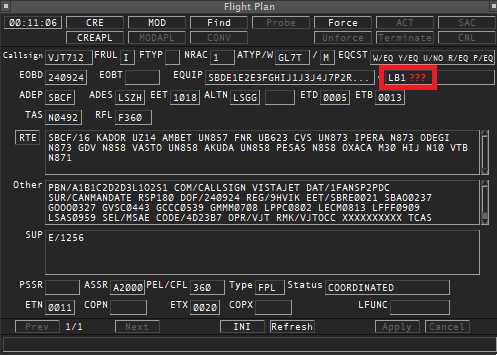

--8<-- "includes/abreviacoes.md"

Sem radar, o plano de voo é a única descrição que você tem da intenção da aeronave, e as capacidades declaradas determinam qual mínima de separação pode ser aplicada.

## O que conferir, na ordem

| # | Campo                               | Para quê                                              |
| - | ----------------------------------- | ----------------------------------------------------- |
| 1 | Rota                                | Pontos de notificação e adjacente de saída            |
| 2 | Nível                               | Compatibilidade com a tabela de níveis aplicável      |
| 3 | Velocidade em número Mach           | Base da técnica do número Mach                        |
| 4 | Ponto e estimado de entrada         | Base de toda a separação longitudinal                 |
| 5 | Item 10a                            | CPDLC, aprovação PBN e aprovação RVSM                 |
| 6 | Item 10b                            | ADS-C                                                 |
| 7 | Item 18                             | PBN, SELCAL, RSP e estimados de FIR                   |

Os itens 1 a 4 dizem **por onde e quando**. Os itens 5 a 7 dizem **com que capacidade**. Sem os dois grupos não há como escolher a separação.

## Velocidade e estimado

A velocidade de cruzeiro vem no item 15 com a letra `M` e três algarismos, por exemplo `M082` para Mach 0.82[^1]. **Sem número Mach declarado, a técnica do número Mach não pode ser planejada** e o valor terá de ser pedido ao piloto.

O estimado sobre o ponto de entrada chega por três caminhos, nesta ordem de confiabilidade:

1. Coordenação do órgão adjacente.
2. Item 18, indicador `EET/`, por exemplo `EET/SBAO0234`.
3. Cálculo próprio, que é hipótese e precisa ser confirmado no primeiro contato.

## Capacidades que mudam a separação

Estas três são as que decidem a mínima. Confirme as três antes de planejar qualquer conflito.

| Capacidade | Como aparece                                   | Se ausente                                                       |
| ---------- | ---------------------------------------------- | ---------------------------------------------------------------- |
| **RVSM**   | Letra `W` no item 10[^2]                       | Separação vertical de 2.000 pés entre o FL 290 e o FL 410[^3]     |
| **RNP 10** | Letra `R` no item 10, com `PBN/` no item 18[^4] | Separação lateral de 100 NM[^5]                                  |
| **ADS-C**  | Grupo `D1` no item 10b[^6]                     | Reportes de posição obrigatórios por CPDLC ou voz                |

Aeronave não aprovada RVSM traz `STS/NONRVSM` no item 18; não certificada RNP 10 traz `RMK/NONRNP10`[^3] [^5].

## Item 10: o que procurar

**Lado esquerdo**, comunicação e navegação[^7]:

| Código        | Significado                          |
| ------------- | ------------------------------------ |
| `J2` a `J7`   | CPDLC FANS 1/A                       |
| `J5` `J6` `J7` | CPDLC FANS 1/A por **SATCOM**       |
| `J1`          | CPDLC ATN, **não** atende esta FIR   |
| `P2`          | CPDLC RCP 240                        |
| `R`           | Aprovado PBN                         |
| `W`           | Aprovado RVSM                        |
| `H`           | HF RTF                               |

**Lado direito**, vigilância[^6]: `D1` é ADS-C FANS 1/A, que é a capacidade usada nesta FIR. `G1` é ADS-C ATN.

!!! info "FANS 1/A por SATCOM é o requisito"
    Para usar ADS-C e CPDLC na FIR Atlântico a aeronave precisa de FANS 1/A, e a sub-rede exigida é **SATCOM**[^8]. Um `J1` isolado indica enlace ATN, que não atende.

<figure markdown="span">
  { loading=lazy }
  <figcaption>Com ADS-C: presença do grupo <code>D1</code>.</figcaption>
</figure>

<figure markdown="span">
  { loading=lazy }
  <figcaption>Sem ADS-C: ausência do grupo <code>D1</code>.</figcaption>
</figure>

!!! warning "O item 18 não substitui o item 10b"
    É comum ver `SUR/RSP180` no item 18 sem `D1` no item 10b. O indicador `SUR/` serve a especificações RSP e a vigilância **não especificada no item 10**[^9], e não supre a declaração de ADS-C. Trate como sem ADS-C até o piloto confirmar o contrário.

## Item 18: indicadores úteis

| Indicador | Conteúdo                          | Exemplo         |
| --------- | --------------------------------- | --------------- |
| `PBN/`    | Especificações de navegação[^4]   | `PBN/A1B1C1D1`  |
| `SUR/`    | Especificações RSP[^9]            | `SUR/RSP180`    |
| `SEL/`    | Código SELCAL[^10]                | `SEL/FKLM`      |
| `EET/`    | Estimados acumulados até a FIR    | `EET/SBAO0234`  |
| `DAT/`    | Capacidades de enlace de dados    | `DAT/1FANS2PDC` |

Sem `SEL/`, não há chamada seletiva possível: a única forma de recuperar uma aeronave silenciosa passa a ser a chamada em voz.

## Declarado não é disponível

!!! danger "A distinção mais importante desta página"
    Nada na VATSIM verifica certificação. Um `D1` no plano **não** garante que haverá logon de enlace, e o piloto pode nem saber operar o recurso.

    **Confirme no primeiro contato.** Enquanto a capacidade não se manifestar na prática, aplique a separação correspondente à capacidade que você **observa**, não à que foi declarada.

Se a aeronave informar degradação de navegação, comunicação ou vigilância a qualquer momento, a mínima que dependia daquela capacidade deixa de valer: reavalie os pares afetados e estabeleça outra separação antes que a anterior seja infringida[^11]. O tratamento está em [Coordenação e contingências](coordenacao.pt.md).

[^1]: **MCA 100-11, item 2.2.6.1**.
[^2]: **AIP-Brasil, ENR 2.2, item 1.8.1**.
[^3]: **AIP-Brasil, ENR 2.2, itens 1.6 e 1.9.3**.
[^4]: **MCA 100-11, item 2.2.4.2.6**.
[^5]: **AIP-Brasil, ENR 3.5, itens 6.2.2 e 8.6.4**.
[^6]: **MCA 100-11, item 2.2.4.3.4.2**.
[^7]: **MCA 100-11, item 2.2.4.2.2**.
[^8]: **AIP-Brasil, ENR 3.5, item 9.1.2**.
[^9]: **MCA 100-11, itens 2.2.4.4 e 2.2.8.1.6**.
[^10]: **MCA 100-11, item 2.2.8.1.12**, e **AIP-Brasil, ENR 3.5, item 9.4.3.2**.
[^11]: **ICA 100-37, Arts. 337 e 382**.
