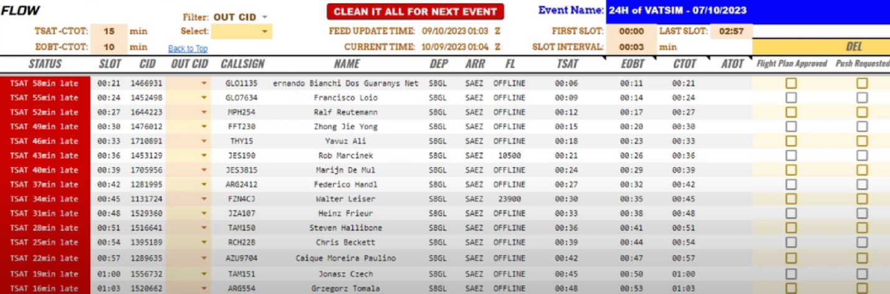
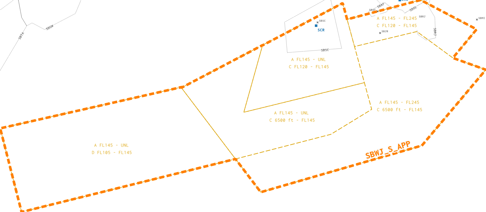
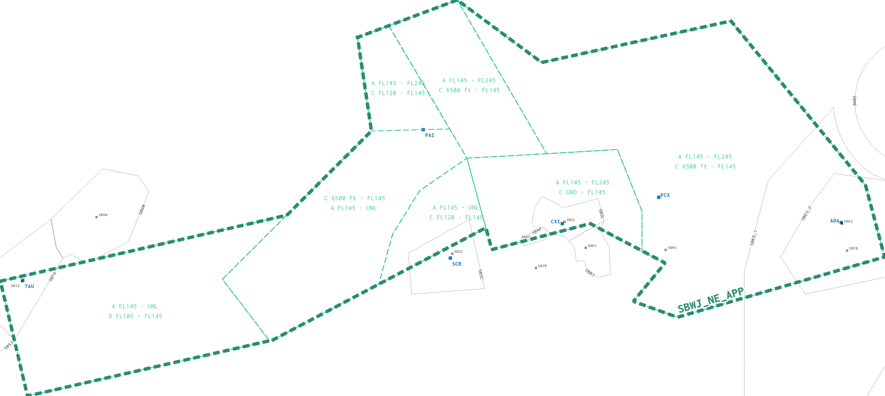
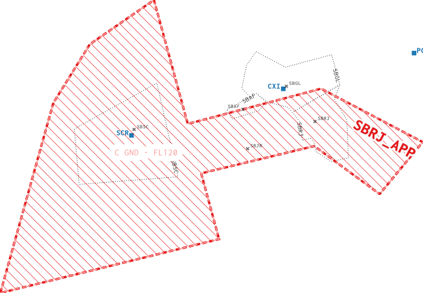

--8<-- "includes/abreviacoes.md"

<figure markdown="span">
  { : style="height:300px" }
  <figcaption>Confira o briefing do evento <a href="https://my.vatsim.net/events/vatsim-elite-wings" target="_blank">clicando aqui</a>.</figcaption>
</figure>

## Controle de Fluxo (`SBSP_TMU`)

???info "Importante"
    Para este evento, o controle de slots será feito pelo VATBRZ Event Manager (feito por Alan Zeidan).

    { : style="height:300px" }

Por conta do controle de slots, este evento contará com um coordenador, que estará online na rede como `SBSP_TMU`.

O coordenador será responsável por preencher o controle de slots, gerenciar a fila de pushbacks e coordenar iniciativas de gerenciamento de tráfegos (TMI), como suspensão de decolagens (*ground stop*) ou atrasos de qualquer tipo. A adoção de medidas de controle de fluxo será apenas realizada pelo `TMU`, seja por iniciativa própria, seja por solicitação de qualquer ATC envolvido no evento.

## Autorização de Tráfego (`SBSP_DEL`)

Está encarregado para a verificação do plano de voo e a autorização de tráfego para todos os tráfegos, seja participando de evento ou não.

### Pontos Importantes de Verificação

Ao lidar com tráfegos do evento, observe com atenção os seguintes itens:

* **Rota**: Deve conter a rota oficial do evento, `NIBRU UZ171 KEVUN`.
* **FL**: Deve conter um nível ímpar, aderente à curta distância da rota.

## Gerenciamento de Solo - São Paulo (`SBSP_GND`)

## Controle Local - São Paulo (`SBSP_TWR`)

## Controle São Paulo (`SBXP_APP`)

## Controle Rio (SBWJ)

### Setorização

#### Alimentador RJ (`SBWJ_S_APP`)

#### Alimentador GL (`SBWJ_NE_APP`)

#### Final RJ (`SBWJ_RJ_APP`)

## Controle Local - Rio de Janeiro (`SBRJ_TWR`)

## Gerenciamento de Solo - Rio de Janeiro (`SBRJ_GND`)

