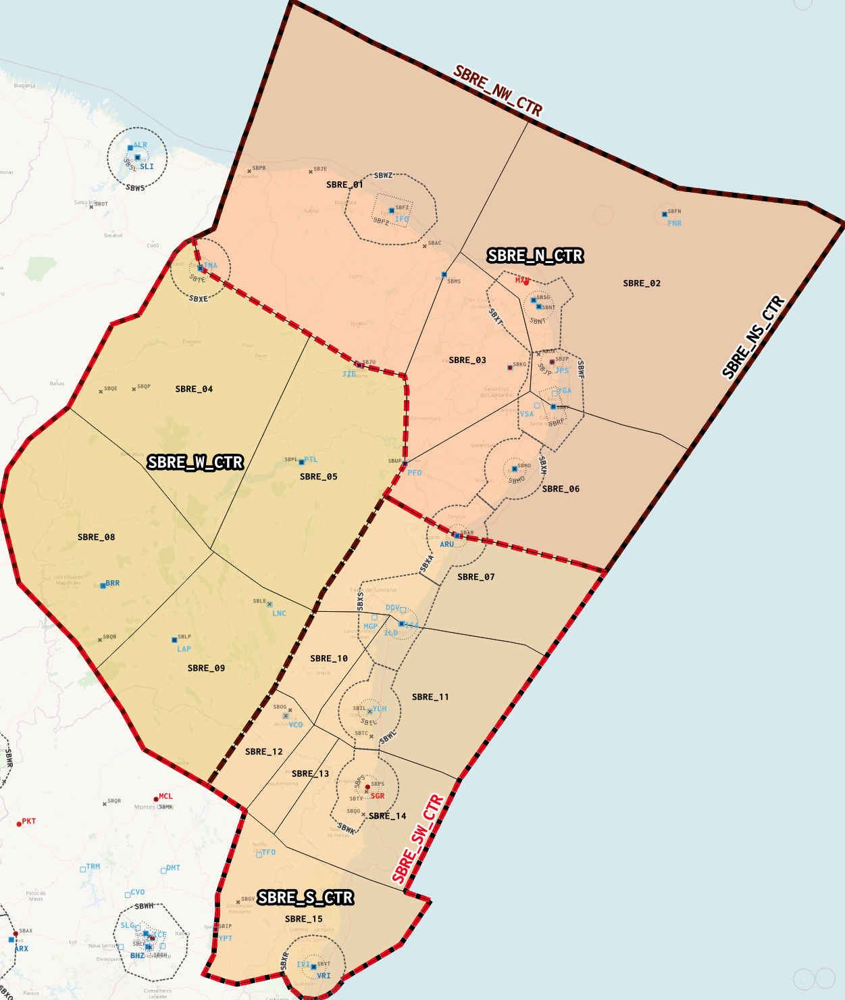

--8<-- "includes/abreviacoes.md"

## Setorização

### Combinados
- **SBRE_N_CTR**
    - Composto pela combinação (união) dos setores 1, 2, 3 e 6 da FIR Recife.
    - Frequência: 134.800 MHz
- **SBRE_W_CTR**
    - Composto pela combinação (união) dos setores 4, 5, 8 e 9 da FIR Recife.
    - Frequência: 124.550 MHz
- **SBRE_S_CTR**
    - Composto pela combinação (união) dos setores 7, 10, 11, 12, 13, 14 e 15 da FIR Recife.
    - Frequência: 125.100 MHz
### Supercombinados
- **SBRE_NS_CTR**
    - Composto pela combinação (união) dos combinados N e S da FIR Recife.
    - Frequência: 125.150 MHz
- **SBRE_NW_CTR**
    - Composto pela combinação (união) dos combinados N e W da FIR Recife.
    - Frequência: 126.100 MHz
- **SBRE_SW_CTR**
    - Composto pela combinação (união) dos combinados S e W da FIR Recife.
    - Frequência: 124.250 MHz
### Posição Geral
- **SBRE_CTR**
    - Composto pela combinação (união) de todos os combinados da FIR Recife.
    - Frequência: 125.400 MHz

 <!-- { : style="height:800px" } -->

!!! info "Uma informação"

    Selecione o combinado no canto superior direito do mapa para visualizar o limite lateral no mapa.

<!--
Daqui pra baixo, são os mapas.
-->
<link rel="stylesheet" href="https://unpkg.com/leaflet@1.9.4/dist/leaflet.css"
   integrity="sha256-p4NxAoJBhIIN+hmNHrzRCf9tD/miZyoHS5obTRR9BMY="
   crossorigin=""/>

