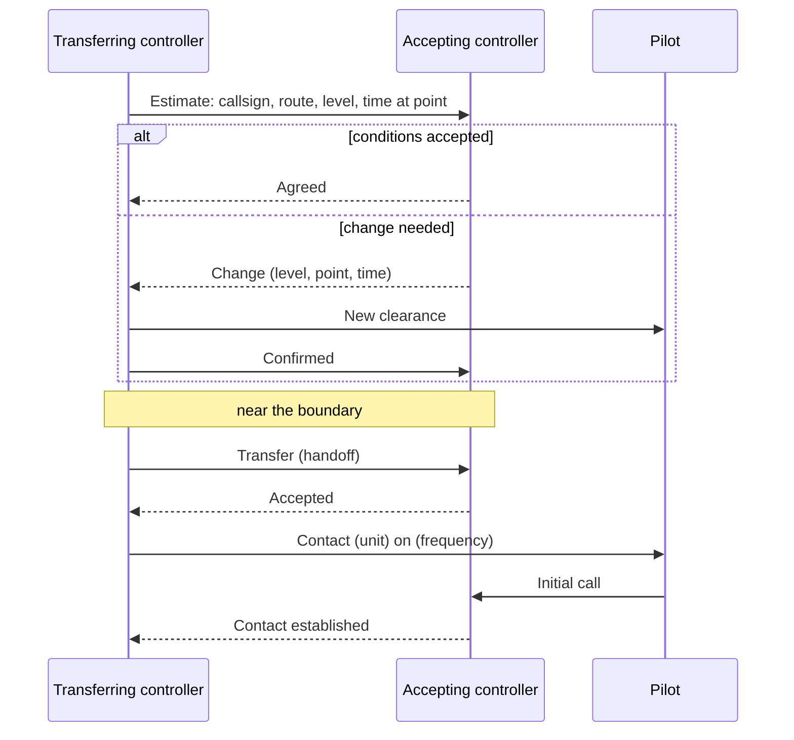

--8<-- "includes/abreviacoes.md"

#

## What coordination is

Coordinating means exchanging information so that the service is not interrupted when the flight changes hands[^1]. Coordination takes place between different units (an APP and an ACC, for example) and also between positions of the same unit, such as two sectors of an ACC or the tower and ground of an aerodrome[^1].

It must be carried out by the **fastest means** available between those involved[^2]. On the network, this is usually the EuroScope private chat, the tag itself (through the automated transfer) or a voice channel agreed between the controllers. See [Coordination on the Network](04-rede.en.md).

## The central rule

!!! danger "No coordination, no entry"
    "An aircraft under the control of a unit, or control position, shall not be permitted to enter airspace under the jurisdiction of another unit, or control position, **unless coordination has first been completed**."[^3]

All the mechanics in the following pages serve this rule. If coordination has not been completed, the aircraft stops before the boundary: in a hold, with a vector or with a level restriction. It only continues once coordination is complete.

## Who directs whom

APPs and TWRs comply with the coordination instructions established by the ACC. TWRs also comply with those of the APP[^4]. In practice, the unit above sets the conditions under which it receives and hands over traffic, within what the letters of agreement and operations manuals already establish.

## Control and communications: two transfers

A transfer has two distinct moments, which do not need to coincide:

| | Transfer of **control** | Transfer of **communications** |
| --- | --- | --- |
| What changes | Who is **responsible** for the aircraft and may issue clearances | **Who the pilot talks to** |
| When | At the common boundary, or at the agreed point, time and level[^5] | With ATS surveillance: as soon as the accepting controller agrees to take over. Without surveillance: 5 minutes before the boundary[^6] |
| How it shows in EuroScope | The tag becomes "assumed" by the new controller | The pilot calls on the new frequency |

The most important consequence lies in the interval between the two. Responsibility remains with the unit in whose area the aircraft is **until the estimated time at which it crosses the boundary**[^7]. The accepting controller may already be talking to the pilot but, until then, **does not change the clearance without the consent of the transferring controller**[^7].

!!! example "Example"
    `SBWR_APP` (Brasília Control) transfers a departure to `SBBS_CTR` 15 NM from the TMA boundary, still climbing to FL 140. The center is already talking to the pilot, but the aircraft is still in the APP's airspace. If the center wants to clear it to FL 340 before the boundary, it must agree this with the APP, which may have other traffic above FL 140 inside the TMA.

## Where the transfer takes place

The aircraft is transferred **at the point, time and level of the boundary** between the areas, or at any other point, time and level previously established by the units[^5]. These points and conditions are set by specific instructions or by a **letter of agreement** between the adjacent units[^8]. At Vatsim Brasil, they are in the operations manuals of each FIR, TMA and aerodrome.

## Propose, accept, modify

Coordination is a proposal followed by a reply:

1. **The transferring controller proposes.** It sends the flight plan and control data **sufficiently in advance** for the accepting controller to analyse them[^9].
2. **The accepting controller replies.** It accepts control under the proposed conditions or indicates the **changes needed** to accept[^10].
3. **The transfer takes place** under the agreed conditions.

The minimum information the transferring controller passes is the **aircraft callsign**, the **route and level** and the **estimated time at the transfer point**. The accepting controller replies with agreement or by requesting changes[^11].

### Changes near the boundary

Two situations call for care:

- An aircraft that requests an **initial clearance near the boundary** of another area is kept within the transferring controller's area until coordination is completed. Add the time needed for coordination to the time to the boundary[^12].
- A **flight plan change** requested by the aircraft, or proposed by ATC, near the boundary depends on acceptance by the adjacent unit[^13].

If the departure aerodrome is so close to the boundary that there is no time to coordinate after take-off, coordinate **before issuing the clearance**, based on the expected take-off time[^14].

## Flights entering or leaving controlled airspace

Coordination is not limited to controlled traffic:

- When an aircraft receiving only **flight information and alerting** is about to enter controlled airspace, or the reverse, coordinate beforehand. The unit responsible for the airspace the aircraft is in initiates it[^15]. Coordination includes the flight plan items, the time of last contact, the entry point and estimate, and any other relevant information[^16].
- When an aircraft stops being controlled, because it has left controlled airspace or cancelled IFR in airspace where VFR is not controlled, pass the data to the unit that will provide flight information and alerting for the rest of the flight[^17].

[^1]: **ICA 100-37, Art. 814 and sole paragraph**. See [ICA 100-37](https://publicacoes.decea.mil.br/publicacao/ica-100-37).
[^2]: **ICA 100-37, Art. 815**.
[^3]: **ICA 100-37, Art. 822**.
[^4]: **ICA 100-37, Art. 821 and sole paragraph**.
[^5]: **ICA 100-37, Art. 823**.
[^6]: **ICA 100-37, Arts. 832 and 833**.
[^7]: **ICA 100-37, Art. 829 and sole paragraph**.
[^8]: **ICA 100-37, Art. 970, items IV and V**.
[^9]: **ICA 100-37, Arts. 824 and 973**.
[^10]: **ICA 100-37, Art. 825 and sole paragraph**.
[^11]: **ICA 100-37, Art. 973, sole paragraph**.
[^12]: **ICA 100-37, Art. 827 and sole paragraph**.
[^13]: **ICA 100-37, Art. 828**.
[^14]: **ICA 100-37, Art. 826 and sole paragraph**.
[^15]: **ICA 100-37, Art. 817 and sole paragraph**.
[^16]: **ICA 100-37, Art. 818**.
[^17]: **ICA 100-37, Art. 837**.
