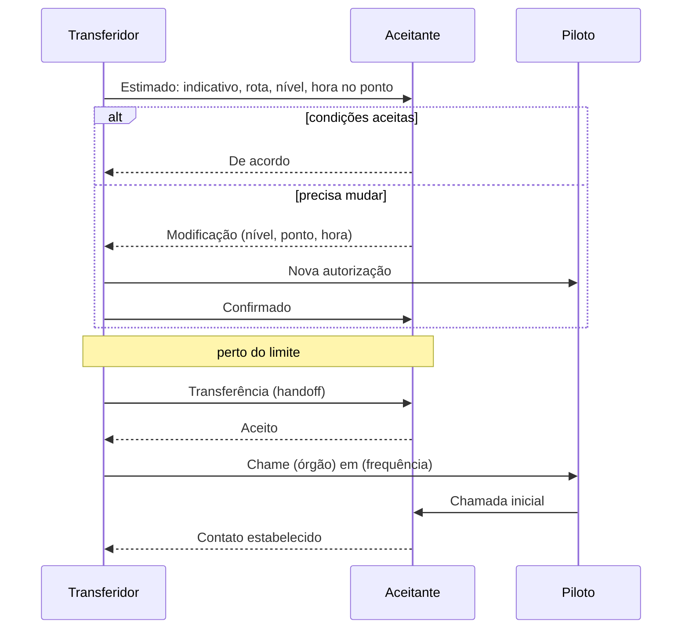

--8<-- "includes/abreviacoes.md"

#

## O que é coordenar

Coordenar é trocar informações para que o serviço não se interrompa quando o voo muda de mãos[^1]. A coordenação acontece entre órgãos diferentes (um APP e um ACC, por exemplo) e também entre posições de um mesmo órgão, como dois setores de um ACC ou a torre e o solo de um aeródromo[^1].

Ela deve ser feita pelo **meio mais rápido** disponível entre os envolvidos[^2]. Na rede, isso costuma ser o chat privado do EuroScope, a própria etiqueta (pela transferência automatizada) ou um canal de voz combinado entre os controladores. Veja [Coordenação na Rede](04-rede.pt.md).

## A regra central

!!! danger "Sem coordenação, a aeronave não entra"
    "Não deverá ser permitido que uma aeronave sob controle de um órgão, ou posição de controle, adentre em espaço aéreo sob jurisdição de outro órgão, ou posição de controle, **sem que antes tenha sido completada a coordenação**."[^3]

Toda a mecânica das próximas páginas serve a essa regra. Se a coordenação não foi concluída, a aeronave para antes do limite: em espera, com um vetor ou com uma restrição de nível. Ela só segue em frente quando a coordenação estiver completa.

## Quem manda em quem

Os APP e as TWR cumprem as instruções de coordenação estabelecidas pelo ACC. As TWR cumprem também as do APP[^4]. Na prática, quem está acima define as condições em que recebe e entrega o tráfego, dentro do que as cartas de acordo e os manuais operacionais já fixam.

## Controle e comunicação: duas transferências

Uma transferência tem dois momentos distintos, que não precisam coincidir:

| | Transferência de **controle** | Transferência de **comunicações** |
| --- | --- | --- |
| O que muda | Quem é **responsável** pela aeronave e pode emitir autorizações | Com **quem o piloto fala** |
| Quando | No limite comum, ou no ponto, hora e nível combinados[^5] | Com vigilância ATS: assim que o aceitante concorda em assumir. Sem vigilância: 5 minutos antes do limite[^6] |
| Como se vê no EuroScope | A etiqueta passa a "assumida" pelo novo controlador | O piloto chama na nova frequência |

A consequência mais importante está no intervalo entre as duas. A responsabilidade continua sendo do órgão em cuja área a aeronave está **até a hora estimada em que ela cruzar o limite**[^7]. O aceitante pode já estar falando com o piloto, mas, até lá, **não altera a autorização sem o consentimento do transferidor**[^7].

!!! example "Exemplo"
    O `SBWR_APP` (Controle Brasília) transfere um tráfego de saída para o `SBBS_CTR` a 15 NM do limite da TMA, ainda subindo para o FL 140. O centro já fala com o piloto, mas a aeronave ainda está no espaço do APP. Se o centro quiser liberá-la para o FL 340 antes do limite, precisa combinar com o APP, que pode ter outro tráfego acima do FL 140 dentro da TMA.

## Onde a transferência acontece

A aeronave é transferida **no ponto, na hora e no nível do limite** entre as áreas, ou em qualquer outro ponto, hora e nível previamente estabelecidos pelos órgãos[^5]. Esses pontos e condições são fixados por instruções específicas ou por uma **carta de acordo operacional** entre os órgãos adjacentes[^8]. Na Vatsim Brasil, eles estão nos manuais operacionais de cada FIR, TMA e aeródromo.

## Propor, aceitar, modificar

A coordenação é uma proposta seguida de uma resposta:

1. **O transferidor propõe.** Envia os dados do plano de voo e do controle com **antecedência suficiente** para o aceitante analisar[^9].
2. **O aceitante responde.** Aceita o controle nas condições propostas ou indica as **modificações necessárias** para aceitar[^10].
3. **A transferência acontece** nas condições acordadas.

As informações mínimas que o transferidor passa são o **indicativo da aeronave**, a **rota e o nível** e a **hora estimada no ponto de transferência**. O aceitante responde de acordo ou pedindo modificações[^11].

### Mudanças perto do limite

Duas situações exigem cuidado:

- Uma aeronave que pede uma **autorização inicial perto do limite** de outra área é mantida dentro da área do transferidor até a coordenação ser concluída. Some o tempo da coordenação ao tempo até o limite[^12].
- Uma **mudança de plano de voo** pedida pela aeronave, ou proposta pelo controle, perto do limite depende da aceitação do órgão adjacente[^13].

Se o aeródromo de partida for tão próximo do limite que não dê tempo de coordenar depois da decolagem, coordene **antes de emitir a autorização**, com base na hora prevista de decolagem[^14].

## Voos que entram ou saem do espaço controlado

A coordenação não se limita ao tráfego controlado:

- Quando uma aeronave que só recebe **informação de voo e alerta** vai entrar em espaço aéreo controlado, ou o contrário, coordene antes. Quem inicia é o órgão responsável pelo espaço em que a aeronave está[^15]. A coordenação inclui os itens do plano de voo, a hora do último contato, o ponto e o estimado de entrada e qualquer outra informação pertinente[^16].
- Quando uma aeronave deixa de ser controlada, porque saiu do espaço controlado ou cancelou o IFR em espaço onde o VFR não é controlado, passe os dados ao órgão que vai prestar informação de voo e alerta no resto do voo[^17].

[^1]: **ICA 100-37, Art. 814 e parágrafo único**. Ver [ICA 100-37](https://publicacoes.decea.mil.br/publicacao/ica-100-37).
[^2]: **ICA 100-37, Art. 815**.
[^3]: **ICA 100-37, Art. 822**.
[^4]: **ICA 100-37, Art. 821 e parágrafo único**.
[^5]: **ICA 100-37, Art. 823**.
[^6]: **ICA 100-37, Arts. 832 e 833**.
[^7]: **ICA 100-37, Art. 829 e parágrafo único**.
[^8]: **ICA 100-37, Art. 970, incisos IV e V**.
[^9]: **ICA 100-37, Arts. 824 e 973**.
[^10]: **ICA 100-37, Art. 825 e parágrafo único**.
[^11]: **ICA 100-37, Art. 973, parágrafo único**.
[^12]: **ICA 100-37, Art. 827 e parágrafo único**.
[^13]: **ICA 100-37, Art. 828**.
[^14]: **ICA 100-37, Art. 826 e parágrafo único**.
[^15]: **ICA 100-37, Art. 817 e parágrafo único**.
[^16]: **ICA 100-37, Art. 818**.
[^17]: **ICA 100-37, Art. 837**.
