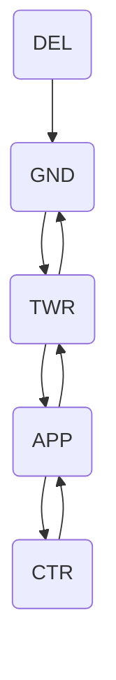

--8<-- "includes/abreviacoes.md"

#

Para fins práticos, disponibilizamos abaixo um exemplo de voo completo, desde o contato inicial com o Tráfego, órgão ATC que realiza autorização de plano, até o contato com o Solo no destino. Considere esse exemplo em uma situação normal, sem adversidades.

## :material-numeric-0-box: Preliminares

<section markdown style="display: grid; grid-template-columns: 5fr 1fr">

O fluxograma ao lado apresenta a sequência de órgãos ATC envolvidos em um voo típico. A comunicação inicia-se no Tráfego (**DEL**), que realiza a autorização do plano de voo. Em seguida, o piloto contata o Solo (**GND**) para solicitar o acionamento e push back, além do táxi até a pista de decolagem. Após isso, o contato é transferido para a Torre (**TWR**), que autoriza a decolagem. Uma vez no ar, o piloto contata o Controle (**APP**) para receber instruções durante o voo. Dependendo da rota, pode haver transferência para o Centro (**CTR**). Na aproximação ao destino, o piloto retorna ao **APP**, depois à **TWR** para autorização de pouso, e finalmente ao **GND** para o táxi até o portão.

Para efeito prático, simularemos a realização do voo **GLO1489** entre os aeroportos de Brasília (SBBR) e Guarulhos (SBGR). As comunicações serão apresentadas em Português, Inglês e Espanhol, refletindo a prática comum, sem fraseologias específicas para situações de emergência ou outras não rotineiras.

Além disso, alguns complementos estarão disponíveis em caixas de observações, destacando particularidades ou variações possíveis na fraseologia mais habitual. Não se esqueça de conferi-las!

!!! danger "Utilização do Espanhol na fraseologia"
    A utilização do Espanhol somente deve ser realizada nos espaços aéreos autorizados, tanto pelo DECEA quanto pelas CAOP oficialmente definidas entre a Vatsim Brasil e outras divisões. Por padrão, **o uso indiscriminado deste idioma na comunicação aeronáutica habitual <u>é vedado</u>**, mesmo que piloto e ATC sejam aptos a utilizá-lo.

</section>

## :material-numeric-1-box: :flag_br: Tráfego / :flag_gb: Delivery / :flag_es: Autorización

### Autorização de Plano de Voo

O piloto inicia o contato com o órgão Tráfego para solicitar a autorização do plano de voo. Antes de chamar o ATC, certifique-se de ter recebido a informação ATIS vigente no aeródromo.

=== ":flag_br: Português"
    

      Tráfego Brasília, bom dia/boa tarde/boa noite. **GOL UNO QUATRO UNO NOVE**.
    

    

      **GOL UNO QUATRO UNO NOVE**, Tráfego Brasília. Bom dia/Boa tarde/Boa noite. :material-information-outline:{ title="<em>A resposta à chamada inicial, contendo o indicativo de chamada da aeronave seguido do nome do órgão ATS, já será considerado um convite para que a aeronave em questão prossiga com a sua mensagem. (Art. 52, MCA 100-16)</em>" }
    

    

      Tráfego Brasília, **GOL UNO QUATRO UNO NOVE**, solicita autorização ATC, informação ATIS BRAVO.
    

    

      **GOL UNO QUATRO UNO NOVE**, autorizado para o aeroporto de Guarulhos :material-information-outline:{ title="<em>Ou SBGR, lido letra por letra</em>" }. Rota do plano de voo. Nível de Voo TRÊS QUATRO ZERO. Pista em uso, DOIS NOVE ESQUERDA. Subida via saída GAXON DOIS ALFA, transição ENRUR. Transponder QUATRO ZERO TRÊS CINCO. Controle Brasília em UNO DOIS NOVE DECIMAL UNO CINCO. Coteje. :material-information-outline:{ title="<em>Vide item 3.2 da CIRCEA 100-53/2022.</em>" }
    

    

      Autorizado até o aeroporto de Guarulhos. Rota do plano de voo. Pista em uso, DOIS NOVE ESQUERDA. Subida via saída GAXON DOIS ALFA, transição ENRUR. Transponder QUATRO ZERO TRÊS CINCO. Controle Brasília em UNO DOIS NOVE DECIMAL UNO CINCO. **GOL UNO QUATRO UNO NOVE**.
    

    

      **GOL UNO QUATRO UNO NOVE**, cotejamento correto. Chame Solo Brasília em UNO DOIS UNO DECIMAL OITO ZERO.
    

    

      Chamará o solo Brasília em UNO DOIS UNO DECIMAL OITO ZERO, **GOL UNO QUATRO UNO NOVE**.
    

=== ":flag_gb: Inglês"
    

      Brasília Delivery, good morning/afternoon/evening. **GOL ONE FOUR ONE NINE**.
    

    

      **GOL ONE FOUR ONE NINE**, Brasília Delivery. Good Morning/Afternoon/Evening.
    

    

      Brasília Delivery, **GOL ONE FOUR ONE NINE**, request ATC clearance, information BRAVO.
    

    

      **GOL ONE FOUR ONE NINE**, cleared to Guarulhos Airport. Flight plan route. Runway in use, TWO NINE LEFT. Climb via GAXON TWO ALFA departure, ENRUR transition. Squawk FOUR ZERO THREE FIVE. Brasília Control on ONE TWO NINE DECIMAL ONE FIVE. Read back.
    

    

      Cleared to Guarulhos Airport. Flight plan route. Runway in use, TWO NINE LEFT. Climb via GAXON TWO ALFA departure, ENRUR transition. Squawk FOUR ZERO THREE FIVE. Brasília Control on ONE TWO NINE DECIMAL ONE FIVE. **GOL ONE FOUR ONE NINE**.
    

    

      **GOL ONE FOUR ONE NINE**, read back is correct. Call Brasília Ground on ONE TWO ONE DECIMAL EIGHT ZERO.
    

    

      Will call Brasília Ground on ONE TWO ONE DECIMAL EIGHT ZERO, **GOL ONE FOUR ONE NINE**.
    

=== ":flag_es: Espanhol"
    

      Brasília Autorización, buenos días/buenas tardes/buenas noches. **GOL UNO CUATRO UNO NUEVE**.
    

    

      **GOL UNO CUATRO UNO NUEVE**, Brasília Autorización. Buenos Días/Buenas Tardes/Buenas Noches.
    

    

      Brasília Autorización, **GOL UNO CUATRO UNO NUEVE**, solicita autorización ATC, información BRAVO.
    

    

      **GOL UNO CUATRO UNO NUEVE**, autorizado hasta el aeropuerto de Guarulhos. Ruta plan de vuelo. Pista en uso, DOS NUEVE IZQUIERDA. Ascienda vía salida normalizada GAXON DOS ALFA, transición ENRUR. Transponder CUATRO CERO TRÊS CINCO. Brasília Control en UNO DOS NUEVE DECIMAL UNO CINCO. Colacione.
    

    

      Autorizado hasta el aeropuerto de Guarulhos. Ruta plan de vuelo. Pista en uso, DOS NUEVE IZQUIERDA. Salida normalizada GAXON DOS ALFA, transición ENRUR. Transponder CUATRO CERO TRÊS CINCO. Brasília Control en UNO DOS NUEVE DECIMAL UNO CINCO. **GOL UNO CUATRO UNO NUEVE**
    

    

      **GOL UNO CUATRO UNO NUEVE**, colación correctal Llame Brasília Tierra en UNO DOS UNO DECIMAL OCHO CERO.
    

    

      Llamará Brasília Tierra en UNO DOS UNO DECIMAL OCHO CERO, **GOL UNO CUATRO UNO NUEVE**.
    

??? abstract "Algumas observações..."

    1. A aeronave da categoria de esteira de turbulência **SUPER (J)** ou **PESADA (H)** deverá incluir a palavra **SUPER** ou **PESADA / HEAVY** imediatamente após o indicativo de chamada no contato inicial com o órgão ATS.

        > :flag_br: Tráfego Brasília, bom dia. TAM OITO UNO TRÊS SETE **PESADA**.  
        > :flag_gb: Brasília Delivery, good morning. TAM EIGHT ONE THREE SEVEN **HEAVY**.  
        > :flag_es: Brasília Autorización, buenos días. TAM OCHO UNO TRES SIETE **PESADA**.  

        Não é necessário repetir a palavra **SUPER** ou **PESADA / HEAVY** nas comunicações subsequentes.

    2. Caso você precise instruir uma saída **OMNI**, você pode adicionar instruções para a subida inicial durante a autorização ATC.

        > :flag_br: PAPA SIERRA CHARLIE NOVEMBER X-RAY, autorizado para Salvador. Rota do plano de voo. Pista em uso, UNO CINCO. **Subida via saída OMNI, mantenha proa da pista até CINCO MIL pés, após voe direto KONVI.** Transponder 4035. Controle São Paulo em UNO TRÊS DOIS DECIMAL UNO. Coteje.  
        > :flag_gb: PAPA SIERRA CHARLIE NOVEMBER X-RAY, cleared to Salvador. Flight plan route. Runway in use, ONE FIVE. **Climb via OMNI departure, fly runway heading until FIVE THOUSAND feet, then fly direct KONVI.** Squawk 4035. Brasília Control on ONE TWO NINE DECIMAL ONE FIVE. Read back.  
        > :flag_es: PAPA SIERRA CHARILE NOVEMBER X-RAY, autorizado para Salvador. Ruta plan de vuelo. Pista en uso, UNO CINCO. **Ascienda vía salida OMNI, mantenga rumbo de la pista hasta CINCO MIL pies, después vuele directo KONVI.** Transponder 4035. Brasília Control en UNO DOS NUEVE DECIMAL UNO CINCO. Colacione.  

## :material-numeric-2-box: :flag_br: Solo / :flag_gb: Ground / :flag_es: Tierra

Este órgão ATC é responsável por gerenciar o tráfego de aeronaves e veículos na área de manobras do aeródromo, em locais como os pátios e taxiways. O contato com o Solo geralmente ocorre após a autorização do plano de voo pelo Tráfego.

### Pushback e Acionamento

Pushback é o reboque da aeronave para fora do portão ou posição de estacionamento, utilizando um veículo rebocador. O acionamento refere-se ao processo de ligar os motores da aeronave.

=== ":flag_br: Português"
    

      Solo Brasília, **GOL UNO QUATRO UNO NOVE**, pátio UNO, posição UNO QUATRO, IFR para Guarulhos, solicita autorização para pushback e acionamento.
    

    

      **GOL UNO QUATRO UNO NOVE**, Solo Brasília, autorizado pushback e acionamento, chame pronto para o táxi.
    

    

      **GOL UNO QUATRO UNO NOVE**, autorizado pushback e acionamento, chamará pronto para o táxi.
    

=== ":flag_gb: Inglês"
    

      Brasília Ground, **GOL ONE FOUR ONE NINE**, apron ONE, position ONE FOUR, IFR to Guarulhos, request clearance for pushback and startup.
    

    

      **GOL ONE FOUR ONE NINE**, Brasília Ground, cleared to pushback and startup, report ready for taxi.
    

    

      Cleared to pushback and startup, I will call when ready for taxi, **GOL ONE FOUR ONE NINE**.
    

=== ":flag_es: Espanhol"
    

      Brasília Tierra, **GOL UNO CUATRO UNO NUEVE**, plataforma UNO, posición UNO CUATRO, IFR para Guarulhos, listo para remolque y puesto en marcha.
    

    

      **GOL UNO CUATRO UNO NUEVE**, Brasília Tierra, autorizado remolque y puesto en marcha, llame listo para rodar.
    

    

      Remolque y puesto en marcha aprobado, llamará listo para rodar, **GOL UNO CUATRO UNO NUEVE**.
    

??? abstract "Algumas observações..."

    1. É comum autorizar a aeronave a iniciar o pushback com uma instrução complementar, como, por exemplo:
    
        1. o sentido do giro da cauda:

            > :flag_br: AZUL QUATRO UNO OITO SETE, Solo São Gonçalo, autorizado pushback e acionamento, **cauda para a esquerda**.  
            > :flag_gb: AZUL FOUR ONE EIGHT SEVEN, São Gonçalo Ground, cleared to pushback and startup, **tail left**.  
            > :flag_es: AZUL CUATRO UNO OCHO SIETE, São Gonçalo Tierra, autorizado remolque y puesto en marcha, **cola a la izquierda**.  

        2. o local para onde deve ser efetuado o pushback:
  
            > :flag_br: VARIG OITO OITO NOVE OITO, Solo Confins, autorizado pushback e acionamento **na taxiway TANGO**.  
            > :flag_gb: VARIG EIGHT EIGHT NINE EIGHT, Confins Ground, cleared to pushback and startup **on taxiway TANGO**.  
            > :flag_es: VARIG OCHO OCHO NUEVE OCHO, Confins Tierra, autorizado remolque y puesto en marcha **en la calle TANGO**.  

    2. Quando o pushback for dispensável ou desnecessário, apenas o acionamento pode ser autorizado:

        > :flag_br: PAPA ROMEO INDIA MIKE OSCAR, Solo Marte, **autorizado acionamento**, chame pronto para o táxi.  
        > :flag_gb: PAPA ROMEO INDIA MIKE OSCAR, Marte Ground, **cleared for startup**, report ready for taxi.  
        > :flag_es: PAPA ROMEO INDIA MIKE OSCAR, Marte Tierra, **autorizado puesto en marcha**, llame listo para rodar.  

### Táxi

Táxi é o deslocamento da aeronave da posição de parada original até a pista de decolagem ou vice-versa, utilizando os taxiways e pátios do aeródromo.

=== ":flag_br: Português"
    

      Solo Brasília, **GOL UNO QUATRO UNO NOVE**, pronto para o táxi.
    

    

      **GOL UNO QUATRO UNO NOVE**, Solo Brasília, táxi autorizado para o ponto de espera da pista DOIS NOVE ESQUERDA via taxiways LIMA MEIA, KILO, UNIFORM e ZULU. Ajuste de altímetro, UNO ZERO UNO TRÊS.
    

    

      Táxi autorizado para o ponto de espera, pista DOIS NOVE ESQUERDA, via taxiways LIMA MEIA, KILO, UNIFORM e ZULU, ajuste de altímetro 1013. **GOL UNO QUATRO UNO NOVE**.
    

=== ":flag_gb: Inglês"
    

      Brasília Ground, **GOL ONE FOUR ONE NINE**, ready for taxi.
    

    

      **GOL ONE FOUR ONE NINE**, Brasília Ground, cleared to taxi to holding point, runway TWO NINE LEFT, via taxiways LIMA FOUR, KILO, UNIFORM and ZULU. QNH ONE ZERO ONE THREE.
    

    

      Cleared to taxi to holding point, runway TWO NINE LEFT, via taxiways LIMA FOUR, KILO, UNIFORM and ZULU, QNH ONE ZERO ONE THREE. **GOL ONE FOUR ONE NINE**.
    

=== ":flag_es: Espanhol"
    

      Brasília Tierra, **GOL UNO CUATRO UNO NUEVE**, listo para rodar.
    

    

      **GOL UNO CUATRO UNO NUEVE**, Brasília Tierra, autorizado rodar al punto de espera, pista DOS NUEVE IZQUIERDA, vía calles LIMA SEIS, KILO, UNIFORM y ZULU. QNH UNO CERO UNO TRES.
    

    

      Autorizado rodar al punto de espera, pista DOS NUEVE IZQUIERDA, vía calles LIMA SEIS, KILO, UNIFORM y ZULU. QNH UNO CERO UNO TRES. **GOL UNO CUATRO UNO NUEVE**.
    

??? abstract "Algumas observações..."

    1. É possível que a aeronave decole de uma intereseção da pista, em vez de usar toda a sua extensão. Na ocasião do taxi, o Solo informará a interseção que será utilizada para a decolagem.
    
        > :flag_br: FORÇA AÉREA DOIS UNO ZERO UNO, Solo Confins, táxi autorizado para o ponto de espera da pista UNO MEIA, **interseção CHARLIE UNO**, via taxiways TANGO, ECHO, MIKE e CHARLIE ONE. Ajuste de altímetro, UNO ZERO UNO TRÊS.  
        > :flag_gb: AIR FORCE TWO ONE ZERO ONE, Confins Ground, cleared to taxi to holding point, runway ONE SIX, **CHARLIE ONE intersection**, via taxiways TANGO, ECHO, MIKE and CHARLIE ONE. QNH ONE ZERO ONE THREE.  
        > :flag_es: FUERZA AEREA DOS UNO CERO UNO, Confins Tierra, autorizado rodar al punto de espera, pista UNO SEIS, **intersección CHARLIE UNO**, vía calles LIMA SEIS, KILO, UNIFORM y ZULU. QNH UNO CERO UNO TRES.  

    2. Eventualmente, para controle de fluxo, o ATC poderá instruir a aeronave para manter posição em determinado ponto durante o taxi:

        > :flag_br: PAPA SIERRA TANGO ALFA ROMEO, **mantenha posição antes da taxiway ALFA**.  
        > :flag_gb: PAPA SIERRA TANGO ALFA ROMEO, **hold position before taxiway ALFA**.  
        > :flag_es: PAPA SIERRA TANGO ALFA ROMEO, **mantenga posición afuera de la calle ALFA**.  

        Nesse caso, o piloto deverá manter posição na taxiway atual antes de chegar no cruzamento desta taxiway com a taxiway ALFA.

### Transferência para a Torre

Ao atingir o ponto de espera, o piloto será transferido para a Torre para receber a autorização de ingresso na pista e decolagem.

=== ":flag_br: Português"
    

      Solo Brasília, **GOL UNO QUATRO UNO NOVE**, no ponto de espera da pista DOIS NOVE ESQUERDA.
    

    

      **GOL UNO QUATRO UNO NOVE**, chame a Torre Brasília em UNO UNO OITO DECIMAL UNO. Bom voo!
    

    

      Chamará Torre Brasília em UNO UNO OITO DECIMAL UNO, **GOL UNO QUATRO UNO NOVE**. Obrigado e bom controle!
    

=== ":flag_gb: Inglês"
    

      Brasília Ground, **GOL ONE FOUR ONE NINE**, on holding point of runway TWO NINE LEFT.
    

    

      **GOL ONE FOUR ONE NINE**, contact Brasília Tower on ONE ONE EIGHT DECIMAL ONE. Have a good flight!
    

    

      Will contact Brasília Tower on ONE ONE EIGHT DECIMAL ONE, **GOL ONE FOUR ONE NINE**. Thanks and have a good control!
    

=== ":flag_es: Espanhol"
    

      Brasília Tierra, **GOL UNO CUATRO UNO NUEVE**, en el punto de espera de la pista DOS NUEVE IZQUIERDA.
    

    

      **GOL UNO CUATRO UNO NUEVE**, llame Torre Brasília en UNO UNO OCHO DECIMAL UNO. ¡Buen vuelo!
    

    

      Llamará Torre Brasília en UNO UNO OCHO DECIMAL UNO, **GOL UNO CUATRO UNO NUEVE**. ¡Gracias y buen control!
    

??? abstract "Algumas observações..."

    1. Para as decolagens de interseções, convém informar na transmissão ao ATC a interseção onde a aeronave se encontra no ponto de espera.

        > :flag_br: Solo Brasília, **GOL UNO QUATRO UNO NOVE**, no ponto de espera da pista DOIS NOVE ESQUERDA, **interseção ZULU**.  
        > :flag_gb: Brasília Ground, **GOL ONE FOUR ONE NINE**, on holding point of runway TWO NINE LEFT, **ZULU intersection**.  
        > :flag_es: Brasília Tierra, **GOL UNO CUATRO UNO NUEVE**, en el punto de espera de la pista DOS NUEVE IZQUIERDA, **intersección ZULU**.  

## :material-numeric-3-box: :flag_br: Torre / :flag_gb: Tower / :flag_es: Torre

### Autorização para Decolagem

A autorização para a decolagem é concedida pela Torre após o piloto informar que está no ponto de espera da pista. A autorização inclui a pista em uso, condições de vento e quaisquer instruções adicionais necessárias.

=== ":flag_br: Português"
    

      Torre Brasília, **GOL UNO QUATRO UNO NOVE**, ponto de espera, pista DOIS NOVE ESQUERDA, pronto para decolagem.
    

    

      **GOL UNO QUATRO UNO NOVE**, Torre Brasília, pista DOIS NOVE ESQUERDA, decolagem autorizada, vento DOIS OITO ZERO GRAUS, ZERO NOVE NÓS. :material-information-outline:{ title="Segue logo após disso qualquer instrução complementar." }
    

    

      Decolagem autorizada, pista DOIS NOVE ESQUERDA, **GOL UNO QUATRO UNO NOVE**.
    

    

      **GOL UNO QUATRO UNO NOVE**, decolado aos ZERO CINCO, chame o Controle Brasília em UNO UNO NOVE DECIMAL DOIS.
    

    

      Chamará o Controle Brasília em UNO UNO NOVE DECIMAL DOIS, **GOL UNO QUATRO UNO NOVE**.
    

=== ":flag_gb: Inglês"
    

      Brasília Tower, **GOL ONE FOUR ONE NINE**, holding point, runway TWO NINE LEFT, ready for takeoff.
    

    

      **GOL ONE FOUR ONE NINE**, Brasília Tower, runway TWO NINE LEFT, cleared for take-off. Wind TWO EIGHT ZERO DEGREES, ZERO NINE KNOTS.
    

    

      Cleared for take-off, runway TWO NINE LEFT, **GOL ONE FOUR ONE NINE**.
    

    

      **GOL ONE FOUR ONE NINE**, airborne at ZERO FIVE, contact Brasília Control on ONE ONE NINE DECIMAL TWO.
    

    

      Contact Brasília Control on ONE ONE NINE DECIMAL TWO, **GOL ONE FOUR ONE NINE**.
    

=== ":flag_es: Espanhol"
    

      Brasilia Torre, **GOL UNO CUATRO UNO NUEVE**, punto de espera, pista DOS NUEVE IZQUIERDA, listo para despegar.
    

    

      **GOL UNO CUATRO UNO NUEVE**, Brasília Torre, pista DOS NUEVE IZQUIERDA, autorizado despegue, viento DOS OCHO CERO grados, CERO NUEVE nudos.
    

    

      Autorizado despegue, pista DOS NUEVE IZQUIERDA, **GOL UNO CUATRO UNO NUEVE**.
    

    

      **GOL UNO CUATRO UNO NUEVE**, en el aire a los CERO CINCO, llame el Brasília Control en UNO UNO NUEVE DECIMAL DOS.
    

    

      Llamará el Brasília Control en UNO UNO NUEVE DECIMAL DOS, **GOL UNO CUATRO UNO NUEVE**.
    

??? abstract "Algumas observações..."

    1. Rotineiramente, para agilizar sequenciamentos de partida e chegada, a Torre pode solicitar que uma aeronave **alinhe e mantenha** na pista, ocasião na qual o piloto deve ingressar, alinhar a aeronave e aguardar nova autorização para decolagem.

        > :flag_br: PAPA ROMEO ECHO ZULU ZULU, Torre Recife, pista UNO OITO, alinha e mantém.  
        > :flag_gb: PAPA ROMEO ECHO ZULU ZULU, Recife Tower, runway ONE EIGHT, line up and wait.  
        > :flag_es: PAPA ROMEO ECHO ZULU ZULU, Recife Torre, pista UNO OITO, alinéese y mantenga.  

    2. Em alguns aeroportos, a Torre pode fornecer instruções adicionais para a decolagem, como uma proa inicial a ser mantida após a decolagem, a próxima frequência a ser contatada, ou outras informações relevantes.

        > :flag_br: AZUL CONECTA CINCO DOIS CINCO SETE, Torre Fortaleza, pista UNO TRÊS, decolagem autorizada, vento UNO CINCO ZERO GRAUS, CINCO NÓS. **Após a decolagem, mantenha a proa da pista subindo para SETE MIL pés.**  
        > :flag_gb: AZUL CONECTA FIVE TWO FIVE SEVEN, Fortaleza Tower, runway ONE THREE, cleared for takeoff, wind ONE FIVE ZERO DEGREES, FIVE KNOTS. **After takeoff, maintain runway heading climbing to SEVEN THOUSAND FEET.**  
        > :flag_es: AZUL CONECTA CINCO DOS CINCO SIETE, Fortaleza Torre, pista UNO TRES, autorizado despegar, viento UNO CINCO CERO GRADOS, CINCO NUDOS. **Después del despegue, mantenga el rumbo de la pista en ascenso a SIETE MIL PIES.**   

        > :flag_br: TAM TRÊS ZERO ZERO DOIS, Torre São Paulo, pista UNO SETE DIREITA, decolagem autorizada, vento DOIS ZERO ZERO GRAUS, UNO DOIS NÓS. **Após a decolagem, chame o Controle São Paulo em UNO DOIS MEIA DECIMAL SETE CINCO. Bom voo!**  
        > :flag_gb: TAM THREE ZERO ZERO TWO, São Paulo Tower, runway ONE SEVEN RIGHT, cleared for takeoff, wind TWO ZERO ZERO DEGREES, ONE TWO KNOTS. **After takeoff, contact São Paulo Control on ONE TWO SIX DECIMAL SEVEN FIVE. Have a good flight!**  
        > :flag_es: TAM TRES CERO CERO DOS, Torre São Paulo, pista UNO SIETE DERECHA, autorizado despegar, viento DOS CERO CERO GRADOS, UNO DOS NUDOS. **Después del despegue, llame el São Paulo Control en UNO DOS SEIS DECIMAL SIETE CINCO. ¡Buen vuelo!**  

    3. Algumas torres não informarão a hora de decolagem no momento da transferência. Confira o MOP do aeródromo para mais detalhes.

    4. Algumas torres fazem a transferência para o Controle junto com a autorização de decolagem (como no exemplo acima), eliminando a necessidade do contato após a decolagem. Confira o MOP do aeródromo para mais detalhes.

    5. Vento com intensidade de zero nó (00000KT) deve ser informado como **vento calmo**.

## :material-numeric-4-box: :flag_br: Controle / :flag_gb: Control / :flag_es: Control

### Contato inicial após decolagem

=== ":flag_br: Português"
    

      Controle Brasília, **GOL UNO QUATRO UNO NOVE**, decolando pista DOIS NOVE ESQUERDA, passando CINCO MIL PÉS, saída GAXON DOIS ALFA, transição ENRUR.
    

    

      **GOL UNO QUATRO UNO NOVE** Controle Brasília, contato radar após a decolagem, suba via GAXON DOIS ALFA para o nível de voo TRÊS MEIA ZERO.
    

    

      Sobe via saída para o nível TRÊS MEIA ZERO, **GOL UNO QUATRO UNO NOVE**.
    

=== ":flag_gb: Inglês"
    

      Brasília Control, **GOL ONE FOUR ONE NINE**, airborne runway TWO NINE LEFT, passing FIVE THOUSAND FEET, GAXON TWO ALFA departure, ENRUR transition.
    

    

      **GOL ONE FOUR ONE NINE** Brasília Control, radar contact on departure, climb via GAXON TWO ALFA to flight level THREE SIX ZERO.
    

    

      Climb via departure to flight level THREE SIX ZERO, **GOL ONE FOUR ONE NINE**.
    

=== ":flag_es: Espanhol"
    

      Brasília Control, **GOL UNO CUATRO UNO NUEVE**, despegado de la pista DOS NUEVE IZQUIERDA, pasando CINCO MIL PIES, salida normalizada GAXON DOS ALFA, transición ENRUR.
    

    

      **GOL UNO CUATRO UNO NUEVE**, Brasília Control, contacto radar en el despegue, ascienda vía GAXON DOS ALFA a nivel TRES SEIS CERO.
    

    

      Asciende vía salida a nivel TRES SEIS CERO, **GOL UNO CUATRO UNO NUEVE**.
    

??? abstract "Algumas observações..."

    1. Ao dizer "Suba via SID para (nível)", o controle está instruindo a aeronave a subir para o nível autorizado seguindo o perfil lateral da SID e cumprindo as restrições de nível e velocidade publicadas na carta do procedimento de saída.
    
    2. É possível, porém, que o Controle cancele restrições de subida existentes na carta do procedimento de saída. O controle pode cancelar restrições específicas ou liberar a subida sem restrições.
    
        1. Caso cancele **todas as restrições de altitude <u>ou</u> velocidade**, a fraseologia será:

            > :flag_br: SURINAM DOIS QUATRO DOIS, Controle Belém, contato radar após a decolagem, suba via saída ILMET UNO para o nível de voo TRÊS MEIA ZERO, **canceladas as restrições de altitude/velocidade**.  
            > :flag_gb: SURINAM TWO FOUR TWO, Belém Control, radar contact on departure, climb via ILMET ONE departure to flight level THREE SIX ZERO, **Cancel altitude/speed restrictions**.  
            > :flag_es: SURINAM DOS CUATRO DOS,  Belém Control, contacto radar en el despegue, ascienda vía salida ILMET UNO al nivel TRES SEIS CERO, **canceladas las restricciones de altitud/velocidad**.  

        2. Caso cancele uma restrição de altitude <u>ou</u> velocidade **em ponto(s) específico(s)**, a fraseologia será:

            > :flag_br: SURINAM DOIS QUATRO DOIS, Controle Belém, contato radar após a decolagem, suba via saída ILMET UNO para o nível de voo TRÊS MEIA ZERO, **cancelada a restrição de altitude/velocidade em ILMET**.  
            > :flag_gb: SURINAM TWO FOUR TWO, Belém Control, radar contact on departure, climb via ILMET ONE departure to flight level THREE SIX ZERO, **Cancel altitude/speed restriction at ILMET**.  
            > :flag_es: SURINAM DOS CUATRO DOS,  Belém Control, contacto radar en el despegue, ascienda vía salida ILMET UNO al nivel TRES SEIS CERO, **canceladas la restricción de altitud/velocidad en ILMET**.  

        3. Caso cancele todas as restrições no procedimento inteiro, a fraseologia será:

            > :flag_br: SURINAM DOIS QUATRO DOIS, Controle Belém, contato radar após a decolagem, suba **sem restrições** para o nível de voo TRÊS MEIA ZERO.  
            > :flag_gb: SURINAM TWO FOUR TWO, Belém Control, radar contact on departure, climb **without restrictions** to flight level THREE SIX ZERO.  
            > :flag_es: SURINAM DOS CUATRO DOS,  Belém Control, contacto radar en el despegue, ascienda **sin restricciones** al nivel TRES SEIS CERO.  

            Ou ainda:

            > :flag_br: SURINAM DOIS QUATRO DOIS, Controle Belém, contato radar após a decolagem, suba via saída ILMET UNO para o nível de voo TRÊS MEIA ZERO, **canceladas as restrições de altitude e velocidade**.  
            > :flag_gb: SURINAM TWO FOUR TWO, Belém Control, radar contact on departure, climb via ILMET ONE departure to flight level THREE SIX ZERO, **Cancel altitude and speed restrictions**.  
            > :flag_es: SURINAM DOS CUATRO DOS,  Belém Control, contacto radar en el despegue, ascienda vía salida ILMET UNO al nivel TRES SEIS CERO, **canceladas las restricciones de altitud y velocidad**.  
            

### Controle de fluxo na subida

Durante a subida para o nível de cruzeiro, o Controle pode emitir instruções para controle de fluxo, como instuir uma restrição de nível temporária, velocidade, proa a ser mantida ou a voar direto para um fixo específico, dentre outras.

=== ":flag_br: Português"
    

      **GOL UNO QUATRO UNO NOVE**, autorizado direto KONVI, suba e mantenha o nível UNO DOIS ZERO.
    

    

      Autorizado direto KONVI, sobe restrito ao nível UNO DOIS ZERO, **GOL UNO QUATRO UNO NOVE**.
    

    

      **GOL UNO QUATRO UNO NOVE**, continue subida para o nível de voo TRÊS MEIA ZERO, mantenha DOIS CINCO ZERO NÓS até o nível de voo UNO SETE ZERO.
    

    

      Continua subida para o nível de voo TRÊS MEIA ZERO, mantém DOIS CINCO ZERO NÓS até o nível de voo UNO SETE ZERO, **GOL UNO QUATRO UNO NOVE**.
    

=== ":flag_gb: Inglês"
    

      **GOL ONE FOUR ONE NINE**, fly direct KONVI, climb restricted to flight level ONE TWO ZERO.
    

    

      Fly direct KONVI, climb restricted to flight level ONE TWO ZERO, **GOL ONE FOUR ONE NINE**.
    

    

      **GOL ONE FOUR ONE NINE**, continue climb to flight level THREE SIX ZERO, maintain TWO FIVE ZERO KNOTS until flight level ONE SEVEN ZERO.
    

    

      Continuing climb to flight level THREE SIX ZERO, maintaining TWO FIVE ZERO KNOTS until flight level ONE SEVEN ZERO, **GOL ONE FOUR ONE NINE**.
    

=== ":flag_es: Espanhol"
    

      **GOL UNO CUATRO UNO NUEVE**, autorizado directo KONVI, ascienda restringido al nivel UNO DOS CERO.
    

    

      Autorizado directo KONVI, asciendiendo para el nivel UNO DOS CERO, **GOL UNO CUATRO UNO NUEVE**.
    

    

      **GOL UNO CUATRO UNO NUEVE**, continúe ascenso al nivel de vuelo TRES SEIS CERO, mantenga DOS CINCO CERO NUDOS hasta el nivel de vuelo UNO SIETE CERO.
    

    

      Continúa ascenso al nivel de vuelo TRES SEIS CERO, manteniendo DOS CINCO CERO NUDOS hasta el nivel de vuelo UNO SIETE CERO, **GOL UNO CUATRO UNO NUEVE**.
    

### Transferência para o próximo órgão

Saindo do Controle de Aproximação, o piloto será transferido para o próximo órgão ATC responsável pela gestão do voo naquela fase da rota, que é o Centro.

!!! note "Importante"
    Nem sempre, em todos os voos, haverá transferência para o Centro. Em voos mais curtos, o Controle de Aproximação pode ser o último órgão ATC a ser contatado antes de haver transferência para a frequência de coordenação, por exemplo.
    
    Adicionalmente, em alguns casos, o Controle de Aproximação que cobre o aeroporto de origem pode transferir a aeronave diretamente para o Controle de Aproximação do aeroporto de destino, se ambos forem adjacentes.

=== ":flag_br: Português"
    

      **GOL UNO QUATRO UNO NOVE**, chame Centro Brasília em UNO DOIS MEIA DECIMAL SETE CINCO.
    

    

      Chamará o Centro Brasília, UNO DOIS MEIA DECIMAL SETE CINCO, **GOL UNO QUATRO UNO NOVE**.
    

=== ":flag_gb: Inglês"
    

      **GOL ONE FOUR ONE NINE**, call Brasília Center on ONE TWO SIX DECIMAL SEVEN FIVE.
    

    

      Call Brasília Center, ONE TWO SIX DECIMAL SEVEN FIVE, **GOL ONE FOUR ONE NINE**.
    

=== ":flag_es: Espanhol"
    

      **GOL UNO CUATRO UNO NUEVE**, llame Centro Brasília en UNO DOS SEIS DECIMAL SIETE CINCO.
    

    

      Llamará Centro Brasília en UNO DOS SEIS DECIMAL SIETE CINCO, **GOL UNO CUATRO UNO NUEVE**.
    

## :material-numeric-5-box: :flag_br: Centro / :flag_gb: Center / :flag_es: Centro

### Chamada inicial

=== ":flag_br: Português"
    

      Centro Brasília, **GOL UNO QUATRO UNO NOVE**.
    

    

      **GOL UNO QUATRO UNO NOVE**, Centro Brasília, acione identificação, suba e mantenha o nível TRÊS MEIA ZERO.
    

    

      Acionou identificação, sobe e mantém o nível TRÊS MEIA ZERO. **GOL UNO QUATRO UNO NOVE**.
    

=== ":flag_gb: Inglês"
    

      Brasília Center, **GOL ONE FOUR ONE NINE**.
    

    

      **GOL ONE FOUR ONE NINE**, Brasília Center, squawk ident, climb and maintain flight level THREE SIX ZERO.
    

    

      Squawk ident, climb and maintain flight level THREE SIX ZERO. **GOL ONE FOUR ONE NINE**.
    

=== ":flag_es: Espanhol"
    

      Brasília Centro, **GOL UNO CUATRO UNO NUEVE**.
    

    

      **GOL UNO CUATRO UNO NUEVE**, Brasília Centro, identifique, ascienda y mantenga nivel TRES SEIS CERO.
    

    

      Identificado, asciende y mantiene nivel TRES SEIS CERO. **GOL UNO CUATRO UNO NUEVE**.
    

??? abstract "Algumas observações..."

    "Acionar identificação" refere-se ao uso do botão IDENT no transponder da aeronave, que faz com que o plote da aeronave seja destacado no radar do controlador, facilitando sua identificação. A função primária desse processo durante a transferência entre órgãos ATC é indicar ao controlador transferidor que a aeronave estabeleceu contato rádio bilateral com o novo órgão ATC, completando, assim, o processo de transferência.

    Se outra forma de confirmação da transferência tiver disponível, o controlador recebedor poderá optar por não solicitar o acionamento da identificação.

### Atingindo o nível de cruzeiro

=== ":flag_br: Português"
    

      Centro Brasília, **GOL UNO QUATRO UNO NOVE**, nível de voo TRÊS MEIA ZERO.
    

    

      **GOL UNO QUATRO UNO NOVE**, Centro Brasília ciente, mantenha a sua navegação.
    

    

      Mantém a navegação, **GOL UNO QUATRO UNO NOVE**.
    

=== ":flag_gb: Inglês"
    

      Brasília Center, **GOL ONE FOUR ONE NINE**, flight level THREE SIX ZERO.
    

    

      **GOL ONE FOUR ONE NINE**, Brasília Center roger, maintain own navigation.
    

    

      Maintain own navigation, **GOL ONE FOUR ONE NINE**.
    

=== ":flag_es: Espanhol"
    

      Brasília Centro, **GOL UNO CUATRO UNO NUEVE**, nivel de vuelo TRES SEIS CERO.
    

    

      **GOL UNO CUATRO UNO NUEVE**, Brasília Centro recibido, mantenga su navegación.
    

    

      Mantenga la navegación, **GOL UNO CUATRO UNO NUEVE**.
    

??? abstract "Algumas observações..."

    Mesmo que o piloto esteja sob o serviço de vigilância radar, é compulsório, por força de regulamento, que o piloto informe ao ATC quando atingir o nível de cruzeiro autorizado.

### Instrução de Procedimento de Descida

Como o início da STAR geralmente se dá no espaço aéreo do Centro, este é responsável por informar a chegada que será seguida.

=== ":flag_br: Português"
    

      **GOL UNO QUATRO UNO NOVE**, prepare a chegada SANPA UNO ALFA, prevista aproximação ILS YANKEE para pista UNO ZERO DIREITA em Guarulhos.
    

    

      Prepara a chegada SANPA UNO ALFA, prevista aproximação ILS YANKEE para pista UNO ZERO DIREITA em Guarulhos, **GOL UNO QUATRO UNO NOVE**.
    

=== ":flag_gb: Inglês"
    

      **GOL ONE FOUR ONE NINE**, plan the SANPA UNO ALFA arrival, expect ILS YANKEE approach for runway ONE ZERO RIGHT at Guarulhos.
    

    

      Plan SANPA UNO ALFA arrival, expect ILS YANKEE approach for runway ONE ZERO RIGHT at Guarulhos, **GOL ONE FOUR ONE NINE**.
    

=== ":flag_es: Espanhol"
    

      **GOL UNO CUATRO UNO NUEVE**, prepare la llegada SANPA UNO ALFA, espere aproximación ILS YANKEE para pista UNO CERO DERECHA en Guarulhos.
    

    

      Prepara la llegada SANPA UNO ALFA, esperando aproximación ILS YANKEE para pista UNO CERO DERECHA en Guarulhos, **GOL UNO CUATRO UNO NUEVE**.
    

### Para a descida

Toda alteração de altitude em espaço aéreo controlado exige autorização prévia do ATC. O piloto deve informar quando estiver no ponto ideal para iniciar a descida a fim de receber a autorização necessária.

=== ":flag_br: Português"
    

      Centro Brasília, **GOL UNO QUATRO UNO NOVE**, ideal de descida.
    

    

      **GOL UNO QUATRO UNO NOVE**, desça via SANPA UNO ALFA para o nível DOIS CINCO ZERO.
    

    

      Desce via SANPA UNO ALFA para o nível DOIS CINCO ZERO. **GOL UNO QUATRO UNO NOVE**.
    

=== ":flag_gb: Inglês"
    

      Brasília Center, **GOL ONE FOUR ONE NINE**, ready for descent.
    

    

      **GOL ONE FOUR ONE NINE**, descend via SANPA UNO ALFA to flight level TWO FIVE ZERO.
    

    

      Descend via SANPA UNO ALFA to flight level TWO FIVE ZERO. **GOL ONE FOUR ONE NINE**.
    

=== ":flag_es: Espanhol"
    

      Brasília Centro, **GOL UNO CUATRO UNO NUEVE**, listo para descenso.
    

    

      **GOL UNO CUATRO UNO NUEVE**, descienda vía SANPA UNO ALFA al nivel DOS CINCO CERO.
    

    

      Descienda vía SANPA UNO ALFA al nivel DOS CINCO CERO. **GOL UNO CUATRO UNO NUEVE**.
    

??? abstract "Algumas observações..."

    1. É comum que o ATC autorize descidas para níveis intermediários antes do nível final de descida, a fim de otimizar o fluxo de tráfego aéreo. Caso o ATC instrua a aeronave a descer para um novo nível, falará:

        > :flag_br: AMERICAN NOVE MEIA ZERO, continue descida, nível de voo UNO UNO ZERO.  
        > :flag_gb: AMERICAN NINE FIVE ZERO, continue descent, flight level ONE ONE ZERO.  
        > :flag_es: AMERICAN NUEVE CINCO CERO, continue descenso, nivel de vuelo UNO UNO CERO.  

### Transferência para o próximo órgão

Ao chegar no limite do espaço aéreo do Centro, o piloto será transferido para o próximo órgão ATC responsável pela gestão do voo naquela fase da rota, que é o Controle de Aproximação.

=== ":flag_br: Português"
    

      **GOL UNO QUATRO UNO NOVE**, chame o Controle São Paulo em UNO DOIS NOVE DECIMAL QUATRO CINCO.
    

    

      Chamará o Controle São Paulo em UNO DOIS NOVE DECIMAL QUATRO CINCO, **GOL UNO QUATRO UNO NOVE**.
    

=== ":flag_gb: Inglês"
    

      **GOL ONE FOUR ONE NINE**, contact São Paulo Control on ONE TWO NINE DECIMAL FOUR FIVE.
    

    

      Will contact São Paulo Control on ONE TWO NINE DECIMAL FOUR FIVE, **GOL ONE FOUR ONE NINE**.
    

=== ":flag_es: Espanhol"
    

      **GOL UNO CUATRO UNO NUEVE**, llame ahora São Paulo Control en UNO DOS NUEVE DECIMAL CUATRO CINCO.
    

    

      Llamará São Paulo Control en UNO DOS NUEVE DECIMAL CUATRO CINCO, **GOL UNO CUATRO UNO NUEVE**.
    

??? abstract "Algumas observações..."

    A transferência pode ser realizada a qualquer momento antes do limite do espaço aéreo, desde que o piloto esteja dentro do alcance de comunicação com o Controle seguinte.

## :material-numeric-6-box: :flag_br: Controle / :flag_gb: Control / :flag_es: Control

### Contato Inicial

=== ":flag_br: Português"
    

      Controle São Paulo, **GOL UNO QUATRO UNO NOVE**, descendo via SANPA UNO ALFA.
    

    

      **GOL UNO QUATRO UNO NOVE**, Controle São Paulo, acione identificação, desça via SANPA UNO ALFA para o nível de voo UNO UNO ZERO, prevista aproximação ILS YANKEE para pista UNO ZERO DIREITA.
    

    

      Desce via SANPA UNO ALFA para o nível UNO UNO ZERO, aguarda ILS YANKEE UNO ZERO DIREITA, **GOL UNO QUATRO UNO NOVE**.
    

=== ":flag_gb: Inglês"
    

      São Paulo Control, **GOL ONE FOUR ONE NINE**, descending via SANPA UNO ALFA.
    

    

      **GOL ONE FOUR ONE NINE** São Paulo Control, squawk ident, descend via SANPA UNO ALFA to flight level ONE ONE ZERO, expect ILS YANKEE approach for runway ONE ZERO RIGHT.
    

    

      Descend via SANPA ONE ALFA to flight level ONE ONE ZERO, expect ILS YANKEE ONE ZERO RIGHT, **GOL ONE FOUR ONE NINE**.
    

=== ":flag_es: Espanhol"
    

      São Paulo Control, **GOL UNO CUATRO UNO NUEVE**, en descenso vía SANPA UNO ALFA.
    

    

      **GOL UNO CUATRO UNO NUEVE**, São Paulo Control, identifique, descienda vía SANPA UNO ALFA al nivel de vuelo UNO UNO CERO, espere aproximación ILS YANKEE para pista UNO CERO DERECHA.
    

    

      Descenso vía SANPA UNO ALFA al nivel UNO UNO CERO, esperando ILS YANKEE UNO CERO DERECHA, **GOL UNO CUATRO UNO NUEVE**.
    

### Controle de Fluxo na Descida

Durante a descida para o nível de aproximação, o Controle pode emitir instruções para controle de fluxo, como instuir uma restrição de nível temporária, velocidade, proa a ser mantida ou a voar direto para um fixo específico, dentre outras.

=== ":flag_br: Português"
    

      **GOL UNO QUATRO UNO NOVE**, autorizado direto SANPA, desça e mantenha o nível UNO ZERO ZERO.
    

    

      Autorizado direto SANPA, desce restrito ao nível UNO ZERO ZERO, **GOL UNO QUATRO UNO NOVE**.
    

    

      **GOL UNO QUATRO UNO NOVE**, reduza para DOIS ZERO ZERO NÓS, desça e mantenha MEIA MIL PÉS, Q N H UNO ZERO UNO QUATRO.
    

    

      Reduz para DOIS ZERO ZERO NÓS, desce e mantém MEIA MIL PÉS, Q N H UNO ZERO UNO QUATRO, **GOL UNO QUATRO UNO NOVE**.
    

=== ":flag_gb: Inglês"
    
 
      **GOL ONE FOUR ONE NINE**, fly direct SANPA, descend restricted to flight level ONE ZERO ZERO.
    

    

      Fly direct SANPA, descend restricted to flight level ONE ZERO ZERO, **GOL ONE FOUR ONE NINE**.
    

    

      **GOL ONE FOUR ONE NINE**, reduce to TWO ZERO ZERO KNOTS, descend and maintain SIX THOUSAND FEET, Q N H ONE ZERO ONE FOUR.
    

    

      Reduce to TWO ZERO ZERO KNOTS, descend and maintain SIX THOUSAND FEET, Q N H ONE ZERO ONE FOUR, **GOL ONE FOUR ONE NINE**.
    

=== ":flag_es: Espanhol"
    

      **GOL UNO CUATRO UNO NUEVE**, vuela directo SANPA, descienda restringido al nivel de vuelo UNO CERO CERO.
    

    

      Vuelo directo SANPA, descienda restringido al nivel de vuelo UNO CERO CERO, **GOL UNO CUATRO UNO NUEVE**.
    

    

      **GOL UNO CUATRO UNO NUEVE**, reduzca a DOS CERO CERO NUDOS, descienda y mantenga SEIS MIL PIES, Q N H UNO CERO UNO CUATRO.
    

    

      Reduzca a DOS CERO CERO NUDOS, descienda y mantenga SEIS MIL PIES, Q N H UNO CERO UNO CUATRO, **GOL UNO CUATRO UNO NUEVE**.
    

??? abstract "Algumas observações..."

    1. As instruções de controle de fluxo na descida seguem a mesma lógica das instruções de controle de fluxo na subida, conforme explicado anteriormente.

    2. Quando a descida é autorizada para uma altitude abaixo do nível de transição, o QNH será informado pelo Controle.

### Autorização do Procedimento

Para iniciar a aproximação, o piloto deve receber autorização do Controle de Aproximação.

=== ":flag_br: Português"
    

      **GOL UNO QUATRO UNO NOVE** autorizado ILS YANKEE para pista UNO ZERO DIREITA, reporte estabilizado no localizador.
    

    

      Autorizado ILS YANKEE para pista UNO ZERO DIREITA, reportará estabilizado no localizador, **GOL UNO QUATRO UNO NOVE**.
    

=== ":flag_gb: Inglês"
    

      **GOL ONE FOUR ONE NINE** cleared ILS YANKEE for runway ONE ZERO RIGHT, report established.
    

    

      Cleared ILS YANKEE for runway ONE ZERO RIGHT, will report established, **GOL ONE FOUR ONE NINE**.
    

=== ":flag_es: Espanhol"
    

      **GOL UNO CUATRO UNO NUEVE** autorizado ILS YANKEE para pista UNO CERO DERECHA, reporte establecido en el localizador.
    

    

      Autorizado ILS YANKEE para pista UNO CERO DERECHA, reportará establecido en el localizador, **GOL UNO CUATRO UNO NUEVE**.
    

??? abstract "Algumas observações..."

    1. Como a definição de "estabilizado" pode variar entre diferentes tipos de aeronaves e operadores, o piloto é responsável por determinar quando a aeronave está estabilizada para a aproximação.
    2. No caso de aproximações visuais, a autorização será dada para a aproximação visual, e o piloto deverá reportar quando estiver efetivamente visual com o campo.

### Transferência para a Torre

=== ":flag_br: Português"
    

      Estabilizado no localizador da pista UNO ZERO DIREITA, **GOL UNO QUATRO UNO NOVE**.
    

    

      **GOL UNO QUATRO UNO NOVE**, chame a Torre Guarulhos em UNO UNO OITO DECIMAL QUATRO. Bom pouso!
    

    

      UNO UNO OITO DECIMAL QUATRO, obrigado, **GOL UNO QUATRO UNO NOVE**.
    

=== ":flag_gb: Inglês"
    

      Established on localizer, runway ONE ZERO RIGHT, **GOL ONE FOUR ONE NINE**.
    

    

      **GOL ONE FOUR ONE NINE**, contact Guarulhos Tower on ONE ONE EIGHT DECIMAL FOUR. Have a good landing!
    

    

      ONE ONE EIGHT DECIMAL FOUR, thank you, **GOL ONE FOUR ONE NINE**.
    

=== ":flag_es: Espanhol"
    

      Establecido en el localizador, pista UNO CERO DERECHA, **GOL UNO CUATRO UNO NUEVE**.
    

    

      **GOL UNO CUATRO UNO NUEVE**, llame Torre Guarulhos en UNO UNO OCHO DECIMAL CUATRO. ¡Buen aterrizaje!
    

    

      UNO UNO OCHO DECIMAL CUATRO, gracias, **GOL UNO CUATRO UNO NUEVE**.
    

## :material-numeric-7-box: :flag_br: Torre / :flag_gb: Tower / :flag_es: Torre

### Contato Inicial

=== ":flag_br: Português"
    

      Torre Guarulhos, **GOL UNO QUATRO UNO NOVE**, final, pista UNO ZERO DIREITA.
    

    

      **GOL UNO QUATRO UNO NOVE**, Torre Guarulhos, pista UNO ZERO DIREITA, pouso autorizado, vento ZERO NOVE ZERO graus, ZERO OITO nós.
    

    

      Pouso autorizado, pista UNO ZERO DIREITA, **GOL UNO QUATRO UNO NOVE**.
    

=== ":flag_gb: Inglês"
    

      Guarulhos Tower, **GOL ONE FOUR ONE NINE** on final, runway ONE ZERO RIGHT.
    

    

      **GOL ONE FOUR ONE NINE**, Guarulhos Tower, runway ONE ZERO RIGHT, cleared to land, wind ZERO NINE ZERO degrees, ZERO EIGHT knots.
    

    

      Cleared to land, runway ONE ZERO RIGHT, **GOL ONE FOUR ONE NINE**.
    

=== ":flag_es: Espanhol"
    

      Guarulhos Torre, **GOL UNO CUATRO UNO NUEVE**, final, pista UNO CERO DERECHA.
    

    

      **GOL UNO CUATRO UNO NUEVE**, Guarulhos Torre, pista UNO CERO DERECHA, autorizado aterrizar, viento CERO NUEVE CERO grados, CERO OCHO nudos.
    

    

      Autorizado aterrizar, pista UNO CERO DERECHA, **GOL UNO CUATRO UNO NUEVE**.
    

??? abstract "Algumas observações..."

    1. Na impossibilidade do controlador autorizar o pouso no contato inicial por conta de ocupação da pista ou outras restrições, a fraseologia será:

        > :flag_br: **AVIANCA MEIA ZERO ZERO DOIS**, Torre São Paulo, pista UNO SETE DIREITA, continue aproximação, aguarde pista livre, vento ZERO NOVE ZERO graus, ZERO OITO nós.  
        > :flag_gb: **AVIANCA SIX ZERO ZERO TWO**, São Paulo Tower, runway ONE SEVEN RIGHT, continue approach, standby for runway vacated, wind ZERO NINE ZERO degrees, ZERO EIGHT knots.  
        > :flag_es: **AVIANCA SEIS CERO CERO DOS**, São Paulo Torre, pista UNO SIETE DERECHA, continúe aproximación, espere pista libre, viento CERO NUEVE CERO grados, CERO OCHO nudos.  

        Ao passo que o piloto coteja:  

        > :flag_br: Continua aproximação, aguarda pista livre, **AVIANCA MEIA ZERO ZERO DOIS**.  
        > :flag_gb: Continuing approach, standby for runway vacated, **AVIANCA SIX ZERO ZERO TWO**.  
        > :flag_es: Continúa aproximación, espere pista libre, **AVIANCA SEIS CERO CERO DOS**.  

    2. O controlador da torre pode fornecer informações adicionais, como condições meteorológicas, informação de tráfego ou sequência de pouso.

        > :flag_br: **PASSAREDO DOIS DOIS UNO MEIA**, Torre Guarulhos, pista UNO ZERO DIREITA, pouso autorizado, vento ZERO NOVE ZERO graus, ZERO OITO nós. **Atenção para decolagem de um B777, pista UNO ZERO ESQUERDA.** 
        > :flag_gb: **PASSAREDO TWO TWO ONE SIX**, Guarulhos Tower, runway ONE ZERO RIGHT, cleared to land, wind ZERO NINE ZERO degrees, ZERO EIGHT knots. **Caution with traffic departing, B777, runway ONE ZERO LEFT.** 
        > :flag_es: **PASSAREDO DOS DOS UNO SEIS**, Guarulhos Torre, pista UNO CERO DERECHA, autorizado aterrizar, viento CERO NUEVE CERO grados, CERO OCHO nudos. **Atención con despegue de un B777, pista UNO CERO IZQUIERDA.** 

        > :flag_br: **VARIG OITO NOVE OITO**, Torre Galeão, pista UNO CINCO, pouso autorizado, vento UNO DOIS ZERO graus, UNO SETE nós. **Atenção para possibilidade tesoura de vento na curta final.**  
        > :flag_gb: **VARIG EIGHT NINE EIGHT**, Galeão Tower, runway ONE FIVE, cleared to land, wind ONE TWO ZERO degrees, ONE SEVEN knots. **Caution for possible windshear on short final.**  
        > :flag_es: **VARIG OCHO NUEVE OCHO**, Galeão Torre, pista UNO CINCO, autorizado aterrizar, viento UNO DOS CERO grados, UNO SIETE nudos. **Atención por posible cizalladura en final corta.**  

        > :flag_br: **AZUL QUATRO DOIS UNO TRÊS**, Torre Aracaju, pista UNO DOIS, pouso autorizado, vento ZERO SEIS ZERO graus, UNO DOIS nós. **Pista molhada.**  
        > :flag_gb: **AZUL FOUR TWO ONE THREE**, Aracaju Tower, runway ONE TWO, cleared to land, wind ZERO SIX ZERO degrees, ONE TWO knots. **Runway wet.**  
        > :flag_es: **AZUL CUATRO DOS UNO TRES**, Aracaju Torre, pista UNO DOS, autorizado aterrizar, viento CERO SEIS CERO grados, UNO DOS nudos. **Pista mojada.**  

    3. O controlador da torre poderá dar outras instruções a serem realizadas imediatamente após o pouso, como solicitar que a aeronave mantenha posição sobre a pista, informar quando estiver livrando ou livrar em uma taxiway específica.

        > :flag_br: **FORÇA AÉREA DOIS QUATRO ZERO QUATRO**, Torre Brasília, pista UNO UNO ESQUERDA, pouso autorizado, vento UNO NOVE ZERO graus, ZERO QUATRO nós. **Após o pouso, mantenha posição na pista.**  
        > :flag_gb: **FORÇA AÉREA TWO FOUR ZERO FOUR**, Brasília Tower, runway ONE ONE LEFT, cleared to land, wind ONE NINE ZERO degrees, ZERO FOUR knots. **After landing, hold position on runway.**  
        > :flag_es: **FUERZA AÉREA DOS CUATRO CERO CUATRO**, Brasília Torre, pista UNO UNO IZQUIERDA, autorizado aterrizar, viento UNO NUEVE CERO grados, CERO CUATRO nudos. **Después de aterrizar, mantenga posición en la pista.**  

        > :flag_br: **TAM TRÊS ZERO DOIS UNO**, Torre Confins, pista UNO MEIA, pouso autorizado, vento UNO UNO ZERO graus, UNO TRÊS nós. **Após o pouso, livre na taxiway FOXTROT UNO.**  
        > :flag_gb: **TAM THREE ZERO TWO ONE**, Confins Tower, runway ONE SIX, cleared to land, wind ONE ONE ZERO degrees, ONE THREE knots. **After landing, vacate on taxiway FOXTROT ONE.**  
        > :flag_es: **TAM TRES CERO DOS UNO**, Confins Torre, pista UNO SEIS, autorizado aterrizar, viento UNO UNO CERO grados, UNO TRES nudos. **Después de aterrizar, salga en calle de rodaje FOXTROT UNO.**  

### Após o pouso

=== ":flag_br: Português"
    

      **GOL UNO QUATRO UNO NOVE**, taxie via BRAVO BRAVO, autorizado cruzamento da pista UNO ZERO ESQUERDA, ao livrar na LIMA chame o Solo Guarulhos em UNO DOIS NOVE DECIMAL SETE.
    

    

      Taxi via BRAVO BRAVO, autorizado cruzamento da pista UNO ZERO ESQUERDA, chamará o Solo Guarulhos em UNO DOIS NOVE DECIMAL SETE ao livrar na LIMA, **GOL UNO QUATRO UNO NOVE**.
    

=== ":flag_gb: Inglês"
    

      **GOL ONE FOUR ONE NINE**, taxi via BRAVO BRAVO, cleared to cross runway ONE ZERO LEFT, when vacating at LIMA contact Guarulhos Ground on ONE TWO NINE DECIMAL SEVEN.
    

    

      Taxi via BRAVO BRAVO, cleared to cross runway ONE ZERO LEFT, will contact Guarulhos Ground on ONE TWO NINE DECIMAL SEVEN when vacating at LIMA, **GOL ONE FOUR ONE NINE**.
    

=== ":flag_es: Espanhol"
    

      **GOL UNO CUATRO UNO NUEVE**, taxi vía BRAVO BRAVO, autorizado cruce de pista UNO CERO IZQUIERDA, al salir en LIMA llame a Guarulhos Tierra en UNO DOS NUEVE DECIMAL SIETE.
    

    

      Taxi vía BRAVO BRAVO, autorizado cruce de pista UNO CERO IZQUIERDA, llamará a Guarulhos Tierra en UNO DOS NUEVE DECIMAL SIETE al salir en LIMA, **GOL UNO CUATRO UNO NUEVE**.
    

## :material-numeric-8-box: :flag_br: Solo / :flag_gb: Ground / :flag_es: Tierra

### Contato inicial

=== ":flag_br: Português"
    

      Solo Guarulhos, **GOL UNO QUATRO UNO NOVE** livrou a pista UNO ZERO ESQUERDA na LIMA.
    

    

      **GOL UNO QUATRO UNO NOVE**, Solo Guarulos, autorizado taxi para o Pátio QUATRO via taxiways ALFA, INDIA, YANKEE QUATRO, YANKEE QUATRO WISKEY, posição QUATRO ZERO TRÊS.
    

    

      Autorizado taxi para o Pátio QUATRO via taxiways ALFA, INDIA, YANKEE QUATRO, YANKEE QUATRO WISKEY, posição QUATRO ZERO TRÊS, **GOL UNO QUATRO UNO NOVE**.
    

=== ":flag_gb: Inglês"
    

      Guarulhos Ground, **GOL ONE FOUR ONE NINE** vacated runway ONE ZERO LEFT at LIMA.
    

    

      **GOL ONE FOUR ONE NINE**, Guarulhos Ground, taxi to Apron FOUR via taxiways ALFA, INDIA, YANKEE FOUR, YANKEE FOUR WISKEY, stand FOUR ZERO THREE.
    

    

      Taxi to Apron FOUR via taxiways ALFA, INDIA, YANKEE FOUR, YANKEE FOUR WISKEY, stand FOUR ZERO THREE, **GOL ONE FOUR ONE NINE**.
    

=== ":flag_es: Espanhol"
    

      Guarulhos Tierra, **GOL UNO CUATRO UNO NUEVE** salió de pista UNO CERO IZQUIERDA en LIMA.
    

    

      **GOL UNO CUATRO UNO NUEVE**, Guarulhos Tierra, taxi al Plataforma CUATRO vía calles de rodaje ALFA, INDIA, YANKEE CUATRO, YANKEE CUATRO WISKEY, posición CUATRO CERO TRES.
    

    

      Taxi al Plataforma CUATRO vía calles de rodaje ALFA, INDIA, YANKEE CUATRO, YANKEE CUATRO WISKEY, posición CUATRO CERO TRES, **GOL UNO CUATRO UNO NUEVE**.
    
