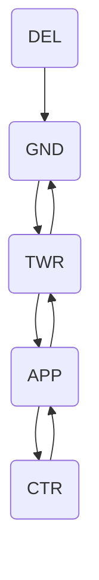

--8<-- "includes/abreviacoes.md"

#

Para fins práticos, disponibilizamos abaixo um exemplo de voo completo, desde o contato inicial com o Tráfego, órgão ATC que realiza autorização de plano, até o contato com o Solo no destino. Considere esse exemplo em uma situação normal, sem adversidades.

## :material-numeric-0-box: Preliminares

<section markdown style="display: grid; grid-template-columns: 5fr 1fr">

O fluxograma ao lado apresenta a sequência de órgãos ATC envolvidos em um voo típico. A comunicação inicia-se no Tráfego (**DEL**), que realiza a autorização do plano de voo. Em seguida, o piloto contata o Solo (**GND**) para solicitar o acionamento e push back, além do táxi até a pista de decolagem. Após isso, o contato é transferido para a Torre (**TWR**), que autoriza a decolagem. Uma vez no ar, o piloto contata o Controle (**APP**) para receber instruções durante o voo. Dependendo da rota, pode haver transferência para o Centro (**CTR**). Na aproximação ao destino, o piloto retorna ao **APP**, depois à **TWR** para autorização de pouso, e finalmente ao **GND** para o táxi até o portão.

Para efeito prático, simularemos a realização do voo **GLO1489** entre os aeroportos de Brasília (SBBR) e Guarulhos (SBGR). As comunicações serão apresentadas em Português, Inglês e Espanhol, refletindo a prática comum, sem fraseologias específicas para situações de emergência ou outras não rotineiras.

??? info "Utilização do Espanhol na fraseologia"
    A utilização do Espanhol somente deve ser realizada nos espaços aéreos autorizados, tanto pelo DECEA quanto pelas CAOP oficialmente definidas entre a Vatsim Brasil e outras divisões. Por padrão, o uso indiscriminado deste idioma na comunicação aeronáutica habitual é vedado, mesmo que piloto e ATC sejam aptos a utilizá-lo.

</section>

## :material-numeric-1-box: :flag_br: Tráfego / :flag_gb: Delivery / :flag_es: Autorización

### Autorização de Plano de Voo

=== ":flag_br: Português"
    

      Tráfego Brasília, bom dia/boa tarde/boa noite. **GOL UNO QUATRO UNO NOVE**.
    

    

      **GOL UNO QUATRO UNO NOVE**, Tráfego Brasília. Bom dia/Boa tarde/Boa noite. :material-information-outline:{ title="<em>Art. 52. A resposta à chamada inicial, contendo o indicativo de chamada da aeronave seguido do nome do órgão ATS, já será considerado um convite para que a aeronave em questão prossiga com a sua mensagem.</em>" }
    

    

      Tráfego Brasília, **GOL UNO QUATRO UNO NOVE**, solicita autorização **ATC**, informação **ATIS BRAVO**.
    

    

      **GOL UNO QUATRO UNO NOVE**, autorizado para o aeroporto de Guarulhos :material-information-outline:{ title="<em>Ou SBGR, lido letra por letra</em>" }. Rota do plano de voo. Nível de Voo **TRÊS QUATRO ZERO**. Pista em uso, **DOIS NOVE ESQUERDA**. Subida via saída **GAXON DOIS ALFA**, transição **ENRUR**. Transponder 4035. Controle Brasília em **UNO DOIS NOVE DECIMAL UNO CINCO**. Coteje. :material-information-outline:{ title="<em>Vide item 3.2 da CIRCEA 100-53/2022.</em>" }
    

    

      Autorizado até o aeroporto de Guarulhos. Rota do plano de voo. Pista em uso, **DOIS NOVE ESQUERDA**. Subida via saída **GAXON DOIS ALFA**, transição **ENRUR**. Transponder 4035, Controle Brasília em **UNO DOIS NOVE**, **DECIMAL UNO CINCO**. **GOL UNO QUATRO UNO NOVE**.
    

    

      **GOL UNO QUATRO UNO NOVE**, cotejamento correto. Chame Solo Brasília em **UNO DOIS UNO DECIMAL OITO ZERO**.
    

    

      Chamará o solo Brasília em **UNO DOIS UNO DECIMAL OITO ZERO**, **GOL UNO QUATRO UNO NOVE**.
    

=== ":flag_gb: Inglês"
    

      Brasília Delivery, good morning/afternoon/evening. **GOL ONE FOUR ONE NINE**.
    

    

      **GOL ONE FOUR ONE NINE**, Brasília Delivery. Good Morning/Afternoon/Evening. :material-information-outline:{ title="<em>Art. 52. A resposta à chamada inicial, contendo o indicativo de chamada da aeronave seguido do nome do órgão ATS, já será considerado um convite para que a aeronave em questão prossiga com a sua mensagem.</em>" }
    

    

      Brasília Delivery, **GOL ONE FOUR ONE NINE**, request **ATC** clearance, information **BRAVO**.
    

    

      **GOL ONE FOUR ONE NINE**, cleared to Guarulhos Airport. Flight plan route. Runway in use, **TWO NINE LEFT**. Climb via **GAXON TWO ALFA** departure, **ENRUR** transition. Squawk 4035. Brasília Control on **ONE TWO NINE DECIMAL ONE FIVE**. Read back. 
    

    

      Cleared to Guarulhos Airport. Flight plan route. Runway in use, **TWO NINE LEFT**. Climb via **GAXON TWO ALFA** departure, **ENRUR** transition. Squawk 4035. Brasília Control on **ONE TWO NINE DECIMAL ONE FIVE**. **GOL ONE FOUR ONE NINE**.
    

    

      **GOL ONE FOUR ONE NINE**, read back is correct. Call Brasília Ground on **ONE TWO ONE DECIMAL EIGHT ZERO**.
    

    

      Will call Brasília Ground on **ONE TWO ONE DECIMAL EIGHT ZERO**, **GOL ONE FOUR ONE NINE**.
    

=== ":flag_es: Espanhol"
    

      Brasília Autorización, buenos días/buenas tardes/buenas noches. **GOL UNO CUATRO UNO NUEVE**.
    

    

      **GOL UNO CUATRO UNO NUEVE**, Brasília Autorización. Buenos Días/Buenas Tardes/Buenas Noches. :material-information-outline:{ title="<em>Art. 52. A resposta à chamada inicial, contendo o indicativo de chamada da aeronave seguido do nome do órgão ATS, já será considerado um convite para que a aeronave em questão prossiga com a sua mensagem.</em>" }
    

    

      Brasília Autorización, **GOL UNO CUATRO UNO NUEVE**, solicita autorización **ATC**, información **BRAVO**.
    

    

      **GOL UNO CUATRO UNO NUEVE**, autorizado hasta el aeropuerto de Guarulhos. Ruta plan de vuelo. Pista en uso, **DOS NUEVE IZQUIERDA**. Salida normalizada **GAXON DOS ALFA**, transición **ENRUR**. Transponder 4035. Brasília Control en **UNO DOS NUEVE DECIMAL UNO CINCO**. Colacione.
    

    

      Autorizado hasta el aeropuerto de Guarulhos. Ruta plan de vuelo. Pista en uso, **DOS NUEVE IZQUIERDA**. Salida normalizada **GAXON DOS ALFA**, transición **ENRUR**. Transponder 4035. Brasília Control en **UNO DOS NUEVE DECIMAL UNO CINCO**. **GOL UNO CUATRO UNO NUEVE**
    

    

      **GOL UNO CUATRO UNO NUEVE**, colación correctal Llame Brasília Tierra en **UNO DOS UNO DECIMAL OCHO CERO**.
    

    

      Llamará Brasília Tierra en **UNO DOS UNO DECIMAL OCHO CERO**, **GOL UNO CUATRO UNO NUEVE**.
    

!!! note "Algumas observações"

    1. A aeronave da categoria de esteira de turbulência **SUPER (J)** ou **PESADA (H)** deverá incluir a palavra **SUPER** ou **PESADA / HEAVY** imediatamente após o indicativo de chamada no contato inicial com o órgão ATS.

        > :flag_br: Tráfego Brasília, bom dia. TAM OITO UNO TRÊS SETE **PESADA**.  
        > :flag_gb: Brasília Delivery, good morning. TAM EIGHT ONE THREE SEVEN **HEAVY**.  
        > :flag_es: Brasília Autorización, buenos días. TAM OCHO UNO TRES SIETE **PESADA**.  

        Não é necessário repetir a palavra **SUPER** ou **PESADA / HEAVY** nas comunicações subsequentes.

    2. Caso você precise instruir uma saída **OMNI**, você pode adicionar instruções para a subida inicial durante a autorização ATC.

        > :flag_br: PAPA SIERRA CHARLIE NOVEMBER X-RAY, autorizado para Salvador. Rota do plano de voo. Pista em uso, **UNO CINCO**. **Subida via saída OMNI, mantenha proa da pista até CINCO MIL pés, após voe direto KONVI.** Transponder 4035. Controle São Paulo em **UNO TRÊS DOIS DECIMAL UNO**. Coteje.   
        > :flag_gb: PAPA SIERRA CHARLIE NOVEMBER X-RAY, cleared to Salvador. Flight plan route. Runway in use, **ONE FIVE**. **Climb via OMNI departure, maintain runway heading until FIVE THOUSAND FEET, then proceed direct KONVI.** Squawk 4035. São Paulo Control on **ONE THREE TWO DECIMAL ONE**. Read back.  
        > :flag_es: PAPA SIERRA CHARLIE NOVEMBER X-RAY, autorizado hasta Salvador. Ruta plan de vuelo. Pista en uso, **UNO CINCO**. **Subida vía salida OMNI, mantenga proa de pista hasta CINCO MIL pies, después proceda directo KONVI.** Transponder 4035. Control São Paulo en **UNO TRES DOS DECIMAL UNO**. Colacione. 

## :material-numeric-2-box: :flag_br: Solo / :flag_gb: Ground / :flag_es: Tierra

### Pushback e Acionamento

=== ":flag_br: Português"
    

      Solo Brasília, **GOL UNO QUATRO UNO NOVE**, posição pátio **UNO**, Box **UNO QUATRO**, pronto para acionamento e push back.
    

    

      **GOL UNO QUATRO UNO NOVE**, Solo Brasília, autorizado acionamento e push back, chame pronto para o táxi.
    

    

      **GOL UNO QUATRO UNO NOVE**, acionamento e push back aprovado, chamará pronto para o táxi.
    

=== ":flag_gb: Inglês"
    

      Brasília Ground, **GOL ONE FOUR ONE NINE**, position Box **ONE FOUR**, request start up and push back.
    

    

      **GOL ONE FOUR ONE NINE**, Brasília Ground, start up and push back approved, report ready for taxi.
    

    

      **GOL ONE FOUR ONE NINE**, start up and push back approved, I will call when ready for taxi.
    

=== ":flag_es: Espanhol"
    

      Rodaje Brasília, **GOL UNO CUATRO UNO NUEVE**, posición plataforma **UNO**, Box **UNO CUATRO**, listo para arranque y retroceso.
    

    

      **GOL UNO CUATRO UNO NUEVE**, Rodaje Brasília, autorizado arranque y retroceso, llame listo para rodaje.
    

    

      **GOL UNO CUATRO UNO NUEVE**, arranque y retroceso aprobado, llamará listo para rodaje.
    

### Táxi

=== ":flag_br: Português"
    

      **GOL UNO QUATRO UNO NOVE** pronto para o táxi.
    

    

      **GOL UNO QUATRO UNO NOVE**, Solo Brasília, autorizado táxi autorizado para o ponto de espera pista **DOIS NOVE ESQUERDA** via taxiways **LIMA QUATRO**, **KILO**, **UNIFORM** e **ZULU**, ajuste de altímetro 1013.
    

    

      **GOL UNO QUATRO UNO NOVE** autorizado táxi autorizado para o ponto de espera pista **DOIS NOVE ESQUERDA** via taxiways **LIMA QUATRO**, **KILO**, **UNIFORM** e **ZULU**, ajuste de altímetro 1013.
    

=== ":flag_gb: Inglês"
    

      **GOL ONE FOUR ONE NINE** ready for taxi.
    

    

      **GOL ONE FOUR ONE NINE**, Brasília Ground, taxi to holding point, runway **TWO NINE LEFT**, via taxiway **LIMA FOUR**, **KILO**, **UNIFORM** and **ZULU**, QNH **ONE ZERO ONE THREE**.
    

    

      **GOL ONE FOUR ONE NINE** taxi to holding point, runway **TWO NINE LEFT**, via taxiway **LIMA FOUR**, **KILO**, **UNIFORM** and **ZULU**, QNH **ONE ZERO ONE THREE**.
    

=== ":flag_es: Espanhol"
    

      **GOL UNO CUATRO UNO NUEVE** listo para rodaje.
    

    

      **GOL UNO CUATRO UNO NUEVE**, Rodaje Brasília, autorizado rodaje al punto de espera pista **DOS NUEVE IZQUIERDA** vía calle de rodaje **LIMA CUATRO**, **KILO**, **UNIFORM** y **ZULU**, ajuste de altímetro 1013 (uno cero uno tres).
    

    

      **GOL UNO CUATRO UNO NUEVE** autorizado rodaje al punto de espera pista **DOS NUEVE IZQUIERDA** vía calle de rodaje **LIMA CUATRO**, **KILO**, **UNIFORM** y **ZULU**, ajuste de altímetro 1013 (uno cero uno tres).
    

### Transferência para a Torre

=== ":flag_br: Português"
    

      Solo Brasília; **GOL UNO QUATRO UNO NOVE** no ponto de espera da pista **DOIS NOVE ESQUERDA**.
    

    

      **GOL UNO QUATRO UNO NOVE**, Solo Brasília, chame Torre Brasília em **UNO UNO OITO**, **DECIMAL UNO**.
    

    

      **GOL UNO QUATRO UNO NOVE** chamará Torre Brasília em **UNO UNO OITO**, **DECIMAL UNO**.
    

=== ":flag_gb: Inglês"
    

      Brasília Ground, **GOL ONE FOUR ONE NINE** holding point runway **TWO NINE LEFT**.
    

    

      **GOL ONE FOUR ONE NINE**, Brasília Ground, call Brasília Tower on **ONE ONE EIGHT**, **DECIMAL ONE**.
    

    

      **GOL ONE FOUR ONE NINE** I will call Brasília Tower on **ONE ONE EIGHT**, **DECIMAL ONE**.
    

=== ":flag_es: Espanhol"
    

      Rodaje Brasília; **GOL UNO CUATRO UNO NUEVE** en el punto de espera pista **DOS NUEVE IZQUIERDA**.
    

    

      **GOL UNO CUATRO UNO NUEVE**, Rodaje Brasília, llame Torre Brasília en **UNO UNO OCHO**, **DECIMAL UNO**.
    

    

      **GOL UNO CUATRO UNO NUEVE** llamará Torre Brasília en **UNO UNO OCHO**, **DECIMAL UNO**.
    

## :material-numeric-3-box: :flag_br: Torre / :flag_gb: Tower / :flag_es: Torre

### Autorização para Decolagem

=== ":flag_br: Português"
    

      Torre Brasília; **GOL UNO QUATRO UNO NOVE**, ponto de espera pista **DOIS NOVE ESQUERDA**.
    

    

      **GOL UNO QUATRO UNO NOVE**; Torre Brasília, pista **DOIS NOVE ESQUERDA**, autorizada decolagem, vento **DOIS OITO ZERO GRAUS**, **ZERO NOVE NÓS**.
    

    

      **GOL UNO QUATRO UNO NOVE**; pista **DOIS NOVE ESQUERDA**, autorizada decolagem.
    

    

      **GOL UNO QUATRO UNO NOVE**; decolado aos **ZERO CINCO**; chame o Controle Brasília em **UNO UNO NOVE**, **DECIMAL DOIS**.
    

    

      **GOL UNO QUATRO UNO NOVE**; chamará Controle Brasília em **UNO UNO NOVE**, **DECIMAL DOIS**.
    

=== ":flag_gb: Inglês"
    

      Brasília Tower; **GOL ONE FOUR ONE NINE**, holding point runway **TWO NINE LEFT**.
    

    

      **GOL ONE FOUR ONE NINE**, Brasília Tower, runway **TWO NINE LEFT**, cleared for take-off, wind **TWO EIGHT ZERO DEGREES**, **ZERO NINE KNOTS**.
    

    

      **GOL ONE FOUR ONE NINE**; runway **TWO NINE LEFT**, cleared for take-off.
    

    

      **GOL ONE FOUR ONE NINE**; airborne at **ZERO FIVE**, call Brasília Control on **ONE ONE NINE**, **DECIMAL TWO**.
    

    

      **GOL ONE FOUR ONE NINE**; I will call Brasília Control on **ONE ONE NINE**, **DECIMAL TWO**.
    

=== ":flag_es: Espanhol"
    

      Torre Brasília; **GOL UNO CUATRO UNO NUEVE**, punto de espera pista **DOS NUEVE IZQUIERDA**.
    

    

      **GOL UNO CUATRO UNO NUEVE**; Torre Brasília, pista **DOS NUEVE IZQUIERDA**, autorizado despegue, viento **DOS OCHO CERO** grados, **CERO NUEVE** nudos.
    

    

      **GOL UNO CUATRO UNO NUEVE**; pista **DOS NUEVE IZQUIERDA**, autorizado despegue.
    

    

      **GOL UNO CUATRO UNO NUEVE**; en el aire a los **CERO CINCO**; llame el Control Brasília en **UNO UNO NUEVE**, **DECIMAL DOS**.
    

    

      **GOL UNO CUATRO UNO NUEVE**; llamará Control Brasília en **UNO UNO NUEVE**, **DECIMAL DOS**.
    

## :material-numeric-4-box: :flag_br: Controle / :flag_gb: Control / :flag_es: Control

### Contato inicial após decolagem

=== ":flag_br: Português"
    

      Controle **BRASÍLIA**, **GOL UNO QUATRO UNO NOVE**, decolando pista **DOIS NOVE ESQUERDA**; passando **CINCO MIL PÉS**, saída **GAXO DOIS ALFA**, transição **ENRUR**.
    

    

      **GOL UNO QUATRO UNO NOVE** Controle Brasília ciente, contato radar na decolagem, suba via **GAXO DOIS ALFA** para o nível **TRÊS MEIA ZERO**.
    

    

      **GOL UNO QUATRO UNO NOVE** ciente, sobe via saída **GAXO DOIS ALFA**, para o nível **TRÊS MEIA ZERO**.
    

=== ":flag_gb: Inglês"
    

      Brasília Control, **GOL ONE FOUR ONE NINE**, airborne runway **TWO NINE LEFT**; passing **FIVE THOUSAND FEET**, **GAXO TWO ALFA** departure, **ENRUR** transition.
    

    

      **GOL ONE FOUR ONE NINE** Brasília Control roger, radar contact on departure, climb via **GAXO TWO ALFA** to flight level **THREE SIX ZERO**.
    

    

      **GOL ONE FOUR ONE NINE**, roger, climb via **GAXO TWO ALFA** to flight level **THREE SIX ZERO**.
    

=== ":flag_es: Espanhol"
    

      Control **BRASÍLIA**, **GOL UNO CUATRO UNO NUEVE**, despegando pista **DOS NUEVE IZQUIERDA**; pasando **CINCO MIL** pies, salida **GAXO DOS ALFA**, transición **ENRUR**.
    

    

      **GOL UNO CUATRO UNO NUEVE** Control Brasília recibido, contacto radar en el despegue, suba vía **GAXO DOS ALFA** hasta nivel **TRES SEIS CERO**.
    

    

      **GOL UNO CUATRO UNO NUEVE** recibido, sube vía salida **GAXO DOS ALFA**, hasta nivel **TRES SEIS CERO**.
    

### Transferência para o próximo órgão

=== ":flag_br: Português"
    

      **GOL UNO QUATRO UNO NOVE**, chame Centro **BRASÍLIA**, **UNO DOIS MEIA**, decimal **SETE CINCO**;
    

    

      **GOL UNO QUATRO UNO NOVE**, chamará Centro **BRASÍLIA**, **UNO DOIS MEIA**, decimal **SETE CINCO**;
    

=== ":flag_gb: Inglês"
    

      **GOL ONE FOUR ONE NINE**, call Brasília Center, **UNE TWO SIX**, decimal **SEVEN FIVE**;
    

    

      **GOL ONE FOUR ONE NINE**, I will call Brasília Center, **UNE TWO SIX**, decimal **SEVEN FIVE**;
    

=== ":flag_es: Espanhol"
    

      **GOL UNO CUATRO UNO NUEVE**, llame Centro **BRASÍLIA**, **UNO DOS SEIS**, decimal **SIETE CINCO**;
    

    

      **GOL UNO CUATRO UNO NUEVE**, llamará Centro **BRASÍLIA**, **UNO DOS SEIS**, decimal **SIETE CINCO**;
    

## :material-numeric-5-box: :flag_br: Centro / :flag_gb: Center / :flag_es: Centro

### Chamada Inicial

=== ":flag_br: Português"
    

      Centro Brasília, **GOL UNO QUATRO UNO NOVE**.
    

    

      **GOL UNO QUATRO UNO NOVE**, Centro Brasília ciente, contato radar, suba e mantenha nível **TRÊS MEIA ZERO**.
    

    

      **GOL UNO QUATRO UNO NOVE**, ciente, sobe e mantém nível **TRÊS MEIA ZERO**.
    

=== ":flag_gb: Inglês"
    

      Brasília Center, **GOL ONE FOUR ONE NINE**.
    

    

      **GOL ONE FOUR ONE NINE**, Brasília Center roger, radar contact, climb and maintain flight level **THREE SIX ZERO**.
    

    

      **GOL ONE FOUR ONE NINE**, roger, climb and maintain flight level **THREE SIX ZERO**.
    

=== ":flag_es: Espanhol"
    

      Centro Brasília, **GOL UNO CUATRO UNO NUEVE**.
    

    

      **GOL UNO CUATRO UNO NUEVE**, Centro Brasília recibido, contacto radar, suba y mantenga nivel **TRES SEIS CERO**.
    

    

      **GOL UNO CUATRO UNO NUEVE**, recibido, sube y mantiene nivel **TRES SEIS CERO**.
    

### Atingindo o nível de cruzeiro

=== ":flag_br: Português"
    

      Centro Brasília, **GOL UNO QUATRO UNO NOVE** nível de voo **TRÊS MEIA ZERO**.
    

    

      **GOL UNO QUATRO UNO NOVE** Centro Brasília ciente, informe no ideal de descida.
    

    

      **GOL UNO QUATRO UNO NOVE** informará no ideal de descida.
    

=== ":flag_gb: Inglês"
    

      Brasília Center, **GOL ONE FOUR ONE NINE** reaching flight level **THREE SIX ZERO**.
    

    

      **GOL ONE FOUR ONE NINE** Brasília Center roger, inform when ready for descend.
    

    

      **GOL ONE FOUR ONE NINE** I will inform when ready for descend.
    

=== ":flag_es: Espanhol"
    

      Centro Brasília, **GOL UNO CUATRO UNO NUEVE** nivel de vuelo **TRES SEIS CERO**.
    

    

      **GOL UNO CUATRO UNO NUEVE** Centro Brasília recibido, informe cuando esté listo para descenso.
    

    

      **GOL UNO CUATRO UNO NUEVE** informará cuando esté listo para descenso.
    

### Para a descida

=== ":flag_br: Português"
    

      Centro Brasília, **GOL UNO QUATRO UNO NOVE** no ponto ideal de descida.
    

    

      **GOL UNO QUATRO UNO NOVE** Centro Brasília ciente, desça via **SANPA UNO ALFA**, reporte passando o nível **UNO QUATRO CINCO**.
    

    

      **GOL UNO QUATRO UNO NOVE** ciente, desce via **SANPA UNO ALFA**, reportará passando o nível **UNO QUATRO CINCO**.
    

=== ":flag_gb: Inglês"
    

      Brasília Center, **GOL ONE FOUR ONE NINE** ready for descend.
    

    

      **GOL ONE FOUR ONE NINE** Brasília Center roger, descent via **SANPA UNO ALFA**, report passing flight **ONE FOUR FIVE**.
    

    

      **GOL ONE FOUR ONE NINE** roger, descent via **SANPA UNO ALFA**, I will report passing flight **ONE FOUR FIVE**.
    

=== ":flag_es: Espanhol"
    

      Centro Brasília, **GOL UNO CUATRO UNO NUEVE** listo para descenso.
    

    

      **GOL UNO CUATRO UNO NUEVE** Centro Brasília recibido, descienda vía **SANPA UNO ALFA**, reporte pasando nivel **UNO CUATRO CINCO**.
    

    

      **GOL UNO CUATRO UNO NUEVE** recibido, desciende vía **SANPA UNO ALFA**, reportará pasando nivel **UNO CUATRO CINCO**.
    

### Transferência para o próximo órgão

=== ":flag_br: Português"
    

      Centro Brasília, **GOL UNO QUATRO UNO NOVE** passando o nível **UNO QUATRO CINCO**.
    

    

      **GOL UNO QUATRO UNO NOVE**, Centro Brasília ciente, chame agora o controle São Paulo em **UNO DOIS NOVE**, decimal **QUATRO CINCO**.
    

    

      **GOL UNO QUATRO UNO NOVE** chamará Controle São Paulo em **UNO DOIS NOVE**, decimal **QUATRO CINCO**.
    

=== ":flag_gb: Inglês"
    

      Brasília Center, **GOL ONE FOUR ONE NINE** passing flight level **ONE FOUR FIVE**.
    

    

      **GOL ONE FOUR ONE NINE**, Brasília center roger, contact now São Paulo Control on **ONE TWO NINE**, decimal **FOUR FIVE**.
    

    

      **GOL ONE FOUR ONE NINE** I will call São Paulo Control on **ONE TWO NINE**, decimal **FOUR FIVE**.
    

=== ":flag_es: Espanhol"
    

      Centro Brasília, **GOL UNO CUATRO UNO NUEVE** pasando nivel **UNO CUATRO CINCO**.
    

    

      **GOL UNO CUATRO UNO NUEVE**, Centro Brasília recibido, llame ahora el control São Paulo en **UNO DOS NUEVE**, decimal **CUATRO CINCO**.
    

    

      **GOL UNO CUATRO UNO NUEVE** llamará Control São Paulo en **UNO DOS NUEVE**, decimal **CUATRO CINCO**.
    

## :material-numeric-6-box: :flag_br: Controle / :flag_gb: Control / :flag_es: Control

### Contato Inicial

=== ":flag_br: Português"
    

      Controle São Paulo, **GOL UNO QUATRO UNO NOVE** procedente de Brasília, passando nível **UNO QUATRO CINCO** para Guarulhos.
    

    

      **GOL UNO QUATRO UNO NOVE** Controle São Paulo ciente, contato radar, desça via **SANPA UNO ALFA**, prevista aproximação **ILS YANKEE** para pista **UNO ZERO DIREITA**.
    

    

      **GOL UNO QUATRO UNO NOVE** Ciente, desce via **SANPA UNO ALFA**, prevista aproximação **ILS YANKEE** para pista **UNO ZERO DIREITA**.
    

=== ":flag_gb: Inglês"
    

      São Paulo Control, **GOL ONE FOUR ONE NINE** traffic from Brasília, passing flight level **ONE FOUR FIVE** to Guarulhos. 
    

    

      **GOL ONE FOUR ONE NINE** São Paulo Control roger, radar contact, descend via **SANPA UNO ALFA**, expect **ILS YANKEE** approach for runway **ONE ZERO RIGHT**.
    

    

      **GOL ONE FOUR ONE NINE** Roger, descend via **SANPA ONE ALFA**, expect **ILS YANKEE** approach for runway **ONE ZERO RIGHT**.
    

=== ":flag_es: Espanhol"
    

      Control São Paulo, **GOL UNO CUATRO UNO NUEVE** procedente de Brasília, pasando nivel **UNO CUATRO CINCO** para Guarulhos.
    

    

      **GOL UNO CUATRO UNO NUEVE** Control São Paulo recibido, contacto radar, descienda vía **SANPA UNO ALFA**, prevista aproximación **ILS YANKEE** para pista **UNO CERO DERECHA**.
    

    

      **GOL UNO CUATRO UNO NUEVE** Recibido, desciende vía **SANPA UNO ALFA**, prevista aproximación **ILS YANKEE** para pista **UNO CERO DERECHA**.
    

### Autorização do Procedimento

=== ":flag_br: Português"
    

      **GOL UNO QUATRO UNO NOVE** autorizado **ILS YANKEE** para pista **UNO ZERO DIREITA**, ajuste de altímetro (ou QNH) 1014, reporte estabilizado.
    

    

      **GOL UNO QUATRO UNO NOVE** autorizado **ILS YANKEE** para pista **UNO ZERO DIREITA**, ajuste de altímetro (ou QNH) 1014, reportará estabilizado.
    

=== ":flag_gb: Inglês"
    

      **GOL ONE FOUR ONE NINE** cleared **ILS YANKEE** approach for runway **ONE ZERO RIGHT**, QNH **ONE ZERO ONE FOUR**, report established.
    

    

      **GOL ONE FOUR ONE NINE** cleared **ILS YANKEE** approach for runway **ONE ZERO RIGHT**, QNH **ONE ZERO ONE FOUR**, I will report established.
    

=== ":flag_es: Espanhol"
    

      **GOL UNO CUATRO UNO NUEVE** autorizado **ILS YANKEE** para pista **UNO CERO DERECHA**, ajuste de altímetro (o QNH) 1014 (uno cero uno cuatro), reporte establecido.
    

    

      **GOL UNO CUATRO UNO NUEVE** autorizado **ILS YANKEE** para pista **UNO CERO DERECHA**, ajuste de altímetro (o QNH) 1014 (uno cero uno cuatro), reportará establecido.
    

### Transferência para a Torre

=== ":flag_br: Português"
    

      Controle São Paulo, **GOL UNO QUATRO UNO NOVE** estabilizado no **ILZ** pista **UNO ZERO DIREITA**.
    

    

      **GOL UNO QUATRO UNO NOVE** chame a Torre Guarulhos em **UNO UNO OITO**, decimal **QUATRO**.
    

    

      **GOL UNO QUATRO UNO NOVE** chamará a Torre Guarulhos em **UNO UNO OITO**, decimal **QUATRO**.
    

=== ":flag_gb: Inglês"
    

      São Paulo Control, **GOL ONE FOUR ONE NINE** established on **ILS** runway **ONE ZERO RIGHT**.
    

    

      **GOL ONE FOUR ONE NINE** call Guarulhos Tower on **ONE ONE EIGHT**, decimal **FOUR**.
    

    

      **GOL ONE FOUR ONE NINE** I will call Guarulhos Tower on **ONE ONE EIGHT**, decimal **FOUR**.
    

=== ":flag_es: Espanhol"
    

      Control São Paulo, **GOL UNO CUATRO UNO NUEVE** establecido en **ILS** pista **UNO CERO DERECHA**.
    

    

      **GOL UNO CUATRO UNO NUEVE** llame la Torre Guarulhos en **UNO UNO OCHO**, decimal **CUATRO**.
    

    

      **GOL UNO CUATRO UNO NUEVE** llamará la Torre Guarulhos en **UNO UNO OCHO**, decimal **CUATRO**.
    

## :material-numeric-7-box: :flag_br: Torre / :flag_gb: Tower / :flag_es: Torre

### Contato Inicial

=== ":flag_br: Português"
    

      Torre Guarulhos, **GOL UNO QUATRO UNO NOVE** na final pista **UNO ZERO DIREITA**.
    

    

      **GOL UNO QUATRO UNO NOVE**, pista **UNO ZERO DIREITA**, pouso autorizado, vento **ZERO NOVE ZERO** graus, **ZERO OITO** nós.
    

    

      **GOL UNO QUATRO UNO NOVE** pista **UNO ZERO DIREITA**, pouso autorizado.
    

=== ":flag_gb: Inglês"
    

      Guarulhos Tower, **GOL ONE FOUR ONE NINE** on final runway **ONE ZERO RIGHT**.
    

    

      **GOL ONE FOUR ONE NINE**, runway **ONE ZERO RIGHT**, cleared to land, wind **ZERO NINE ZERO** degrees, **ZERO EIGHT** knots.
    

    

      **GOL ONE FOUR ONE NINE** runway **ONE ZERO RIGHT**, cleared to land.
    

=== ":flag_es: Espanhol"
    

      Torre Guarulhos, **GOL UNO CUATRO UNO NUEVE** en final pista **UNO CERO DERECHA**.
    

    

      **GOL UNO CUATRO UNO NUEVE**, pista **UNO CERO DERECHA**, aterrizaje autorizado, viento **CERO NUEVE CERO** grados, **CERO OCHO** nudos.
    

    

      **GOL UNO CUATRO UNO NUEVE** pista **UNO CERO DERECHA**, aterrizaje autorizado.
    

### Após o pouso - Cruzamento de pista

=== ":flag_br: Português"
    

      **GOL UNO QUATRO UNO NOVE**, no solo aos **CINCO UNO**, livra na taxiway **BRAVO BRAVO**, autorizado cruzamento da pista **UNO ZERO ESQUERDA**, após livrar o cruzamento, chame o Solo Guarulhos em **UNO DOIS NOVE**, decimal **SETE**.
    

    

      **GOL UNO QUATRO UNO NOVE**, livra na taxiway **BRAVO BRAVO**, autorizado cruzamento da pista **UNO ZERO ESQUERDA**, após livrar o cruzamento, chamará o Solo Guarulhos em **UNO DOIS NOVE**, decimal **SETE**.
    

=== ":flag_gb: Inglês"
    

      **GOL ONE FOUR ONE NINE**, on the ground at **FIVE ONE**, vacating runway on taxiway **BRAVO BRAVO**, cleared crossing runway **ONE ZERO LEFT**, after vacating runway contact Guarulhos Ground one **UNO TWO ONE**, decimal **SEVEN**.
    

    

      **GOL ONE FOUR ONE NINE**, vacating runway on taxiway **BRAVO BRAVO**, cleared crossing runway **ONE ZERO LEFT**, after vacating runway I will contact Guarulhos Ground one **UNO TWO ONE**, decimal **SEVEN**.
    

=== ":flag_es: Espanhol"
    

      **GOL UNO CUATRO UNO NUEVE**, en tierra a los **CINCO UNO**, saliendo de pista en calle de rodaje **BRAVO BRAVO**, autorizado cruce de pista **UNO CERO IZQUIERDA**, después de salir del cruce, llame Rodaje Guarulhos en **UNO DOS NUEVE**, decimal **SIETE**.
    

    

      **GOL UNO CUATRO UNO NUEVE**, saliendo de pista en calle de rodaje **BRAVO BRAVO**, autorizado cruce de pista **UNO CERO IZQUIERDA**, después de salir del cruce, llamará Rodaje Guarulhos en **UNO DOS NUEVE**, decimal **SIETE**.
    

### Transferência para o Solo

=== ":flag_br: Português"
    

      Solo Guarulhos **GOL UNO QUATRO UNO NOVE** livrando a pista **UNO ZERO ESQUERDA** na interseção **LIMA**.
    

    

      **GOL UNO QUATRO UNO NOVE** autorizado táxi para o Pátio **QUATRO** via taxiway **ALFA**, **INDIA**, **YANKEE QUATRO**, **YANKEE QUATRO WISKEY**, posição **QUATRO ZERO TRÊS**. 
    

    

      **GOL UNO QUATRO UNO NOVE** ciente, autorizado táxi para o Pátio **QUATRO** via taxiway **ALFA**, **INDIA**, **YANKEE QUATRO**, **YANKEE QUATRO WISKEY**, posição **QUATRO ZERO TRÊS**. 
    

=== ":flag_gb: Inglês"
    

      Guarulhos Ground, **GOL ONE FOUR ONE NINE** vacating runway, **LIMA** intersection.
    

    

      **GOL ONE FOUR ONE NINE** cleared taxi to appron **FOUR**, via taxiway **ALFA**, **INDIA**, **YANKEE FOUR**, **YANKEE FOUR WISKEY**, stand **FOUR ZERO THREE**.
    

    

      **GOL ONE FOUR ONE NINE** roger, cleared taxi to appron **FOUR**, via taxiway **ALFA**, **INDIA**, **YANKEE FOUR**, **YANKEE FOUR WISKEY**, stand **FOUR ZERO THREE**.
    

=== ":flag_es: Espanhol"
    

      Rodaje Guarulhos **GOL UNO CUATRO UNO NUEVE** saliendo de pista **UNO CERO IZQUIERDA** en intersección **LIMA**.
    

    

      **GOL UNO CUATRO UNO NUEVE** autorizado rodaje para Plataforma **CUATRO** vía calle de rodaje **ALFA**, **INDIA**, **YANKEE CUATRO**, **YANKEE CUATRO WISKEY**, posición **CUATRO CERO TRES**.
    

    

      **GOL UNO CUATRO UNO NUEVE** recibido, autorizado rodaje para Plataforma **CUATRO** vía calle de rodaje **ALFA**, **INDIA**, **YANKEE CUATRO**, **YANKEE CUATRO WISKEY**, posición **CUATRO CERO TRES**.
    

<!-- ---

<a href="../algarismos/">
←
Página anterior
|
Algarismos
</a>

<a href="../dicas/">
Próxima página
|
Dicas
→
</a>

 -->

