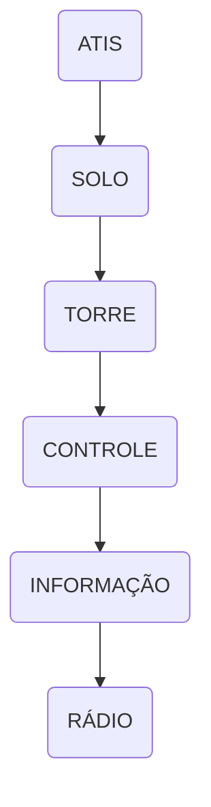

--8<-- "includes/abreviacoes.md"

#

## :material-numeric-0-box: Preliminares

<section markdown style="display: grid; grid-template-columns: 5fr 2fr">

O fluxograma ao lado apresenta a sequência de órgãos envolvidos neste voo. A aeronave sai de um aeródromo controlado, atravessa espaço aéreo controlado, segue em rota sob o serviço de informação de voo e pousa em um aeródromo não controlado atendido por estação aeronáutica.

Para efeito prático, simularemos o voo do **PT-VBR**, um Cessna 172, entre **Pampulha (SBBH)** e **Ipatinga (SBIP)**, em regras de voo visual, com cruzeiro em **7.500 pés**.

Considere o **nível de transição em 080**. Todo o voo acontece abaixo dele, portanto a referência vertical é sempre **altitude em pés com QNH**, e em nenhum momento se fala em nível de voo.

As comunicações são apresentadas em Português, Inglês e Espanhol. Os complementos e variações aparecem em caixas de observações ao final de cada etapa, e vale a pena conferi-las.

!!! danger "Utilização do Espanhol na fraseologia"
    A utilização do Espanhol somente deve ser realizada nos espaços aéreos autorizados, tanto pelo DECEA quanto pelas CAOP oficialmente definidas entre a Vatsim Brasil e outras divisões. Por padrão, **o uso indiscriminado deste idioma na comunicação aeronáutica habitual <u>é vedado</u>**, mesmo que piloto e ATC sejam aptos a utilizá-lo.

</section>

## :material-numeric-1-box: :flag_br: Solo / :flag_gb: Ground / :flag_es: Tierra

### Acionamento e táxi

Antes de chamar o Solo, ouça o ATIS e tenha em mãos o QNH, a pista em uso e a letra da informação. No voo visual, o contato inicial já traz a posição no pátio, o tipo de aeronave, as regras de voo e o destino.

=== ":flag_br: Português"
    

      Solo Pampulha, **PAPA TANGO VICTOR BRAVO ROMEO**, bom dia.
    

    

      **PAPA TANGO VICTOR BRAVO ROMEO**, Solo Pampulha, bom dia. :material-information-outline:{ title="<em>A resposta à chamada inicial, contendo o indicativo de chamada da aeronave seguido do nome do órgão ATS, já será considerado um convite para que a aeronave em questão prossiga com a sua mensagem. (Art. 52, MCA 100-16)</em>" }
    

    

      Solo Pampulha, **PAPA TANGO VICTOR BRAVO ROMEO**, pátio da aviação geral, um Cessna 172, VFR para Ipatinga, informação ALFA, solicita acionamento e instruções de táxi.
    

    

      **VICTOR BRAVO ROMEO**, Solo Pampulha, acionamento aprovado, táxi autorizado para o ponto de espera da pista UNO TRÊS via taxiway ALFA. Ajuste de altímetro UNO ZERO UNO TRÊS. Transponder QUATRO DOIS ZERO UNO. Próximo ao ponto de espera, chame a Torre Pampulha em UNO UNO OITO DECIMAL ZERO.
    

    

      Acionamento aprovado, táxi autorizado para o ponto de espera da pista UNO TRÊS via taxiway ALFA, ajuste de altímetro UNO ZERO UNO TRÊS, transponder QUATRO DOIS ZERO UNO, chamará a Torre Pampulha em UNO UNO OITO DECIMAL ZERO, **VICTOR BRAVO ROMEO**.
    

=== ":flag_gb: Inglês"
    

      Pampulha Ground, **PAPA TANGO VICTOR BRAVO ROMEO**, good morning.
    

    

      **PAPA TANGO VICTOR BRAVO ROMEO**, Pampulha Ground, good morning.
    

    

      Pampulha Ground, **PAPA TANGO VICTOR BRAVO ROMEO**, general aviation apron, a Cessna 172, VFR to Ipatinga, information ALFA, request startup and taxi instructions.
    

    

      **VICTOR BRAVO ROMEO**, Pampulha Ground, startup approved, taxi to holding point runway ONE THREE via taxiway ALFA. QNH ONE ZERO ONE THREE. Squawk FOUR TWO ZERO ONE. Approaching holding point, contact Pampulha Tower on ONE ONE EIGHT DECIMAL ZERO.
    

    

      Startup approved, taxi to holding point runway ONE THREE via taxiway ALFA, QNH ONE ZERO ONE THREE, squawk FOUR TWO ZERO ONE, will contact Pampulha Tower on ONE ONE EIGHT DECIMAL ZERO, **VICTOR BRAVO ROMEO**.
    

=== ":flag_es: Espanhol"
    

      Pampulha Tierra, **PAPA TANGO VICTOR BRAVO ROMEO**, buenos días.
    

    

      **PAPA TANGO VICTOR BRAVO ROMEO**, Pampulha Tierra, buenos días.
    

    

      Pampulha Tierra, **PAPA TANGO VICTOR BRAVO ROMEO**, plataforma de aviación general, un Cessna 172, VFR para Ipatinga, información ALFA, solicita puesta en marcha e instrucciones de rodaje.
    

    

      **VICTOR BRAVO ROMEO**, Pampulha Tierra, puesta en marcha aprobada, autorizado rodar al punto de espera de la pista UNO TRES vía calle ALFA. Ajuste de altímetro UNO CERO UNO TRES. Transponder CUATRO DOS CERO UNO. Próximo al punto de espera, llame Pampulha Torre en UNO UNO OCHO DECIMAL CERO.
    

    

      Puesta en marcha aprobada, autorizado rodar al punto de espera de la pista UNO TRES vía calle ALFA, ajuste de altímetro UNO CERO UNO TRES, transponder CUATRO DOS CERO UNO, llamará Pampulha Torre en UNO UNO OCHO DECIMAL CERO, **VICTOR BRAVO ROMEO**.
    

??? abstract "Algumas observações..."

    1. Em aeródromos que possuam a posição **TRÁFEGO**, a autorização de saída visual é emitida antes do táxi. Nesse caso, o Solo cuida apenas do acionamento e do táxi.

        > :flag_br: **PAPA TANGO VICTOR BRAVO ROMEO**, Tráfego Pampulha, autorizado saída VFR para Ipatinga, mantenha VFR, após a decolagem saída pela perna do vento à esquerda, transponder QUATRO DOIS ZERO UNO. Coteje.  
        > :flag_gb: **PAPA TANGO VICTOR BRAVO ROMEO**, Pampulha Delivery, cleared VFR departure to Ipatinga, maintain VFR, after departure leave via left downwind, squawk FOUR TWO ZERO ONE. Read back.  
        > :flag_es: **PAPA TANGO VICTOR BRAVO ROMEO**, Pampulha Autorización, autorizada salida VFR para Ipatinga, mantenga VFR, después del despegue salida por el tramo con viento en cola por la izquierda, transponder CUATRO DOS CERO UNO. Colacione.  

    2. A aeronave de aviação geral raramente precisa de pushback. Quando o estacionamento permitir a saída pelos próprios meios, solicite apenas o acionamento.

    3. Se a intenção for permanecer no circuito para treinamento, informe isso já no contato com o Solo, porque muda o planejamento da Torre.

        > :flag_br: Solo Pampulha, **PAPA TANGO VICTOR BRAVO ROMEO**, pátio da aviação geral, um Cessna 172, **voo local no circuito de tráfego**, informação ALFA, solicita acionamento e instruções de táxi.  
        > :flag_gb: Pampulha Ground, **PAPA TANGO VICTOR BRAVO ROMEO**, general aviation apron, a Cessna 172, **local flight in the traffic circuit**, information ALFA, request startup and taxi instructions.  
        > :flag_es: Pampulha Tierra, **PAPA TANGO VICTOR BRAVO ROMEO**, plataforma de aviación general, un Cessna 172, **vuelo local en el circuito de tránsito**, información ALFA, solicita puesta en marcha e instrucciones de rodaje.  

## :material-numeric-2-box: :flag_br: Torre / :flag_gb: Tower / :flag_es: Torre

### Decolagem e saída do circuito

A Torre autoriza a decolagem e informa como a aeronave deve deixar o circuito de tráfego. Esse é o ponto em que a operação VFR mais se diferencia da IFR, já que não existe procedimento de saída publicado a ser seguido.

=== ":flag_br: Português"
    

      Torre Pampulha, **PAPA TANGO VICTOR BRAVO ROMEO**, ponto de espera da pista UNO TRÊS, pronto para a decolagem.
    

    

      **VICTOR BRAVO ROMEO**, Torre Pampulha, pista UNO TRÊS, decolagem autorizada, vento UNO TRÊS ZERO graus, ZERO OITO nós. Após a decolagem, saída pela perna do vento à esquerda, reporte livre do circuito.
    

    

      Decolagem autorizada, pista UNO TRÊS, saída pela perna do vento à esquerda, reportará livre do circuito, **VICTOR BRAVO ROMEO**.
    

    

      **VICTOR BRAVO ROMEO**, livre do circuito, rumo leste, subindo para SETE MIL E QUINHENTOS pés.
    

    

      **VICTOR BRAVO ROMEO**, decolado aos UNO DOIS, chame o Controle Belo Horizonte em UNO UNO NOVE DECIMAL UNO. Bom voo!
    

    

      Chamará o Controle Belo Horizonte em UNO UNO NOVE DECIMAL UNO, **VICTOR BRAVO ROMEO**. Obrigado e bom controle!
    

=== ":flag_gb: Inglês"
    

      Pampulha Tower, **PAPA TANGO VICTOR BRAVO ROMEO**, holding point runway ONE THREE, ready for departure.
    

    

      **VICTOR BRAVO ROMEO**, Pampulha Tower, runway ONE THREE, cleared for take-off, wind ONE THREE ZERO degrees, ZERO EIGHT knots. After departure, leave via left downwind, report clear of the circuit.
    

    

      Cleared for take-off, runway ONE THREE, leaving via left downwind, will report clear of the circuit, **VICTOR BRAVO ROMEO**.
    

    

      **VICTOR BRAVO ROMEO**, clear of the circuit, eastbound, climbing to SEVEN THOUSAND FIVE HUNDRED feet.
    

    

      **VICTOR BRAVO ROMEO**, airborne at ONE TWO, contact Belo Horizonte Control on ONE ONE NINE DECIMAL ONE. Have a good flight!
    

    

      Will contact Belo Horizonte Control on ONE ONE NINE DECIMAL ONE, **VICTOR BRAVO ROMEO**. Thanks and have a good control!
    

=== ":flag_es: Espanhol"
    

      Pampulha Torre, **PAPA TANGO VICTOR BRAVO ROMEO**, punto de espera de la pista UNO TRES, listo para despegar.
    

    

      **VICTOR BRAVO ROMEO**, Pampulha Torre, pista UNO TRES, autorizado despegue, viento UNO TRES CERO grados, CERO OCHO nudos. Después del despegue, salida por el tramo con viento en cola por la izquierda, reporte libre del circuito.
    

    

      Autorizado despegue, pista UNO TRES, salida por el tramo con viento en cola por la izquierda, reportará libre del circuito, **VICTOR BRAVO ROMEO**.
    

    

      **VICTOR BRAVO ROMEO**, libre del circuito, rumbo este, ascendiendo a SIETE MIL QUINIENTOS pies.
    

    

      **VICTOR BRAVO ROMEO**, en el aire a los UNO DOS, llame Belo Horizonte Control en UNO UNO NUEVE DECIMAL UNO. ¡Buen vuelo!
    

    

      Llamará Belo Horizonte Control en UNO UNO NUEVE DECIMAL UNO, **VICTOR BRAVO ROMEO**. ¡Gracias y buen control!
    

??? abstract "Algumas observações..."

    1. A Torre pode condicionar a saída ao tráfego existente, mantendo a aeronave no circuito até que haja espaço.

        > :flag_br: **VICTOR BRAVO ROMEO**, pista UNO TRÊS, decolagem autorizada, vento UNO TRÊS ZERO graus, ZERO OITO nós. **Mantenha o circuito, aguarde instruções para a saída.**  
        > :flag_gb: **VICTOR BRAVO ROMEO**, runway ONE THREE, cleared for take-off, wind ONE THREE ZERO degrees, ZERO EIGHT knots. **Remain in the circuit, standby for departure instructions.**  
        > :flag_es: **VICTOR BRAVO ROMEO**, pista UNO TRES, autorizado despegue, viento UNO TRES CERO grados, CERO OCHO nudos. **Manténgase en el circuito, espere instrucciones para la salida.**  

    2. Também é comum a Torre limitar a altitude enquanto a aeronave estiver na CTR.

        > :flag_br: **VICTOR BRAVO ROMEO**, após a decolagem, saída em frente, **mantenha DOIS MIL pés ou abaixo até deixar a CTR**, reporte livre do circuito.  
        > :flag_gb: **VICTOR BRAVO ROMEO**, after departure, straight out, **maintain TWO THOUSAND feet or below until leaving the CTR**, report clear of the circuit.  
        > :flag_es: **VICTOR BRAVO ROMEO**, después del despegue, salida en línea recta, **mantenga DOS MIL pies o inferior hasta abandonar la CTR**, reporte libre del circuito.  

    3. Se a decolagem for de uma interseção, informe isso no reporte de ponto de espera, exatamente como no voo por instrumentos.

    4. Vento com intensidade de zero nó (00000KT) deve ser informado como **vento calmo**.

## :material-numeric-3-box: :flag_br: Controle / :flag_gb: Control / :flag_es: Control

### Saída da CTR e da TMA

Dentro do espaço aéreo controlado, o voo visual continua sujeito a autorização. O Controle mantém a vigilância, presta informação de tráfego e libera a aeronave quando ela deixar o seu espaço aéreo.

=== ":flag_br: Português"
    

      Controle Belo Horizonte, **PAPA TANGO VICTOR BRAVO ROMEO**, decolado de Pampulha, VFR para Ipatinga, passando QUATRO MIL pés, subindo para SETE MIL E QUINHENTOS pés.
    

    

      **VICTOR BRAVO ROMEO**, Controle Belo Horizonte, contato radar, MEIA milhas a leste de Pampulha. Mantenha VFR, subida a seu critério para SETE MIL E QUINHENTOS pés. Reporte deixando a TMA Belo Horizonte.
    

    

      Mantém VFR, sobe a critério para SETE MIL E QUINHENTOS pés, reportará deixando a TMA, **VICTOR BRAVO ROMEO**.
    

    

      **VICTOR BRAVO ROMEO**, informação de tráfego, um Seneca, DOIS milhas à sua frente, mesmo rumo, MEIA MIL pés.
    

    

      Tráfego à vista, **VICTOR BRAVO ROMEO**.
    

    

      **VICTOR BRAVO ROMEO**, deixando a TMA Belo Horizonte, SETE MIL E QUINHENTOS pés.
    

    

      **VICTOR BRAVO ROMEO**, serviço radar terminado aos DOIS OITO. Autorizada a troca de frequência, chame Informação Brasília em UNO DOIS CINCO DECIMAL TRÊS.
    

    

      Chamará Informação Brasília em UNO DOIS CINCO DECIMAL TRÊS, **VICTOR BRAVO ROMEO**.
    

=== ":flag_gb: Inglês"
    

      Belo Horizonte Control, **PAPA TANGO VICTOR BRAVO ROMEO**, airborne from Pampulha, VFR to Ipatinga, passing FOUR THOUSAND feet, climbing to SEVEN THOUSAND FIVE HUNDRED feet.
    

    

      **VICTOR BRAVO ROMEO**, Belo Horizonte Control, radar contact, SIX miles east of Pampulha. Maintain VFR, climb at your discretion to SEVEN THOUSAND FIVE HUNDRED feet. Report leaving Belo Horizonte TMA.
    

    

      Maintaining VFR, climbing at own discretion to SEVEN THOUSAND FIVE HUNDRED feet, will report leaving the TMA, **VICTOR BRAVO ROMEO**.
    

    

      **VICTOR BRAVO ROMEO**, traffic information, a Seneca, TWO miles ahead of you, same direction, SIX THOUSAND feet.
    

    

      Traffic in sight, **VICTOR BRAVO ROMEO**.
    

    

      **VICTOR BRAVO ROMEO**, leaving Belo Horizonte TMA, SEVEN THOUSAND FIVE HUNDRED feet.
    

    

      **VICTOR BRAVO ROMEO**, radar service terminated at TWO EIGHT. Frequency change approved, contact Brasília Information on ONE TWO FIVE DECIMAL THREE.
    

    

      Will contact Brasília Information on ONE TWO FIVE DECIMAL THREE, **VICTOR BRAVO ROMEO**.
    

=== ":flag_es: Espanhol"
    

      Belo Horizonte Control, **PAPA TANGO VICTOR BRAVO ROMEO**, despegado de Pampulha, VFR para Ipatinga, pasando CUATRO MIL pies, ascendiendo a SIETE MIL QUINIENTOS pies.
    

    

      **VICTOR BRAVO ROMEO**, Belo Horizonte Control, contacto radar, SEIS millas al este de Pampulha. Mantenga VFR, ascenso a su discreción a SIETE MIL QUINIENTOS pies. Reporte abandonando la TMA Belo Horizonte.
    

    

      Mantiene VFR, asciende a discreción a SIETE MIL QUINIENTOS pies, reportará abandonando la TMA, **VICTOR BRAVO ROMEO**.
    

    

      **VICTOR BRAVO ROMEO**, información de tráfico, un Seneca, DOS millas adelante, misma dirección, SEIS MIL pies.
    

    

      Tráfico a la vista, **VICTOR BRAVO ROMEO**.
    

    

      **VICTOR BRAVO ROMEO**, abandonando la TMA Belo Horizonte, SIETE MIL QUINIENTOS pies.
    

    

      **VICTOR BRAVO ROMEO**, servicio radar terminado a los DOS OCHO. Autorizado el cambio de frecuencia, llame Brasília Información en UNO DOS CINCO DECIMAL TRES.
    

    

      Llamará Brasília Información en UNO DOS CINCO DECIMAL TRES, **VICTOR BRAVO ROMEO**.
    

??? abstract "Algumas observações..."

    1. Quando a informação de tráfego é prestada, a resposta esperada é objetiva: **tráfego à vista** ou **tráfego não avistado**. Se o tráfego não estiver à vista, o ATC providenciará outra forma de separação.

        > :flag_br: **VICTOR BRAVO ROMEO**, tráfego não avistado.  
        > :flag_gb: **VICTOR BRAVO ROMEO**, negative contact.  
        > :flag_es: **VICTOR BRAVO ROMEO**, tráfico no a la vista.  

    2. O encerramento do serviço radar segue o mesmo padrão do voo por instrumentos, detalhado nas [Dicas Importantes](../fraseologia-aeronautica/dicas.pt.md) do Manual de Fraseologia Aeronáutica. Substitua o minuto pelo horário real do encerramento, lido dígito a dígito.

    3. Nem todo voo visual sai do espaço aéreo controlado. Em voos curtos, o Controle pode transferir a aeronave diretamente para a Torre do destino.

## :material-numeric-4-box: :flag_br: Informação / :flag_gb: Information / :flag_es: Información

### Voo em rota sob o serviço de informação de voo

Fora do espaço aéreo controlado, o piloto passa a operar sob o serviço de informação de voo. Aqui não existe autorização, existe informação. O piloto reporta posição e intenções, e o operador responde com condições, tráfego conhecido e ciência.

=== ":flag_br: Português"
    

      Informação Brasília, **PAPA TANGO VICTOR BRAVO ROMEO**.
    

    

      **PAPA TANGO VICTOR BRAVO ROMEO**, Informação Brasília.
    

    

      **VICTOR BRAVO ROMEO**, um Cessna 172, VFR de Pampulha para Ipatinga, SETE MIL E QUINHENTOS pés, no través de João Monlevade, estimando Ipatinga aos QUATRO CINCO.
    

    

      **VICTOR BRAVO ROMEO**, Informação Brasília ciente. Tráfego conhecido é o PAPA TANGO KILO SIERRA ALFA, um EMB 110, VFR de Ipatinga para Pampulha, MEIA MIL E QUINHENTOS pés, rumo oposto, estimando João Monlevade aos TRÊS OITO. Reporte DEZ minutos fora de Ipatinga.
    

    

      Ciente do tráfego, reportará DEZ minutos fora de Ipatinga, **VICTOR BRAVO ROMEO**.
    

    

      **VICTOR BRAVO ROMEO**, DEZ minutos fora de Ipatinga.
    

    

      **VICTOR BRAVO ROMEO**, Informação Brasília ciente, chame Rádio Ipatinga em UNO DOIS MEIA DECIMAL TRÊS.
    

    

      Chamará Rádio Ipatinga em UNO DOIS MEIA DECIMAL TRÊS, **VICTOR BRAVO ROMEO**.
    

=== ":flag_gb: Inglês"
    

      Brasília Information, **PAPA TANGO VICTOR BRAVO ROMEO**.
    

    

      **PAPA TANGO VICTOR BRAVO ROMEO**, Brasília Information.
    

    

      **VICTOR BRAVO ROMEO**, a Cessna 172, VFR from Pampulha to Ipatinga, SEVEN THOUSAND FIVE HUNDRED feet, abeam João Monlevade, estimating Ipatinga at FOUR FIVE.
    

    

      **VICTOR BRAVO ROMEO**, Brasília Information roger. Known traffic is PAPA TANGO KILO SIERRA ALFA, an EMB 110, VFR from Ipatinga to Pampulha, SIX THOUSAND FIVE HUNDRED feet, opposite direction, estimating João Monlevade at THREE EIGHT. Report TEN minutes out of Ipatinga.
    

    

      Roger the traffic, will report TEN minutes out of Ipatinga, **VICTOR BRAVO ROMEO**.
    

    

      **VICTOR BRAVO ROMEO**, TEN minutes out of Ipatinga.
    

    

      **VICTOR BRAVO ROMEO**, Brasília Information roger, contact Ipatinga Radio on ONE TWO SIX DECIMAL THREE.
    

    

      Will contact Ipatinga Radio on ONE TWO SIX DECIMAL THREE, **VICTOR BRAVO ROMEO**.
    

=== ":flag_es: Espanhol"
    

      Brasília Información, **PAPA TANGO VICTOR BRAVO ROMEO**.
    

    

      **PAPA TANGO VICTOR BRAVO ROMEO**, Brasília Información.
    

    

      **VICTOR BRAVO ROMEO**, un Cessna 172, VFR de Pampulha para Ipatinga, SIETE MIL QUINIENTOS pies, al través de João Monlevade, estimando Ipatinga a los CUATRO CINCO.
    

    

      **VICTOR BRAVO ROMEO**, Brasília Información recibido. Tráfico conocido es el PAPA TANGO KILO SIERRA ALFA, un EMB 110, VFR de Ipatinga para Pampulha, SEIS MIL QUINIENTOS pies, dirección opuesta, estimando João Monlevade a los TRES OCHO. Reporte DIEZ minutos afuera de Ipatinga.
    

    

      Recibido el tráfico, reportará DIEZ minutos afuera de Ipatinga, **VICTOR BRAVO ROMEO**.
    

    

      **VICTOR BRAVO ROMEO**, DIEZ minutos afuera de Ipatinga.
    

    

      **VICTOR BRAVO ROMEO**, Brasília Información recibido, llame Ipatinga Radio en UNO DOS SEIS DECIMAL TRES.
    

    

      Llamará Ipatinga Radio en UNO DOS SEIS DECIMAL TRES, **VICTOR BRAVO ROMEO**.
    

??? abstract "Algumas observações..."

    1. Mudanças de nível em rota, fora do espaço aéreo controlado, são decisão do piloto. O operador apenas toma ciência.

        > :flag_br: **VICTOR BRAVO ROMEO**, descendo para CINCO MIL E QUINHENTOS pés devido nuvens.  
        > :flag_gb: **VICTOR BRAVO ROMEO**, descending to FIVE THOUSAND FIVE HUNDRED feet due to clouds.  
        > :flag_es: **VICTOR BRAVO ROMEO**, descendiendo a CINCO MIL QUINIENTOS pies debido a nubes.   
        > :flag_br: **VICTOR BRAVO ROMEO**, Informação Brasília ciente.  
        > :flag_gb: **VICTOR BRAVO ROMEO**, Brasília Information roger.  
        > :flag_es: **VICTOR BRAVO ROMEO**, Brasília Información recibido.  

    2. Desvios por meteorologia são informados, não solicitados.

        > :flag_br: **VICTOR BRAVO ROMEO**, desviando à direita devido formação.  
        > :flag_gb: **VICTOR BRAVO ROMEO**, right deviation due weather.  
        > :flag_es: **VICTOR BRAVO ROMEO**, desviando a la derecha debido a formación.  

    3. Caso o voo precise ingressar novamente em espaço aéreo controlado, o operador informa a frequência a ser contatada.

        > :flag_br: **VICTOR BRAVO ROMEO**, ao ingressar no espaço aéreo controlado, chame o Controle Belo Horizonte em UNO UNO NOVE DECIMAL UNO.  
        > :flag_gb: **VICTOR BRAVO ROMEO**, when entering controlled airspace, contact Belo Horizonte Control on ONE ONE NINE DECIMAL ONE.  
        > :flag_es: **VICTOR BRAVO ROMEO**, al ingresar en el espacio aéreo controlado, llame Belo Horizonte Control en UNO UNO NUEVE DECIMAL UNO.  

## :material-numeric-5-box: :flag_br: Rádio / :flag_gb: Radio / :flag_es: Radio

### Chegada no aeródromo não controlado

Em aeródromo atendido por estação aeronáutica, o piloto solicita informações, recebe as condições e **declara suas intenções**. A estação não autoriza pouso, não sequencia e não separa tráfego. Quem decide é o piloto, com base nas informações recebidas.

=== ":flag_br: Português"
    

      Rádio Ipatinga, **PAPA TANGO VICTOR BRAVO ROMEO**.
    

    

      **PAPA TANGO VICTOR BRAVO ROMEO**, Rádio Ipatinga.
    

    

      **VICTOR BRAVO ROMEO**, um Cessna 172, procedente de Pampulha, DEZ minutos fora, a sudoeste, SETE MIL E QUINHENTOS pés, solicita informações.
    

    

      **VICTOR BRAVO ROMEO**, Rádio Ipatinga ciente. Vento UNO TRÊS ZERO graus, ZERO MEIA nós, pista utilizada por outras aeronaves é a UNO DOIS, ajuste de altímetro UNO ZERO UNO DOIS, temperatura DOIS QUATRO graus, aeródromo opera visual, CAVOK. Tráfego conhecido é o PAPA TANGO KILO LIMA CHARLIE, um Cessna 182, na perna do vento da pista UNO DOIS para toque e arremetida. Informe intenções.
    

    

      **VICTOR BRAVO ROMEO** ciente, ingressará no início da perna do vento da pista UNO DOIS para pouso.
    

    

      **VICTOR BRAVO ROMEO**, Rádio Ipatinga ciente, reporte na perna do vento.
    

=== ":flag_gb: Inglês"
    

      Ipatinga Radio, **PAPA TANGO VICTOR BRAVO ROMEO**.
    

    

      **PAPA TANGO VICTOR BRAVO ROMEO**, Ipatinga Radio.
    

    

      **VICTOR BRAVO ROMEO**, a Cessna 172, from Pampulha, TEN minutes out, southwest, SEVEN THOUSAND FIVE HUNDRED feet, request information.
    

    

      **VICTOR BRAVO ROMEO**, Ipatinga Radio roger. Wind ONE THREE ZERO degrees, ZERO SIX knots, runway ONE TWO is being used by other aircraft, altimeter setting ONE ZERO ONE TWO, temperature TWO FOUR degrees, aerodrome under visual conditions, CAVOK. Known traffic is PAPA TANGO KILO LIMA CHARLIE, a Cessna 182, on downwind leg runway ONE TWO for touch and go. Advise intentions.
    

    

      **VICTOR BRAVO ROMEO** roger, will join early downwind leg runway ONE TWO for landing.
    

    

      **VICTOR BRAVO ROMEO**, Ipatinga Radio roger, report downwind leg.
    

=== ":flag_es: Espanhol"
    

      Ipatinga Radio, **PAPA TANGO VICTOR BRAVO ROMEO**.
    

    

      **PAPA TANGO VICTOR BRAVO ROMEO**, Ipatinga Radio.
    

    

      **VICTOR BRAVO ROMEO**, un Cessna 172, procedente de Pampulha, DIEZ minutos afuera, al suroeste, SIETE MIL QUINIENTOS pies, solicita información.
    

    

      **VICTOR BRAVO ROMEO**, Ipatinga Radio recibido. Viento UNO TRES CERO grados, CERO SEIS nudos, la pista utilizada por otras aeronaves es la UNO DOS, ajuste de altímetro UNO CERO UNO DOS, temperatura DOS CUATRO grados, aeródromo en condiciones visuales, CAVOK. Tráfico conocido es el PAPA TANGO KILO LIMA CHARLIE, un Cessna 182, en el tramo con viento en cola de la pista UNO DOS para toque y despegue. Informe intenciones.
    

    

      **VICTOR BRAVO ROMEO** recibido, ingresará al inicio del tramo con viento en cola de la pista UNO DOS para aterrizar.
    

    

      **VICTOR BRAVO ROMEO**, Ipatinga Radio recibido, reporte en el tramo con viento en cola.
    

??? abstract "Algumas observações..."

    1. A pista informada pela estação aeronáutica é a **pista utilizada por outras aeronaves**, e não uma pista designada. A escolha final é do piloto em comando, que deve considerar vento, tráfego existente e desempenho da aeronave.

    2. Se o aeródromo estiver abaixo dos mínimos visuais, a estação informa a condição e devolve a decisão ao piloto.

        > :flag_br: **VICTOR BRAVO ROMEO**, vento ZERO OITO ZERO graus, ZERO SETE nós, ajuste de altímetro UNO ZERO UNO DOIS, temperatura TRÊS DOIS graus, **aeródromo abaixo dos mínimos visuais, visibilidade estimada DOIS MIL metros, teto MEIA ZERO ZERO pés**, informe intenções.  
        > :flag_gb: **VICTOR BRAVO ROMEO**, wind ZERO EIGHT ZERO degrees, ZERO SEVEN knots, altimeter setting ONE ZERO ONE TWO, temperature THREE TWO degrees, **aerodrome below visual minima, estimated visibility TWO THOUSAND meters, ceiling SIX HUNDRED feet**, advise intentions.  
        > :flag_es: **VICTOR BRAVO ROMEO**, viento CERO OCHO CERO grados, CERO SIETE nudos, ajuste de altímetro UNO CERO UNO DOS, temperatura TRES DOS grados, **aeródromo por debajo de los mínimos visuales, visibilidad estimada DOS MIL metros, techo SEIS CERO CERO pies**, informe intenciones.   
        > :flag_br: **VICTOR BRAVO ROMEO** ciente, irá prosseguir para a alternativa Governador Valadares.  
        > :flag_gb: **VICTOR BRAVO ROMEO** roger, will proceed to alternate Governador Valadares.  
        > :flag_es: **VICTOR BRAVO ROMEO** recibido, procederá al alternativo Governador Valadares.  

    3. Quando não houver estação aeronáutica no ar, os reportes continuam sendo feitos, em fonia às cegas, na frequência do aeródromo. Anuncie posição e intenções em cada perna, mesmo sem resposta.

## :material-numeric-6-box: Circuito de tráfego e pouso

Do ingresso ao toque, cada perna gera um reporte. Em aeródromo não controlado, os reportes servem para que os demais tráfegos construam a própria consciência situacional.

=== ":flag_br: Português"
    

      **VICTOR BRAVO ROMEO**, perna do vento da pista UNO DOIS.
    

    

      **VICTOR BRAVO ROMEO**, Rádio Ipatinga ciente, o KILO LIMA CHARLIE está na perna base da pista UNO DOIS para toque e arremetida. Reporte perna base.
    

    

      Ciente do tráfego, **VICTOR BRAVO ROMEO**.
    

    

      **VICTOR BRAVO ROMEO**, perna base da pista UNO DOIS, trem de pouso baixado e travado, tráfego à vista.
    

    

      **VICTOR BRAVO ROMEO**, Rádio Ipatinga ciente.
    

    

      **VICTOR BRAVO ROMEO**, na final.
    

    

      **VICTOR BRAVO ROMEO**, Rádio Ipatinga ciente, vento UNO TRÊS ZERO graus, ZERO MEIA nós, reporte no solo.
    

    

      **VICTOR BRAVO ROMEO**, no solo aos QUATRO CINCO.
    

    

      **VICTOR BRAVO ROMEO**, Rádio Ipatinga ciente, reporte pista livre.
    

    

      **VICTOR BRAVO ROMEO**, pista livre.
    

    

      **VICTOR BRAVO ROMEO**, Rádio Ipatinga ciente.
    

=== ":flag_gb: Inglês"
    

      **VICTOR BRAVO ROMEO**, downwind leg runway ONE TWO.
    

    

      **VICTOR BRAVO ROMEO**, Ipatinga Radio roger, KILO LIMA CHARLIE is on base leg runway ONE TWO for touch and go. Report base leg.
    

    

      Roger the traffic, **VICTOR BRAVO ROMEO**.
    

    

      **VICTOR BRAVO ROMEO**, base leg runway ONE TWO, landing gear down and locked, traffic in sight.
    

    

      **VICTOR BRAVO ROMEO**, Ipatinga Radio roger.
    

    

      **VICTOR BRAVO ROMEO**, on final.
    

    

      **VICTOR BRAVO ROMEO**, Ipatinga Radio roger, wind ONE THREE ZERO degrees, ZERO SIX knots, report on the ground.
    

    

      **VICTOR BRAVO ROMEO**, on the ground at FOUR FIVE.
    

    

      **VICTOR BRAVO ROMEO**, Ipatinga Radio roger, report runway vacated.
    

    

      **VICTOR BRAVO ROMEO**, runway vacated.
    

    

      **VICTOR BRAVO ROMEO**, Ipatinga Radio roger.
    

=== ":flag_es: Espanhol"
    

      **VICTOR BRAVO ROMEO**, tramo con viento en cola de la pista UNO DOS.
    

    

      **VICTOR BRAVO ROMEO**, Ipatinga Radio recibido, el KILO LIMA CHARLIE está en el tramo base de la pista UNO DOS para toque y despegue. Reporte tramo base.
    

    

      Recibido el tráfico, **VICTOR BRAVO ROMEO**.
    

    

      **VICTOR BRAVO ROMEO**, tramo base de la pista UNO DOS, tren de aterrizaje abajo y asegurado, tráfico a la vista.
    

    

      **VICTOR BRAVO ROMEO**, Ipatinga Radio recibido.
    

    

      **VICTOR BRAVO ROMEO**, en final.
    

    

      **VICTOR BRAVO ROMEO**, Ipatinga Radio recibido, viento UNO TRES CERO grados, CERO SEIS nudos, reporte en tierra.
    

    

      **VICTOR BRAVO ROMEO**, en tierra a los CUATRO CINCO.
    

    

      **VICTOR BRAVO ROMEO**, Ipatinga Radio recibido, reporte pista libre.
    

    

      **VICTOR BRAVO ROMEO**, pista libre.
    

    

      **VICTOR BRAVO ROMEO**, Ipatinga Radio recibido.
    

!!! danger "Nunca diga isso na estação aeronáutica"
    Expressões como **pouso autorizado**, **decolagem autorizada**, **autorizado a ingressar** e **número DOIS para o pouso** implicam controle de tráfego aéreo e **não podem** ser usadas por uma estação **RÁDIO**. Se você estiver controlando a posição, informe e tome ciência, jamais autorize.

## :material-numeric-7-box: Táxi e encerramento

Após livrar a pista, o piloto informa a intenção de estacionamento e encerra o plano de voo.

=== ":flag_br: Português"
    

      Rádio Ipatinga, **VICTOR BRAVO ROMEO**, taxiando para o pátio da aviação geral, solicita encerramento do plano de voo.
    

    

      **VICTOR BRAVO ROMEO**, Rádio Ipatinga ciente, plano de voo encerrado aos QUATRO SETE.
    

    

      Ciente, obrigado e boa tarde, **VICTOR BRAVO ROMEO**.
    

=== ":flag_gb: Inglês"
    

      Ipatinga Radio, **VICTOR BRAVO ROMEO**, taxiing to the general aviation apron, request flight plan closure.
    

    

      **VICTOR BRAVO ROMEO**, Ipatinga Radio roger, flight plan closed at FOUR SEVEN.
    

    

      Roger, thank you and good afternoon, **VICTOR BRAVO ROMEO**.
    

=== ":flag_es: Espanhol"
    

      Ipatinga Radio, **VICTOR BRAVO ROMEO**, rodando a la plataforma de aviación general, solicita cierre del plan de vuelo.
    

    

      **VICTOR BRAVO ROMEO**, Ipatinga Radio recibido, plan de vuelo cerrado a los CUATRO SIETE.
    

    

      Recibido, gracias y buenas tardes, **VICTOR BRAVO ROMEO**.
    

!!! tip "Não invente solicitações"
    Assim como no voo por instrumentos, evite pedidos sem previsão regulamentar, como "solicita corte e desembarque". Informe apenas o que for operacionalmente relevante.

---
