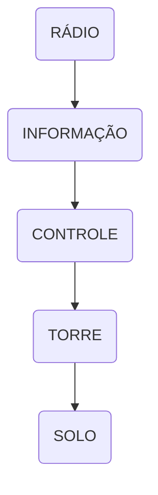

--8<-- "includes/abreviacoes.md"

#

## :material-numeric-0-box: Preliminares

<section markdown style="display: grid; grid-template-columns: 5fr 2fr">

Na volta, o sentido se inverte. O **PT-VBR** parte de **Ipatinga (SBIP)**, aeródromo não controlado atendido por estação aeronáutica, e regressa a **Pampulha (SBBH)**, aeródromo controlado, com cruzeiro em **6.500 pés**.

Como na ida, o **nível de transição está em 080** e todo o voo acontece abaixo dele, em altitude referenciada ao QNH.

É aqui que aparecem as duas situações mais cobradas em treinamento VFR: a **partida sem controle**, em que o piloto conduz a operação e apenas informa cada passo, e a **entrada no circuito de tráfego controlado**, em que a Torre autoriza, sequencia e organiza o fluxo.

</section>

## :material-numeric-1-box: :flag_br: Rádio / :flag_gb: Radio / :flag_es: Radio

### Partida com plano de voo visual

Na partida de aeródromo não controlado, o piloto anuncia cada fase e a estação responde com informações e ciência. Repare que não há autorização em nenhum momento.

=== ":flag_br: Português"
    

      Rádio Ipatinga, **PAPA TANGO VICTOR BRAVO ROMEO**.
    

    

      **PAPA TANGO VICTOR BRAVO ROMEO**, Rádio Ipatinga.
    

    

      **VICTOR BRAVO ROMEO**, iniciando o táxi, pista UNO DOIS, destino Pampulha, solicita informações.
    

    

      **VICTOR BRAVO ROMEO**, Rádio Ipatinga ciente. Vento UNO TRÊS ZERO graus, ZERO CINCO nós. Ajuste de altímetro UNO ZERO UNO DOIS. Temperatura DOIS CINCO graus. Sem tráfego conhecido. Hora certa UNO OITO. Reporte no ponto de espera.
    

    

      Ciente, taxiando para o ponto de espera da pista UNO DOIS, **VICTOR BRAVO ROMEO**.
    

    

      **VICTOR BRAVO ROMEO**, no ponto de espera da pista UNO DOIS.
    

    

      **VICTOR BRAVO ROMEO**, Rádio Ipatinga ciente, reporte alinhado para a decolagem.
    

    

      **VICTOR BRAVO ROMEO**, ingressa na cabeceira UNO DOIS, alinhado.
    

    

      **VICTOR BRAVO ROMEO**, Rádio Ipatinga ciente, vento UNO TRÊS ZERO graus, ZERO CINCO nós, reporte fora do solo.
    

    

      **VICTOR BRAVO ROMEO**, fora do solo aos DOIS DOIS.
    

    

      **VICTOR BRAVO ROMEO**, Rádio Ipatinga ciente.
    

    

      **VICTOR BRAVO ROMEO**, atinge e mantém MEIA MIL E QUINHENTOS pés, rumo oeste, estimando Pampulha aos ZERO CINCO.
    

    

      **VICTOR BRAVO ROMEO**, Rádio Ipatinga ciente, chame Informação Brasília em UNO DOIS CINCO DECIMAL TRÊS.
    

=== ":flag_gb: Inglês"
    

      Ipatinga Radio, **PAPA TANGO VICTOR BRAVO ROMEO**.
    

    

      **PAPA TANGO VICTOR BRAVO ROMEO**, Ipatinga Radio.
    

    

      **VICTOR BRAVO ROMEO**, commencing taxi, runway ONE TWO, destination Pampulha, request information.
    

    

      **VICTOR BRAVO ROMEO**, Ipatinga Radio roger. Wind ONE THREE ZERO degrees, ZERO FIVE knots. Altimeter setting ONE ZERO ONE TWO. Temperature TWO FIVE degrees. No reported traffic. Time check ONE EIGHT. Report holding point.
    

    

      Roger, taxiing to holding point runway ONE TWO, **VICTOR BRAVO ROMEO**.
    

    

      **VICTOR BRAVO ROMEO**, holding point runway ONE TWO.
    

    

      **VICTOR BRAVO ROMEO**, Ipatinga Radio roger, report lined up for departure.
    

    

      **VICTOR BRAVO ROMEO**, entering runway ONE TWO, lined up.
    

    

      **VICTOR BRAVO ROMEO**, Ipatinga Radio roger, wind ONE THREE ZERO degrees, ZERO FIVE knots, report airborne.
    

    

      **VICTOR BRAVO ROMEO**, airborne at TWO TWO.
    

    

      **VICTOR BRAVO ROMEO**, Ipatinga Radio roger.
    

    

      **VICTOR BRAVO ROMEO**, reaching and maintaining SIX THOUSAND FIVE HUNDRED feet, westbound, estimating Pampulha at ZERO FIVE.
    

    

      **VICTOR BRAVO ROMEO**, Ipatinga Radio roger, contact Brasília Information on ONE TWO FIVE DECIMAL THREE.
    

=== ":flag_es: Espanhol"
    

      Ipatinga Radio, **PAPA TANGO VICTOR BRAVO ROMEO**.
    

    

      **PAPA TANGO VICTOR BRAVO ROMEO**, Ipatinga Radio.
    

    

      **VICTOR BRAVO ROMEO**, iniciando el rodaje, pista UNO DOS, destino Pampulha, solicita información.
    

    

      **VICTOR BRAVO ROMEO**, Ipatinga Radio recibido. Viento UNO TRES CERO grados, CERO CINCO nudos. Ajuste de altímetro UNO CERO UNO DOS. Temperatura DOS CINCO grados. Sin tráfico conocido. Hora UNO OCHO. Reporte en el punto de espera.
    

    

      Recibido, rodando al punto de espera de la pista UNO DOS, **VICTOR BRAVO ROMEO**.
    

    

      **VICTOR BRAVO ROMEO**, en el punto de espera de la pista UNO DOS.
    

    

      **VICTOR BRAVO ROMEO**, Ipatinga Radio recibido, reporte alineado para el despegue.
    

    

      **VICTOR BRAVO ROMEO**, ingresa en la cabecera UNO DOS, alineado.
    

    

      **VICTOR BRAVO ROMEO**, Ipatinga Radio recibido, viento UNO TRES CERO grados, CERO CINCO nudos, reporte en el aire.
    

    

      **VICTOR BRAVO ROMEO**, en el aire a los DOS DOS.
    

    

      **VICTOR BRAVO ROMEO**, Ipatinga Radio recibido.
    

    

      **VICTOR BRAVO ROMEO**, alcanza y mantiene SEIS MIL QUINIENTOS pies, rumbo oeste, estimando Pampulha a los CERO CINCO.
    

    

      **VICTOR BRAVO ROMEO**, Ipatinga Radio recibido, llame Brasília Información en UNO DOS CINCO DECIMAL TRES.
    

??? abstract "Algumas observações..."

    1. Havendo tráfego conhecido, a estação o descreve com detalhe suficiente para que o piloto construa a própria separação.

        > :flag_br: **VICTOR BRAVO ROMEO**, Rádio Ipatinga ciente. Vento UNO TRÊS ZERO graus, ZERO CINCO nós. Ajuste de altímetro UNO ZERO UNO DOIS. **Tráfego conhecido é o PAPA SIERRA ROMEO ECHO TANGO, um Xingu, na perna do vento da pista UNO DOIS.** Reporte no ponto de espera.  
        > :flag_gb: **VICTOR BRAVO ROMEO**, Ipatinga Radio roger. Wind ONE THREE ZERO degrees, ZERO FIVE knots. Altimeter setting ONE ZERO ONE TWO. **Known traffic is PAPA SIERRA ROMEO ECHO TANGO, a Xingu, on downwind leg runway ONE TWO.** Report holding point.  
        > :flag_es: **VICTOR BRAVO ROMEO**, Ipatinga Radio recibido. Viento UNO TRES CERO grados, CERO CINCO nudos. Ajuste de altímetro UNO CERO UNO DOS. **Tráfico conocido es el PAPA SIERRA ROMEO ECHO TANGO, un Xingu, en el tramo con viento en cola de la pista UNO DOS.** Reporte en el punto de espera.  

    2. Quando o piloto decide aguardar por causa de outro tráfego, ele informa a decisão. A estação apenas toma ciência.

        > :flag_br: **VICTOR BRAVO ROMEO**, no ponto de espera, mantém posição, aguardando o pouso do Xingu.  
        > :flag_gb: **VICTOR BRAVO ROMEO**, holding point, maintaining position, waiting for the Xingu landing.  
        > :flag_es: **VICTOR BRAVO ROMEO**, en el punto de espera, mantiene posición, esperando el aterrizaje del Xingu.  

    3. A **hora certa** é fornecida pela estação porque, sem órgão de controle, o horário de decolagem reportado pelo piloto é o registro oficial do movimento.

## :material-numeric-2-box: :flag_br: Informação / :flag_gb: Information / :flag_es: Información

### Reporte de posição em rota

O contato com o serviço de informação de voo é breve e objetivo: quem sou, o que sou, de onde para onde, em que altitude, onde estou e qual o estimado.

=== ":flag_br: Português"
    

      Informação Brasília, **PAPA TANGO VICTOR BRAVO ROMEO**, um Cessna 172, VFR de Ipatinga para Pampulha, MEIA MIL E QUINHENTOS pés, DOIS ZERO milhas a oeste de Ipatinga, estimando Pampulha aos ZERO CINCO.
    

    

      **VICTOR BRAVO ROMEO**, Informação Brasília ciente. Sem tráfego conhecido na sua rota. Reporte DEZ minutos fora de Pampulha.
    

    

      Reportará DEZ minutos fora de Pampulha, **VICTOR BRAVO ROMEO**.
    

    

      **VICTOR BRAVO ROMEO**, DEZ minutos fora de Pampulha, MEIA MIL E QUINHENTOS pés.
    

    

      **VICTOR BRAVO ROMEO**, Informação Brasília ciente. Ao ingressar no espaço aéreo controlado, chame o Controle Belo Horizonte em UNO UNO NOVE DECIMAL UNO.
    

    

      Chamará o Controle Belo Horizonte em UNO UNO NOVE DECIMAL UNO, **VICTOR BRAVO ROMEO**.
    

=== ":flag_gb: Inglês"
    

      Brasília Information, **PAPA TANGO VICTOR BRAVO ROMEO**, a Cessna 172, VFR from Ipatinga to Pampulha, SIX THOUSAND FIVE HUNDRED feet, TWO ZERO miles west of Ipatinga, estimating Pampulha at ZERO FIVE.
    

    

      **VICTOR BRAVO ROMEO**, Brasília Information roger. No reported traffic on your route. Report TEN minutes out of Pampulha.
    

    

      Will report TEN minutes out of Pampulha, **VICTOR BRAVO ROMEO**.
    

    

      **VICTOR BRAVO ROMEO**, TEN minutes out of Pampulha, SIX THOUSAND FIVE HUNDRED feet.
    

    

      **VICTOR BRAVO ROMEO**, Brasília Information roger. When entering controlled airspace, contact Belo Horizonte Control on ONE ONE NINE DECIMAL ONE.
    

    

      Will contact Belo Horizonte Control on ONE ONE NINE DECIMAL ONE, **VICTOR BRAVO ROMEO**.
    

=== ":flag_es: Espanhol"
    

      Brasília Información, **PAPA TANGO VICTOR BRAVO ROMEO**, un Cessna 172, VFR de Ipatinga para Pampulha, SEIS MIL QUINIENTOS pies, DOS CERO millas al oeste de Ipatinga, estimando Pampulha a los CERO CINCO.
    

    

      **VICTOR BRAVO ROMEO**, Brasília Información recibido. Sin tráfico conocido en su ruta. Reporte DIEZ minutos afuera de Pampulha.
    

    

      Reportará DIEZ minutos afuera de Pampulha, **VICTOR BRAVO ROMEO**.
    

    

      **VICTOR BRAVO ROMEO**, DIEZ minutos afuera de Pampulha, SEIS MIL QUINIENTOS pies.
    

    

      **VICTOR BRAVO ROMEO**, Brasília Información recibido. Al ingresar en el espacio aéreo controlado, llame Belo Horizonte Control en UNO UNO NUEVE DECIMAL UNO.
    

    

      Llamará Belo Horizonte Control en UNO UNO NUEVE DECIMAL UNO, **VICTOR BRAVO ROMEO**.
    

## :material-numeric-3-box: :flag_br: Controle / :flag_gb: Control / :flag_es: Control

### Ingresso na TMA e na CTR

O ingresso em espaço aéreo controlado depende de autorização. O piloto solicita, informando posição, altitude e intenção, e o Controle responde com o código transponder, a autorização e eventuais restrições.

=== ":flag_br: Português"
    

      Controle Belo Horizonte, **PAPA TANGO VICTOR BRAVO ROMEO**, um Cessna 172, VFR de Ipatinga para Pampulha, MEIA MIL E QUINHENTOS pés, DOIS CINCO milhas a nordeste de Pampulha, solicita ingresso na TMA para pouso em Pampulha.
    

    

      **VICTOR BRAVO ROMEO**, Controle Belo Horizonte, transponder QUATRO DOIS ZERO TRÊS.
    

    

      Transponder QUATRO DOIS ZERO TRÊS, **VICTOR BRAVO ROMEO**.
    

    

      **VICTOR BRAVO ROMEO**, contato radar, DOIS CINCO milhas a nordeste de Pampulha. Autorizado ingresso na TMA Belo Horizonte, mantenha VFR, desça para QUATRO MIL E QUINHENTOS pés, Q N H UNO ZERO UNO TRÊS.
    

    

      Autorizado ingresso na TMA, mantém VFR, desce para QUATRO MIL E QUINHENTOS pés, Q N H UNO ZERO UNO TRÊS, **VICTOR BRAVO ROMEO**.
    

    

      **VICTOR BRAVO ROMEO**, informação de tráfego, um ATR 72 em aproximação para Confins, TRÊS milhas ao norte, MEIA MIL pés em descida.
    

    

      Tráfego à vista, **VICTOR BRAVO ROMEO**.
    

    

      **VICTOR BRAVO ROMEO**, chame a Torre Pampulha em UNO UNO OITO DECIMAL ZERO.
    

    

      Chamará a Torre Pampulha em UNO UNO OITO DECIMAL ZERO, **VICTOR BRAVO ROMEO**.
    

=== ":flag_gb: Inglês"
    

      Belo Horizonte Control, **PAPA TANGO VICTOR BRAVO ROMEO**, a Cessna 172, VFR from Ipatinga to Pampulha, SIX THOUSAND FIVE HUNDRED feet, TWO FIVE miles northeast of Pampulha, request TMA entry for landing at Pampulha.
    

    

      **VICTOR BRAVO ROMEO**, Belo Horizonte Control, squawk FOUR TWO ZERO THREE.
    

    

      Squawk FOUR TWO ZERO THREE, **VICTOR BRAVO ROMEO**.
    

    

      **VICTOR BRAVO ROMEO**, radar contact, TWO FIVE miles northeast of Pampulha. Cleared to enter Belo Horizonte TMA, maintain VFR, descend to FOUR THOUSAND FIVE HUNDRED feet, Q N H ONE ZERO ONE THREE.
    

    

      Cleared to enter the TMA, maintaining VFR, descending to FOUR THOUSAND FIVE HUNDRED feet, Q N H ONE ZERO ONE THREE, **VICTOR BRAVO ROMEO**.
    

    

      **VICTOR BRAVO ROMEO**, traffic information, an ATR 72 on approach to Confins, THREE miles north, SIX THOUSAND feet descending.
    

    

      Traffic in sight, **VICTOR BRAVO ROMEO**.
    

    

      **VICTOR BRAVO ROMEO**, contact Pampulha Tower on ONE ONE EIGHT DECIMAL ZERO.
    

    

      Will contact Pampulha Tower on ONE ONE EIGHT DECIMAL ZERO, **VICTOR BRAVO ROMEO**.
    

=== ":flag_es: Espanhol"
    

      Belo Horizonte Control, **PAPA TANGO VICTOR BRAVO ROMEO**, un Cessna 172, VFR de Ipatinga para Pampulha, SEIS MIL QUINIENTOS pies, DOS CINCO millas al noreste de Pampulha, solicita ingreso a la TMA para aterrizar en Pampulha.
    

    

      **VICTOR BRAVO ROMEO**, Belo Horizonte Control, transponder CUATRO DOS CERO TRES.
    

    

      Transponder CUATRO DOS CERO TRES, **VICTOR BRAVO ROMEO**.
    

    

      **VICTOR BRAVO ROMEO**, contacto radar, DOS CINCO millas al noreste de Pampulha. Autorizado el ingreso a la TMA Belo Horizonte, mantenga VFR, descienda a CUATRO MIL QUINIENTOS pies, Q N H UNO CERO UNO TRES.
    

    

      Autorizado el ingreso a la TMA, mantiene VFR, desciende a CUATRO MIL QUINIENTOS pies, Q N H UNO CERO UNO TRES, **VICTOR BRAVO ROMEO**.
    

    

      **VICTOR BRAVO ROMEO**, información de tráfico, un ATR 72 en aproximación a Confins, TRES millas al norte, SEIS MIL pies en descenso.
    

    

      Tráfico a la vista, **VICTOR BRAVO ROMEO**.
    

    

      **VICTOR BRAVO ROMEO**, llame Pampulha Torre en UNO UNO OCHO DECIMAL CERO.
    

    

      Llamará Pampulha Torre en UNO UNO OCHO DECIMAL CERO, **VICTOR BRAVO ROMEO**.
    

??? abstract "Algumas observações..."

    1. O Controle pode negar ou condicionar o ingresso por volume de tráfego. Nesse caso, a aeronave deve permanecer fora do espaço aéreo controlado.

        > :flag_br: **VICTOR BRAVO ROMEO**, mantenha fora da TMA Belo Horizonte, aguarde autorização para o ingresso.  
        > :flag_gb: **VICTOR BRAVO ROMEO**, remain outside Belo Horizonte TMA, standby for entry clearance.  
        > :flag_es: **VICTOR BRAVO ROMEO**, manténgase fuera de la TMA Belo Horizonte, espere autorización para el ingreso.  

    2. É comum o Controle definir um ponto de notificação visual para o ingresso na CTR. Consulte a carta do aeródromo e informe o ponto no reporte.

        > :flag_br: **VICTOR BRAVO ROMEO**, autorizado ingresso na CTR Belo Horizonte via Lagoa da Pampulha, mantenha DOIS MIL E QUINHENTOS pés ou abaixo, reporte sobre o ponto.  
        > :flag_gb: **VICTOR BRAVO ROMEO**, cleared to enter Belo Horizonte CTR via Pampulha Lake, maintain TWO THOUSAND FIVE HUNDRED feet or below, report over the point.  
        > :flag_es: **VICTOR BRAVO ROMEO**, autorizado el ingreso a la CTR Belo Horizonte vía Laguna de Pampulha, mantenga DOS MIL QUINIENTOS pies o inferior, reporte sobre el punto.  

## :material-numeric-4-box: :flag_br: Torre / :flag_gb: Tower / :flag_es: Torre

### Entrada no circuito de tráfego

Este é o contato mais importante da chegada. O piloto informa posição, altitude e o que deseja. A Torre responde com a autorização para o circuito, a pista em uso, o vento, o ajuste de altímetro e o reporte esperado.

=== ":flag_br: Português"
    

      Torre Pampulha, **PAPA TANGO VICTOR BRAVO ROMEO**, UNO ZERO milhas a nordeste do aeródromo, QUATRO MIL E QUINHENTOS pés, solicita instruções para pouso.
    

    

      **VICTOR BRAVO ROMEO**, Torre Pampulha, autorizado para o circuito de tráfego, pista UNO TRÊS, vento UNO TRÊS ZERO graus, UNO ZERO nós, ajuste de altímetro UNO ZERO UNO TRÊS, reporte perna do vento.
    

    

      Autorizado para o circuito de tráfego, pista UNO TRÊS, ajuste de altímetro UNO ZERO UNO TRÊS, reportará perna do vento, **VICTOR BRAVO ROMEO**.
    

    

      **VICTOR BRAVO ROMEO**, perna do vento da pista UNO TRÊS.
    

    

      **VICTOR BRAVO ROMEO**, avistado, é o número DOIS para o pouso, siga o Cessna na perna base, reporte perna base.
    

    

      Tráfego à vista, é o número DOIS, reportará perna base, **VICTOR BRAVO ROMEO**.
    

    

      **VICTOR BRAVO ROMEO**, perna base da pista UNO TRÊS.
    

    

      **VICTOR BRAVO ROMEO**, reporte na final.
    

    

      **VICTOR BRAVO ROMEO**, na final.
    

    

      **VICTOR BRAVO ROMEO**, pista UNO TRÊS, pouso autorizado, vento UNO TRÊS ZERO graus, UNO ZERO nós.
    

    

      Pouso autorizado, pista UNO TRÊS, **VICTOR BRAVO ROMEO**.
    

=== ":flag_gb: Inglês"
    

      Pampulha Tower, **PAPA TANGO VICTOR BRAVO ROMEO**, ONE ZERO miles northeast of the aerodrome, FOUR THOUSAND FIVE HUNDRED feet, request landing instructions.
    

    

      **VICTOR BRAVO ROMEO**, Pampulha Tower, cleared to traffic pattern, runway ONE THREE, wind ONE THREE ZERO degrees, ONE ZERO knots, QNH ONE ZERO ONE THREE, report downwind leg.
    

    

      Cleared to traffic pattern, runway ONE THREE, QNH ONE ZERO ONE THREE, will report downwind leg, **VICTOR BRAVO ROMEO**.
    

    

      **VICTOR BRAVO ROMEO**, downwind leg runway ONE THREE.
    

    

      **VICTOR BRAVO ROMEO**, I have you in sight, number TWO for landing, follow the Cessna on base leg, report base leg.
    

    

      Traffic in sight, number TWO, will report base leg, **VICTOR BRAVO ROMEO**.
    

    

      **VICTOR BRAVO ROMEO**, base leg runway ONE THREE.
    

    

      **VICTOR BRAVO ROMEO**, report on final.
    

    

      **VICTOR BRAVO ROMEO**, on final.
    

    

      **VICTOR BRAVO ROMEO**, runway ONE THREE, cleared to land, wind ONE THREE ZERO degrees, ONE ZERO knots.
    

    

      Cleared to land, runway ONE THREE, **VICTOR BRAVO ROMEO**.
    

=== ":flag_es: Espanhol"
    

      Pampulha Torre, **PAPA TANGO VICTOR BRAVO ROMEO**, UNO CERO millas al noreste del aeródromo, CUATRO MIL QUINIENTOS pies, solicita instrucciones para aterrizar.
    

    

      **VICTOR BRAVO ROMEO**, Pampulha Torre, autorizado al circuito de tránsito, pista UNO TRES, viento UNO TRES CERO grados, UNO CERO nudos, ajuste de altímetro UNO CERO UNO TRES, reporte tramo con viento en cola.
    

    

      Autorizado al circuito de tránsito, pista UNO TRES, ajuste de altímetro UNO CERO UNO TRES, reportará tramo con viento en cola, **VICTOR BRAVO ROMEO**.
    

    

      **VICTOR BRAVO ROMEO**, tramo con viento en cola de la pista UNO TRES.
    

    

      **VICTOR BRAVO ROMEO**, a la vista, es el número DOS para aterrizar, siga al Cessna en el tramo base, reporte tramo base.
    

    

      Tráfico a la vista, es el número DOS, reportará tramo base, **VICTOR BRAVO ROMEO**.
    

    

      **VICTOR BRAVO ROMEO**, tramo base de la pista UNO TRES.
    

    

      **VICTOR BRAVO ROMEO**, reporte en final.
    

    

      **VICTOR BRAVO ROMEO**, en final.
    

    

      **VICTOR BRAVO ROMEO**, pista UNO TRES, autorizado a aterrizar, viento UNO TRES CERO grados, UNO CERO nudos.
    

    

      Autorizado a aterrizar, pista UNO TRES, **VICTOR BRAVO ROMEO**.
    

??? abstract "Algumas observações..."

    1. A Torre pode determinar o lado do circuito no momento da autorização, o que é frequente em aeródromos com restrições de sobrevoo.

        > :flag_br: **VICTOR BRAVO ROMEO**, faça aproximação pela direita, pista ZERO DOIS, vento ZERO QUATRO ZERO graus, UNO ZERO nós, ajuste de altímetro UNO ZERO UNO QUATRO, reporte perna base.  
        > :flag_gb: **VICTOR BRAVO ROMEO**, make right hand approach, runway ZERO TWO, wind ZERO FOUR ZERO degrees, ONE ZERO knots, QNH ONE ZERO ONE FOUR, report base leg.  
        > :flag_es: **VICTOR BRAVO ROMEO**, efectúe aproximación por la derecha, pista CERO DOS, viento CERO CUATRO CERO grados, UNO CERO nudos, ajuste de altímetro UNO CERO UNO CUATRO, reporte tramo base.  

    2. Quando a aeronave chega alinhada com a pista, a Torre pode autorizar a aproximação direta e economizar todo o circuito.

        > :flag_br: **VICTOR BRAVO ROMEO**, autorizada aproximação direta, pista UNO TRÊS, vento UNO CINCO ZERO graus, UNO CINCO nós, Q N H UNO ZERO UNO TRÊS, reporte final.  
        > :flag_gb: **VICTOR BRAVO ROMEO**, cleared straight in approach, runway ONE THREE, wind ONE FIVE ZERO degrees, ONE FIVE knots, Q N H ONE ZERO ONE THREE, report final.  
        > :flag_es: **VICTOR BRAVO ROMEO**, autorizada aproximación directa, pista UNO TRES, viento UNO CINCO CERO grados, UNO CINCO nudos, Q N H UNO CERO UNO TRES, reporte final.  

    3. Se a pista ainda estiver ocupada, a autorização de pouso não sai no contato de final.

        > :flag_br: **VICTOR BRAVO ROMEO**, pista UNO TRÊS, continue aproximação, aguarde pista livre, vento UNO TRÊS ZERO graus, UNO ZERO nós.  
        > :flag_gb: **VICTOR BRAVO ROMEO**, runway ONE THREE, continue approach, standby for runway vacated, wind ONE THREE ZERO degrees, ONE ZERO knots.  
        > :flag_es: **VICTOR BRAVO ROMEO**, pista UNO TRES, continúe aproximación, espere pista libre, viento UNO TRES CERO grados, UNO CERO nudos.  

## :material-numeric-5-box: Após o pouso

Depois do toque, a Torre informa a hora de pouso, a saída da pista e a transferência para o Solo.

=== ":flag_br: Português"
    

      **VICTOR BRAVO ROMEO**, pousado aos ZERO CINCO, livre à esquerda na taxiway BRAVO, ao livrar chame o Solo Pampulha em UNO DOIS UNO DECIMAL MEIA.
    

    

      Livre à esquerda na BRAVO, chamará o Solo Pampulha em UNO DOIS UNO DECIMAL MEIA, **VICTOR BRAVO ROMEO**.
    

    

      Solo Pampulha, **PAPA TANGO VICTOR BRAVO ROMEO**, livrou a pista UNO TRÊS na BRAVO.
    

    

      **VICTOR BRAVO ROMEO**, Solo Pampulha, táxi autorizado para o pátio da aviação geral via taxiway BRAVO.
    

    

      Táxi autorizado para o pátio da aviação geral via taxiway BRAVO, **VICTOR BRAVO ROMEO**.
    

=== ":flag_gb: Inglês"
    

      **VICTOR BRAVO ROMEO**, landed at ZERO FIVE, vacate left on taxiway BRAVO, when vacated contact Pampulha Ground on ONE TWO ONE DECIMAL SIX.
    

    

      Vacating left on BRAVO, will contact Pampulha Ground on ONE TWO ONE DECIMAL SIX, **VICTOR BRAVO ROMEO**.
    

    

      Pampulha Ground, **PAPA TANGO VICTOR BRAVO ROMEO**, vacated runway ONE THREE at BRAVO.
    

    

      **VICTOR BRAVO ROMEO**, Pampulha Ground, taxi to the general aviation apron via taxiway BRAVO.
    

    

      Taxi to the general aviation apron via taxiway BRAVO, **VICTOR BRAVO ROMEO**.
    

=== ":flag_es: Espanhol"
    

      **VICTOR BRAVO ROMEO**, aterrizado a los CERO CINCO, salga por la izquierda en la calle BRAVO, al salir llame Pampulha Tierra en UNO DOS UNO DECIMAL SEIS.
    

    

      Sale por la izquierda en BRAVO, llamará Pampulha Tierra en UNO DOS UNO DECIMAL SEIS, **VICTOR BRAVO ROMEO**.
    

    

      Pampulha Tierra, **PAPA TANGO VICTOR BRAVO ROMEO**, salió de la pista UNO TRES en BRAVO.
    

    

      **VICTOR BRAVO ROMEO**, Pampulha Tierra, autorizado rodar a la plataforma de aviación general vía calle BRAVO.
    

    

      Autorizado rodar a la plataforma de aviación general vía calle BRAVO, **VICTOR BRAVO ROMEO**.
    

!!! tip "Voo completo"
    Com a ida e a volta, você percorreu todos os órgãos que um voo visual pode encontrar no Brasil. O que sobra são as variações, e é exatamente disso que trata a próxima página.

---
