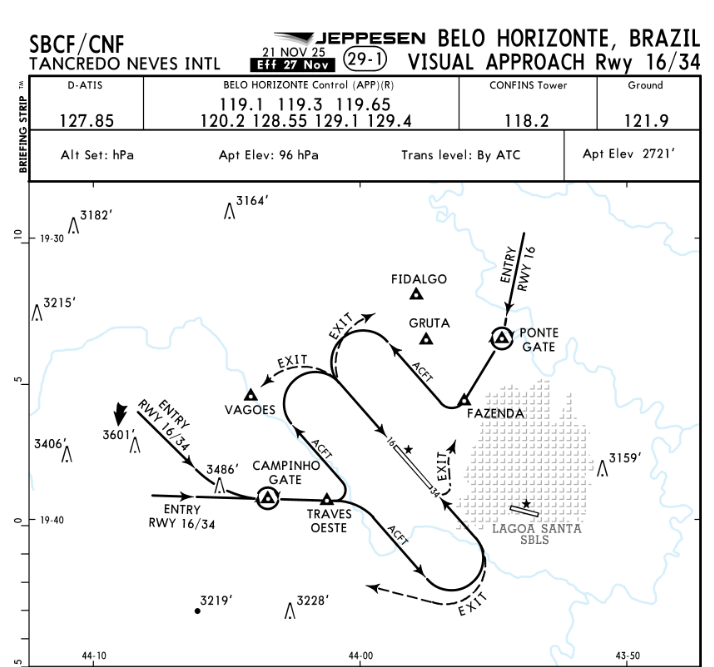
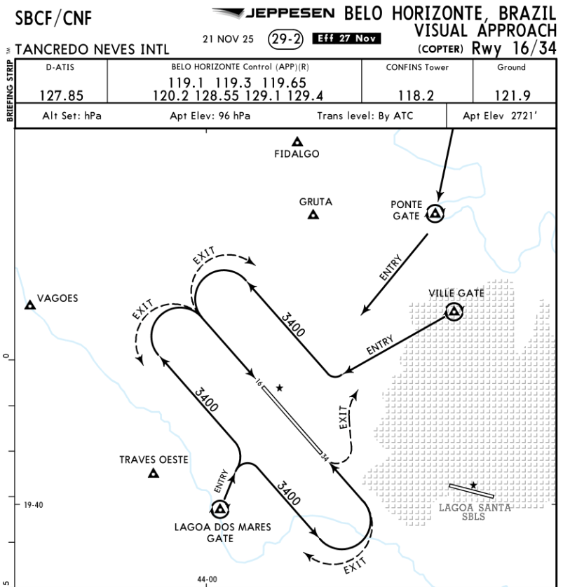
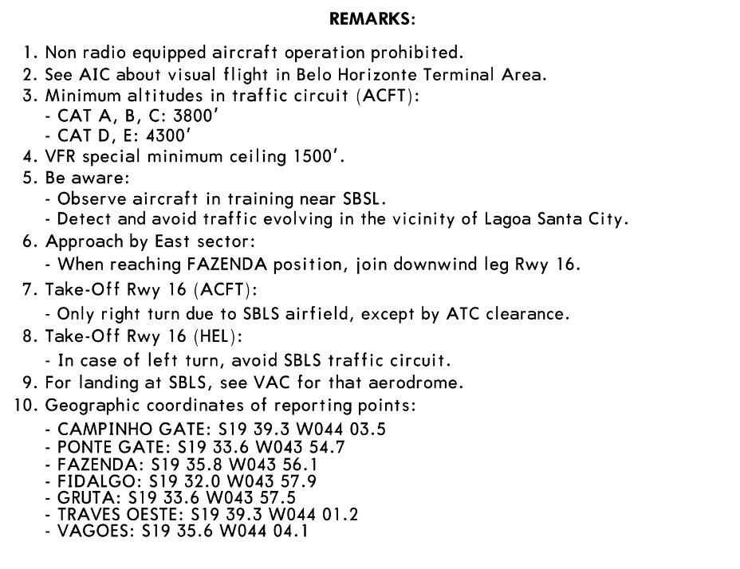
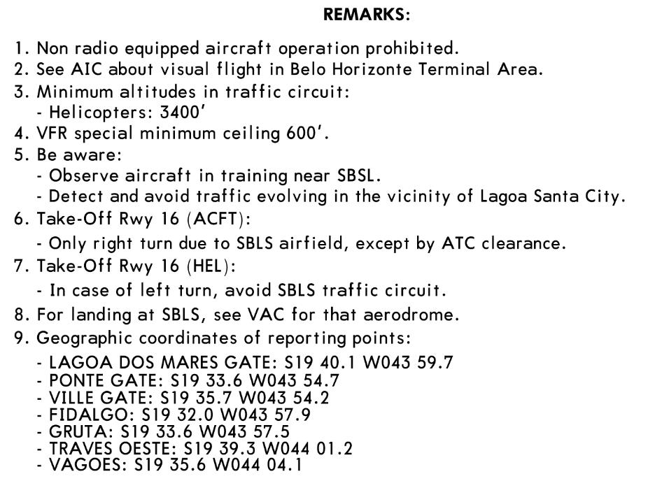

# Circuit Operation with a published VAC (AISWEB)

> Content intended for the **flight simulation environment**. The VAC chart images are for **educational/illustrative** use and may belong to third parties. In real-world operations, always use the up-to-date official publications from **AISWEB** or an official DECEA provider.

When a **VAC** exists for the aerodrome, it becomes the **primary reference** for:

- **circuit direction** per runway (left/right),
- circuit **altitudes**,
- **reporting points** and joining/leaving routes,
- **local restrictions** (obstacles, sensitive areas, noise),
- **helicopter** procedures (when published).

!!! note "Operational rule"
    **VAC / AIP / NOTAM** take precedence over the "standard circuit".

---

## What to extract from the VAC in 60 seconds (quick check)

| Item | What you are looking for | Where it normally appears |
|---|---|---|
| Runway(s) and configuration | RWY in use and alternative runways | Header / chart title |
| Circuit direction | Left or right per runway | Circuit arrows / notes |
| Circuit altitude | Minimum / standard altitude per category | Remarks / notes / annotations on the circuit |
| Joining/leaving point(s) | "ENTRY/EXIT", "GATE", "REPORTING POINTS" | VAC map and list of coordinates |
| Critical restrictions | "only right turn", areas to avoid, neighbouring traffic | Remarks |
| HEL procedure | low circuit, dedicated routes, prohibited crossings | VAC-CAT H + Remarks |

---

## Practical example: SBCF (Confins) — VAC ACFT and VAC CAT H

!!! tip "Important note"
    The images below serve as a **reading example** and do not replace consulting the current publications.

### VAC — ACFT (Aeroplanes)

**How the TWR uses it (summary of what the drawing provides):**

- Shows the **rectangular flow** of the circuit and the **ENTRY/EXIT points**.
- Highlights **gates/reporting points** (e.g. *PONTE GATE*, *CAMPINHO GATE*, *VAGOES*).
- Indicates the **circuit orientation per RWY** (from the drawing and arrows).
- Provides context on **sensitive areas** (e.g. the proximity of **SBLS / Lagoa Santa** in the example).

### VAC — CAT H (Helicopters)

**How the TWR uses it (summary of what the drawing provides):**

- Defines a specific (HEL) circuit with a **profile and tracks** different from ACFT.
- Highlights **gates** and routes that avoid conflicts with fixed-wing traffic.
- Reinforces that HEL often operates with adjusted **altitudes/legs** (low circuit / dedicated routes).

---

## REMARKS from the example (SBCF) — what becomes an "operating rule" at the TWR

### REMARKS — ACFT

### REMARKS — CAT H

### Operational summary (for application at the TWR)

| Topic | ACFT (according to the example remarks) | CAT H (according to the example remarks) |
|---|---|---|
| Radio | Operation of aircraft **without radio prohibited** | Operation of aircraft **without radio prohibited** |
| Area / attention | Refers to the AIC on visual flight in the TMA BH | Refers to the AIC on visual flight in the TMA BH |
| Minimum circuit altitudes | **CAT A/B/C: 3800'**; **CAT D/E: 4300'** | **Helicopters: 3400'** |
| Special minimum (ceiling) | **1500'** | **600'** |
| Nearby traffic | Watch for training traffic near **SBSL** and avoid traffic near **Lagoa Santa** | Same |
| Takeoff RWY 16 (ACFT) | **Right turn only**, except with ATC authorisation | (in the HEL part) if turning left, **avoid the SBLS circuit** |
| Approach / integration | The example states: on reaching position **FAZENDA**, join the RWY 16 downwind leg (eastern sector) | Apply integration according to VAC-CAT H (avoid crossing the ACFT final/flows) |
| Neighbouring aerodrome (SBLS) | For landing at SBLS, see the aerodrome's VAC | For landing at SBLS, see the aerodrome's VAC |

!!! note "Practical point"
    With a published VAC, the TWR must treat "remarks" as **mandatory restrictions** and incorporate them into the briefing and the sequence.

---

## How the TWR should apply it (summary model)

1. Identify on the VAC:
   - runway(s) and circuit (L/R),
   - circuit altitude,
   - reporting points and gates,
   - restrictions and notes (remarks).
2. Standardise your briefing:
   - "runway, circuit, altitude, reports, restrictions".
3. If there is mixed traffic:
   - apply altitude/lateral separation **without contradicting the VAC**.
4. If there is a conflict between safety and flow:
   - safety prevails (hold/orbit/extend/resequence).

---

## Wind-based pattern: runway change and circuit mitigation

### When to consider a runway change

| Signal/Hazard | Risk if you do not change | Recommended action |
|---|---|---|
| sustained wind favours another runway | increased tailwind/drift and instability | plan the transition and communicate early |
| gusts and significant variation | the sequence becomes a "puzzle" | stabilise the decision, avoid switching back and forth |
| rain/runway condition | performance/braking | use the safest runway |
| heavy traffic and frequent changes | conflict and confusion in the circuit | "freeze" the operation until it is safe to change |

### How to carry out a runway change (practical procedure)

1. **Announce the intention** in advance:
   - "expect runway change to ___ in X minutes".
2. **Stop new entries** into the old circuit:
   - hold traffic outside / orbit / hold at a point.
3. **Empty the circuit**:
   - complete pending landings/takeoffs (or go around/resequence).
4. **Declare the new runway** and confirm the circuit according to the VAC:
   - direction (L/R) and altitude.
5. **Restart with a simple pattern**:
   - join downwind as the default, fixed reports.

### Mitigation during the transition (short rules)

- Avoid authorising a **straight-in final** during a runway change.
- Avoid simultaneous traffic in opposite directions (even VFR).
- Use "**remain outside the circuit**" to organise the queue.
- After the change, resume with **one** joining pattern (preferably downwind).

---

## Standardisation block (fixed briefing ready for simulation)

!!! note "TWR BRIEFING — CIRCUIT (SIM)"

    - Runway in use: **[RWY __]** (according to the VAC)
    - Circuit: **[LEFT/RIGHT]** (according to the VAC per RWY)
    - Circuit altitudes (according to the VAC/remarks):
        - **ACFT:** **[CAT A/B/C ____' | CAT D/E ____']**
        - **HEL:** **[____']**
    - Standard joining (if the VAC indicates gates):
        - "via **[GATE/ENTRY]** to the downwind leg", report **downwind / base / final**
    - Restrictions (remarks):
        - **[right turn only after takeoff RWY __]**
        - **[avoid area/city ___]**
        - **[coordination with neighbouring aerodrome ___]**
    - Helicopters:
        - operate according to **VAC-CAT H**, avoid crossing the ACFT final/flow without coordination
    - Straight-in final:
        - **only** if the VAC allows it and **with no conflict** with the circuit; otherwise, integrate via the circuit/gates

!!! tip "Recommendation"
    Use this briefing as a fixed message on the simulation server to standardise expectations and reduce repeated instructions on the radio.
