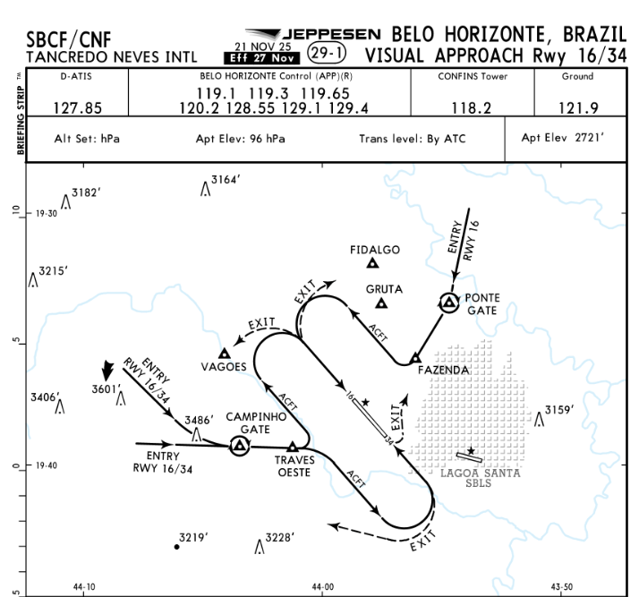
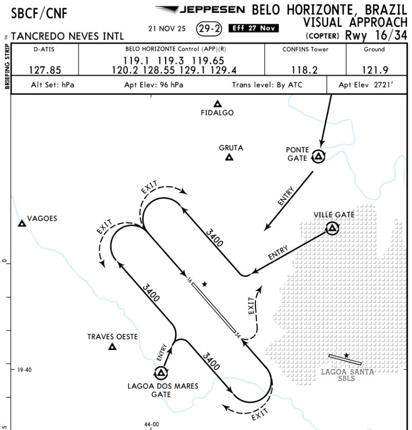
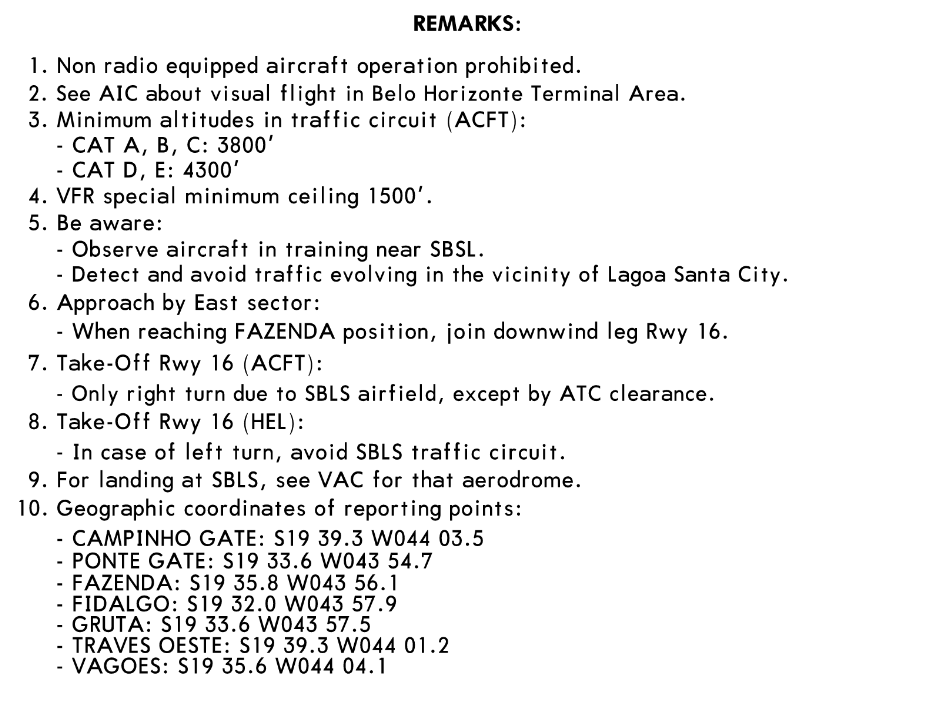
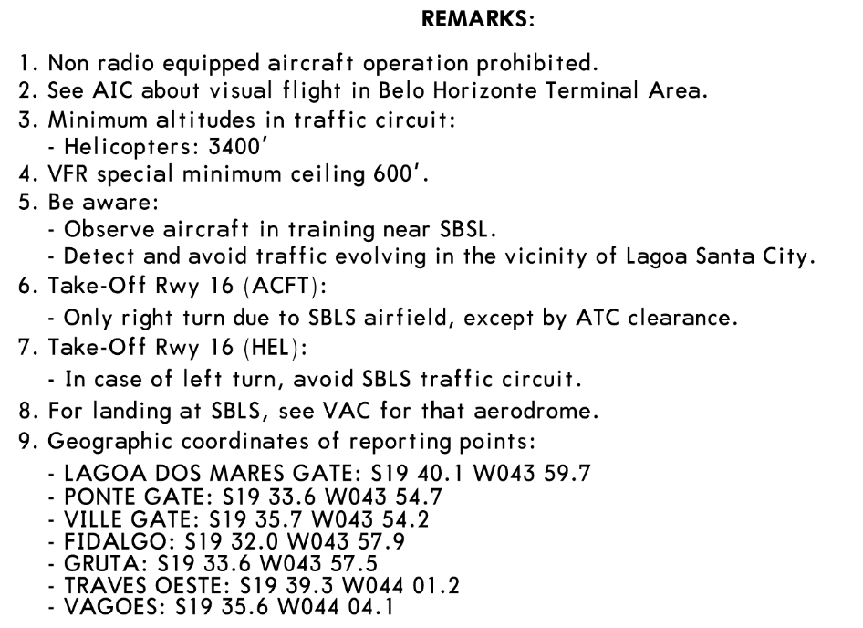

# Operação de Circuito com VAC publicada (AISWEB)

> Conteúdo destinado ao **ambiente de simulação de voo**. As imagens de cartas VAC são de uso **educacional/exemplificativo** e podem ser de terceiros. Em operações reais, utilize sempre as publicações oficiais atualizadas do **AISWEB** ou fornecedor oficial do DECEA.

Quando existir **VAC** para o aeródromo, ela passa a ser a **referência primária** para:

- **direção do circuito** por pista (esquerda/direita),
- **altitudes** do circuito,
- **pontos de reporte** e rotas de ingresso/saída,
- **restrições locais** (obstáculos, áreas sensíveis, ruído),
- procedimentos de **helicópteros** (quando publicados).

!!! note "Regra operacional"
    **VAC / AIP / NOTAM** prevalecem sobre "circuito padrão".

---

## O que extrair da VAC em 60 segundos (check rápido)

| Item | O que você busca | Onde normalmente aparece |
|---|---|---|
| Pista(s) e configuração | RWY em uso e pistas alternativas | Cabeçalho / título da carta |
| Direção do circuito | Esquerda ou direita por pista | Setas do circuito / observações |
| Altitude do circuito | Altitude mínima / padrão por categoria | Remarks / notas / anotações no circuito |
| Ponto(s) de ingresso/saída | "ENTRY/EXIT", "GATE", "REPORTING POINTS" | Mapa da VAC e lista de coordenadas |
| Restrições críticas | "only right turn", áreas a evitar, tráfego vizinho | Remarks |
| Procedimento HEL | circuito baixo, rotas dedicadas, cruzamentos proibidos | VAC-CAT H + Remarks |

---

## Exemplo prático: SBCF (Confins) — VAC ACFT e VAC CAT H

!!! tip "Nota importante"
    As imagens abaixo servem como **exemplo de leitura** e não substituem consulta às publicações vigentes.

### VAC — ACFT (Aviões)

**Como a TWR usa (resumo do que o desenho entrega):**

- Mostra o **fluxo retangular** do circuito e os **pontos de ENTRY/EXIT**.
- Evidencia **gates/pontos de reporte** (ex.: *PONTE GATE*, *CAMPINHO GATE*, *VAGOES*).
- Indica a **orientação do circuito por RWY** (pelo desenho e setas).
- Fornece contexto de **áreas sensíveis** (ex.: proximidade de **SBLS / Lagoa Santa** no exemplo).

### VAC — CAT H (Helicópteros)

**Como a TWR usa (resumo do que o desenho entrega):**

- Define um circuito específico (HEL) com **perfil e trajetórias** diferentes do ACFT.
- Evidencia **gates** e rotas que evitam conflitos com o tráfego de asa fixa.
- Reforça que HEL frequentemente opera com **altitudes/pernas** ajustadas (baixo circuito / rotas dedicadas).

---

## REMARKS do exemplo (SBCF) — o que vira "regra de operação" na TWR

### REMARKS — ACFT

### REMARKS — CAT H

### Resumo operacional (para aplicação na TWR)

| Tema | ACFT (conforme remarks do exemplo) | CAT H (conforme remarks do exemplo) |
|---|---|---|
| Rádio | Operação de aeronave **sem rádio proibida** | Operação de aeronave **sem rádio proibida** |
| Área / atenção | Cita AIC sobre voo visual na TMA BH | Cita AIC sobre voo visual na TMA BH |
| Altitudes mínimas no circuito | **CAT A/B/C: 3800'**; **CAT D/E: 4300'** | **Helicópteros: 3400'** |
| Mínimo especial (teto) | **1500'** | **600'** |
| Tráfego próximo | Atenção a tráfego de instrução perto de **SBSL** e evitar tráfego próximo à **Lagoa Santa** | Idem |
| Decolagem RWY 16 (ACFT) | **Somente curva à direita**, exceto por autorização ATC | (na parte HEL) se curva à esquerda, **evitar o circuito de SBLS** |
| Aproximação / integração | Exemplo menciona: ao atingir posição **FAZENDA**, ingressar na perna do vento RWY 16 (setor leste) | Aplicar integração conforme VAC-CAT H (evitar cruzar final/fluxos do ACFT) |
| Aeródromo vizinho (SBLS) | Para pouso em SBLS, ver VAC do aeródromo | Para pouso em SBLS, ver VAC do aeródromo |

!!! note "Ponto prático"
    Com VAC publicada, a TWR deve tratar "remarks" como **restrições mandatórias** e incorporá-las no briefing e na sequência.

---

## Como a TWR deve aplicar (modelo resumido)

1. Identifique na VAC:
   - pista(s) e circuito (L/R),
   - altitude do circuito,
   - pontos de reporte e gates,
   - restrições e observações (remarks).
2. Padronize seu briefing:
   - "pista, circuito, altitude, reportes, restrições".
3. Se houver tráfego misto:
   - aplique separação por altitude/lateral **sem contrariar a VAC**.
4. Se houver conflito entre segurança e fluxo:
   - segurança prevalece (hold/orbit/estenda/resequencie).

---

## Padrão por vento: mudança de pista e mitigação do circuito

### Quando considerar mudança de pista

| Sinal/Perigo | Risco se não mudar | Ação recomendada |
|---|---|---|
| vento sustentado favorece outra pista | aumento de cauda/deriva e instabilidade | planejar transição e comunicar cedo |
| rajadas e variação significativa | sequência vira "quebra-cabeça" | estabilizar decisão, evitar alternar |
| chuva/condição de pista | performance/frenagem | aplicar pista mais segura |
| tráfego intenso e mudança frequente | conflito e confusão no circuito | "congelar" operação quando for seguro mudar |

### Como executar mudança de pista (procedimento prático)

1. **Anuncie intenção** com antecedência:
   - "prevendo mudança de pista para ___ em X minutos".
2. **Pare novos ingressos** no circuito antigo:
   - segure tráfego fora / órbita / mantenha em ponto.
3. **Esvazie o circuito**:
   - conclua pousos/decolagens pendentes (ou arremeta/resequencie).
4. **Declare pista nova** e confirme circuito conforme VAC:
   - direção (L/R) e altitude.
5. **Reinicie com padrão simples**:
   - join downwind como default, reportes fixos.

### Mitigação durante transição (regras curtas)

- Evite autorizar **final direto** durante troca de pista.
- Evite tráfegos simultâneos em sentidos opostos (mesmo em VFR).
- Use "**mantenha fora do circuito**" para organizar fila.
- Após mudança, retome com **um** padrão de ingresso (preferencialmente downwind).

---

## Bloco de padronização (briefing fixo pronto para simulação)

!!! note "BRIEFING TWR — CIRCUITO (SIM)"

    - Pista em uso: **[RWY __]** (conforme VAC)
    - Circuito: **[ESQUERDA/DIREITA]** (conforme VAC por RWY)
    - Altitudes do circuito (conforme VAC/remarks):
        - **ACFT:** **[CAT A/B/C ____' | CAT D/E ____']**
        - **HEL:** **[____']**
    - Ingresso padrão (se VAC indicar gates):
        - "via **[GATE/ENTRY]** para perna do vento", reporte **vento / base / final**
    - Restrições (remarks):
        - **[somente curva à direita na decolagem RWY __]**
        - **[evitar área/cidade ___]**
        - **[coordenação com aeródromo vizinho ___]**
    - Helicópteros:
        - operar conforme **VAC-CAT H**, evitar cruzar final/fluxo ACFT sem coordenação
    - Final direto:
        - **somente** se VAC permitir e **sem conflito** com o circuito; caso contrário, integrar via circuito/gates

!!! tip "Recomendação"
    Use esse briefing como mensagem fixa no servidor de simulação para padronizar expectativa e reduzir instruções repetidas no rádio.
