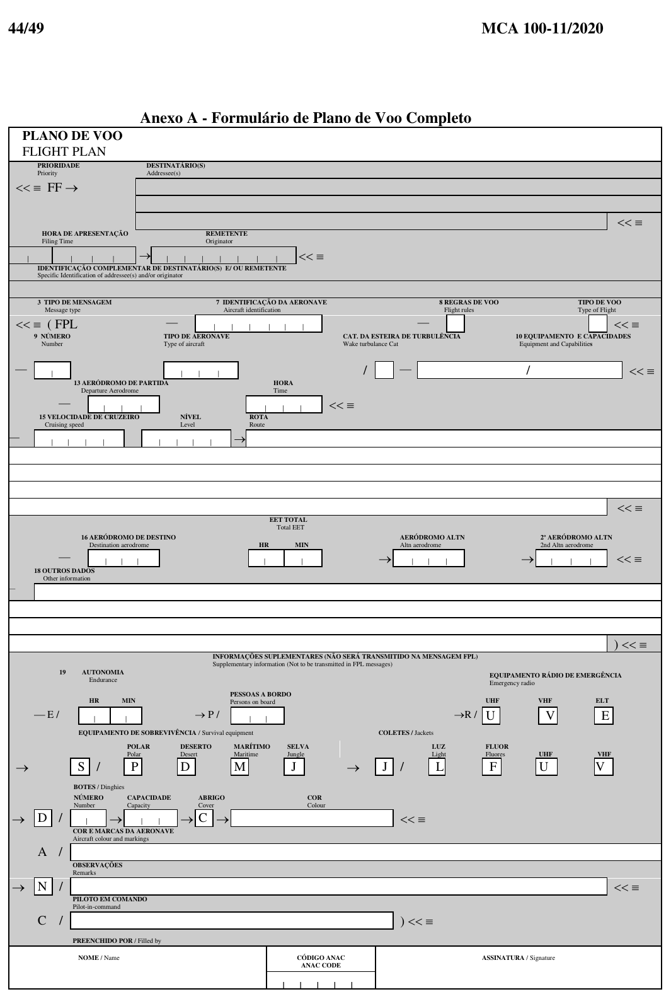
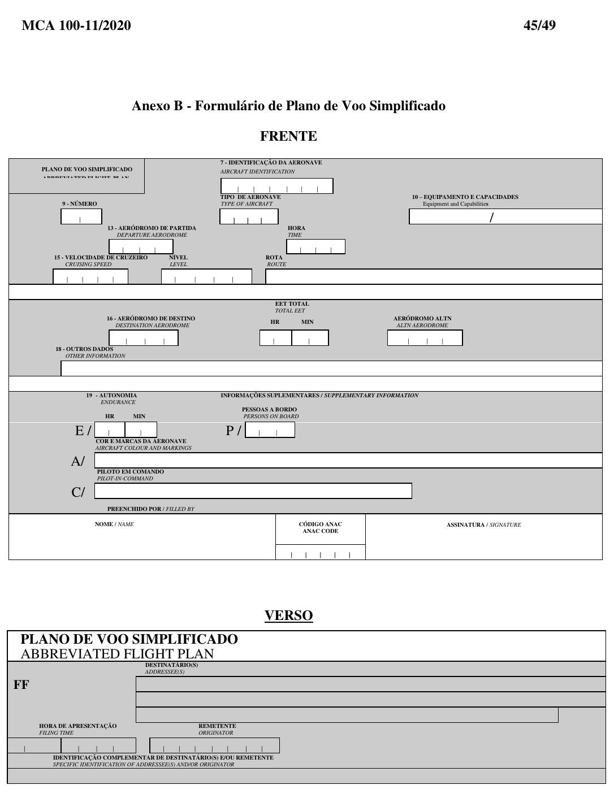
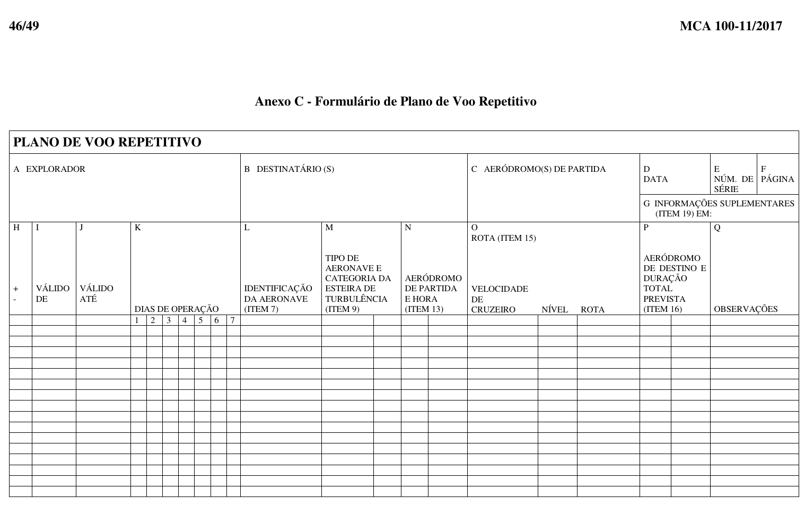

#

## Full Flight Plan

## Abbreviated Flight Plan

## Repetitive Flight Plan (RPL)

### Note

- The shaded fields/reverse side are usually intended for AIS/ATS use.
- In simulation, you will normally fill in the fields equivalent to the **full FPL** and, when applicable, use **ITEM 18** to supplement them.

---
