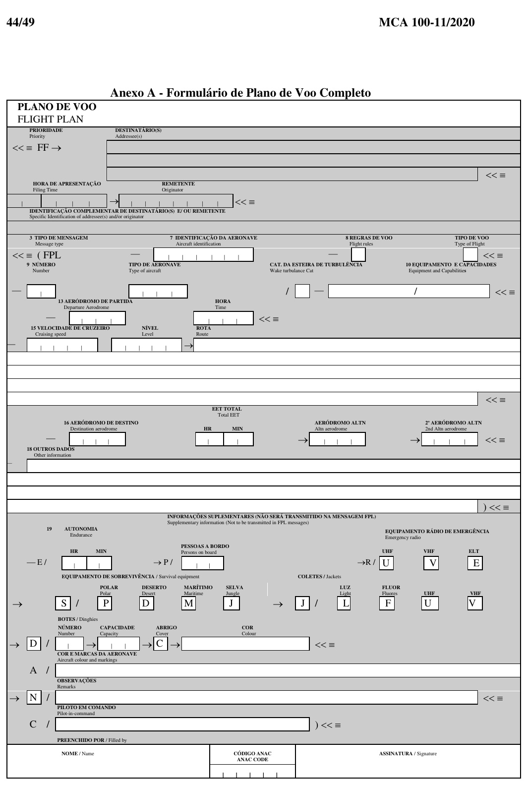
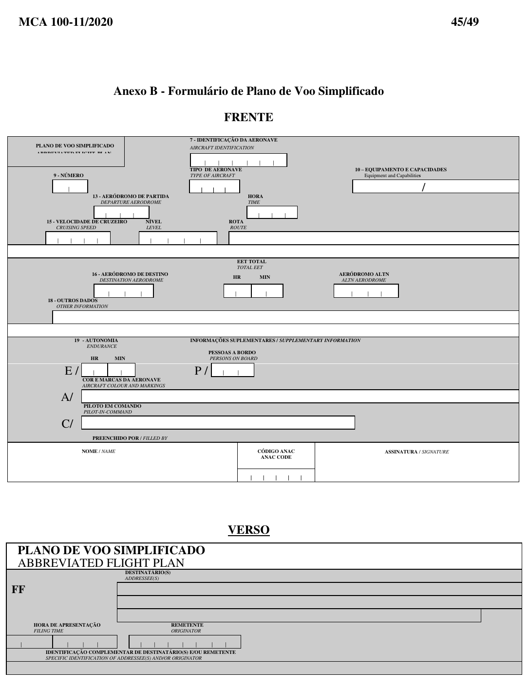
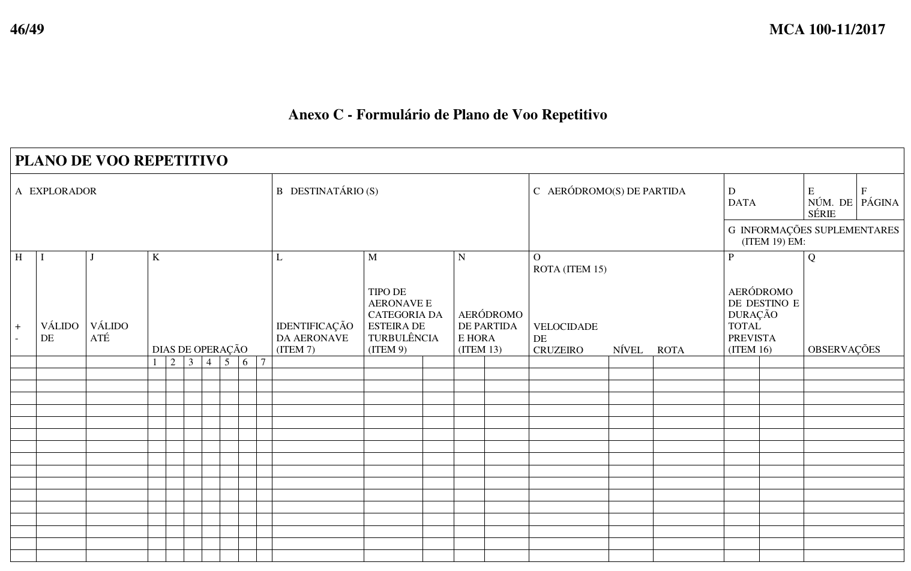

# Formulários Oficiais (DECEA)

Abaixo estão os formulários conforme os anexos do MCA 100-11.

## Plano de Voo Completo

## Plano de Voo Simplificado

## Plano de Voo Repetitivo (RPL)

### Observação

- Os campos sombreados/verso costumam ser destinados a uso AIS/ATS.
- Em simulação, normalmente você vai preencher os campos equivalentes ao **FPL completo**, e, quando aplicável, usar o **ITEM 18** para complementar.

---
