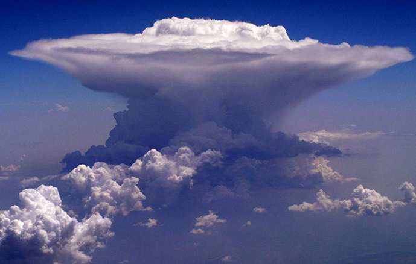

--8<-- "includes/abreviacoes.md"

# METAR and SPECI

## Definition

METAR (Meteorological Aerodrome Report) and SPECI (Special Weather Report) are standardised messages that provide weather information observed at aerodromes. Because they are messages encoded after direct observation, they therefore constitute an observation of present, current weather, even though they may contain some supplementary or short-term trend information.

## Message structure

A METAR/SPECI is encoded as follows:

| Type    | Location   | Date/time | Wind      | Horizontal Visibility              | Phenomena | Cloud Cover            | Temperature and Dew Point      | Pressure | Supplementary Information  | End of Message  |
| :------ | :--------- | :-------- | :-------- | :--------------------------------- | :-------- | :--------------------- | :----------------------------- | :------ | :------------------------- | :-------------- |
| `METAR` | `SBGR`     | `291200Z` | `11005KT` | `0750 0600S R10R/1200U R28R/0900N` | `+SHRA`   | `BKN008 SCT014 FEW025` | `26/20`                        | `Q1017` | `NOSIG`                    | `=`             |

<!-- LSZH 200150Z AUTO VRB02KT 0750 0600S R14/1200U R16/1000N R28/0900U R34/0900N FZFG VV003 M02/M02 Q1020 NOSIG -->

<!-- 1. **Type**: `METAR` or `SPECI`
2. **ICAO location**: e.g. `SBGR`
3. **Date/time (UTC)**: e.g. `291200Z`
4. **Wind**: direction/speed, variation, gusts
5. **Visibility**: in metres (`9999` = ≥ 10 km)
6. **Phenomena**: `-RA`, `TS`, `BR`, `FG`, etc.
7. **Clouds**: `FEW/SCT/BKN/OVC` + height (hundreds of feet) + `CB/TCU`
8. **Temperature/Dew point**: `TT/TD`
9. **Pressure**: `QNH` (`Q1016`)
10. **Supplements**: `RE...`, `WS RWY..`, `NOSIG`, corrections, remarks -->

<!-- !!! tip "Operational"
    Read first: **wind + visibility + phenomena + ceiling (lowest BKN/OVC) + QNH**.  
    The rest confirms nuance and trend. -->

## Description of each group

### Type

> `[METAR] SBGR 291200Z 11005KT 0750 0600S R10R/1200U R28R/0900N +SHRA BKN008 SCT014 FEW025 26/20 Q1017 NOSIG=`<br/>
> Routine observation

The first word is always `METAR` or `SPECI`, indicating the message type. A `METAR` message is a **routine** observation, usually made every hour at minute 00. A `SPECI`, on the other hand, indicates a **special** observation due to significant changes in weather conditions.

---

### Correction of Previous Observation

If a METAR or SPECI is issued with incorrect information, a correction message will be issued containing the word `COR` immediately after the message type.

In our example, if it were to be corrected:

> `METAR [COR] SBGR 291200Z 11005KT 0750 0600S R10R/1200U R28R/0900N +SHRA BKN008 SCT014 FEW025 26/20 Q1017 NOSIG=`<br/>
> Correction of previous observation

---

### Location

> `METAR [SBGR] 291200Z 11005KT 0750 0600S R10R/1200U R28R/0900N +SHRA BKN008 SCT014 FEW025 26/20 Q1017 NOSIG=`<br/>
> São Paulo/Guarulhos Airport

The four-letter ICAO code identifies the aerodrome where the observation was made.

??? "How are ICAO codes built?"
    - The first letter indicates the geographical region (e.g. `S` for South America).
    - The second letter indicates the country (e.g. `B` for Brazil).
    - The last two letters identify the specific aerodrome (e.g. `GR` for São Paulo/Guarulhos).

??? tip "Important information"
    Exceptionally, some codes may not refer to airports but to specific weather stations, such as offshore platforms or mountain stations, which also issue METARs for other, non-aeronautical purposes.

---

### Date and Time of Observation

> `METAR SBGR [291200Z] 11005KT 0750 0600S R10R/1200U R28R/0900N +SHRA BKN008 SCT014 FEW025 26/20 Q1017 NOSIG=`<br/>
> Observation made on the 29th of the current month at 1200Z

The next group indicates the day of the month and the time of the observation in UTC, in 24-hour format, followed by the letter `Z`.

!!! example "Examples"

    - `291200Z`: observation made on the 29th of the current month at 1200Z;
    - `040800Z`: observation made on the 4th of the current month at 0800Z;
    - `150530Z`: observation made on the 15th of the current month at 0530Z;
    - `011500Z`: observation made on the 1st of the current month at 1500Z;
    - `312027Z`: observation made on the 31st of the current month at 2027Z.

---

### Automated observation

> `METAR LSGG 200620Z [AUTO] VRB03KT 0900 0200NE R04/1200U R22/0900N PRFG VV002 M00/M00 Q1019 REFZDZ TEMPO 0600 FZFG=`<br/>
> Observation made by an automated system

Some METARs/SPECIs may include the word `AUTO`, indicating that the observation was made by an automated system, without direct human intervention. In these cases, this information appears immediately after the date/time.

---

### Wind

> `METAR SBGR 291200Z [11005KT] 0750 0600S R10R/1200U R28R/0900N +SHRA BKN008 SCT014 FEW025 26/20 Q1017 NOSIG=`<br/>
> Wind from 110° at 5 knots

This group gives the mean direction from which the wind is blowing, relative to true north and rounded to the nearest 10°, followed by the mean wind speed.

The wind speed unit may be either knots (`KT`) or metres per second (`MPS`), depending on the country. In Brazil, the standard unit is the knot (`KT`).

There are five possible wind representations, according to the wind behaviour over the last 10 minutes before the observation:

#### Steady Wind `(dddffKT)`

If during the 10 minutes preceding the observation the wind blows with constant direction and speed, it is classified as **steady**. It is represented by three digits for the direction (in degrees) and two digits for the speed (in knots), followed by the unit `KT`.

#### Variable Wind, Undefined `(VRBffKT)`

If during the 10 minutes preceding the observation the wind shows a direction variation equal to or greater than 60° but less than 180°, and the speed is below 3 knots, it is classified as **variable (undefined)**. In this case, the direction is represented by `VRB`, followed by the speed in knots.

#### Variable Wind, Defined `(dddVddd)`

If during the 10 minutes preceding the observation the wind shows a direction variation equal to or greater than 60° and the speed is equal to or greater than 3 knots, with the two extreme directions between which the wind has varied being observed, it is classified as **variable (defined)**. In this case, the direction is represented by two three-digit groups separated by the letter `V`, indicating the lower and upper limits of the wind direction variation in a clockwise direction.

#### Calm Wind `(00000KT)`

The wind is classified as **calm** when the mean wind speed is below 1 knot. In this case, the direction is represented by `000` and the speed by `00`, followed by the unit `KT`.

#### Gusts `(...GffKT)`

If during the 10 minutes preceding the observation the wind shows gusts, that is, rapid and momentary variations in wind speed exceeding the mean speed by 10 knots or more, it is classified as **gusting**. In this case, the maximum gust speed is given in two digits immediately after the mean speed and the letter **G**.

#### Wind of 100 knots or more `(...P99KT)`

For mean wind speeds equal to or greater than 100 knots, the speed is represented by `P99` ("plus 99").

!!! example "Examples"

    - `11005KT`: wind from 110° at 5 knots
    - `29013KT`: wind from 290° at 13 knots
    - `VRB03KT`: variable wind at 3 knots
    - `140V200`: wind varying between 140° and 200°
    - `00000KT`: calm wind
    - `25012G22KT`: wind from 250° at 12 knots with gusts up to 22 knots

!!! warning "Attention"

    Since the wind direction in a METAR/SPECI is given relative to true north, it is important to convert it to magnetic north when interpreting it, taking the local magnetic variation into account.

    The correction is made as follows:

      - If the magnetic variation is East (positive), subtract the variation from the true direction.

      - If the magnetic variation is West (negative), add the variation to the true direction.

    In Brazil, since the average magnetic variation is 20° West, the conversion generally involves adding 20° to the true direction to obtain the magnetic direction.
    

<!-- **Points of attention**

- `G` (gusts) + `TS` / `SH` → risk of gusts and changes in performance.
- Large `xxxVyyy` → crosswind component can change quickly.

--- -->

---

### Horizontal Visibility

> `METAR SBGR 291200Z 11005KT [0750 0600S] R10R/1200U R28R/0900N +SHRA BKN008 SCT014 FEW025 26/20 Q1017 NOSIG=`<br/>
> Prevailing horizontal visibility of 750 metres, visibility of 600 metres to the south

This group gives the prevailing horizontal visibility in metres. In some cases, there may be additional information about visibility in specific sectors.

If the horizontal visibility is not the same in different directions and differs from the prevailing visibility, the visibility in specific sectors will be given after the prevailing visibility, referring to the cardinal (N, E, S, W) or intercardinal (NE, SE, SW, NW) points.

Visibility is reported as follows:

1. increments of 50 m up to 800 m;
2. increments of 100 m for values from 800 to 5000 m;
3. increments of 1000 m for values from 5000 to 9000 m; and
4. 9999 to indicate 10 km or more.

!!! example "Examples"

    - `9999`: visibility of 10 km or more
    - `0750`: visibility of 750 metres
    - `6000`: visibility of 6 km
    - `1500NE`: visibility of 1.5 km to the northeast
    - `3000S`: visibility of 3 km to the south

<!-- - `9999` = **visibility ≥ 10 km**
- `BR` = mist (reduces visibility)
- `FG` = fog (usually more critical)
- `-RA / RA / +RA` = light / moderate / heavy rain
- `TS` = thunderstorm (may appear with `CB`)
- `DZ` = drizzle -->

---

### Runway Visual Range (RVR)

> `METAR SBGR 291200Z 11005KT 0750 0600S [R10R/1200U R28R/0900N] +SHRA BKN008 SCT014 FEW025 26/20 Q1017 NOSIG=`<br/>
> RVR on runway 10R of 1200 metres, upward tendency; RVR on runway 28R of 900 metres, no change

Runway visual range (RVR) is a measure of the distance along the runway over which a pilot can see the runway markings or approach lights. In a METAR/SPECI, RVR is given for specific runways, followed by the tendency.

The value is the mean obtained over the 10 minutes preceding the observation, and may be lowered if there is a considerable deterioration in visual range conditions.

RVR is reported as follows:

1. increments of 25 m for values up to 400 m;
2. increments of 50 m for values from 400 to 800 m; and
3. increments of 100 m for values above 800 m.

Additionally, if the RVR is greater than the maximum value observable by the equipment, it will be given as `Pxxxx`, where `xxxx` is the maximum measurable value. Likewise, when the RVR is below the minimum observable value, it will be given as `Mxxxx`, where `xxxx` is the minimum measurable value.

A tendency, also observed over this 10-minute period, may be given in three different ways:

- `U` (up): upward tendency of the visual range;
- `D` (down): downward tendency of the visual range;
- `N` (no change): no significant change in the visual range.

!!! example "Examples"

    - `R10R/1200U`: RVR on runway 10R of 1200 metres, upward tendency
    - `R28R/0900N`: RVR on runway 28R of 900 metres, no change
    - `R16/0500D`: RVR on runway 16 of 500 metres, downward tendency
    - `R22/1500U`: RVR on runway 22 of 1500 metres, upward tendency
    - `R04/P1800D`: RVR on runway 04 greater than 1800 metres, downward tendency

---

### Weather Phenomena

> `METAR SBGR 291200Z 11005KT 0750 0600S R10R/1200U R28R/0900N [+SHRA] BKN008 SCT014 FEW025 26/20 Q1017 NOSIG=`<br/>
> Heavy rain shower

All weather phenomena observed at the aerodrome and in its vicinity that are significant to flight operations are indicated by standardised codes.

The phenomena group is divided into three parts:

1. intensity or proximity qualifier (as applicable);
2. abbreviation of the phenomenon descriptor; and
3. abbreviation of the weather phenomenon or combinations thereof.

#### Table of Qualifiers, Descriptors and Weather Phenomena

=== ":flag_br: Portuguese"
    | Intensidade ou Proximidade | Descritor            | Precipitação                   | Obscurecedor                | Outros                                |
    | :------------------------- | :------------------- | :----------------------------- | :-------------------------- | :------------------------------------ |
    | `-` Leve                   | `MI` Baixo           | `DZ` Chuvisco                  | `BR` Névoa Úmida            | `PO` Poeira/Areia em Redemoinhos      |
    | ` ` Moderada (sem sinal)   | `BC` Bancos          | `RA` Chuva                     | `FG` Nevoeiro               | `SQ` Tempestades                      |
    | `+` Forte/Bem desenvolvido | `PR` Parcial         | `SN` Neve                      | `FU` Fumaça                 | `FC` Funil (tornado ou tromba d'água) |
    | `VC` Na vizinhança         | `DR` Flutuante Baixo | `SG` Grãos de Neve             | `VA` Cinzas Vulcânicas      | `SS` Tempestade de Areia              |
    |                            | `BL` Soprada         | `PL` Pelotas de Gelo           | `DU` Poeira em área extensa | `DS` Tempestade de Poeira             |
    |                            | `SH` Pancada(s)      | `GR` Granizo                   | `SA` Areia                  |                                       |
    |                            | `TS` Trovoada        | `GS` Granizo Pequeno           | `HZ` Névoa Seca             |                                       |
    |                            | `FZ` Congelante      | `UP` Precipitação Desconhecida |                             |                                       |

=== ":flag_us: English"
    | Intensity or Proximity   | Descriptor        | Precipitation              | Obscuration          | Other                               |
    | :----------------------- | :---------------- | :--------------------------| :------------------- | :---------------------------------- |
    | `-` Light                | `MI` Shallow      | `DZ` Drizzle               | `BR` Mist            | `PO` Dust/Sand Whirls               |
    | ` ` Moderate (no sign)   | `BC` Patches      | `RA` Rain                  | `FG` Fog             | `SQ` Squalls                        |
    | `+` Heavy/Well developed | `PR` Partial      | `SN` Snow                  | `FU` Smoke           | `FC` Funnel (tornado or waterspout) |
    | `VC` In the vicinity     | `DR` Low Drifting | `SG` Snow Grains           | `VA` Volcanic Ash    | `SS` Sandstorm                      |
    |                          | `BL` Blowing      | `PL` Ice Pellets           | `DU` Widespread Dust | `DS` Duststorm                      |
    |                          | `SH` Shower(s)    | `GR` Hail                  | `SA` Sand            |                                     |
    |                          | `TS` Thunderstorm | `GS` Small Hail            | `HZ` Haze            |                                     |
    |                          | `FZ` Freezing     | `UP` Unknown Precipitation |                      |                                     |

=== ":flag_es: Spanish"
    | Intensidad o Proximidad      | Descriptor       | Precipitación                  | Obscurecedor          | Otros                                 |
    | :--------------------------- | :--------------- | :----------------------------- | :-------------------- | :------------------------------------ |
    | `-` Débil                    | `MI` Baja        | `DZ` Llovizna                  | `BR` Neblina          | `PO` Remolinos de Polvo/Arena         |
    | ` ` Moderada (sin signo)     | `BC` Bancos      | `RA` Lluvia                    | `FG` Niebla           | `SQ` Turbonadas                       |
    | `+` Fuerte/Bien desarrollado | `PR` Parcial     | `SN` Nieve                     | `FU` Humo             | `FC` Embudo (tornado o tromba marina) |
    | `VC` En las proximidades     | `DR` Bajo Deriva | `SG` Granos de Nieve (cinarra) | `VA` Ceniza Volcánica | `SS` Tempestad de Arena               |
    |                              | `BL` Soplando    | `PL` Hielo Granulado           | `DU` Polvo Extendido  | `DS` Tempestad de Polvo               |
    |                              | `SH` Chubasco(s) | `GR` Granizo                   | `SA` Arena            |                                       |
    |                              | `TS` Tormenta    | `GS` Granizo Pequeño           | `HZ` Calima           |                                       |
    |                              | `FZ` Engelante   | `UP` Precipitación Desconocida |                       |                                       |

!!! example "Examples"

    - `-RA`: light precipitation of rain (or light rain)
    - `+TSRA`: thunderstorm with heavy precipitation of rain (or heavy rain)
    - `VCFG`: fog in the vicinity
    - `SHSN`: snow shower
    - `FZFG`: freezing fog
    - `BLSA`: blowing sand
    - `DRDU`: low drifting dust
    - `+TSGRRASN`: thunderstorm with heavy precipitation of hail, rain and snow
---

### Cloud Cover

> `METAR SBGR 291200Z 11005KT 0750 0600S R10R/1200U R28R/0900N +SHRA [BKN008 SCT014 FEW025] 26/20 Q1017 NOSIG=`<br/>
> Broken at 800 feet, scattered at 1400 feet, few clouds at 2500 feet.

Cloud cover is represented by standardised codes indicating the amount of cloud present in the sky and the height of the cloud base in hundreds of feet **above ground level (AGL)**.

When convective clouds occur, such as _cumulonimbus_ (CB) or _cumulus congestus_ of great vertical extent (TCU), this information is appended to the end of the cloud cover group.

??? info "Convective Clouds"

    CB and TCU clouds are indicative of significant atmospheric instability and may be associated with severe weather phenomena such as thunderstorms, turbulence and hail. The presence of these clouds is crucial to the safety of flight operations and requires special attention from pilots and air traffic controllers. Flying near or through these clouds can pose considerable risks due to the adverse conditions they can generate, not only for the aircraft but also for the passengers and crew on board.

    It is important to note that a TCU generally develops into a CB, which is why it is important to report both types in the METAR/SPECI message.

    See below an illustrative image of these clouds:

    <div class="grid" markdown>
    <figure markdown="span">
    { height="250" }
    <figcaption>Cumulonimbus (CB)</figcaption>
    </figure>
    <figure markdown="span">
    { height="250" }
    <figcaption>Towering Cumulus (TCU)</figcaption>
    </figure>
    </div>


When there are no clouds of operational significance, no restriction on vertical visibility, and the term `CAVOK` is not appropriate, the code `NSC` (Nil Significant Cloud) is used.

If an automated system issues the METAR/SPECI and no clouds can be detected, the code `NCD` (No Cloud Detected) is used. Likewise, if the system detects the presence of CB or TCU clouds but cannot determine the base height, the height is given as `///`. Additionally, if thunder is heard or lightning is detected, but it is not possible to identify the amount and base height of CB clouds because the sky is obscured or covered by a very low cloud layer, the code `/////CB` is used.

#### Cloud Cover Table

| Code   | Description     | Coverage             | Defines ceiling?                          |
| :----- | :-------------- | :------------------- | :---------------------------------------: |
| `FEW`  | Few clouds      | 1 to 2 oktas         | :fontawesome-solid-circle-xmark:{.cornot} |
| `SCT`  | Scattered       | 3 to 4 oktas         | :fontawesome-solid-circle-xmark:{.cornot} |
| `BKN`  | Broken          | 5 to 7 oktas         | :fontawesome-solid-circle-check:{.corok}  |
| `OVC`  | Overcast        | 8 oktas              | :fontawesome-solid-circle-check:{.corok}  |

!!! example "Examples"

    - `FEW025`: few clouds at 2500 feet AGL
    - `SCT014`: scattered clouds at 1400 feet AGL
    - `BKN008`: broken at 800 feet AGL
    - `OVC002`: overcast at 200 feet AGL
    - `BKN015CB`: broken at 1500 feet AGL with cumulonimbus
    - `SCT030TCU`: scattered clouds at 3000 feet AGL with towering cumulus

<!-- - `FEW` and `SCT` normally **do not define a ceiling**.
- `BKN` or `OVC` **define a ceiling** (use the lowest BKN/OVC).
- Height is in hundreds of feet:
  - `BKN015` → **1500 ft**
  - `OVC002` → **200 ft** -->

---

### Vertical Visibility

> `METAR LSZH 200150Z AUTO VRB02KT 0750 0600S R04/1200U R22/0900N PRFG [VV003] M02/M02 Q1020 NOSIG=`<br/>
> Vertical visibility of 300 feet

When the sky is obscured by clouds or other weather phenomena, vertical visibility is given in the METAR/SPECI. Vertical visibility is defined as the vertical visual range into an obscuring medium.

Vertical visibility is given in hundreds of feet, preceded by `VV`, up to a limit of 2000 feet.

When vertical visibility information is not available or cannot be determined by an automated system, the code `VV///` is used.

!!! example "Examples"

    - `VV003`: vertical visibility of 300 feet
    - `VV015`: vertical visibility of 1500 feet
    - `VV///`: vertical visibility not determined

---

### CAVOK

> `METAR SBGR 291200Z 11005KT [CAVOK] 26/20 Q1017 NOSIG=`<br/>
> Clear sky and good visibility.

The term `CAVOK` (Ceiling And Visibility OK) replaces the groups for horizontal visibility, runway visual range, present weather, clouds or vertical visibility when the following conditions occur simultaneously at the time of observation:

1. horizontal visibility of 10 km or more;
2. no significant clouds; and
3. no significant weather phenomena that could affect flight safety.

---

### Temperature and Dew Point

> `METAR SBGR 291200Z 11005KT 0750 0600S R10R/1200U R28R/0900N +SHRA BKN008 SCT014 FEW025 [26/20] Q1017 NOSIG=`<br/>
> Temperature of 26°C and dew point of 20°C

This group gives the air temperature and the dew point temperature, both in degrees Celsius, separated by a slash (`/`).

When values are in the range between -9°C and 9°C, the value is preceded by a zero (`0`). Negative values are indicated by the letter `M` (minus) before the number.

??? info "Why is the Dew Point useful?"
    The importance of the dew point lies in the fact that it indicates the temperature to which the air must be cooled, at constant pressure, for the relative humidity to reach 100% and condensation to begin. The difference between the air temperature and the dew point, known as the "spread", is a crucial indicator of air humidity. A small spread suggests high humidity, while a large spread indicates low humidity.

    The formula below can be used to calculate relative humidity (UR) based on the air temperature ($T$) and the dew point ($PO$):

    $$
    UR \approx 100 \times \left[ exp \left( \frac{17.625 \times PO}{243.04 + PO} \right) \div exp \left( \frac{17.625 \times T}{243.04 + T} \right) \right]
    $$

!!! example "Examples"

    - `26/20`: temperature of 26°C and dew point of 20°C
    - `15/10`: temperature of 15°C and dew point of 10°C
    - `M02/M05`: temperature of -2°C and dew point of -5°C
    - `10/10`: temperature of 10°C and dew point of 10°C (100% relative humidity)
    - `41/02`: temperature of 41°C and dew point of 2°C (low relative humidity)

---

### Pressure

> `METAR SBGR 291200Z 11005KT 0750 0600S R10R/1200U R28R/0900N +SHRA BKN008 SCT014 FEW025 26/20 [Q1017] NOSIG=`<br/>
> Sea level pressure of 1017 hPa.

This group gives the atmospheric pressure at sea level, expressed in hectopascals (hPa), preceded by the letter `Q`. The value is rounded down to the nearest whole hectopascal and, if it is less than 1000 hPa, it is preceded by a zero.

!!! example "Examples"

    - `Q1017`: sea level pressure of 1017 hPa
    - `Q1005`: sea level pressure of 1005 hPa
    - `Q0998`: sea level pressure of 998 hPa

---

### Supplementary Information

> `METAR SBGR 291200Z 11005KT 0750 0600S R10R/1200U R28R/0900N +SHRA BKN008 SCT014 FEW025 26/20 Q1017 [NOSIG]=`<br/>
> No significant change expected.

Various additional information may be included at the end of the METAR/SPECI, such as weather trends, special remarks or warnings.

- **Recent Weather**

    Information on recent weather phenomena that occurred at the aerodrome or in its vicinity is indicated by the standardised codes, preceded by the abbreviation `RE`.

- **Wind Shear**

    The presence of wind shear on approach or take-off on a given runway is indicated by the abbreviation `WS Rxx`, where `xx` is the runway number. If the wind shear affects all runways, the abbreviation used is `WS ALL RWY`.

- **Trend Forecast**

    When a significant change in weather conditions is forecast, it is indicated by `TEMPO` if temporary, or `BECMG` if the change is permanent. These forecasts are followed by the standard groups for weather phenomena, visibility, cloud cover, among others.

- **No Significant Change**

    The abbreviation `NOSIG` indicates that no significant changes in weather conditions are expected in the next hour.

- **Other remarks**

    Any other remark relevant to flight operations may be included at the end of the METAR/SPECI after `RMK`. The text after `RMK` does not follow a standardised format and may vary from one weather station to another.

---

### End of Message

> `METAR SBGR 291200Z 11005KT 0750 0600S R10R/1200U R28R/0900N +SHRA BKN008 SCT014 FEW025 26/20 Q1017 NOSIG[=]`<br/>
> End of message.

The equals sign (`=`) indicates the end of the message.

---

## Practical METAR/SPECI Examples

??? info "`METAR TXKF 011755Z 24041G53KT 6000 HZ SCT033 BKN060 BKN080 20/12 Q0997`"

    - `METAR`: routine observation
    - `TXKF`: Bermuda aerodrome
    - `011755Z`: observation made on the 1st of the current month at 1755Z
    - `24041G53KT`: wind from 240° at 41 knots with gusts up to 53 knots
    - `6000`: visibility of 6 km
    - `HZ`: haze
    - `SCT033`: scattered clouds at 3300 feet AGL
    - `BKN060`: broken at 6000 feet AGL (ceiling)
    - `BKN080`: broken at 8000 feet AGL
    - `20/12`: temperature of 20°C and dew point of 12°C
    - `Q0997`: sea level pressure of 997 hPa

??? info "`SPECI LPLA 011802Z 30030G46KT 6000 -TSRA BKN024 SCT025CB BKN040 10/06 Q1009 WS ALL RWY`"

    - `SPECI`: special observation
    - `LPLA`: Lajes aerodrome, Azores, Portugal
    - `011802Z`: observation made on the 1st of the current month at 1802Z
    - `30030G46KT`: wind from 300° at 30 knots with gusts up to 46 knots
    - `6000`: visibility of 6 km
    - `-TSRA`: thunderstorm with light rain
    - `BKN024`: broken at 2400 feet AGL (ceiling)
    - `SCT025CB`: scattered clouds at 2500 feet AGL with cumulonimbus
    - `BKN040`: broken at 4000 feet AGL
    - `10/06`: temperature of 10°C and dew point of 6°C
    - `Q1009`: sea level pressure of 1009 hPa
    - `WS ALL RWY`: wind shear on all runways

??? info "`METAR SBRJ 011900Z 11015KT 5000 -TSRA BR SCT035 FEW040CB OVC070 26/24 Q1003 RERA`"

    - `METAR`: routine observation
    - `SBRJ`: Rio de Janeiro aerodrome, Brazil
    - `011900Z`: observation made on the 1st of the current month at 1900Z
    - `11015KT`: wind from 110° at 15 knots
    - `5000`: visibility of 5 km
    - `-TSRA`: thunderstorm with light rain
    - `BR`: mist
    - `SCT035`: scattered clouds at 3500 feet AGL
    - `FEW040CB`: few clouds at 4000 feet AGL with cumulonimbus
    - `OVC070`: overcast at 7000 feet AGL (ceiling)
    - `26/24`: temperature of 26°C and dew point of 24°C
    - `Q1003`: sea level pressure of 1003 hPa
    - `RERA`: recent rain

??? info "`METAR UATE 011800Z 12002MPS 0250 R11/0800N FZFG VV006 M01/M01 Q1014 NOSIG`"

    - `METAR`: routine observation
    - `UATE`: Aktau aerodrome, Kazakhstan
    - `011800Z`: observation made on the 1st of the current month at 1800Z
    - `12002MPS`: wind from 120° at 2 metres per second
    - `0250`: visibility of 250 metres
    - `R11/0800N`: RVR on runway 11 of 800 metres, no change
    - `FZFG`: freezing fog
    - `VV006`: vertical visibility of 600 feet
    - `M01/M01`: temperature of -1°C and dew point of -1°C
    - `Q1014`: sea level pressure of 1014 hPa
    - `NOSIG`: no significant change expected

??? info "`METAR LIMF 011850Z 06004KT 010V080 0150 R36/0500D FG VV002 03/02 Q1008`"

    - `METAR`: routine observation
    - `LIMF`: Turin aerodrome, Italy
    - `011850Z`: observation made on the 1st of the current month at 1850Z
    - `06004KT`: wind from 60° at 4 knots
    - `010V080`: wind direction varying between 10° and 80°
    - `0150`: visibility of 150 metres
    - `R36/0500D`: RVR on runway 36 of 500 metres, downward tendency
    - `FG`: fog
    - `VV002`: vertical visibility of 200 feet
    - `03/02`: temperature of 3°C and dew point of 2°C
    - `Q1008`: sea level pressure of 1008 hPa

??? info "`METAR ENSB 011820Z 26025KT 4000 -SHSN FEW006 SCT015 BKN020 M07/M09 Q0995 RMK WIND 1400FT 23022G42KT`"

    - `METAR`: routine observation
    - `ENSB`: Longyearbyen aerodrome, Norway
    - `011820Z`: observation made on the 1st of the current month at 1820Z
    - `26025KT`: wind from 260° at 25 knots
    - `4000`: visibility of 4 km
    - `-SHSN`: light snow shower
    - `FEW006`: few clouds at 600 feet AGL
    - `SCT015`: scattered clouds at 1500 feet AGL
    - `BKN020`: broken at 2000 feet AGL (ceiling)
    - `M07/M09`: temperature of -7°C and dew point of -9°C
    - `Q0995`: sea level pressure of 995 hPa
    - `RMK WIND 1400FT 23022G42KT`: additional remark indicating wind at 1400 feet AGL from 230° at 22 knots with gusts up to 42 knots

??? info "`METAR USHH 011800Z 00000MPS CAVOK M36/M41 Q1045 NOSIG`"

    - `METAR`: routine observation
    - `USHH`: Khanty Mansiysk aerodrome, Russia
    - `011800Z`: observation made on the 1st of the current month at 1800Z
    - `00000MPS`: calm wind
    - `CAVOK`: clear sky and good visibility
    - `M36/M41`: temperature of -36°C and dew point of -41°C
    - `Q1045`: sea level pressure of 1045 hPa
    - `NOSIG`: no significant change expected

??? info "`SPECI SBLO 011827Z 30015G25KT 8000 3000NW -TSRA SCT030 FEW040CB BKN070 24/22 Q1009`"

    - `SPECI`: special observation
    - `SBLO`: Londrina aerodrome, Brazil
    - `011827Z`: observation made on the 1st of the current month at 1827Z
    - `30015G25KT`: wind from 300° at 15 knots with gusts up to 25 knots
    - `8000`: visibility of 8 km
    - `3000NW`: visibility of 3 km to the northwest
    - `-TSRA`: thunderstorm with light rain
    - `SCT030`: scattered clouds at 3000 feet AGL
    - `FEW040CB`: few clouds at 4000 feet AGL with cumulonimbus
    - `BKN070`: broken at 7000 feet AGL (ceiling)
    - `24/22`: temperature of 24°C and dew point of 22°C
    - `Q1009`: sea level pressure of 1009 hPa

??? info "`	SPECI SGAS 011840Z 11005KT 070V140 9999 TS BKN030 FEW040CB 34/18 Q1005`"

    - `SPECI`: special observation
    - `SGAS`: Asunción aerodrome, Paraguay
    - `011840Z`: observation made on the 1st of the current month at 1840Z
    - `11005KT`: wind from 110° at 5 knots
    - `070V140`: wind direction varying between 70° and 140°
    - `9999`: visibility of 10 km or more
    - `TS`: moderate thunderstorm
    - `BKN030`: broken at 3000 feet AGL (ceiling)
    - `FEW040CB`: few clouds at 4000 feet AGL with cumulonimbus
    - `34/18`: temperature of 34°C and dew point of 18°C
    - `Q1005`: sea level pressure of 1005 hPa

??? info "`METAR LBWN 011900Z AUTO VRB04G14KT 9999 -SN OVC009/// M01/M01 Q1011 TEMPO 5000 -SN`"

    - `METAR`: routine observation
    - `LBWN`: Varna aerodrome, Bulgaria
    - `011900Z`: observation made on the 1st of the current month at 1900Z
    - `AUTO`: automated observation
    - `VRB04G14KT`: variable wind at 4 knots with gusts up to 14 knots
    - `9999`: visibility of 10 km or more
    - `-SN`: light snow
    - `OVC009///`: overcast at 900 feet AGL, cloud type not determined
    - `M01/M01`: temperature of -1°C and dew point of -1°C
    - `Q1011`: sea level pressure of 1011 hPa
    - `TEMPO 5000 -SN`: temporary forecast of 5 km visibility with light snow

??? info "`METAR UOOO 011900Z 17002MPS CAVOK M43/M47 Q1027 NOSIG`"

    - `METAR`: routine observation
    - `UOOO`: Norilsk aerodrome, Russia
    - `011900Z`: observation made on the 1st of the current month at 1900Z
    - `17002MPS`: wind from 170° at 2 metres per second
    - `CAVOK`: clear sky and good visibility
    - `M43/M47`: temperature of -43°C and dew point of -47°C
    - `Q1027`: sea level pressure of 1027 hPa
    - `NOSIG`: no significant change expected

??? info "`METAR SBUF 011800Z AUTO 11009KT 080V160 CAVOK 37/16 Q1008`"

    - `METAR`: routine observation
    - `SBUF`: Paulo Afonso aerodrome, Brazil
    - `011800Z`: observation made on the 1st of the current month at 1800Z
    - `AUTO`: automated observation
    - `11009KT`: wind from 110° at 9 knots
    - `080V160`: wind direction varying between 80° and 160°
    - `CAVOK`: clear sky and good visibility
    - `37/16`: temperature of 37°C and dew point of 16°C
    - `Q1008`: sea level pressure of 1008 hPa


<!-- ## Library of real examples (REDEMET)

> Below are real examples, obtained from REDEMET automatic queries (various aerodromes/dates).  
> The purpose here is to **recognise patterns** quickly.

### METAR (CAVOK / fair weather)

```text
METAR SBGR 291200Z 31005KT CAVOK 26/20 Q1016=
METAR SBBR 291200Z VRB03KT CAVOK 26/20 Q1018=
METAR SBMG 290200Z 00000KT CAVOK 25/21 Q1013=
METAR SBMT 040000Z VRB02KT CAVOK 22/18 Q1016=
METAR SBSP 040800Z AUTO 36006KT 330V030 CAVOK 21/19 Q1015=
```

### METAR (rain and ceiling)

```text
METAR SBSP 040400Z AUTO 34010KT 9999 -RA FEW012 BKN024 21/20 Q1017=
METAR SBSP 042000Z 31011KT 8000 -RA SCT015 OVC080 23/21 Q1016=
METAR SBMT 042100Z 14003KT 110V170 7000 -RA SCT017 FEW035TCU OVC080 21/20 Q1016=
METAR SBPV 291200Z 32002KT 9999 OVC002 23/22 Q1013=
METAR SBVH 291200Z 29007KT 5000 BR SCT011 OVC055 21/20 Q1017=
```

### SPECI (significant change / convective)

```text
SPECI SBSP 040201Z 36005KT CAVOK 23/20 Q1017=
SPECI SBMT 041936Z 03012G24KT 340V070 1000 -TSRA BR BKN015 FEW035CB 21/19 Q1016=
SPECI SBPV 291223Z 17002KT 9999 OVC005 24/22 Q1013=
```

### METAR COR (correction)

```text
METAR COR SBMT 042000Z 04007KT 360V090 3000 -RA BR BKN015 FEW035TCU 20/19 Q1015 RETS=
```

---

## Guided (operational) interpretations — selected examples

### 1) Convective with severe visibility reduction (SPECI)

```text
SPECI SBMT 041936Z 03012G24KT 340V070 1000 -TSRA BR BKN015 FEW035CB 21/19 Q1016=
```

**Analysis:**

- **SPECI**: relevant change (do not wait for the next METAR).
- **03012G24KT**: strong gusts (instability).
- **1000**: visibility 1 km (direct impact on minima).
- **-TSRA BR**: thunderstorm with rain and mist.
- **BKN015**: ceiling 1500 ft (more restrictive IFR).
- **FEW035CB**: presence of CB (risk of turbulence, hail, wind shear, microburst).

!!! warning "Operational reading"
    Typical "closing window" scenario; alternate/holding and waiting for improvement may be required.

### 2) Extremely low ceiling (OVC002)

```text
METAR SBPV 291200Z 32002KT 9999 OVC002 23/22 Q1013=
```

**Analysis:**

- **OVC002**: overcast at 200 ft → critical ceiling.
- Good visibility does not "save" the ceiling for IFR operations (the approach depends on minima).

### 3) Persistent light rain with high OVC

```text
METAR SBSP 042000Z 31011KT 8000 -RA SCT015 OVC080 23/21 Q1016=
```

**Analysis:**

- **-RA** + vis 8 km: moderate degradation
- **SCT015** (not a ceiling) and **OVC080** (ceiling 8000 ft): the ceiling is not the limiting factor, but a wet runway and wind may be.

---

## Common mistakes (that lead to poor decisions)

- Treating **SCT** as a ceiling: a ceiling is **BKN/OVC**.
- Ignoring **xxxVyyy**: variable direction can increase the actual crosswind component.
- "CAVOK = always good": there may be strong wind (in the TAF) and NOTAMs limiting operations.
- Not cross-checking the METAR against a recent TAF (or SPECI): the trend may have changed. -->
