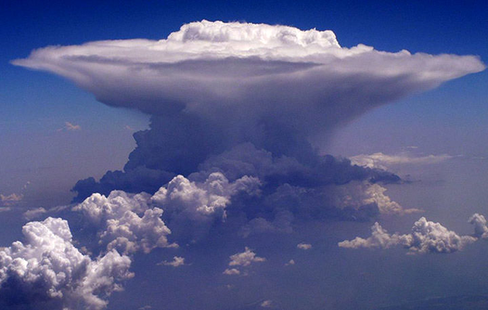

--8<-- "includes/abreviacoes.md"


#

## Definição

METAR (Meteorological Aerodrome Report) e SPECI (Special Weather Report) são mensagens padronizadas que fornecem informações meteorológicas observadas em aeródromos. Por se trataram de mensagens codificadas após observação direta, constituem, portanto, observação de tempo presente, atual, ainda que possa ter alguma infomação suplementar ou de tendência de curto prazo.

## Estrutura da mensagem

Um METAR/SPECI será codificado da seguinte forma:

| Tipo    | Localidade | Data/hora | Vento     | Visibilidade Horizontal            | Fenômenos | Cobertura de Nuvens    | Temperatura e Ponto de Orvalho | Pressão | Informações Suplementares | Fim da Mensagem |
| :------ | :--------- | :-------- | :-------- | :--------------------------------- | :-------- | :--------------------- | :----------------------------- | :------ | :------------------------- | :-------------- |
| `METAR` | `SBGR`     | `291200Z` | `11005KT` | `0750 0600S R10R/1200U R28R/0900N` | `+SHRA`   | `BKN008 SCT014 FEW025` | `26/20`                        | `Q1017` | `NOSIG`                    | `=`             |

<!-- LSZH 200150Z AUTO VRB02KT 0750 0600S R14/1200U R16/1000N R28/0900U R34/0900N FZFG VV003 M02/M02 Q1020 NOSIG -->

<!-- 1. **Tipo**: `METAR` ou `SPECI`
2. **Localidade ICAO**: ex. `SBGR`
3. **Data/hora (UTC)**: ex. `291200Z`
4. **Vento**: direção/velocidade, variação, rajadas
5. **Visibilidade**: em metros (`9999` = ≥ 10 km)
6. **Fenômenos**: `-RA`, `TS`, `BR`, `FG`, etc.
7. **Nuvens**: `FEW/SCT/BKN/OVC` + altura (centenas de pés) + `CB/TCU`
8. **Temperatura/Ponto de orvalho**: `TT/TD`
9. **Pressão**: `QNH` (`Q1016`)
10. **Complementos**: `RE...`, `WS RWY..`, `NOSIG`, correções, observações -->

<!-- !!! tip "Operacional"
    Leia primeiro: **vento + visibilidade + fenômenos + teto (BKN/OVC mais baixo) + QNH**.  
    O restante confirma nuance e tendência. -->

## Descrição de cada grupo

### Tipo

> `[METAR] SBGR 291200Z 11005KT 0750 0600S R10R/1200U R28R/0900N +SHRA BKN008 SCT014 FEW025 26/20 Q1017 NOSIG=`<br/>
> Observação regular

A palavra inicial é sempre `METAR` ou `SPECI`, indicando o tipo de mensagem. Uma mensagem `METAR` é uma observação **regular**, usualmente realizada de hora em hora no minuto 00. Já um `SPECI` indica uma observação **especial** devido a mudanças significativas nas condições meteorológicas.

---

### Correção de Observação Anterior

Caso um METAR ou um SPECI seja expedido com alguma informação errada, uma mensagem de correção será emitida e nela constará a palavra `COR` logo após o tipo da mensagem.

No caso do nosso exemplo, se fosse o caso dele ser corrigido:

> `METAR [COR] SBGR 291200Z 11005KT 0750 0600S R10R/1200U R28R/0900N +SHRA BKN008 SCT014 FEW025 26/20 Q1017 NOSIG=`<br/>
> Correção de observação anterior

---

### Localidade

> `METAR [SBGR] 291200Z 11005KT 0750 0600S R10R/1200U R28R/0900N +SHRA BKN008 SCT014 FEW025 26/20 Q1017 NOSIG=`<br/>
> Aeroporto de São Paulo/Guarulhos

O código ICAO de quatro letras identifica o aeródromo onde a observação foi realizada.

??? "Como são montados os códigos ICAO?"
    - A primeira letra indica a região geográfica (ex.: `S` para América do Sul).
    - A segunda letra indica o país (ex.: `B` para Brasil).
    - As duas últimas letras identificam o aeródromo específico (ex.: `GR` para São Paulo/Guarulhos).

??? tip "Informação importante"
    Excepcionalmente, alguns códigos podem não se referir a aeroportos, mas sim a estações meteorológicas específicas, como plataformas offshore ou estações de montanha, que também emitem METAR com outros fins, não-aeronáuticos.

---

### Data e Hora da Observação

> `METAR SBGR [291200Z] 11005KT 0750 0600S R10R/1200U R28R/0900N +SHRA BKN008 SCT014 FEW025 26/20 Q1017 NOSIG=`<br/>
> Observação realizada em 29 do mês atual às 1200Z

O grupo seguinte indica o dia do mês e a hora da observação em UTC, em formato 24 horas, seguido pela letra `Z`.

!!! example "Exemplos"

    - `291200Z`: observação realizada no dia 29 do mês atual às 1200Z;
    - `040800Z`: observação realizada no dia 4 do mês atual às 0800Z;
    - `150530Z`: observação realizada no dia 15 do mês atual às 0530Z;
    - `011500Z`: observação realizada no dia 1º do mês atual às 1500Z;
    - `312027Z`: observação realizada no dia 31 do mês atual às 2027Z.

---

### Observação automatizada

> `METAR LSGG 200620Z [AUTO] VRB03KT 0900 0200NE R04/1200U R22/0900N PRFG VV002 M00/M00 Q1019 REFZDZ TEMPO 0600 FZFG=`<br/>
> Observação realizada por sistema automatizado

Alguns METAR/SPECI podem incluir a palavra `AUTO`, indicando que a observação foi realizada por um sistema automatizado, sem intervenção humana direta. Nesses casos, esta informação aparece logo após a data/hora.

---

### Vento

> `METAR SBGR 291200Z [11005KT] 0750 0600S R10R/1200U R28R/0900N +SHRA BKN008 SCT014 FEW025 26/20 Q1017 NOSIG=`<br/>
> Vento de 110° a 5 nós

Aqui é apresentada a direção média do vento soprado em relação ao norte verdadeiro, arredondada para o múltiplo de 10° mais próximo à direção de onde o vento sopra, seguida da velocidade média do vento.

A unidade de velocidade do vento pode ser tanto o nó (`KT`) quanto o metro por segundo (`MPS`), dependendo do país. No Brasil, a unidade padrão é o nó (`KT`).

Há cinco representações possíveis para o vento, conforme o comportamento baseado nos últimos 10 minutos antes da observação:

#### Vento Estável `(dddffKT)`

Se durante os 10 minutos anteriores à observação o vento sopra com direção e velocidade constantes, ele é classificado como **estável**. É representado por três dígitos para a direção (em graus) e dois dígitos para a velocidade (em nós), seguido da unidade `KT`.

#### Vento Variável Indefinido `(VRBffKT)`

Se durante os 10 minutos anteriores à observação o vento apresentar uma variação de direção igual ou maior que 60°, mas menor que 180° e a velocidade for inferior a 3 nós, ele é classificado como **variável indefinido**. Nesse caso, a direção é representada por `VRB`, seguida da velocidade em nós.

#### Vento Variável Definido `(dddVddd)`

Se durante os 10 minutos anteriores à observação o vento apresentar uma variação de direção igual ou maior que 60° e a velocidade for igual ou superior a 3 nós com observação das duas direções extremas entre as quais o vento tenha variado, ele é classificado como **variável definido**. Nesse caso, a direção é representada por dois grupos de três dígitos separados pela letra `V`, indicando os limites mínimo e máximo da variação da direção do vento no sentido horário.

#### Vento Calmo `(00000KT)`

O vento é classificado como **calmo** quando a velocidade média do vento é inferior a 1 nó. Nesse caso, a direção é representada por `000` e a velocidade por `00`, seguido da unidade `KT`.

#### Rajadas `(...GffKT)`

Se durante os 10 minutos anteriores à observação o vento apresentar rajadas, ou seja, variações rápidas e momentâneas na velocidade do vento, que exceda a velocidade média em 10 nós ou mais, ele é classificado como **com rajadas**. Nesse caso, a velocidade máxima das rajadas em dois dígitos logo após a velocidade média e a letra **G**.

#### Vento maior que 100 nós `(...P99KT)`

Para velocidades médias do vento iguais ou superiores a 100 nós, a velocidade é representada por `P99` ("plus 99").

!!! example "Exemplos"

    - `11005KT`: vento de 110° a 5 nós
    - `29013KT`: vento de 290° a 13 nós
    - `VRB03KT`: vento variável a 3 nós
    - `140V200`: vento variando entre 140° e 200°
    - `00000KT`: vento calmo
    - `25012G22KT`: vento de 250° a 12 nós com rajadas de até 22 nós

!!! warning "Atenção"

    Como a direção do vento no METAR/SPECI é dada em relação ao norte verdadeiro, é importante converter para o norte magnético ao interpretar, considerando a declinação magnética local.

    A correção é feita:

      - Se a declinação magnética for para Leste (positiva), subtraia o valor da declinação da direção verdadeira.

      - Se a declinação magnética for para Oeste (negativa), some o valor da declinação à direção verdadeira.

    No Brasil, como a declinação magnética média é de 20° Oeste, a conversão geralmente envolve somar 20° à direção verdadeira para obter a direção magnética.
    

<!-- **Pontos de atenção**

- `G` (rajadas) + `TS` / `SH` → risco de rajada e mudança de performance.
- `xxxVyyy` grande → componente cruzado pode variar rápido.

--- -->

---

### Visibilidade Horizontal

> `METAR SBGR 291200Z 11005KT [0750 0600S] R10R/1200U R28R/0900N +SHRA BKN008 SCT014 FEW025 26/20 Q1017 NOSIG=`<br/>
> Visibilidade horizontal predominante de 750 metros, visibilidade de 600 metros ao sul

Aqui é apresentada a visibilidade horizontal predominante em metros. Em alguns casos, pode haver informações adicionais sobre visibilidade em setores específicos.

Se a velocidade horizontal não for a mesma em diferentes direções e for diferente da visibilidade predominante, a visibilidade em setores específicos será indicada após a visibilidade predominante referentes aos pontos cardeais (N, E, S, W) ou colaterais (NE, SE, SW, NW).

A visibilidade será informada conforme o seguinte:

1. incrementos de 50 m até o valor de 800 m;
2. incrementos de 100 m para valores de 800 a 5000 m;
3. incrementos de 1000 m para valores de 5000 a 9000 m; e
4. 9999 para indicar 10 km ou mais.

!!! example "Exemplos"

    - `9999`: visibilidade igual ou superior a 10 km
    - `0750`: visibilidade de 750 metros
    - `6000`: visibilidade de 6 km
    - `1500NE`: visibilidade de 1,5 km ao nordeste
    - `3000S`: visibilidade de 3 km ao sul

<!-- - `9999` = **visibilidade ≥ 10 km**
- `BR` = névoa úmida (reduz visibilidade)
- `FG` = nevoeiro (geralmente mais crítico)
- `-RA / RA / +RA` = chuva fraca / moderada / forte
- `TS` = trovoada (pode aparecer com `CB`)
- `DZ` = garoa/chuvisco -->

---

### Alcance Visual de Pista (RVR)

> `METAR SBGR 291200Z 11005KT 0750 0600S [R10R/1200U R28R/0900N] +SHRA BKN008 SCT014 FEW025 26/20 Q1017 NOSIG=`<br/>
> RVR na pista 10R de 1200 metros, tendência de aumento; RVR na pista 28R de 900 metros, tendência estável

O alcance visual de pista (RVR) é uma medida da distância ao longo da pista em que um piloto pode ver as marcas de pista ou luzes de aproximação. No METAR/SPECI, o RVR é indicado para pistas específicas, seguido pela tendência de variação.

O valor de visibilidade é a média obtida nos 10 minutos precedentes à observação, podendo ser alterado a menor caso haja deterioração considerável da condição de alcance visual.

O RVR será informado conforme o seguinte:

1. incrementos de 25 m para valores até 400 m;
2. incrementos de 50 m para valores de 400 a 800 m; e
3. incrementos de 100 m para valores acima de 800 m.

Adicionalmente, caso o RVR seja superior ao valor máximo observável pelo equipamento, ele será indicado como `Pxxxx`, onde `xxxx` é o valor máximo mensurável. Da mesma forma, quando o RVR for inferior ao valor mínimo observável, ele será indicado como `Mxxxx`, onde `xxxx` é o valor mínimo mensurável.

Uma tendência de variação, igualmente observada nesse período de 10 minutos, pode ser apresentada de três formas diferentes:

- `U` (up): tendência de aumento do alcance visual;
- `D` (down): tendência de diminuição do alcance visual;
- `N` (no change): sem variação significativa no alcance visual.

!!! example "Exemplos"

    - `R10R/1200U`: RVR na pista 10R de 1200 metros, tendência de aumento
    - `R28R/0900N`: RVR na pista 28R de 900 metros, tendência estável
    - `R16/0500D`: RVR na pista 16 de 500 metros, tendência de diminuição
    - `R22/1500U`: RVR na pista 22 de 1500 metros, tendência de aumento
    - `R04/P1800D`: RVR na pista 04 superior a 1800 metros, tendência de diminuição

---

### Fenômenos Meteorológicos

> `METAR SBGR 291200Z 11005KT 0750 0600S R10R/1200U R28R/0900N [+SHRA] BKN008 SCT014 FEW025 26/20 Q1017 NOSIG=`<br/>
> Pancada de chuva forte

Todos os fenômeneos meteorológicos observados no aeródromo e na sua vizinhança e significativos para as operações aéreas são indicados por códigos padronizados.

O grupo de informações de fenômenos são divididos em três partes:

1. qualificador de intensidade ou proximidade (conforme o caso);
2. abreviatura do descritor do fenômeno; e
3. abreviatura do fenômeno meteorológico ou suas combinações.

#### Tabela de Qualificadores, Descritores e Fenômenos Meteorológicos

=== ":flag_br: Português"
    | Intensidade ou Proximidade | Descritor            | Precipitação                   | Obscurecedor                | Outros                                |
    | :------------------------- | :------------------- | :----------------------------- | :-------------------------- | :------------------------------------ |
    | `-` Leve                   | `MI` Baixo           | `DZ` Chuvisco                  | `BR` Névoa Úmida            | `PO` Poeira/Areia em Redemoinhos      |
    | ` ` Moderada (sem sinal)   | `BC` Bancos          | `RA` Chuva                     | `FG` Nevoeiro               | `SQ` Tempestades                      |
    | `+` Forte/Bem desenvolvido | `PR` Parcial         | `SN` Neve                      | `FU` Fumaça                 | `FC` Funil (tornado ou tromba d'água) |
    | `VC` Na vizinhança         | `DR` Flutuante Baixo | `SG` Grãos de Neve             | `VA` Cinzas Vulcânicas      | `SS` Tempestade de Areia              |
    |                            | `BL` Soprada         | `PL` Pelotas de Gelo           | `DU` Poeira em área extensa | `DS` Tempestade de Poeira             |
    |                            | `SH` Pancada(s)      | `GR` Granizo                   | `SA` Areia                  |                                       |
    |                            | `TS` Trovoada        | `GS` Granizo Pequeno           | `HZ` Névoa Seca             |                                       |
    |                            | `FZ` Congelante      | `UP` Precipitação Desconhecida |                             |                                       |

=== ":flag_us: English"
    | Intensity or Proximity   | Descriptor        | Precipitation              | Obscuration          | Other                               |
    | :----------------------- | :---------------- | :--------------------------| :------------------- | :---------------------------------- |
    | `-` Light                | `MI` Shallow      | `DZ` Drizzle               | `BR` Mist            | `PO` Dust/Sand Whirls               |
    | ` ` Moderate (no sign)   | `BC` Patches      | `RA` Rain                  | `FG` Fog             | `SQ` Squalls                        |
    | `+` Heavy/Well developed | `PR` Partial      | `SN` Snow                  | `FU` Smoke           | `FC` Funnel (tornado or waterspout) |
    | `VC` In the vicinity     | `DR` Low Drifting | `SG` Snow Grains           | `VA` Volcanic Ash    | `SS` Sandstorm                      |
    |                          | `BL` Blowing      | `PL` Ice Pellets           | `DU` Widespread Dust | `DS` Duststorm                      |
    |                          | `SH` Shower(s)    | `GR` Hail                  | `SA` Sand            |                                     |
    |                          | `TS` Thunderstorm | `GS` Small Hail            | `HZ` Haze            |                                     |
    |                          | `FZ` Freezing     | `UP` Unknown Precipitation |                      |                                     |

=== ":flag_es: Español"
    | Intensidad o Proximidad      | Descriptor       | Precipitación                  | Obscurecedor          | Otros                                 |
    | :--------------------------- | :--------------- | :----------------------------- | :-------------------- | :------------------------------------ |
    | `-` Débil                    | `MI` Baja        | `DZ` Llovizna                  | `BR` Neblina          | `PO` Remolinos de Polvo/Arena         |
    | ` ` Moderada (sin signo)     | `BC` Bancos      | `RA` Lluvia                    | `FG` Niebla           | `SQ` Turbonadas                       |
    | `+` Fuerte/Bien desarrollado | `PR` Parcial     | `SN` Nieve                     | `FU` Humo             | `FC` Embudo (tornado o tromba marina) |
    | `VC` En las proximidades     | `DR` Bajo Deriva | `SG` Granos de Nieve (cinarra) | `VA` Ceniza Volcánica | `SS` Tempestad de Arena               |
    |                              | `BL` Soplando    | `PL` Hielo Granulado           | `DU` Polvo Extendido  | `DS` Tempestad de Polvo               |
    |                              | `SH` Chubasco(s) | `GR` Granizo                   | `SA` Arena            |                                       |
    |                              | `TS` Tormenta    | `GS` Granizo Pequeño           | `HZ` Calima           |                                       |
    |                              | `FZ` Engelante   | `UP` Precipitación Desconocida |                       |                                       |

!!! example "Exemplos"

    - `-RA`: precipitação fraca de chuva (ou chuva fraca)
    - `+TSRA`: trovoada com precipitação forte de chuva (ou chuva forte)
    - `VCFG`: nevoeiro na vizinhança
    - `SHSN`: pancada de neve
    - `FZFG`: nevoeiro congelante
    - `BLSA`: areia soprada
    - `DRDU`: poeira baixa em suspensão
    - `+TSGRRASN`: tempestade com precipitação forte de granizo, chuva e neve
---

### Cobertura de Nuvens

> `METAR SBGR 291200Z 11005KT 0750 0600S R10R/1200U R28R/0900N +SHRA [BKN008 SCT014 FEW025] 26/20 Q1017 NOSIG=`<br/>
> Nublado a 800 pés, esparsas a 1400 pés, poucas nuvens a 2500 pés.

A cobertura de nuvens é representada por códigos padronizados que indicam a quantidade de nuvens presentes no céu e a altura da base dessas nuvens em centenas de pés **acima do nível do solo (AGL)**.

Na ocorrência de nuvens convectivas, como _cumulonimbus_ (CB) ou _cumulo congestus_ de grande extensão vertical (TCU), essas informações são adicionadas ao final do grupo de cobertura de nuvens.

??? info "Nuvens Convectivas"

    Nuvens do tipo CB e TCU são indicativas de instabilidade atmosférica significativa, podendo estar associadas a fenômenos meteorológicos severos, como tempestades, turbulência e granizo. A presença dessas nuvens é crucial para a segurança das operações aéreas, exigindo atenção especial por parte dos pilotos e controladores de tráfego aéreo. Voar próximo ou através dessas nuvens pode representar riscos consideráveis devido às condições adversas que elas podem gerar, não apenas para a aeronave, mas também para os passageiros e tripulação a bordo.

    Importante ressaltar que, geralmente, um TCU evolui para um CB, definindo, portanto, a importância da representação de ambos os tipos na mensagem METAR/SPECI.

    Veja abaixo uma imagem ilustrativa dessas nuvens:

    <div class="grid" markdown>
    <figure markdown="span">
    { height="250" }
    <figcaption>Cumulonimbus (CB)</figcaption>
    </figure>
    <figure markdown="span">
    { height="250" }
    <figcaption>Towering Cumulus (TCU)</figcaption>
    </figure>
    </div>


Na ausência de nuvens de significado operacional, nenhuma restrição à visibilidade vertical e o uso do termo `CAVOK` não for apropriado, o código `NSC` (Nil Significant Cloud) será utilizado.

Se um sistema automatizado emitir o METAR/SPECI e as nuvens não puderem ser detectadas, o código `NCD` (No Cloud Detected) será utilizado. Da mesma forma, se o sistema detectar a presença de nuvens do tipo CB ou TCU, mas não puder determinar a altura da base, a altura será indicada como `///`. Adicionalmente, se forem ouvidos trovôes ou detectados raios e/ou relâmpagos, mas não for possível identificar a quantidade e a alura da base das nuvens do tipo CB em razão de céu obscurecido ou encoberto por camada de nuvens muito baixa, é utilizado o código `/////CB`.

#### Tabela de Cobertura de Nuvens

| Código | Descrição       | Cobertura            | Define teto?                              |
| :----- | :-------------- | :------------------- | :---------------------------------------: |
| `FEW`  | Poucas nuvens   | 1 a 2 oitavos do céu | :fontawesome-solid-circle-xmark:{.cornot} |
| `SCT`  | Nuvens esparsas | 3 a 4 oitavos do céu | :fontawesome-solid-circle-xmark:{.cornot} |
| `BKN`  | Nublado         | 5 a 7 oitavos do céu | :fontawesome-solid-circle-check:{.corok}  |
| `OVC`  | Encoberto       | 8 oitavos do céu     | :fontawesome-solid-circle-check:{.corok}  |

!!! example "Exemplos"

    - `FEW025`: poucas nuvens a 2500 pés AGL
    - `SCT014`: nuvens esparsas a 1400 pés AGL
    - `BKN008`: nublado a 800 pés AGL
    - `OVC002`: encoberto a 200 pés AGL
    - `BKN015CB`: nublado a 1500 pés AGL com cumulonimbus
    - `SCT030TCU`: nuvens esparsas a 3000 pés AGL com torre de cumulus

<!-- - `FEW` e `SCT` normalmente **não definem teto**.
- `BKN` ou `OVC` **definem teto** (use o menor BKN/OVC).
- Altura é em centenas de pés:
  - `BKN015` → **1500 ft**
  - `OVC002` → **200 ft** -->

---

### Visibilidade Vertical

> `METAR LSZH 200150Z AUTO VRB02KT 0750 0600S R04/1200U R22/0900N PRFG [VV003] M02/M02 Q1020 NOSIG=`<br/>
> Visibilidade vertical de 300 pés

Quando o céu estiver obscurecido por nuvens ou outros fenômenos meteorológicos, a visibilidade vertical será indicada no METAR/SPECI. A visibilidade vertical é definida como o alcance visual vertical dentro de um meio obscurecedor.

A visibilidade vertical será apresentada em centenas de pés seguido de `VV` até o limite de 2000 pés.

Quando as informaçõees de visibilidade vertical não estiverem disponíveis ou não puderem ser determinadas por um sistema automatizado, o código `VV///` será utilizado.

!!! example "Exemplos"

    - `VV003`: visibilidade vertical de 300 pés
    - `VV015`: visibilidade vertical de 1500 pés
    - `VV///`: visibilidade vertical não determinada

---

### CAVOK

> `METAR SBGR 291200Z 11005KT [CAVOK] 26/20 Q1017 NOSIG=`<br/>
> Céu claro e visibilidade boa.

O termo `CAVOK` (Ceiling And Visibility OK) substitui os grupos relativos à visibilidade horizontal, alcance visual na pista, tempo presente, nuvens ou visibilidade vertical quando ocorrerem, simultaneamente no momento da observação, as seguintes condições:

1. visibilidade horizontal igual ou superior a 10 km;
2. ausência de nuvens significativas; e
3. ausência de fenômenos meteorológicos significativos que possam afetar a segurança do voo.

---

### Temperatura e Ponto de Orvalho

> `METAR SBGR 291200Z 11005KT 0750 0600S R10R/1200U R28R/0900N +SHRA BKN008 SCT014 FEW025 [26/20] Q1017 NOSIG=`<br/>
> Temperatura de 26°C e ponto de orvalho de 20°C

Aqui são indicados a temperatura do ar e a temperatura do ponto de orvalho, ambos em graus Celsius, separados por uma barra (`/`).

Quando os valores estiverem na faixa de -9°C e 9°C, o valor é precedido por zero (`0`). Já valores negativos são indicados com a letra `M` (minus) antes do número.

??? info "Qual a utilidade em saber o Ponto de Orvalho?"
    A importância do dado do ponto de orvalho reside no fato de que ele indica a temperatura à qual o ar deve ser resfriado, mantendo-se a pressão constante, para que a umidade relativa atinja 100% e a condensação comece a ocorrer. A diferença entre a temperatura do ar e o ponto de orvalho, conhecida como "spread", é um indicador crucial da umidade do ar. Um spread pequeno sugere alta umidade, enquanto um spread grande indica baixa umidade.

    A fórmula abaixo pode ser usada para calcular a umidade relativa (UR) com base na temperatura do ar ($T$) e no ponto de orvalho ($PO$):

    $$
    UR \approx 100 \times \left[ exp \left( \frac{17.625 \times PO}{243.04 + PO} \right) \div exp \left( \frac{17.625 \times T}{243.04 + T} \right) \right]
    $$

!!! example "Exemplos"

    - `26/20`: temperatura de 26°C e ponto de orvalho de 20°C
    - `15/10`: temperatura de 15°C e ponto de orvalho de 10°C
    - `M02/M05`: temperatura de -2°C e ponto de orvalho de -5°C
    - `10/10`: temperatura de 10°C e ponto de orvalho de 10°C (100% de umidade relativa)
    - `41/02`: temperatura de 41°C e ponto de orvalho de 2°C (baixa umidade relativa)

---

### Pressão

> `METAR SBGR 291200Z 11005KT 0750 0600S R10R/1200U R28R/0900N +SHRA BKN008 SCT014 FEW025 26/20 [Q1017] NOSIG=`<br/>
> Pressão ao nível do mar de 1017 hPa.

Aqui é indicada a pressão atmosférica ao nível do mar, expressa em hectopascais (hPa), precedida pela letra `Q`. O valor é arredondado para o hectopascal inteiro mais baixo e, caso seja menor que 1000 hPa, é precedido por um zero.

!!! example "Exemplos"

    - `Q1017`: pressão ao nível do mar de 1017 hPa
    - `Q1005`: pressão ao nível do mar de 1005 hPa
    - `Q0998`: pressão ao nível do mar de 998 hPa

---

### Informações Suplementares

> `METAR SBGR 291200Z 11005KT 0750 0600S R10R/1200U R28R/0900N +SHRA BKN008 SCT014 FEW025 26/20 Q1017 [NOSIG]=`<br/>
> Sem alterações significativas esperadas.

Diversas informações adicionais podem ser incluídas no final do METAR/SPECI, como tendências meteorológicas, observações especiais ou avisos.

- **Tempo Recente**

    As informações sobre fenômenos meteorológicos recentes que ocorreram no aeródromo ou em sua vizinhança são indicadas pelos códigos padronizados, precedidos pela abreviatura `RE`.

- **Cortante de Vento (_windshear_)**

    A presença de cortante de vento na aproximação ou decolagem em uma determinada pista é indicada pela abreviatura `WS Rxx`, onde `xx` é o número da pista. Caso o cortante afete todas as pistas, a abreviatura utilizada é `WS ALL RWY`.

- **Previsão de Tendência**

    Quando existir previsão de mudança significativa nas condições meteorológicas, elas serão indicadas por `TEMPO`, se forem temporárias, ou `BECMG`, se forem mudanças definitivas. Essas previsões são seguidas pelos grupos padrão de fenômenos meteorológicos, visibilidade, cobertura de nuvens, entre outros.

- **Sem Alterações Significativas**

    A abreviatura `NOSIG` indica que não são esperadas alterações significativas nas condições meteorológicas na proxima hora.

- **Outras observações**

    Qualquer outra observação relevante para as operações aéreas pode ser incluída no final do METAR/SPECI depois de `RMK`. O texto após `RMK` não segue um formato padronizado e pode variar conforme a estação meteorológica.

---

### Encerramento da Mensagem

> `METAR SBGR 291200Z 11005KT 0750 0600S R10R/1200U R28R/0900N +SHRA BKN008 SCT014 FEW025 26/20 Q1017 NOSIG[=]`<br/>
> Fim da mensagem.

O sinal de igual (`=`) indica o fim da mensagem.

---

## Exemplos Práticos de METAR/SPECI

??? info "`METAR TXKF 011755Z 24041G53KT 6000 HZ SCT033 BKN060 BKN080 20/12 Q0997`"

    - `METAR`: observação regular
    - `TXKF`: aeródromo de Bermuda
    - `011755Z`: observação realizada no dia 1º do mês atual às 1755Z
    - `24041G53KT`: vento de 240° a 41 nós com rajadas de até 53 nós
    - `6000`: visibilidade de 6 km
    - `HZ`: névoa seca
    - `SCT033`: nuvens esparsas a 3300 pés AGL
    - `BKN060`: nublado a 6000 pés AGL (teto)
    - `BKN080`: nublado a 8000 pés AGL
    - `20/12`: temperatura de 20°C e ponto de orvalho de 12°C
    - `Q0997`: pressão ao nível do mar de 997 hPa

??? info "`SPECI LPLA 011802Z 30030G46KT 6000 -TSRA BKN024 SCT025CB BKN040 10/06 Q1009 WS ALL RWY`"

    - `SPECI`: observação especial
    - `LPLA`: aeródromo de Lajes, Açores, Portugal
    - `011802Z`: observação realizada no dia 1º do mês atual às 1802Z
    - `30030G46KT`: vento de 300° a 30 nós com rajadas de até 46 nós
    - `6000`: visibilidade de 6 km
    - `-TSRA`: trovoada com chuva fraca
    - `BKN024`: nublado a 2400 pés AGL (teto)
    - `SCT025CB`: nuvens esparsas a 2500 pés AGL com cumulonimbus
    - `BKN040`: nublado a 4000 pés AGL
    - `10/06`: temperatura de 10°C e ponto de orvalho de 6°C
    - `Q1009`: pressão ao nível do mar de 1009 hPa
    - `WS ALL RWY`: cortante de vento em todas as pistas

??? info "`METAR SBRJ 011900Z 11015KT 5000 -TSRA BR SCT035 FEW040CB OVC070 26/24 Q1003 RERA`"

    - `METAR`: observação regular
    - `SBRJ`: aeródromo do Rio de Janeiro, Brasil
    - `011900Z`: observação realizada no dia 1º do mês atual às 1900Z
    - `11015KT`: vento de 110° a 15 nós
    - `5000`: visibilidade de 5 km
    - `-TSRA`: trovoada com chuva fraca
    - `BR`: névoa úmida
    - `SCT035`: nuvens esparsas a 3500 pés AGL
    - `FEW040CB`: poucas nuvens a 4000 pés AGL com cumulonimbus
    - `OVC070`: encoberto a 7000 pés AGL (teto)
    - `26/24`: temperatura de 26°C e ponto de orvalho de 24°C
    - `Q1003`: pressão ao nível do mar de 1003 hPa
    - `RERA`: chuva recente

??? info "`METAR UATE 011800Z 12002MPS 0250 R11/0800N FZFG VV006 M01/M01 Q1014 NOSIG`"

    - `METAR`: observação regular
    - `UATE`: aeródromo de Aktau, Cazaquistão
    - `011800Z`: observação realizada no dia 1º do mês atual às 1800Z
    - `12002MPS`: vento de 120° a 2 metros por segundo
    - `0250`: visibilidade de 250 metros
    - `R11/0800N`: RVR na pista 11 de 800 metros, tendência estável
    - `FZFG`: nevoeiro congelante
    - `VV006`: visibilidade vertical de 600 pés
    - `M01/M01`: temperatura de -1°C e ponto de orvalho de -1°C
    - `Q1014`: pressão ao nível do mar de 1014 hPa
    - `NOSIG`: sem alterações significativas esperadas

??? info "`METAR LIMF 011850Z 06004KT 010V080 0150 R36/0500D FG VV002 03/02 Q1008`"

    - `METAR`: observação regular
    - `LIMF`: aeródromo de Turim, Itália
    - `011850Z`: observação realizada no dia 1º do mês atual às 1850Z
    - `06004KT`: vento de 60° a 4 nós
    - `010V080`: direção do vento variável entre 10° e 80°
    - `0150`: visibilidade de 150 metros
    - `R36/0500D`: RVR na pista 36 de 500 metros, tendência de piora
    - `FG`: nevoeiro
    - `VV002`: visibilidade vertical de 200 pés
    - `03/02`: temperatura de 3°C e ponto de orvalho de 2°C
    - `Q1008`: pressão ao nível do mar de 1008 hPa

??? info "`METAR ENSB 011820Z 26025KT 4000 -SHSN FEW006 SCT015 BKN020 M07/M09 Q0995 RMK WIND 1400FT 23022G42KT`"

    - `METAR`: observação regular
    - `ENSB`: aeródromo de Longyearbyen, Noruega
    - `011820Z`: observação realizada no dia 1º do mês atual às 1820Z
    - `26025KT`: vento de 260° a 25 nós
    - `4000`: visibilidade de 4 km
    - `-SHSN`: pancada fraca de neve
    - `FEW006`: poucas nuvens a 600 pés AGL
    - `SCT015`: nuvens esparsas a 1500 pés AGL
    - `BKN020`: nublado a 2000 pés AGL (teto)
    - `M07/M09`: temperatura de -7°C e ponto de orvalho de -9°C
    - `Q0995`: pressão ao nível do mar de 995 hPa
    - `RMK WIND 1400FT 23022G42KT`: observação adicional indicando vento a 1400 pés AGL vindo de 230° a 22 nós com rajadas de até 42 nós

??? info "`METAR USHH 011800Z 00000MPS CAVOK M36/M41 Q1045 NOSIG`"

    - `METAR`: observação regular
    - `USHH`: aeródromo de Khanty Mansiysk, Rússia
    - `011800Z`: observação realizada no dia 1º do mês atual às 1800Z
    - `00000MPS`: vento calmo
    - `CAVOK`: céu claro e visibilidade boa
    - `M36/M41`: temperatura de -36°C e ponto de orvalho de -41°C
    - `Q1045`: pressão ao nível do mar de 1045 hPa
    - `NOSIG`: sem alterações significativas esperadas

??? info "`SPECI SBLO 011827Z 30015G25KT 8000 3000NW -TSRA SCT030 FEW040CB BKN070 24/22 Q1009`"

    - `SPECI`: observação especial
    - `SBLO`: aeródromo de Londrina, Brasil
    - `011827Z`: observação realizada no dia 1º do mês atual às 1827Z
    - `30015G25KT`: vento de 300° a 15 nós com rajadas de até 25 nós
    - `8000`: visibilidade de 8 km
    - `3000NW`: visibilidade de 3 km ao noroeste
    - `-TSRA`: trovoada com chuva fraca
    - `SCT030`: nuvens esparsas a 3000 pés AGL
    - `FEW040CB`: poucas nuvens a 4000 pés AGL com cumulonimbus
    - `BKN070`: nublado a 7000 pés AGL (teto)
    - `24/22`: temperatura de 24°C e ponto de orvalho de 22°C
    - `Q1009`: pressão ao nível do mar de 1009 hPa

??? info "`	SPECI SGAS 011840Z 11005KT 070V140 9999 TS BKN030 FEW040CB 34/18 Q1005`"

    - `SPECI`: observação especial
    - `SGAS`: aeródromo de Assunção, Paraguai
    - `011840Z`: observação realizada no dia 1º do mês atual às 1840Z
    - `11005KT`: vento de 110° a 5 nós
    - `070V140`: direção do vento variável entre 70° e 140°
    - `9999`: visibilidade igual ou superior a 10 km
    - `TS`: trovoada moderada
    - `BKN030`: nublado a 3000 pés AGL (teto)
    - `FEW040CB`: poucas nuvens a 4000 pés AGL com cumulonimbus
    - `34/18`: temperatura de 34°C e ponto de orvalho de 18°C
    - `Q1005`: pressão ao nível do mar de 1005 hPa

??? info "`METAR LBWN 011900Z AUTO VRB04G14KT 9999 -SN OVC009/// M01/M01 Q1011 TEMPO 5000 -SN`"

    - `METAR`: observação regular
    - `LBWN`: aeródromo de Varna, Bulgária
    - `011900Z`: observação realizada no dia 1º do mês atual às 1900Z
    - `AUTO`: observação automática
    - `VRB04G14KT`: vento variável a 4 nós com rajadas de até 14 nós
    - `9999`: visibilidade igual ou superior a 10 km
    - `-SN`: neve fraca
    - `OVC009///`: céu encoberto a 900 pés AGL, tipo de nuvem não determinado
    - `M01/M01`: temperatura de -1°C e ponto de orvalho de -1°C
    - `Q1011`: pressão ao nível do mar de 1011 hPa
    - `TEMPO 5000 -SN`: previsão temporária de visibilidade de 5 km com neve fraca

??? info "`METAR UOOO 011900Z 17002MPS CAVOK M43/M47 Q1027 NOSIG`"

    - `METAR`: observação regular
    - `UOOO`: aeródromo de Norilsk, Rússia
    - `011900Z`: observação realizada no dia 1º do mês atual às 1900Z
    - `17002MPS`: vento de 170° a 2 metros por segundo
    - `CAVOK`: céu claro e visibilidade boa
    - `M43/M47`: temperatura de -43°C e ponto de orvalho de -47°C
    - `Q1027`: pressão ao nível do mar de 1027 hPa
    - `NOSIG`: sem alterações significativas esperadas

??? info "`METAR SBUF 011800Z AUTO 11009KT 080V160 CAVOK 37/16 Q1008`"

    - `METAR`: observação regular
    - `SBUF`: aeródromo de Paulo Afonso, Brasil
    - `011800Z`: observação realizada no dia 1º do mês atual às 1800Z
    - `AUTO`: observação automática
    - `11009KT`: vento de 110° a 9 nós
    - `080V160`: direção do vento variável entre 80° e 160°
    - `CAVOK`: céu claro e visibilidade boa
    - `37/16`: temperatura de 37°C e ponto de orvalho de 16°C
    - `Q1008`: pressão ao nível do mar de 1008 hPa


<!-- ## Biblioteca de exemplos reais (REDEMET)

> Abaixo há exemplos reais, obtidos de consultas automáticas da REDEMET (vários aeródromos/datas).  
> A finalidade aqui é **reconhecer padrões** rapidamente.

### METAR (CAVOK / bom tempo)

```text
METAR SBGR 291200Z 31005KT CAVOK 26/20 Q1016=
METAR SBBR 291200Z VRB03KT CAVOK 26/20 Q1018=
METAR SBMG 290200Z 00000KT CAVOK 25/21 Q1013=
METAR SBMT 040000Z VRB02KT CAVOK 22/18 Q1016=
METAR SBSP 040800Z AUTO 36006KT 330V030 CAVOK 21/19 Q1015=
```

### METAR (chuva e teto)

```text
METAR SBSP 040400Z AUTO 34010KT 9999 -RA FEW012 BKN024 21/20 Q1017=
METAR SBSP 042000Z 31011KT 8000 -RA SCT015 OVC080 23/21 Q1016=
METAR SBMT 042100Z 14003KT 110V170 7000 -RA SCT017 FEW035TCU OVC080 21/20 Q1016=
METAR SBPV 291200Z 32002KT 9999 OVC002 23/22 Q1013=
METAR SBVH 291200Z 29007KT 5000 BR SCT011 OVC055 21/20 Q1017=
```

### SPECI (mudança significativa / convectivo)

```text
SPECI SBSP 040201Z 36005KT CAVOK 23/20 Q1017=
SPECI SBMT 041936Z 03012G24KT 340V070 1000 -TSRA BR BKN015 FEW035CB 21/19 Q1016=
SPECI SBPV 291223Z 17002KT 9999 OVC005 24/22 Q1013=
```

### METAR COR (correção)

```text
METAR COR SBMT 042000Z 04007KT 360V090 3000 -RA BR BKN015 FEW035TCU 20/19 Q1015 RETS=
```

---

## Interpretações guiadas (operacionais) — exemplos selecionados

### 1) Convectivo com redução severa de visibilidade (SPECI)

```text
SPECI SBMT 041936Z 03012G24KT 340V070 1000 -TSRA BR BKN015 FEW035CB 21/19 Q1016=
```

**Análise:**

- **SPECI**: mudança relevante (não esperar o próximo METAR).
- **03012G24KT**: rajadas fortes (instabilidade).
- **1000**: visibilidade 1 km (impacto direto em mínimos).
- **-TSRA BR**: trovoada com chuva e névoa úmida.
- **BKN015**: teto 1500 ft (IFR mais restritivo).
- **FEW035CB**: presença de CB (risco de turbulência, granizo, cisalhamento, microburst).

!!! warning "Leitura operacional"
    Cenário típico de "janela fechando"; alternado/holding e espera por melhora podem ser necessários.

### 2) Teto extremamente baixo (OVC002)

```text
METAR SBPV 291200Z 32002KT 9999 OVC002 23/22 Q1013=
```

**Análise:**

- **OVC002**: céu encoberto a 200 ft → teto crítico.
- Visibilidade boa não "salva" teto para operação IFR (aproximação depende de mínimos).

### 3) Chuva fraca persistente com OVC alto

```text
METAR SBSP 042000Z 31011KT 8000 -RA SCT015 OVC080 23/21 Q1016=
```

**Análise:**

- **-RA** + vis 8 km: degradação moderada
- **SCT015** (não teto) e **OVC080** (teto 8000 ft): teto não é o fator limitante, mas pista molhada e vento podem ser.

---

## Erros comuns (que geram decisões ruins)

- Tratar **SCT** como teto: teto é **BKN/OVC**.
- Ignorar **xxxVyyy**: direção variável pode elevar componente cruzado real.
- "CAVOK = sempre bom": pode haver vento forte (no TAF) e NOTAM limitando operação.
- Não confrontar METAR com TAF recente (ou com SPECI): tendência pode ter mudado. -->
