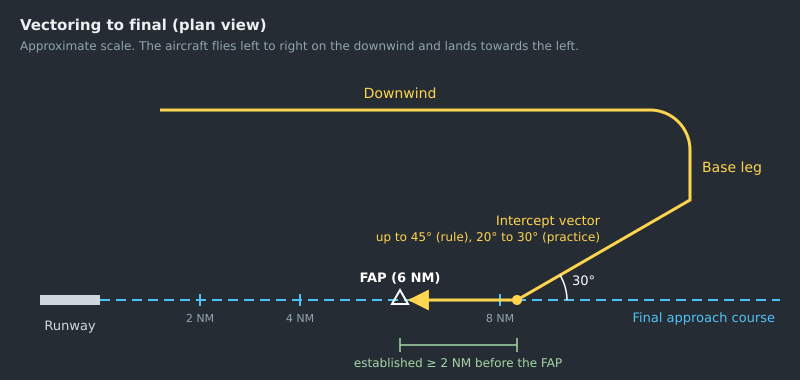
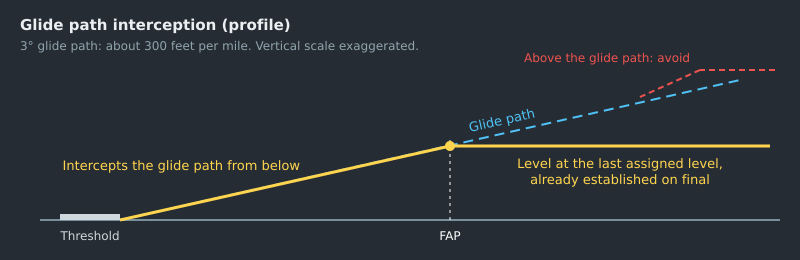

--8<-- "includes/abreviacoes.md"

# Vectoring Techniques

## Before the first vector

A good vector is planned before it is transmitted. Before any heading, answer:

1. **Where does the aircraft need to go?** A radial, an airway, the final course, a point on the STAR.
2. **What altitude is safe along the way?** Under vectoring, obstacle clearance is yours. See [Minimum vectoring altitude](01-fundamentos.en.md#minimum-vectoring-altitude).
3. **What happens if communication is lost?** A heading that points out of the airspace, or towards terrain, calls for a limit and a communication failure instruction. See [Communication failure under vectoring](#communication-failure-under-vectoring).
4. **How does vectoring end?** With the interception of a course, a "resume own navigation" or a visual approach.

## Turn geometry

!!! note "Good practice"
    This section is vectoring technique, not regulation. The numbers are approximate and are meant for planning.

An aircraft does not change heading the instant it receives the instruction. Between the transmission, the readback, the pilot's action and the turn itself, it still covers a considerable distance. For a vector to end up where you want, it has to be given **earlier**.

Jets usually limit bank to about 25°. As a result, the turn radius grows with the square of the speed:

| Ground speed | Approximate radius (25° bank) |
| --- | --- |
| 160 kt | 0.8 NM |
| 180 kt | 1.0 NM |
| 210 kt | 1.4 NM |
| 250 kt | 2.0 NM |

Two practical consequences:

- **A 90° turn "travels" about one radius** before the aircraft is on the new heading. At 250 kt, that is 2 NM. Add the reaction time, and the turn to base at 250 kt has to be given about 3 NM before the desired point.
- **Reduce speed before the final turns.** At 180 kt, the intercept turn is almost half the size of the one at 250 kt, and the error in your calculation shrinks with it. That is why the sequence on the [speed page](03-velocidade.en.md) matters.

Wind also counts. With a tailwind on the base leg, the aircraft reaches the final course sooner and tends to overshoot it. With a headwind on final, ground speed drops and the spacing between two aircraft shrinks.

## Intercepting a radial or airway

To take an aircraft to a radial, airway or course, ICA 100-37 requires a heading that intercepts the course **at a distance that ensures the interception**[^1]. In practice:

- give the purpose together with the heading: "vectoring for intercepting 154 radial of Manaus VOR";
- choose an angle that leaves room for the turn: 30° to 45° is usual, and larger angles need more distance;
- say what to do next: "after intercepting, resume own navigation direct Curitiba VOR".

> **PT MBO, radar contact, 11 miles northwest of Caxias NDB. Vectors to intercept Palegre 035 radial, turn left heading 070, climb and maintain FL 370. When intercepting, resume own navigation direct Curitiba VOR.**[^2]

## Vectoring to the final approach

This is where vectoring shows up most at an `APP` position. ICA 100-37 sets the rules:

| Rule | Source |
| --- | --- |
| Before vectoring for the approach, or at its start, inform **the type of approach and the runway**. | [^3] |
| Inform the aircraft's position **at least once** before the start of the final approach. | [^4] |
| When giving the vector that leads to final, **state the reason**: "vectoring for ILS final approach". | [^5] |
| The final vector must allow the aircraft to **become established on the final course before intercepting the glide path from below**, with an intercept angle of **45° or less**. | [^6] |
| Ask the aircraft to **report established**. The approach clearance must be issued **before** that report, unless circumstances prevent it. | [^7] |
| Once cleared for the approach, the aircraft **maintains the last assigned level** until intercepting the glide path. If you want it to intercept at a level different from the one on the IAC, instruct it to maintain that level until established. | [^8] |
| Vectoring ends when the aircraft intercepts the final course and, on an ILS, the glide path. | [^9] |

{ : style="display:block; margin:auto; border:2px solid #999" loading=lazy }

{ : style="display:block; margin:auto; border:2px solid #999" loading=lazy }

### The vectoring pattern

The most common way to bring several aircraft to final is a horseshoe pattern, similar to the traffic circuit, only larger:

1. **Downwind leg**: parallel to the final course, in the opposite direction to landing, a few miles to the side. This is where the aircraft descends and slows down.
2. **Base leg**: perpendicular to the final course. Where you turn the aircraft onto base decides the spacing with the aircraft ahead.
3. **Intercept vector**: a heading of 20° to 30° to the final course, given from base.

!!! note "Good practice"
    - Make the interception at least **2 NM before the FAP**. That way the aircraft becomes established on the course before the glide path arrives.
    - Prefer an intercept of **20° to 30°**. The regulatory limit is 45°, but large angles at high speed cause the aircraft to overshoot the course.
    - Choose the intercept altitude from the IAC. With a 3° glide path, the glide path rises about **300 ft per mile**: intercepting at 3,000 ft above the threshold corresponds to about 10 NM.
    - Give the approach clearance together with the intercept vector. If communication fails, the pilot already knows what to do.

The typical intercept vector combines the MCA 100-16 phrases[^10]:

> **TAM 3753, turn left heading 120, maintain 4,000 feet until established, cleared ILS Z approach runway 29L, report established.**

### Crossing the final course

Sometimes you need to **cross** the final course, for example to have the aircraft intercept from the other side, or to separate it from other traffic. Tell the pilot beforehand. Without the warning, the pilot may capture the localizer on their own[^11]:

> **TAM 3910, this turn will take you through the localizer due traffic.**

## Vectoring for a visual approach

Vectoring for a visual approach may begin when the **reported ceiling is above the minimum vectoring altitude** and the weather conditions allow the approach and landing to be completed visually[^12]. Take the aircraft to a position from which the pilot can see the aerodrome, such as the downwind or base leg.

The visual approach clearance may only be issued **after the pilot reports the aerodrome or the preceding aircraft in sight**. Vectoring normally ends at that moment[^13]. A visual approach does not cancel the IFR flight[^14], and ATC continues to separate the aircraft from other arrivals and departures[^15]. For successive visual approaches, see [Sequencing](04-sequenciamento.en.md#successive-visual-approaches).

> **PT IOB, expect vectoring for visual approach.**
>
> **TAM 3310, cleared visual approach runway 29L.**

## Vectors and directs on the STAR

An aircraft on a STAR already has a track and restrictions. Both a vector and a direct change that, but only the vector is vectoring. On a direct, the aircraft navigates on its own, and obstacle clearance follows the rules in [What about a direct?](01-fundamentos.en.md#what-about-a-direct):

- **Direct to a point on the same STAR**: restrictions at the points bypassed are cancelled, and those still ahead remain in force[^16].
- **Vector, or direct to a point off the STAR**: **all** level and speed restrictions of the STAR are cancelled. You must restate the cleared level, give any restrictions needed and say whether the aircraft will rejoin the STAR later[^17].
- **Altitude off the STAR**: the minimum altitudes of the STAR protect only the published track. Off it, the cleared level must respect the minimum altitude for the area. Under vectoring, that is the vectoring altitude (ATCSMAC).
- **Rejoining the STAR**: the instruction must contain the STAR (if not yet given), the cleared level and the point at which the aircraft rejoins[^18].

> **PT ASN, turn left heading 260 vectors due traffic, descend to FL 050, expect to rejoin STAR at FRANC.**
>
> **PT ASN, resume own navigation, cleared direct FRANC to rejoin DELTA 1B arrival. Descend via STAR to FL 030.**

## Weather avoidance

Warn the aircraft **in good time** when it appears about to enter an area of adverse weather, so that the pilot can decide what to do and, if desired, request guidance to avoid it[^19]. Airborne weather radar usually shows the weather better than the surveillance display[^19].

When vectoring around weather, make sure the aircraft can return to its intended track within surveillance coverage. If that is not possible, inform the pilot[^20].

> **PT JEF, vectoring for weather deviation, fly heading 270 until clear of weather, then direct Brasília VOR.**

## Vectoring VFR flights

VFR flights may also be vectored, but the controller must take care that they **do not inadvertently enter instrument meteorological conditions**[^21]. **Special VFR** flights should not be vectored, except in exceptional circumstances, such as a declared emergency[^22].

## Communication failure under vectoring

A vectored aircraft that loses communication is on a heading that only makes sense in your plan. If that heading leads out of the airspace, towards terrain or towards other traffic, **give the limit of the vector and the communication failure instruction together with it**[^23]:

> **AAL 7904, vectoring for sequencing, turn right heading 345. If radio contact lost, on crossing 060 radial of CAXIAS VOR, fly heading PORTO VOR and contact Rio Control 119.0.**
>
> **TAM 3456, vectoring for sequencing, turn left heading 285, limit three minutes to resume own navigation direct NIMTO. If radio contact lost, when established on the ILS Z, contact Brasília Tower frequency 118.10.**

If two-way communication is lost, check whether the aircraft's receiver still works. Ask for a turn, an `IDENT` or a code change and watch the screen[^24]. The manoeuvres requested must allow the aircraft to return to its cleared track after completing them[^25]. If the response comes, you may continue to control the aircraft this way[^26].

> **TAM 3702, if you read me turn 30 degrees to right.**
>
> **TAM 3702, turn observed, change to frequency 126.1.**

## In EuroScope

- **Enter every heading on the tag.** The heading field records what was cleared and shows it to the other controllers. See [Using EuroScope](../../../fundamentos/softwares/euroscope/utilizacao.en.md).
- **Use the speed vector.** The line projecting the future position shows where the current heading is taking the aircraft and when it will cross the final course.
- **Measure before turning.** `F1 + D` (`.distance`) gives the continuous distance to a point or another aircraft. `F1 + S` (`.sep`) predicts the minimum distance between two aircraft. See [Commands](../../../fundamentos/softwares/euroscope/comandos.en.md).

[^1]: **ICA 100-37, Art. 930, item III**. See [ICA 100-37](https://publicacoes.decea.mil.br/publicacao/ica-100-37).
[^2]: **MCA 100-16, Art. 173**. See [MCA 100-16](https://publicacoes.decea.mil.br/publicacao/MCA-100-16).
[^3]: **ICA 100-37, Art. 997**.
[^4]: **ICA 100-37, Art. 998**.
[^5]: **ICA 100-37, Art. 1002**.
[^6]: **ICA 100-37, Art. 1001, sole paragraph**.
[^7]: **ICA 100-37, Art. 1003 and § 1°**.
[^8]: **ICA 100-37, Art. 1004 and sole paragraph**.
[^9]: **ICA 100-37, Arts. 1003, § 2°, and 1008**.
[^10]: **MCA 100-16, Arts. 117 and 175**.
[^11]: **MCA 100-16, Arts. 175 and 176**.
[^12]: **ICA 100-37, Art. 1009**.
[^13]: **ICA 100-37, Art. 1010**.
[^14]: **ICA 100-37, Art. 458**.
[^15]: **ICA 100-37, Art. 453**.
[^16]: **MCA 100-16, Art. 115, item VIII**.
[^17]: **MCA 100-16, Art. 115, item IX**.
[^18]: **MCA 100-16, Art. 115, item X**.
[^19]: **ICA 100-37, Art. 941 and §§ 1° and 2°**.
[^20]: **ICA 100-37, Art. 942**.
[^21]: **ICA 100-37, Art. 1026**.
[^22]: **ICA 100-37, Arts. 494 and 1025**.
[^23]: **ICA 100-37, Art. 927**; **MCA 100-16, Arts. 172 and 178**.
[^24]: **ICA 100-37, Art. 984**.
[^25]: **ICA 100-37, Art. 986**.
[^26]: **ICA 100-37, Art. 987**; **MCA 100-16, Art. 177**.
