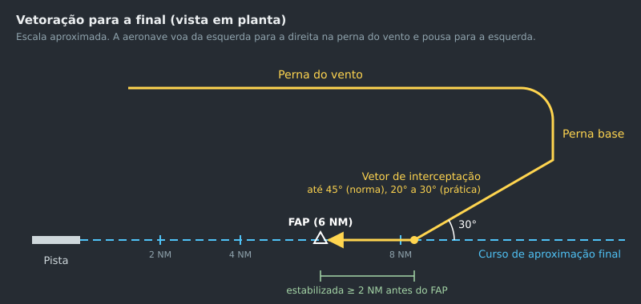
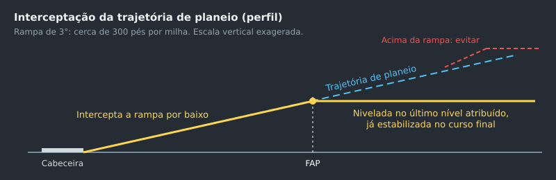

--8<-- "includes/abreviacoes.md"

#

## Antes do primeiro vetor

Um vetor bom é planejado antes de ser transmitido. Antes de qualquer proa, responda:

1. **Para onde a aeronave precisa ir?** Uma radial, uma aerovia, o curso final, um ponto da STAR.
2. **Qual altitude é segura no caminho?** Sob vetoração, a separação de obstáculos é sua. Veja [Altitude mínima de vetoração](01-fundamentos.pt.md#altitude-minima-de-vetoracao).
3. **O que acontece se a comunicação cair?** Uma proa que aponta para fora do espaço aéreo, ou para o terreno, pede um limite e uma instrução de falha de comunicação. Veja [Falha de comunicação sob vetoração](#falha-de-comunicacao-sob-vetoracao).
4. **Como a vetoração termina?** Com a interceptação de um curso, um "reassuma navegação" ou uma aproximação visual.

## Geometria da curva

!!! note "Boa prática"
    Esta seção é técnica de vetoração, não norma. Os números são aproximados e servem para planejar.

Uma aeronave não muda de proa no instante em que recebe a instrução. Entre a transmissão, o cotejamento, a ação do piloto e a curva em si, ela ainda percorre uma distância considerável. Para um vetor chegar onde você quer, ele precisa ser dado **antes**.

Jatos costumam limitar a inclinação a cerca de 25°. Com isso, o raio da curva cresce com o quadrado da velocidade:

| Velocidade em relação ao solo | Raio aproximado (25° de inclinação) |
| --- | --- |
| 160 kt | 0,8 NM |
| 180 kt | 1,0 NM |
| 210 kt | 1,4 NM |
| 250 kt | 2,0 NM |

Duas consequências práticas:

- **Uma curva de 90° "anda" cerca de um raio** antes de a aeronave estar na proa nova. A 250 kt, isso dá 2 NM. Some o tempo de reação, e a curva para a base a 250 kt precisa ser dada uns 3 NM antes do ponto desejado.
- **Reduza a velocidade antes das curvas finais.** A 180 kt, a curva de interceptação é quase metade da de 250 kt, e o erro de cálculo diminui junto. Por isso a sequência da [página de velocidade](03-velocidade.pt.md) importa.

O vento também conta. Com vento de cauda na perna base, a aeronave chega ao curso final mais rápido e tende a ultrapassá-lo. Com vento de proa na final, a velocidade em relação ao solo cai, e o espaçamento entre duas aeronaves encolhe.

## Interceptar uma radial ou aerovia

Para levar uma aeronave a uma radial, aerovia ou curso, a ICA 100-37 exige uma proa que intercepte o curso **a uma distância que garanta a interceptação**[^1]. Na prática:

- dê o objetivo junto com a proa: "vetoração para interceptar radial 154 do VOR Manaus";
- escolha um ângulo que deixe espaço para a curva: entre 30° e 45° é o habitual, e ângulos maiores pedem mais distância;
- diga o que fazer depois: "ao interceptar, reassuma a navegação direto VOR Curitiba".

> **PT MBO, contato radar, 11 milhas noroeste do NDB Caxias. Vetoração para interceptar radial 035 VOR Palegre, curva à esquerda proa 070, suba e mantenha FL 370. Ao interceptar, reassuma a navegação direto VOR Curitiba.**[^2]

## Vetoração para a aproximação final

É aqui que a vetoração mais aparece numa posição de `APP`. A ICA 100-37 fixa as regras:

| Regra | Fonte |
| --- | --- |
| Antes de vetorar para a aproximação, ou no início, informe **o tipo de aproximação e a pista**. | [^3] |
| Informe a posição da aeronave **pelo menos uma vez** antes do início da aproximação final. | [^4] |
| Ao dar o vetor que leva à final, **informe a razão**: "vetoração para final ILS". | [^5] |
| O vetor final deve permitir que a aeronave se **estabilize no curso final antes de interceptar a rampa, por baixo**, com ângulo de interceptação de **45° ou menos**. | [^6] |
| Peça à aeronave que **reporte estabilizada**. A autorização para a aproximação deve ser emitida **antes** desse reporte, salvo se as circunstâncias impedirem. | [^7] |
| Autorizada a aproximação, a aeronave **mantém o último nível atribuído** até interceptar a rampa. Se você quiser que ela intercepte num nível diferente do da IAC, instrua-a a manter esse nível até estabilizada. | [^8] |
| A vetoração termina quando a aeronave intercepta o curso final e, no ILS, a rampa. | [^9] |

{ : style="display:block; margin:auto; border:2px solid #999" loading=lazy }

{ : style="display:block; margin:auto; border:2px solid #999" loading=lazy }

### O padrão de vetoração

A forma mais comum de levar várias aeronaves à final é um circuito em ferradura, semelhante ao circuito de tráfego, só que maior:

1. **Perna do vento**: paralela ao curso final, no sentido oposto ao do pouso, a algumas milhas de distância lateral. É onde a aeronave desce e reduz a velocidade.
2. **Perna base**: perpendicular ao curso final. A posição da curva para a base decide o espaçamento com a aeronave da frente.
3. **Vetor de interceptação**: uma proa de 20° a 30° em relação ao curso final, dada a partir da base.

!!! note "Boa prática"
    - Faça a interceptação pelo menos **2 NM antes do FAP**. Assim a aeronave estabiliza no curso antes de a rampa chegar.
    - Prefira **20° a 30°** de interceptação. O limite normativo é 45°, mas ângulos grandes, a velocidades altas, produzem ultrapassagem do curso.
    - Escolha a altitude de interceptação na IAC. Com uma rampa de 3°, a trajetória de planeio sobe cerca de **300 pés por milha**: interceptar a 3.000 pés acima da cabeceira corresponde a cerca de 10 NM.
    - Dê a autorização de aproximação junto com o vetor de interceptação. Se a comunicação falhar, o piloto já sabe o que fazer.

O vetor de interceptação típico combina as frases do MCA 100-16[^10]:

> **TAM 3753, curva à esquerda proa 120, mantenha 4.000 pés até estabilizado, autorizado aproximação ILS Z pista 29L, reporte estabilizado.**

### Cruzar o curso final

Às vezes é preciso **cruzar** o curso final, por exemplo para fazer a aeronave interceptar pelo outro lado, ou para separá-la de outro tráfego. Avise o piloto antes. Sem o aviso, ele pode capturar o localizador por conta própria[^11]:

> **TAM 3910, esta curva o fará cruzar o localizador, devido tráfego.**

## Vetoração para aproximação visual

A vetoração para uma aproximação visual pode começar quando o **teto informado estiver acima da altitude mínima de vetoração** e as condições meteorológicas permitirem completar a aproximação e o pouso em condições visuais[^12]. Leve a aeronave a uma posição de onde o piloto possa ver o aeródromo, como a perna do vento ou a base.

A autorização para a aproximação visual só pode ser emitida **depois que o piloto informar que avista o aeródromo ou a aeronave precedente**. A vetoração normalmente termina nesse momento[^13]. A aproximação visual não cancela o voo IFR[^14], e o controle continua separando a aeronave das demais chegadas e partidas[^15]. Para aproximações visuais em sequência, veja [Sequenciamento](04-sequenciamento.pt.md#aproximacoes-visuais-em-sequencia).

> **PT IOB, aguarde vetoração para aproximação visual.**
>
> **TAM 3310, autorizado aproximação visual pista 29L.**

## Vetorar uma aeronave na STAR

Uma aeronave numa STAR já tem trajetória e restrições. Vetorá-la muda isso:

- **Direto para um ponto da própria STAR**: as restrições dos pontos ultrapassados ficam canceladas, e as que ainda faltam continuam valendo[^16].
- **Vetor, ou direto para um ponto fora da STAR**: **todas** as restrições de nível e de velocidade da STAR ficam canceladas. Você precisa reiterar o nível autorizado, dar as restrições que forem necessárias e avisar se a aeronave vai voltar à STAR depois[^17].
- **Voltar à STAR**: a instrução precisa conter a STAR (se ainda não tiver sido informada), o nível autorizado e o ponto em que a aeronave reingressa[^18].

> **PT ASN, curva à esquerda proa 260, vetoração devido a tráfego, desça para FL 050, previsto reingressar na STAR em FRANC.**
>
> **PT ASN, reassuma navegação, autorizado direto FRANC para reingressar na chegada DELTA 1B. Desça via STAR para FL 030.**

## Desvio de meteorologia

Avise a aeronave **com antecedência** quando ela parecer prestes a entrar numa área de condições meteorológicas adversas, para que o piloto decida o que fazer e, se quiser, peça orientação para evitá-la[^19]. O radar meteorológico de bordo costuma mostrar a formação melhor do que a tela de vigilância[^19].

Ao vetorar para desviar de uma formação, garanta que a aeronave consiga voltar à trajetória prevista dentro da cobertura de vigilância. Se não for possível, informe o piloto[^20].

> **PT JEF, vetoração para desvio de formação, voe proa 270 até livrar formações, após direto VOR Brasília.**

## Vetoração de voos VFR

Voos VFR também podem ser vetorados, mas o controlador precisa tomar cuidado para que eles **não entrem inadvertidamente em condições meteorológicas por instrumentos**[^21]. Voos **VFR Especiais** não devem ser vetorados, exceto em circunstâncias excepcionais, como uma emergência declarada[^22].

## Falha de comunicação sob vetoração

Uma aeronave vetorada que perde a comunicação está numa proa que só faz sentido no seu plano. Se essa proa levar para fora do espaço aéreo, para o terreno ou para outro tráfego, **dê o limite do vetor e a instrução de falha de comunicação junto com ele**[^23]:

> **AAL 7904, vetoração para sequenciamento, curva à direita proa 345. Em caso de falha de comunicações, ao cruzar a radial 060 do VOR CAXIAS, voe na proa do VOR PORTO e chame o Controle Rio em 119,0.**
>
> **TAM 3456, vetoração para sequenciamento, curva à esquerda proa 285, limite três minutos para reassumir a navegação direto NIMTO. Em caso de falha de comunicações, ao estabilizar no ILS Z, chame Torre Brasília frequência 118,10.**

Se a comunicação bilateral for perdida, verifique se o receptor da aeronave ainda funciona. Peça uma curva, um `IDENT` ou uma mudança de código e observe na tela[^24]. As manobras pedidas devem permitir que a aeronave volte à trajetória autorizada depois de cumpri-las[^25]. Se a resposta vier, você pode continuar controlando a aeronave dessa forma[^26].

> **TAM 3702, caso esteja me ouvindo, curve 30 graus à direita.**
>
> **TAM 3702, curva observada, troque para frequência 126,1.**

## No EuroScope

- **Lance cada proa na etiqueta.** O campo de proa registra o que foi autorizado e o mostra aos outros controladores. Veja [Utilização do EuroScope](../../../fundamentos/softwares/euroscope/utilizacao.pt.md).
- **Use o vetor de velocidade.** A linha que projeta a posição futura mostra para onde a proa atual está levando a aeronave e quando ela vai cruzar o curso final.
- **Meça antes de girar.** `F1 + D` (`.distance`) dá a distância contínua até um ponto ou outra aeronave. `F1 + S` (`.sep`) prevê a menor distância entre dois tráfegos. Veja [Comandos](../../../fundamentos/softwares/euroscope/comandos.pt.md).

[^1]: **ICA 100-37, Art. 930, inciso III**. Ver [ICA 100-37](https://publicacoes.decea.mil.br/publicacao/ica-100-37).
[^2]: **MCA 100-16, Art. 173**. Ver [MCA 100-16](https://publicacoes.decea.mil.br/publicacao/MCA-100-16).
[^3]: **ICA 100-37, Art. 997**.
[^4]: **ICA 100-37, Art. 998**.
[^5]: **ICA 100-37, Art. 1002**.
[^6]: **ICA 100-37, Art. 1001, parágrafo único**.
[^7]: **ICA 100-37, Art. 1003 e § 1°**.
[^8]: **ICA 100-37, Art. 1004 e parágrafo único**.
[^9]: **ICA 100-37, Arts. 1003, § 2°, e 1008**.
[^10]: **MCA 100-16, Arts. 117 e 175**.
[^11]: **MCA 100-16, Arts. 175 e 176**.
[^12]: **ICA 100-37, Art. 1009**.
[^13]: **ICA 100-37, Art. 1010**.
[^14]: **ICA 100-37, Art. 458**.
[^15]: **ICA 100-37, Art. 453**.
[^16]: **MCA 100-16, Art. 115, inciso VIII**.
[^17]: **MCA 100-16, Art. 115, inciso IX**.
[^18]: **MCA 100-16, Art. 115, inciso X**.
[^19]: **ICA 100-37, Art. 941 e §§ 1° e 2°**.
[^20]: **ICA 100-37, Art. 942**.
[^21]: **ICA 100-37, Art. 1026**.
[^22]: **ICA 100-37, Arts. 494 e 1025**.
[^23]: **ICA 100-37, Art. 927**; **MCA 100-16, Arts. 172 e 178**.
[^24]: **ICA 100-37, Art. 984**.
[^25]: **ICA 100-37, Art. 986**.
[^26]: **ICA 100-37, Art. 987**; **MCA 100-16, Art. 177**.
