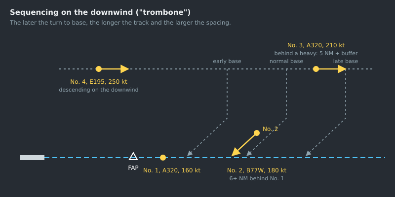

--8<-- "includes/abreviacoes.md"

#

## The goal

Sequencing means putting arrivals **in line on final, each one at the minimum distance from the previous one, with the least possible delay**. ICA 100-37 sets the criterion: the sequence is determined so as to "facilitate the arrival of the greatest number of aircraft with the least average delay"[^1].

This does not require following the order of arrival. It is usually the best sequence, but not always. A fast aircraft behind a slow one, or a light one behind a heavy one, may give a better sequence if they swap places.

## Priorities

Two situations jump the queue. The aircraft receives **special priority** when[^2]:

1. it needs to land for a reason affecting its safety, such as engine failure or fuel shortage;
2. it is carrying, or will carry, a sick or seriously injured person requiring urgent medical assistance, or an organ for transplant.

If an aircraft in the sequence reports that it **prefers to hold**, because of the weather or for another reason, approve it. Send it to another holding point, or place it at the **top of the stack**, so that the other holding aircraft can land[^3]. Also take into account the delay the aircraft has already absorbed en route by flying at reduced speed[^4].

## Planning the sequence

A sequence is decided **early**. The farther the aircraft is from final, the cheaper it is to correct the spacing. A few minutes in advance, speed solves what, at 10 NM from the runway, could only be solved with an orbit.

!!! note "Good practice"
    1. **Build the line** as soon as the aircraft enter the TMA, or earlier, from the arrivals list. Order it by estimated time at final, not by straight-line distance.
    2. **Identify the order conflicts**: two aircraft that would reach final at the same time, a fast one behind a slow one, a light one right behind a heavy one.
    3. **Decide the order and communicate it.** Tell each aircraft its position in the sequence and inform the tower of the sequence[^5].
    4. **Set the target spacing** for each pair, as shown below.
    5. **Apply the tools in order of cost**, from the cheapest to the most expensive.

### Target spacing

The minimum for each pair is **the greater** of the radar minimum (5 NM) and the wake turbulence minimum (see the [wake turbulence table](01-fundamentos.en.md#wake-turbulence)). But aiming at exactly the minimum at the moment of interception guarantees an infringement further along, because of compression.

**Compression** is the shrinking of the spacing on final. The aircraft ahead slows to approach speed before the one behind, and the one behind stays a little faster until it slows down too. With a headwind, the effect increases, because the ground speed of the aircraft that is already low and slow drops further.

!!! note "Good practice"
    Add a margin of **1 to 2 NM** to the pair's minimum at the moment of interception. Increase the margin with a strong headwind on final, or when the aircraft behind is faster.

    | Pair (leading → following) | Minimum | Target at interception |
    | --- | --- | --- |
    | `M` → `M` | 5 NM | 6 to 7 NM |
    | `H` → `M` | 5 NM (wake) | 6 to 7 NM |
    | `H` → `L` | 6 NM (wake) | 7 to 8 NM |
    | `M` → `L` | 5 NM (wake) | 6 to 7 NM |
    | `J` → `M` | 7 NM (wake) | 8 to 9 NM |

## The tools, in order of cost

### 1. Speed

This is the first choice: invisible to the pilot, it does not lengthen the track and takes no one off the procedure. Slow down the one behind or speed up the one ahead[^6]. It works best far from the runway and above FL 100, where the speed margin is greater. See [Speed Control](03-velocidade.en.md).

### 2. Shortening the track of the leading aircraft

A direct to a point further along the STAR, or an early base turn, moves the leading aircraft forward and opens space for the one behind. Use it when the leading aircraft is clearly in the right position in the line.

### 3. Lengthening the track: the downwind leg ("trombone")

The downwind leg is a ruler: the later you turn the aircraft onto base, the longer the track and the greater the spacing with the aircraft ahead. Its advantages are that it is continuous (you adjust minute by minute, deciding only when to give the base turn) and that it keeps aircraft in a predictable flow.

{ : style="display:block; margin:auto; border:2px solid #999" loading=lazy }

To delay an aircraft before the downwind leg, use a vector away with the stated purpose: "vectoring for delay" or "for sequencing"[^7].

> **PT EGR, vectoring for sequencing, turn right heading 060, descend to FL 190.**
>
> **TAM 3616, for sequencing, you will be vectored via south sector of Piraí VOR.**

### 4. Orbit

A 360° turn delays the aircraft by about 2 to 3 minutes. It is useful to absorb a small, isolated delay, but it has costs: the aircraft leaves the flow, the turn takes up lateral space, and during the turn the heading passes through every direction. Only use it away from other traffic, never on or near final, and preferably with a clear purpose[^8]:

> **PT SLB, vectoring, make a three sixty turn left for crossing BUENO at or below FL 240.**

### 5. Holding

When the delay exceeds a few minutes, or when there are more aircraft than the downwind leg can take, use holding. It is the end of the line, not the first option.

| Rule | Source |
| --- | --- |
| Use the published holding procedures. With no published procedure, or if the pilot does not know it, describe the procedure to be followed. | [^9] |
| The **first** aircraft to arrive takes the **lowest level**, and the following ones successively higher levels. | [^10] |
| Aircraft holding over the same fix are separated **vertically**: the radar minimum does not apply between them. | [^11] |
| Maintain vertical separation between the holding pattern and en-route traffic within **5 minutes** of flight from the holding area, unless there is lateral separation. | [^12] |
| Do **not** apply speed control to aircraft entering or established in a holding pattern. | [^13] |
| In the holding pattern, level changes are made at a rate of **500 to 1,000 ft per minute**, unless otherwise instructed. | [^14] |

The maximum holding speeds are[^15]:

| Level | Normal conditions | Turbulence |
| --- | --- | --- |
| Up to 14,000 ft | 230 kt (170 kt for categories A and B) | 280 kt (170 kt for categories A and B) |
| Above 14,000 up to 20,000 ft | 240 kt | 280 kt or Mach 0.8, whichever is lower |
| Above 20,000 up to 34,000 ft | 265 kt | 280 kt or Mach 0.8, whichever is lower |
| Above 34,000 ft | Mach 0.83 | Mach 0.83 |

The outbound leg lasts **1 minute** at or below 14,000 ft, and **1 minute 30 seconds** above that[^16].

#### Expected approach time

Every arriving aircraft that will hold receives an **expected approach time** from the APP, preferably **before starting descent** from cruising level[^17]. If the estimate changes by **5 minutes or more**, transmit the revised time[^17]. With an expected hold of **30 minutes or more**, transmit the time by the fastest means[^18]. Also state the holding point the time refers to, if it is not obvious to the pilot[^19].

> **GLO 1840, maintain holding pattern over Vitória VOR, at FL 040.**
>
> **TAM 3304, hold over NEROK as published, maintain FL 080, delay not determined due traffic.**
>
> **PT MKO, standard holding procedure, expect further clearance at 1645.**

To take an aircraft out of the hold, vector it from the fix to the downwind or base leg, or clear it for the published procedure. In procedural control, the next aircraft is only cleared for the approach when the previous one reports that it can complete it visually, or when it is in contact with the tower and in sight of it[^20].

## On final

### Separation until the tower

Until the transfer, **the APP is responsible for separation** between successive aircraft on the same final[^21]. That responsibility only passes to the tower if the local procedure provides for it and the tower has surveillance.

Transfer communication to the tower **at a point where the landing clearance, or another instruction, can still be given in time**[^22], with essential traffic information, if any[^23]. Inform the tower of the sequence and of any instruction or restriction given to the aircraft, so that it can maintain separation after the transfer[^5].

!!! note "Good practice"
    Transfer the aircraft as soon as it is established on the final course and clear of conflicts, and before the FAP. An aircraft transferred at 3 NM from the runway leaves the tower no time to plan a departure between two arrivals.

### Successive visual approaches

On a visual approach, separation may pass to the pilot. Until the following aircraft reports **the preceding one in sight**, separation remains with ATC. From then on, instruct it to **follow and maintain own separation** from the preceding aircraft[^24].

Wake turbulence calls for special attention in this case. Wake turbulence separation is no longer required of ATC when the following aircraft is making a visual approach, has the preceding one in sight and has been instructed to follow it maintaining own separation[^25]. Even so, you must **issue a caution of possible wake turbulence** whenever both are `H` or `J`, or the preceding one is in a heavier category, and the distance is less than the wake turbulence minimum[^26]. It is up to the pilot of the following aircraft to decide whether the spacing is acceptable and to request more if needed[^27].

> **PUA 646, cleared visual approach runway 35, maintain own separation from preceding B747, caution wake turbulence.**

### Missed approach

A missed approach comes back to you. It follows the published missed approach on the IAC, or ATC instructions[^28]. Prepare a place for it in the sequence beforehand: usually back on the downwind leg, at the end of the line or in the first available gap.

## Example

Four arrivals for runway 29L, with calm wind:

| Aircraft | Wake | Initial situation |
| --- | --- | --- |
| GLO 1840 | `M` (B738) | On the downwind leg, 12 NM ahead of the others |
| TAM 3502 | `H` (B77W) | Entering the downwind leg |
| AZU 4512 | `M` (A20N) | 3 NM behind the TAM, faster |
| PTB 2231 | `L` (C208) | Arriving from another sector, slow |

Plan:

1. **GLO 1840** is number 1. Normal base, intercept vector at 180 kt and transfer to the tower once established.
2. **TAM 3502** is number 2. It comes 6 to 7 NM behind the GLO, since under the `M → H` rule only the radar minimum applies. Slow it to 210 kt on the downwind leg.
3. **AZU 4512** is 3 NM behind the TAM and faster. It needs 5 NM from the heavy for wake turbulence, plus the margin, so 6 to 7 NM. **Slow it first** to 210 kt and extend its downwind leg until the distance reaches the target, before giving the base turn.
4. **PTB 2231** is slow. Putting it **between** two jets would delay the jet behind for the whole final. There are two options: put it ahead of everyone, if it reaches final before the GLO, or leave it last. As last, it needs 5 NM from the AZU for wake turbulence (`M → L`). Since it is slower, the distance tends to grow, not shrink. Either way, decide early and inform the pilot.

[^1]: **ICA 100-37, Art. 461**. See [ICA 100-37](https://publicacoes.decea.mil.br/publicacao/ica-100-37).
[^2]: **ICA 100-37, Art. 462**.
[^3]: **ICA 100-37, Art. 464 and §§ 1° and 2°**.
[^4]: **ICA 100-37, Art. 465**.
[^5]: **ICA 100-37, Art. 996**.
[^6]: **ICA 100-37, Art. 234**.
[^7]: **MCA 100-16, Arts. 172 and 174**. See [MCA 100-16](https://publicacoes.decea.mil.br/publicacao/MCA-100-16).
[^8]: **MCA 100-16, Art. 181**.
[^9]: **ICA 100-37, Art. 253 and sole paragraph**.
[^10]: **ICA 100-37, Art. 256 and sole paragraph**.
[^11]: **ICA 100-37, Arts. 254 and 952**.
[^12]: **ICA 100-37, Art. 255**.
[^13]: **ICA 100-37, Art. 228**.
[^14]: **ICA 100-37, Art. 265**.
[^15]: **ICA 100-37, Art. 260, Table 1**.
[^16]: **ICA 100-37, Art. 262**.
[^17]: **ICA 100-37, Art. 466 and §§ 1° and 3°**.
[^18]: **ICA 100-37, Art. 467**.
[^19]: **ICA 100-37, Art. 468**.
[^20]: **ICA 100-37, Art. 463**.
[^21]: **ICA 100-37, Art. 1005**.
[^22]: **ICA 100-37, Art. 1007**.
[^23]: **ICA 100-37, Art. 457**.
[^24]: **ICA 100-37, Art. 454 and sole paragraph**.
[^25]: **ICA 100-37, Art. 213, item II**.
[^26]: **ICA 100-37, Arts. 214 and 455**.
[^27]: **ICA 100-37, Art. 456 and sole paragraph**.
[^28]: **ICA 100-37, Art. 488**.
