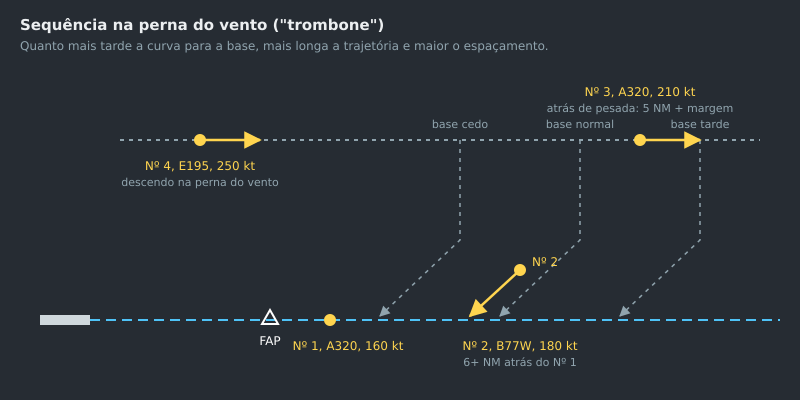

--8<-- "includes/abreviacoes.md"

# Sequenciamento

## O objetivo

Sequenciar é pôr as chegadas **em fila na final, cada uma à distância mínima da anterior, com o menor atraso possível**. A ICA 100-37 define o critério: a sequência é determinada de modo a "facilitar a chegada do maior número de aeronaves, com um mínimo de demora média"[^1].

Isso não obriga a seguir a ordem de chegada. Normalmente ela é a melhor sequência, mas nem sempre. Uma aeronave rápida atrás de uma lenta, ou uma leve atrás de uma pesada, pode render uma sequência melhor se trocar de posição.

## Prioridades

Duas situações furam a fila. A aeronave recebe **prioridade especial** quando[^2]:

1. precisa pousar por causa que afeta sua segurança, como falha de motor ou falta de combustível;
2. transporta, ou vai transportar, enfermo ou ferido em estado grave que precise de assistência médica urgente, ou órgão para transplante.

Se uma aeronave da sequência avisar que **prefere esperar**, por causa da meteorologia ou de outro motivo, autorize. Mande-a para outro ponto de espera, ou coloque-a no **topo da sequência**, para que as demais aeronaves em espera possam pousar[^3]. Também considere o tempo de atraso que a aeronave já absorveu em rota, voando com velocidade reduzida[^4].

## Planejar a sequência

Uma sequência se decide **cedo**. Quanto mais longe a aeronave estiver da final, mais barato é corrigir o espaçamento. Alguns minutos de antecedência resolvem com velocidade o que, a 10 NM da pista, só se resolveria com uma órbita.

!!! note "Boa prática"
    1. **Monte a fila** assim que as aeronaves entrarem na TMA, ou antes, pela lista de chegadas. Ordene pelo horário estimado de chegada à final, não pela distância em linha reta.
    2. **Identifique os conflitos de ordem**: duas aeronaves que chegariam à final ao mesmo tempo, uma rápida atrás de uma lenta, uma leve logo atrás de uma pesada.
    3. **Decida a ordem e comunique.** Diga à aeronave em que posição ela está e informe a sequência à torre[^5].
    4. **Defina o espaçamento-alvo** de cada par, como mostrado abaixo.
    5. **Aplique as ferramentas em ordem de custo**, da mais barata para a mais cara.

### Espaçamento-alvo

O mínimo de cada par é **o maior** entre a mínima radar (5 NM) e a de esteira de turbulência (veja a [tabela de esteira](01-fundamentos.pt.md#esteira-de-turbulencia)). Mas mirar exatamente no mínimo, no momento da interceptação, garante uma violação mais adiante, por causa da compressão.

**Compressão** é o encolhimento do espaçamento na final. A aeronave da frente reduz para a velocidade de aproximação antes da de trás, e a de trás continua um pouco mais rápida até reduzir também. Com vento de proa, o efeito aumenta, porque a velocidade em relação ao solo de quem já está baixo e lento cai mais.

!!! note "Boa prática"
    Some uma margem de **1 a 2 NM** ao mínimo do par no momento da interceptação. Aumente a margem com vento de proa forte na final, ou quando a aeronave de trás for mais rápida.

    | Par (frente → trás) | Mínimo | Alvo na interceptação |
    | --- | --- | --- |
    | `M` → `M` | 5 NM | 6 a 7 NM |
    | `H` → `M` | 5 NM (esteira) | 6 a 7 NM |
    | `H` → `L` | 6 NM (esteira) | 7 a 8 NM |
    | `M` → `L` | 5 NM (esteira) | 6 a 7 NM |
    | `J` → `M` | 7 NM (esteira) | 8 a 9 NM |

## As ferramentas, em ordem de custo

### 1. Velocidade

É a primeira escolha: invisível para o piloto, sem alongar a trajetória e sem tirar ninguém do procedimento. Reduza a de trás ou acelere a da frente[^6]. Funciona melhor longe da pista e acima do FL 100, onde a margem de velocidade é maior. Veja [Ajuste de Velocidade](03-velocidade.pt.md).

### 2. Encurtar a trajetória do primeiro

Um direto para um ponto mais adiante na STAR, ou uma base antecipada, adianta a aeronave da frente e abre espaço para a de trás. Use quando a aeronave da frente estiver claramente na posição certa da fila.

### 3. Alongar a trajetória: a perna do vento ("trombone")

A perna do vento é uma régua: quanto mais tarde você vira a aeronave para a base, mais longa fica a trajetória e maior o espaçamento com a aeronave da frente. Tem a vantagem de ser contínua (você ajusta minuto a minuto, só decidindo quando dar a base) e de manter as aeronaves num fluxo previsível.

{ : style="display:block; margin:auto; border:2px solid #999" loading=lazy }

Para atrasar uma aeronave antes da perna do vento, use um vetor de afastamento com o objetivo declarado: "vetoração para atraso" ou "para sequenciamento"[^7].

> **PT EGR, vetoração para sequenciamento, curva à direita proa 060, desça para FL 190.**
>
> **TAM 3616, para sequenciamento de tráfego, será vetorado via setor sul do VOR Piraí.**

### 4. Órbita

Uma curva de 360° atrasa a aeronave cerca de 2 a 3 minutos. É útil para absorver um atraso pequeno e isolado, mas tem custos: a aeronave sai do fluxo, a curva ocupa espaço lateral, e durante a curva a proa passa por todas as direções. Só use longe de outros tráfegos, nunca na final ou perto dela, e de preferência com um objetivo claro[^8]:

> **PT SLB, vetoração, faça curva de três meia zero graus pela esquerda, para cruzar BUENO no FL 240 ou abaixo.**

### 5. Espera

Quando o atraso passa de alguns minutos, ou quando há mais aeronaves do que a perna do vento comporta, use a espera. Ela é o fim da fila, não a primeira opção.

| Regra | Fonte |
| --- | --- |
| Use os procedimentos de espera publicados. Sem procedimento publicado, ou se o piloto não o conhecer, descreva o procedimento a seguir. | [^9] |
| A **primeira** aeronave a chegar ocupa o **nível mais baixo**, e as seguintes os níveis sucessivamente mais altos. | [^10] |
| Aeronaves em espera sobre o mesmo fixo são separadas **verticalmente**: a mínima radar não se aplica entre elas. | [^11] |
| Mantenha a separação vertical entre a espera e o tráfego em rota a até **5 minutos** de voo da área de espera, salvo separação lateral. | [^12] |
| **Não** aplique ajuste de velocidade a aeronave entrando ou voando em espera. | [^13] |
| Na espera, as mudanças de nível são feitas a uma razão de **500 a 1.000 pés por minuto**, salvo outra instrução. | [^14] |

As velocidades máximas na espera são[^15]:

| Nível | Condições normais | Turbulência |
| --- | --- | --- |
| Até 14.000 pés | 230 kt (170 kt para as categorias A e B) | 280 kt (170 kt para as categorias A e B) |
| Acima de 14.000 até 20.000 pés | 240 kt | 280 kt ou Mach 0,8, o que for menor |
| Acima de 20.000 até 34.000 pés | 265 kt | 280 kt ou Mach 0,8, o que for menor |
| Acima de 34.000 pés | Mach 0,83 | Mach 0,83 |

A perna de afastamento dura **1 minuto** até 14.000 pés, inclusive, e **1 minuto e 30 segundos** acima disso[^16].

#### Hora estimada de aproximação

Toda aeronave que chega e vai esperar recebe do APP uma **hora estimada de aproximação**, de preferência **antes de iniciar a descida** do nível de cruzeiro[^17]. Se o estimado mudar em **5 minutos ou mais**, transmita a hora corrigida[^17]. Com espera prevista de **30 minutos ou mais**, transmita a hora pelo meio mais rápido[^18]. Informe também o ponto de espera ao qual a hora se refere, se não for óbvio para o piloto[^19].

> **GLO 1840, mantenha espera sobre VOR Vitória, no FL 040.**
>
> **TAM 3304, espera em NEROK conforme procedimento publicado, mantenha FL 080, atraso não determinado devido a tráfego.**
>
> **PT MKO, procedimento de espera padrão, aguarde nova autorização às 1645.**

Para tirar uma aeronave da espera, vetore-a a partir do fixo para a perna do vento ou para a base, ou autorize o procedimento publicado. No controle sem vigilância, a aeronave seguinte só é autorizada para a aproximação quando a anterior informar que pode completá-la em condições visuais, ou quando estiver em contato com a torre e à vista dela[^20].

## Na final

### Separação até a torre

Até a transferência, **o APP é responsável pela separação** entre aeronaves sucessivas na mesma final[^21]. Essa responsabilidade só passa para a torre se o procedimento local previr e a torre dispuser de vigilância.

Transfira a comunicação para a torre **num ponto em que a autorização de pouso, ou outra instrução, ainda possa ser dada a tempo**[^22], com a informação de tráfego essencial, se houver[^23]. Informe a torre da sequência e de qualquer instrução ou restrição dada às aeronaves, para que ela mantenha a separação depois da transferência[^5].

!!! note "Boa prática"
    Transfira a aeronave assim que ela estiver estabilizada no curso final e livre de conflitos, e antes do FAP. Uma aeronave transferida a 3 NM da pista deixa a torre sem tempo para planejar uma decolagem entre duas chegadas.

### Aproximações visuais em sequência

Na aproximação visual, a separação pode passar para o piloto. Até que a aeronave de trás informe **ter a da frente à vista**, a separação continua com o controle. A partir daí, instrua-a a **seguir e manter a própria separação** da aeronave da frente[^24].

A esteira de turbulência pede atenção especial nesse caso. A separação por esteira deixa de ser obrigatória para o controle quando a aeronave de trás faz uma aproximação visual, avistou a da frente e foi instruída a segui-la mantendo a própria separação[^25]. Mesmo assim, você deve **emitir o aviso de possível esteira de turbulência** sempre que as duas forem `H` ou `J`, ou a da frente for de categoria mais pesada, e a distância for menor que a mínima de esteira[^26]. Cabe ao piloto de trás decidir se o espaçamento é aceitável e pedir mais, se necessário[^27].

> **PUA 646, autorizado aproximação visual pista 35, mantenha própria separação do B747 precedente, atenção esteira de turbulência.**

### Arremetida

Uma arremetida volta para você. Ela segue a aproximação perdida publicada na IAC, ou as instruções do controle[^28]. Prepare antes um lugar para ela na sequência: normalmente, de volta à perna do vento, no fim da fila ou na primeira lacuna disponível.

## Exemplo

Quatro chegadas para a pista 29L, com vento calmo:

| Aeronave | Esteira | Situação inicial |
| --- | --- | --- |
| GLO 1840 | `M` (B738) | Na perna do vento, 12 NM à frente das demais |
| TAM 3502 | `H` (B77W) | Entrando na perna do vento |
| AZU 4512 | `M` (A20N) | 3 NM atrás do TAM, mais rápido |
| PTB 2231 | `L` (C208) | Chegando por outro setor, lento |

Plano:

1. **GLO 1840** é o número 1. Base normal, vetor de interceptação a 180 kt e transferência para a torre ao estabilizar.
2. **TAM 3502** é o número 2. Vem 6 a 7 NM atrás do GLO, pela regra `M → H` só a mínima radar. Reduza para 210 kt na perna do vento.
3. **AZU 4512** está 3 NM atrás do TAM e é mais rápido. Ele precisa de 5 NM da pesada pela esteira, mais a margem, então 6 a 7 NM. **Reduza-o primeiro** para 210 kt e estique sua perna do vento até a distância chegar ao alvo, antes de dar a base.
4. **PTB 2231** é lento. Colocá-lo **entre** dois jatos atrasaria o jato de trás por toda a final. Há duas opções: pô-lo à frente de todos, se ele chegar à final antes do GLO, ou deixá-lo por último. Por último, ele precisa de 5 NM do AZU pela esteira (`M → L`). Como é mais lento, a distância tende a crescer, e não a encolher. Num caso ou no outro, decida cedo e informe o piloto.

[^1]: **ICA 100-37, Art. 461**. Ver [ICA 100-37](https://publicacoes.decea.mil.br/publicacao/ica-100-37).
[^2]: **ICA 100-37, Art. 462**.
[^3]: **ICA 100-37, Art. 464 e §§ 1° e 2°**.
[^4]: **ICA 100-37, Art. 465**.
[^5]: **ICA 100-37, Art. 996**.
[^6]: **ICA 100-37, Art. 234**.
[^7]: **MCA 100-16, Arts. 172 e 174**. Ver [MCA 100-16](https://publicacoes.decea.mil.br/publicacao/MCA-100-16).
[^8]: **MCA 100-16, Art. 181**.
[^9]: **ICA 100-37, Art. 253 e parágrafo único**.
[^10]: **ICA 100-37, Art. 256 e parágrafo único**.
[^11]: **ICA 100-37, Arts. 254 e 952**.
[^12]: **ICA 100-37, Art. 255**.
[^13]: **ICA 100-37, Art. 228**.
[^14]: **ICA 100-37, Art. 265**.
[^15]: **ICA 100-37, Art. 260, Tabela 1**.
[^16]: **ICA 100-37, Art. 262**.
[^17]: **ICA 100-37, Art. 466 e §§ 1° e 3°**.
[^18]: **ICA 100-37, Art. 467**.
[^19]: **ICA 100-37, Art. 468**.
[^20]: **ICA 100-37, Art. 463**.
[^21]: **ICA 100-37, Art. 1005**.
[^22]: **ICA 100-37, Art. 1007**.
[^23]: **ICA 100-37, Art. 457**.
[^24]: **ICA 100-37, Art. 454 e parágrafo único**.
[^25]: **ICA 100-37, Art. 213, inciso II**.
[^26]: **ICA 100-37, Arts. 214 e 455**.
[^27]: **ICA 100-37, Art. 456 e parágrafo único**.
[^28]: **ICA 100-37, Art. 488**.
