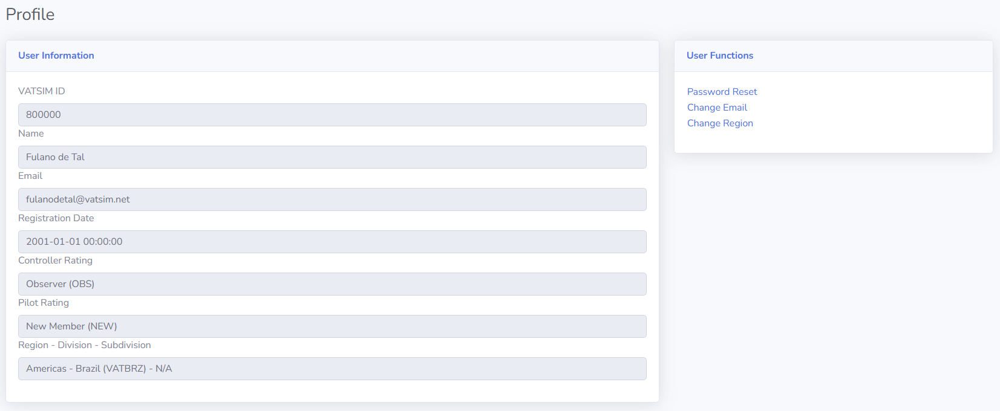

--8<-- "includes/abreviacoes.md"

Ready to begin your journey with Vatsim Brasil and launch your career as a virtual ATC? Start here with all the essential guides you need to get going!

## Introduction

!!! warning "Attention"
    Members should only submit a transfer request to Vatsim Brasil if they are genuinely committed to joining and taking part. Requests made without real interest make the process inefficient and unfair to those with genuine intentions.

    A 90-day waiting period applies between transfers. This rule is strictly enforced and cannot be waived.

!!! Info "Note"
    If you only want to fly on Vatsim, you do not need to go through the ATC Training process. All airspace and air traffic control services on Vatsim are available to all pilots, whether or not they are ATC.

Thank you very much for your interest in joining Vatsim Brasil! Before you begin, it is important to understand how the Vatsim network is organized and how member assignments work.

This guide was written to walk you through everything you need to know—step by step. Once you are familiar with the structure, you can move on to the next sections to find the right path based on what you want to do.

## Understanding the Vatsim Structure

Vatsim is organized into three main levels:

1. **Regions**
    * These are the largest administrative levels on the network. Each region covers a large geographic area and is responsible for the overall oversight of air traffic control operations and flight activities within its jurisdiction.

2. **Divisions**
    * Each region is subdivided into several divisions, usually based geographically on countries or groups of countries.

3. **Subdivisions**
    * Also known as vACCs or ARTCCs, depending on the region. These are smaller, local organizations responsible for specific airspaces and controller training. Not all Divisions have Subdivisions.

Vatsim Brasil (Vatbrz) is a Division within the Americas Region (AMAS) and has no Subdivisions.

All members, whether transferring to Vatsim Brasil or applying to control as visitors, must strictly follow the Vatsim **Transfer and Visiting Controller Policy**[^1].

<!--If you are only interested in becoming a visiting controller (without transferring), refer directly to the Transfer and Visiting Controller Policy in our Library on the left-hand side for detailed instructions and requirements.-->

[^1]: [Transfer and Visiting Controller Policy - TVCP](https://vatsim.net/docs/policy/transfer-and-visiting-controller-policy)

## Assigned vACC/Division/Region

To continue with the next sections of this document, you must first determine your current vACC, Division and Region assignment. You can find this information by checking your profile on [myVATSIM](https://my.vatsim.net) and looking at the "Region - Division - Subdivision" field.

## Region and Division Assignment
After checking your myVATSIM profile, if you are not currently in the Americas Region (AMAS), follow these steps:

1. Visit the [myVATSIM Region transfer page](https://my.vatsim.net/user/region).
2. Select "Americas" as your new Region.
3. Select "Brasil (VATBRZ)" as your new Division.

!!! info
    Regional transfers are not managed by the division and are outside our control. Please avoid messaging us about the status of your transfer, as we are not responsible for these processes.
    Remember that the VATSIM Transfer and Visiting Controller Policy applies and any approved transfers are subject to a 90-day waiting period before you can submit another transfer request.
