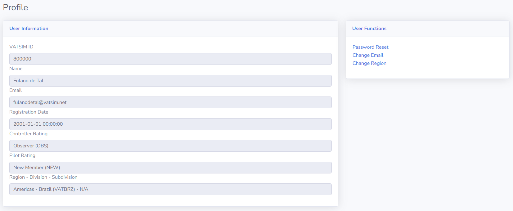

--8<-- "includes/abreviacoes.md"

Pronto para começar sua jornada com a Vatsim Brasil e lançar sua carreira como ATC virtual? Comece aqui com todos os guias essenciais para você iniciar!

## Introdução

!!! warning "Atenção"
    Membros só devem enviar um pedido de transferência para a Vatsim Brasil se estiverem genuinamente comprometidos em ingressar e participar. Pedidos feitos sem interesse verdadeiro tornam o processo ineficiente e injusto para aqueles com intenções genuínas.

    Um período de espera de 90 dias se aplica entre transferências. Esta regra é rigorosamente aplicada e não pode ser dispensada.

!!! Info "Nota"
    Se você somente deseja voar na Vatsim, não é necessário passar pelo processo de Instrução ATC. Todos os espaços aéreos e serviços de controle de tráfego aéreo na Vatsim estão disponíveis para todos os pilotos, independentemente de serem ATC ou não.

Muito obrigado pelo seu interesse em ingressar na Vatsim Brasil! Antes de começar, é importante entender como a rede Vatsim está organizada e como funcionam as atribuições de membros.

Esse guia foi elaborado para guiá-lo por tudo o que você precisa saber—passo a passo. Uma vez familiarizado com a estrutura, você pode avançar para as próximas seções para encontrar o caminho certo com base no que deseja fazer.

## Compreendendo a Estrutura da Vatsim

A Vatsim é organizada em três níveis principais:

1. **Regiões**
    * Esses são os maiores níveis administrativos na rede. Cada região cobre uma grande área geográfica e é responsável pela supervisão geral das operações de controle de tráfego aéreo e atividades de voo dentro de sua jurisdição.

2. **Divisões**
    * Cada região é subdividida em várias divisões, geralmente baseadas geográficamente por países ou agrupamentos de países.

3. **Subdivisões**
    * Também conhecidas como vACCs ou ARTCCs, dependendo da região. Estas representam organizações menores e locais responsáveis por espaços aéreos específicos e treinamento de controladores. Nem todas as Divisões possuem Subdivisões.

A Vatsim Brasil (Vatbrz) é uma Divisão dentro da Região Américas (AMAS) e não possui Subdivisões.

Todos os membros, sejam transferindo para a Vatsim Brasil ou se candidatando para controle como visitantes, devem seguir rigorosamente a **Política de Transferência e Controladores Visitantes**[^1] da Vatsim.

<!--Se você está apenas interessado em se tornar um controlador visitante (sem se transferir), consulte diretamente a Política de Transferência e Controladores Visitantes em nossa Biblioteca no lado esquerdo para obter instruções e requisitos detalhados.-->

[^1]: [Transfer and Visiting Controller Policy - TVCP](https://vatsim.net/docs/policy/transfer-and-visiting-controller-policy)

## vACC/Divisão/Região Atribuída

Para continuar com as próximas seções deste documento, você deve primeiro determinar sua atribuição atual em termos de vACC, Divisão e Região. Você pode encontrar essas informações verificando seu perfil no [myVATSIM](https://my.vatsim.net) e olhando o campo "Region - Division - Subdivision".

## Atribuição de Região e Divisão
Depois de conferir seu perfil no myVATSIM, se você não estiver atualmente na Região América (AMAS), siga estes passos:

1. Visite a [página de transferência de Região do myVATSIM](https://my.vatsim.net/user/region).
2. Selecione "Americas" como sua nova Região.
3. Selecione "Brasil (VATBRZ)" como sua nova Divisão.

!!! info
    Transferências regionais não são gerenciadas pela divisão e estão fora do nosso controle. Por favor, evite nos enviar mensagens sobre o status de sua transferência, pois não somos responsáveis por esses processos.
    Lembre-se que a Política de Transferência e Controladores Visitantes da VATSIM se aplica e quaisquer transferências aprovadas estarão sujeitas a um período de espera de 90 dias antes que você possa enviar outra solicitação de transferência.

#

<!-- ---

<a href="../">
←
Página anterior
|
Visão Geral
</a>

<a href="../treinamentoatc/">
Próxima página
|
Treinamento ATC
→
</a>

 -->