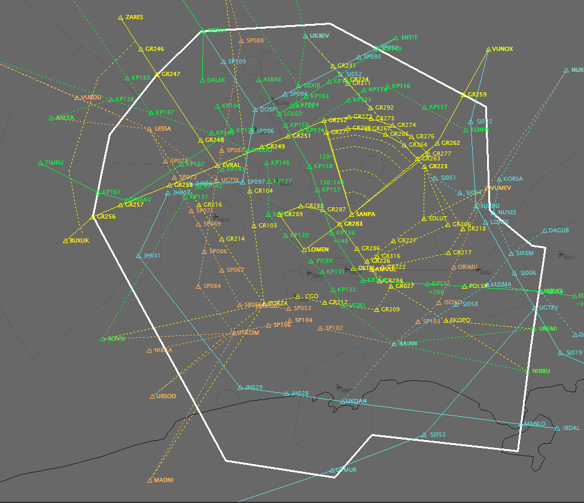

--8<-- "includes/abreviacoes.md"

#

The main tool is [Euroscope](https://www.euroscope.hu). It is used for all air traffic control activities, whether in radar or non-radar (procedural) operation, as well as for weather information, coordination channels with other ATC units and the issuing of operational reports.

{ loading=lazy }
