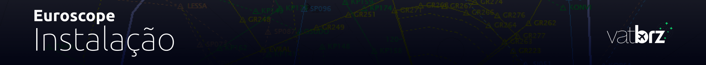
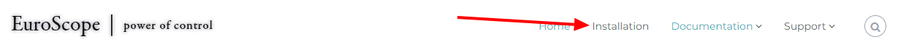
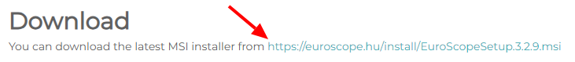

--8<-- "includes/abreviacoes.md"

#

## Download

!!! info "Information"
    Euroscope is only available for *Microsoft Windows*.

1. Go to the [Euroscope website](https://www.euroscope.hu) and open the downloads page by clicking `Installation` on the top bar.

{ : style="border:2px solid #999" }

2. Click the link available in the "Download" section to download EuroScope. Once downloaded, follow the installer steps as usual.

{ : style="border:2px solid #999" }

!!! danger "Attention!"
    We recommend installing version **3.2.3.2**, which can be found [at this link](https://www.euroscope.hu/wp/2024/06/09/v3-2-2-3-and-v3-2-3-2-with-token-authentication-update/).

!!! warning "A tip!"
    We strongly recommend reading the Euroscope manual, which can easily be found on the website under `Documentation` > `Download User's Guide`.

## *Sectorfiles* and Configuration Files

Sector files are downloaded and installed **through [Aeronav GNG](https://files.aero-nav.com/SBXX)**. To do so, follow the steps shown in the video below:

<iframe width="560" height="315" src="https://www.youtube.com/embed/odyaBXAEkhg?si=tEQH_ATFucSrw8ZY" title="YouTube video player" frameborder="0" allow="accelerometer; autoplay; clipboard-write; encrypted-media; gyroscope; picture-in-picture; web-share" referrerpolicy="strict-origin-when-cross-origin" allowfullscreen></iframe>

!!! warning "Attention!"
    If the dialog box does not appear, you forgot to uncheck the `Auto load last profile on startup` option in the previous step. Uncheck the option and open Euroscope again.

??? question "What is the difference between the `radar` profile and the `solo` profile?"
    The `solo` profile contains a color scheme and tags optimized for controlling the `DEL`, `RMP`, `GND` and `TWR` positions.

    The `radar` profile, on the other hand, is optimized for the `APP` and `CTR` positions.

!!! info "An important note"
    If you want to change position and the new one is in a different FIR, you must restart Euroscope and open the correct profile for the new position. Simply loading the new sector/ASR is not enough.
