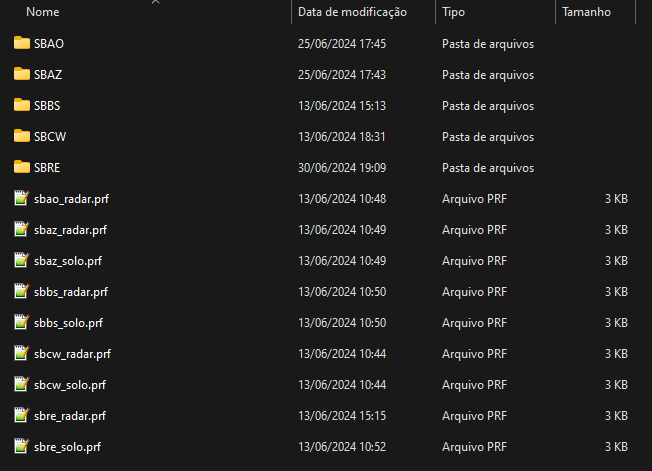
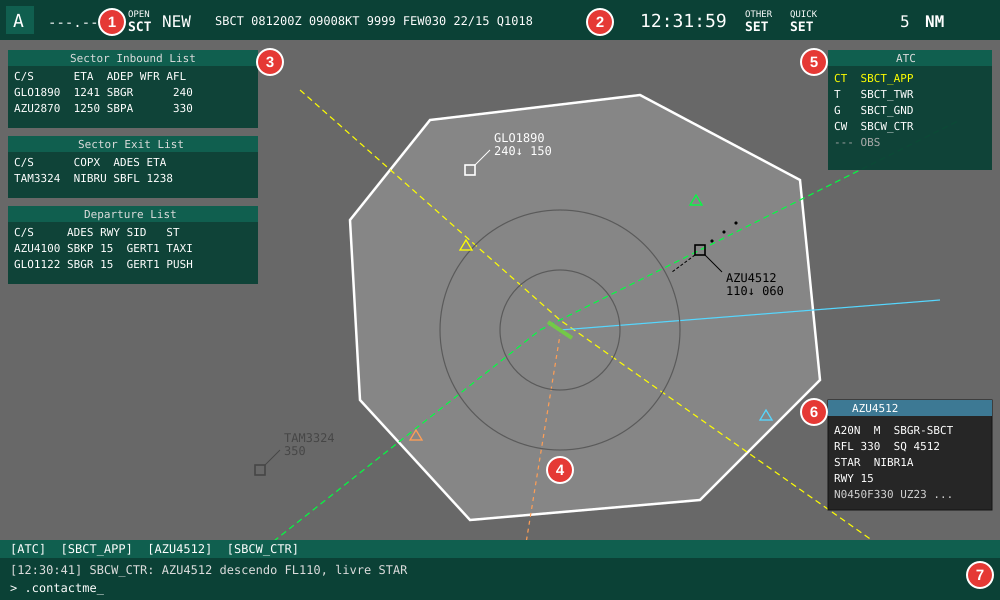
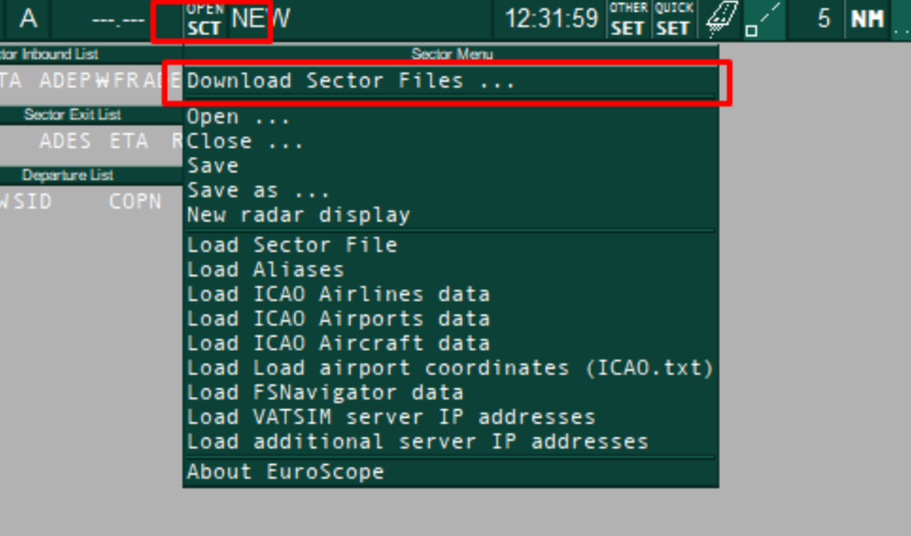
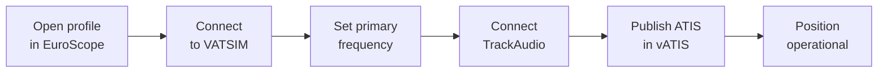
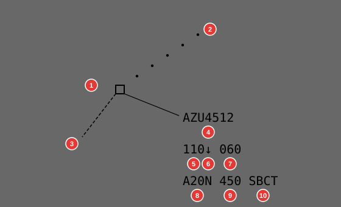
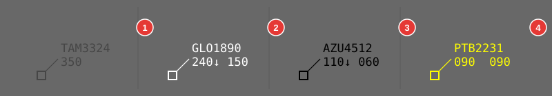
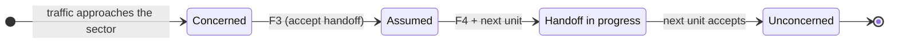
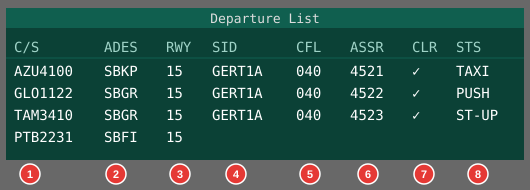
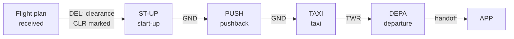

--8<-- "includes/abreviacoes.md"

# Usage

This page walks through **EuroScope** in a typical control session: opening the profile, connecting to the network, reading the screen and the tags, working with the lists and closing the session. It assumes the [installation](instalacao.en.md) is already done. The shortcuts mentioned here are detailed in the [Command Guide](comandos.en.md).

!!! info "About the illustrations"
    Figures marked as **illustration** are simplified drawings that use the colors of the VATSIM Brasil profiles. The exact window layout and fields may vary with the profile, the plugin versions and each controller's preferences.

## Before you start

- [x] EuroScope installed, with the sectorfiles of the FIR you will control.
- [x] [TrackAudio](../trackaudio/index.en.md) installed and configured.
- [x] [vATIS](../vatis/index.en.md) configured, if the position is responsible for the ATIS.
- [x] The position's SOP reviewed ([aerodromes](../../../MOP/aerodromos/index.en.md), [terminals](../../../MOP/terminais/index.en.md) or [centers](../../../MOP/centros/index.en.md)).

## Opening the profile

When EuroScope opens, choose the profile file (`.prf`) of the FIR you will control. Each FIR has two profiles:

{ : style="display:block; margin:auto; border:2px solid #999" loading=lazy }

| Profile | Positions | Main plugin |
|---|---|---|
| `solo` | `DEL`, `RMP`, `GND` and `TWR` | **Ground Radar Plugin (GRP)**, which draws the aerodrome, the parking stands and the ground tags. |
| `radar` | `APP` and `CTR` | **TopSky**, which reproduces a real radar system, with flight plan windows, alerts and vectoring tools. |

In both profiles, transponder codes are handed out by the **CCAMS** plugin, which prevents duplicate codes between controllers.

!!! warning "Attention!"
    To switch FIRs, close EuroScope and open the new FIR's profile. Loading another sector while the program is open is not enough.

## The main screen

Once the profile is loaded, the screen has the elements below.

<figure markdown>
{ : style="border:2px solid #999" loading=lazy }
<figcaption>Illustration of the radar profile screen.</figcaption>
</figure>

1. **Menu bar.** Gives access to the connection, the sector files (`OPEN SCT`), the settings (`OTHER SET`) and the quick settings (`QUICK SET`).
2. **METAR and clock.** Shows the METARs added with `F2` and the UTC time.
3. **Lists.** Show traffic entering the sector (*Sector Inbound List*), leaving it (*Sector Exit List*) and, on ground positions, the departures (*Departure List*).
4. **Radar view.** Shows the active sector (white outline), airways, procedures, runways and the targets with their tags.
5. **Controller list.** Shows the connected units and their identifiers. It is used to choose the recipient of handoffs.
6. **TopSky flight plan window.** Shows the plan of the selected traffic: type, departure/destination, cruise level, transponder code, procedure and route.
7. **Chat and command line.** Holds the message tabs (`ATC` channel, private chats and frequency) and the field where commands such as `.contactme` are typed.

### Sector menu

The `OPEN SCT` button opens the sector file menu. Use it to open another sector or load additional data without switching profiles.

{ : style="display:block; margin:auto; border:2px solid #999; max-width:600px" loading=lazy }

## Connecting to the network

EuroScope connects first. TrackAudio and vATIS depend on its connection.

1. In the menu bar, open the connection menu and choose `Connect`.
2. Fill in the connection window:

    | Field | What to enter |
    |---|---|
    | `Callsign` | The position callsign, for example `SBCT_TWR`. To only observe, use a callsign ending in `_OBS`. |
    | `Real name` | Your name, as registered on VATSIM. |
    | `Certificate` | Your CID. |
    | `Password` | Your VATSIM password. |
    | `Facility` and `Rating` | Unit type and your rating. The network rejects connections to a position above your rating. |
    | `Server` | `AUTOMATIC`. |
    | `Connect type` | `Direct to VATSIM`. |

3. Once connected, open the voice communications setup (*Voice Communications Setup*, in the `OTHER SET` menu) and mark the position's frequency as **primary** (`Prim`). This window also holds the controller information lines (*Controller ATIS*), shown to pilots who check your position.
4. Connect [TrackAudio](../trackaudio/utilizacao.en.md) and enable `RX` and `TX` on your frequency.
5. If the position is responsible for the ATIS, publish it with [vATIS](../vatis/index.en.md).

!!! tip "Tip"
    Before opening a position, check the controller list (item 5 on the screen) to see who is already connected. That tells you whom you will coordinate with and hand traffic off to.

## Tags

Each aircraft is shown as a target with a tag. The figure shows a typical radar profile tag.

{ : style="display:block; margin:auto; border:2px solid #999; max-width:560px" loading=lazy }

1. **Position symbol.** Marks the aircraft's current position.
2. **History.** Dots with the previous positions, showing the track flown.
3. **Speed vector.** Projects the aircraft's future position at its current track and speed.
4. **Callsign.**
5. **Current level,** in hundreds of feet (`110` = FL110).
6. **Trend.** Shows whether the aircraft is climbing (`↑`), descending (`↓`) or level.
7. **Cleared level (CFL).** Last level assigned by ATC, changed with `F8`.
8. **Aircraft type.**
9. **Ground speed.**
10. **Destination aerodrome.**

Clicking a tag field opens the matching menu: level, heading, speed, direct routing and so on. These menus are how you record what was cleared on frequency, so other controllers see the same information.

### Tag states

The tag color shows how the traffic relates to your sector. The colors below are the ones configured in the VATSIM Brasil TopSky.

{ : style="display:block; margin:auto; border:2px solid #999" loading=lazy }

1. **Unconcerned** (dark gray). The traffic is not in, and will not enter, your sector.
2. **Concerned** (white). The traffic will enter your sector or there is a handoff to you.
3. **Assumed** (black). The traffic is under your control.
4. **Coordination** (yellow). A coordination about the traffic is in progress.

The normal cycle of a traffic between two sectors is:

## Radar control routine

1. **Assume.** When the traffic calls, or when the handoff arrives, click the tag with `F3`.
2. **Record clearances.** Every level, heading or speed given on frequency must be entered in the tag: `F8` for the level, or the menu of the matching field.
3. **Monitor separation.** Use `F1 + S` (`.sep`) to predict the closest point between two traffics and `F1 + D` (`.distance`) to follow the distance to a point.
4. **Hand off.** Before the sector boundary, start the handoff to the next unit with `F4`. Once it accepts, instruct the pilot to contact the new frequency.
5. **Point out.** If a traffic will pass close to another sector without entering it, alert the adjacent controller with `F1 + P`.

!!! warning "Attention!"
    Do not instruct the pilot to change frequency before the next unit accepts the handoff. If it does not accept, coordinate through chat or the coordination channel.

## Ground positions: departure list

In the `solo` profile, the departure list is the main working tool of `DEL`, `GND` and `TWR`.

{ : style="display:block; margin:auto; border:2px solid #999; max-width:530px" loading=lazy }

1. **Callsign.** Click to select the traffic and open the flight plan.
2. **Destination.**
3. **Departure runway.**
4. Assigned **SID**.
5. **Initial cleared level.**
6. Assigned **transponder code** (by CCAMS or with `F9`).
7. **Clearance (CLR).** Mark it once the ATC clearance has been read to the pilot.
8. **Ground state.** Shows which phase the traffic is in.

The ground state is updated at each step, so every position knows where the traffic is and who should call it:

!!! tip "Tip"
    Before clearing, open the flight plan and check the route, level and equipment. The [Flight Plan Manual](../../../documentos/manuais/manual-plano-de-voo/index.en.md) shows the most common errors.

## Inbound and exit lists

On radar positions, the **Sector Inbound List** (SIL) shows the traffic that will enter your sector, with estimated time and level. It lets you prepare before the handoff. The **Sector Exit List** (SEL) shows the traffic you have assumed that will leave the sector, with the exit point and time. It works as a reminder of the handoffs you need to start.

## Coordination and chat

- **`ATC` channel.** Messages to all connected controllers. Use it for general notices.
- **Private chat.** Use `F1 + C` (`.chat`) on the tag to talk to the pilot, or `.chat` followed by the callsign to talk to a controller.
- **`.contactme`** (`HOME` shortcut). Asks a pilot to call on your frequency.
- **`.break`.** Signals to the other controllers that you need a break or relief.

## Closing the session

1. Hand off all assumed traffic or, if no unit takes over the area, instruct pilots to switch to the monitoring frequency (UNICOM, 122.800 MHz).
2. Announce on the `ATC` channel that you are disconnecting.
3. Stop the ATIS in vATIS.
4. Disconnect TrackAudio.
5. Disconnect EuroScope from the connection menu (`Disconnect`).

## Learn more

- The EuroScope user guide is on the [official website](https://www.euroscope.hu), under `Documentation`.
- The **TopSky** and **Ground Radar Plugin** documentation ships with the plugin files, in the FIR package folder.
