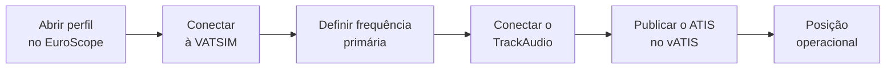
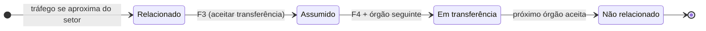
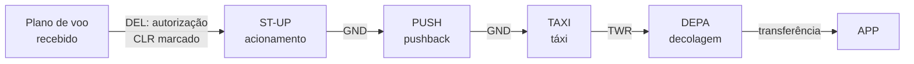

--8<-- "includes/abreviacoes.md"

# Utilização

Esta página mostra o uso do **EuroScope** em uma sessão de controle típica: abrir o perfil, conectar à rede, ler a tela e as etiquetas, trabalhar com as listas e encerrar a sessão. Ela parte do ponto em que a [instalação](instalacao.pt.md) já foi feita. Os atalhos citados aqui estão detalhados no [Guia de Comandos](comandos.pt.md).

!!! info "Sobre as ilustrações"
    As figuras marcadas como **ilustração** são representações simplificadas, desenhadas com as cores dos perfis da VATSIM Brasil. A disposição exata das janelas e dos campos pode variar conforme o perfil, a versão dos plugins e as preferências de cada controlador.

## Antes de começar

- [x] EuroScope instalado, com os *sectorfiles* da FIR em que vai controlar.
- [x] [TrackAudio](../trackaudio/index.pt.md) instalado e configurado.
- [x] [vATIS](../vatis/index.pt.md) configurado, se a posição for responsável pelo ATIS.
- [x] Consulta prévia ao MOP da posição ([aeródromos](../../../MOP/aerodromos/index.pt.md), [terminais](../../../MOP/terminais/index.pt.md) ou [centros](../../../MOP/centros/index.pt.md)).

## Abrindo o perfil

Ao abrir o EuroScope, escolha o arquivo de perfil (`.prf`) da FIR em que vai controlar. Cada FIR tem dois perfis:

{ : style="display:block; margin:auto; border:2px solid #999" loading=lazy }

| Perfil | Posições | Plugin principal |
|---|---|---|
| `solo` | `DEL`, `RMP`, `GND` e `TWR` | **Ground Radar Plugin (GRP)**, que desenha o aeródromo, as posições de estacionamento e as etiquetas de solo. |
| `radar` | `APP` e `CTR` | **TopSky**, que reproduz um sistema radar real, com janelas de plano de voo, alertas e ferramentas de vetoração. |

Nos dois perfis, os códigos transponder são distribuídos pelo plugin **CCAMS**, que evita códigos repetidos entre controladores.

!!! warning "Atenção!"
    Para trocar de FIR, feche o EuroScope e abra o perfil da nova FIR. Carregar outro setor com o programa aberto não basta.

## A tela principal

Depois de carregado o perfil, a tela tem os elementos abaixo.

<figure markdown>
{ : style="border:2px solid #999" loading=lazy }
<figcaption>Ilustração da tela do perfil radar.</figcaption>
</figure>

1. **Barra de menus.** Dá acesso à conexão, aos arquivos de setor (`OPEN SCT`), às configurações (`OTHER SET`) e às configurações rápidas (`QUICK SET`).
2. **METAR e relógio.** Mostra os METARs adicionados com `F2` e a hora UTC.
3. **Listas.** Mostram tráfegos que entram no setor (*Sector Inbound List*), que saem dele (*Sector Exit List*) e, nas posições de solo, as partidas (*Departure List*).
4. **Vista radar.** Mostra o setor ativo (contorno branco), aerovias, procedimentos, pistas e os alvos com suas etiquetas.
5. **Lista de controladores.** Mostra os órgãos conectados e a sigla de cada um. Ela é usada para escolher o destino das transferências.
6. **Janela de plano de voo do TopSky.** Exibe o plano do tráfego selecionado: tipo, origem/destino, nível de cruzeiro, código transponder, procedimento e rota.
7. **Chat e linha de comando.** Concentra as abas de mensagens (canal `ATC`, conversas privadas e frequência) e o campo onde se digitam comandos como `.contactme`.

### Menu de setor

O botão `OPEN SCT` abre o menu de arquivos de setor. Ele serve para abrir outro setor ou carregar dados adicionais sem trocar de perfil.

{ : style="display:block; margin:auto; border:2px solid #999; max-width:600px" loading=lazy }

## Conectando à rede

O EuroScope é o primeiro programa a conectar. TrackAudio e vATIS dependem da conexão dele.

1. Na barra de menus, abra o menu de conexão e escolha `Connect`.
2. Preencha a janela de conexão:

    | Campo | O que preencher |
    |---|---|
    | `Callsign` | Indicativo da posição, por exemplo `SBCT_TWR`. Para apenas observar, use um indicativo terminado em `_OBS`. |
    | `Real name` | Seu nome, como cadastrado na VATSIM. |
    | `Certificate` | Seu CID. |
    | `Password` | Sua senha da VATSIM. |
    | `Facility` e `Rating` | Tipo de órgão e seu rating. A rede não aceita conexão numa posição acima do seu rating. |
    | `Server` | `AUTOMATIC`. |
    | `Connect type` | `Direct to VATSIM`. |

3. Após conectar, abra a configuração de comunicações por voz (*Voice Communications Setup*, no menu `OTHER SET`) e marque a frequência da posição como **primária** (`Prim`). Nessa janela também ficam as linhas de informação do controlador (*Controller ATIS*), exibidas aos pilotos que consultarem a sua posição.
4. Conecte o [TrackAudio](../trackaudio/utilizacao.pt.md) e habilite `RX` e `TX` da sua frequência.
5. Se a posição for responsável pelo ATIS, publique-o pelo [vATIS](../vatis/index.pt.md).

!!! tip "Dica"
    Antes de abrir uma posição, confira na lista de controladores (item 5 da tela) quem já está conectado. Assim você sabe com quem vai coordenar e para quem vai transferir os tráfegos.

## Etiquetas

Cada aeronave aparece como um alvo com uma etiqueta (*tag*). A figura mostra uma etiqueta típica do perfil radar.

{ : style="display:block; margin:auto; border:2px solid #999; max-width:560px" loading=lazy }

1. **Símbolo de posição.** Marca a posição atual da aeronave.
2. **Histórico.** Pontos com as posições anteriores, que mostram a trajetória.
3. **Vetor de velocidade.** Projeta a posição futura da aeronave no rumo e na velocidade atuais.
4. **Indicativo de chamada.**
5. **Nível atual,** em centenas de pés (`110` = FL110).
6. **Tendência.** Indica se a aeronave sobe (`↑`), desce (`↓`) ou está nivelada.
7. **Nível autorizado (CFL).** Último nível atribuído pelo controle, alterado com `F8`.
8. **Tipo de aeronave.**
9. **Velocidade de solo.**
10. **Aeródromo de destino.**

Clicar em um campo da etiqueta abre o menu correspondente: nível, proa, velocidade, rota direta etc. É por esses menus que se registra o que foi autorizado na fonia, para que os outros controladores vejam a mesma informação.

### Estados das etiquetas

A cor da etiqueta indica a relação do tráfego com o seu setor. As cores abaixo são as configuradas no TopSky da VATSIM Brasil.

{ : style="display:block; margin:auto; border:2px solid #999" loading=lazy }

1. **Não relacionado** (cinza escuro). O tráfego não está nem vai entrar no seu setor.
2. **Relacionado** (branco). O tráfego vai entrar no seu setor ou há uma transferência para você.
3. **Assumido** (preto). O tráfego está sob o seu controle.
4. **Em coordenação** (amarelo). Há uma coordenação em andamento sobre o tráfego.

O ciclo normal de um tráfego entre dois setores é este:

## Rotina de controle radar

1. **Assumir.** Quando o tráfego chamar, ou quando a transferência chegar, clique na etiqueta com `F3`.
2. **Registrar autorizações.** Cada nível, proa ou velocidade dado na fonia deve ser lançado na etiqueta: `F8` para o nível, ou o menu do campo correspondente.
3. **Monitorar a separação.** Use `F1 + S` (`.sep`) para prever a menor distância entre dois tráfegos e `F1 + D` (`.distance`) para acompanhar a distância até um ponto.
4. **Transferir.** Antes do limite do setor, inicie a transferência com `F4` para o órgão seguinte. Depois que ele aceitar, instrua o piloto a chamar a nova frequência.
5. **Point out.** Se um tráfego vai passar perto de outro setor sem entrar nele, avise o controlador vizinho com `F1 + P`.

!!! warning "Atenção!"
    Não instrua o piloto a trocar de frequência antes de o próximo órgão aceitar a transferência. Se ele não aceitar, coordene pelo chat ou pelo canal de coordenação.

## Posições de solo: lista de partidas

No perfil `solo`, a lista de partidas é a principal ferramenta de trabalho de `DEL`, `GND` e `TWR`.

{ : style="display:block; margin:auto; border:2px solid #999; max-width:530px" loading=lazy }

1. **Indicativo.** Clique para selecionar o tráfego e abrir o plano de voo.
2. **Destino.**
3. **Pista de decolagem.**
4. **SID** atribuída.
5. **Nível inicial autorizado.**
6. **Código transponder** atribuído (pelo CCAMS ou com `F9`).
7. **Autorização (CLR).** Marque quando a autorização de tráfego for transmitida ao piloto.
8. **Estado de solo.** Indica em que fase o tráfego está.

O estado de solo é atualizado a cada etapa, e cada posição sabe onde o tráfego está e quem deve chamá-lo:

!!! tip "Dica"
    Antes de autorizar, abra o plano de voo e confira rota, nível e equipamento. O [Manual de Plano de Voo](../../../documentos/manuais/manual-plano-de-voo/index.pt.md) mostra os erros mais comuns.

## Listas de entrada e saída

Nas posições radar, a **Sector Inbound List** (SIL) mostra os tráfegos que vão entrar no seu setor, com a hora estimada e o nível. Ela permite se preparar antes da transferência. A **Sector Exit List** (SEL) mostra os tráfegos assumidos por você que vão sair do setor, com o ponto e a hora de saída. Ela serve de lembrete das transferências que você precisa iniciar.

## Coordenação e chat

- **Canal `ATC`.** Mensagens para todos os controladores conectados. Use para avisos gerais.
- **Conversa privada.** Use `F1 + C` (`.chat`) sobre a etiqueta para conversar com o piloto, ou `.chat` seguido do indicativo para conversar com um controlador.
- **`.contactme`** (atalho `HOME`). Pede a um piloto que chame na sua frequência.
- **`.break`.** Sinaliza aos outros controladores que você precisa de uma pausa ou substituição.

## Encerrando a sessão

1. Transfira todos os tráfegos assumidos ou, se nenhum órgão assumir a área, instrua os pilotos a mudar para a frequência de monitoramento (UNICOM, 122.800 MHz).
2. Avise no canal `ATC` que vai desconectar.
3. Encerre o ATIS no vATIS.
4. Desconecte o TrackAudio.
5. Desconecte o EuroScope pelo menu de conexão (`Disconnect`).

## Para saber mais

- O manual do usuário do EuroScope está no [site oficial](https://www.euroscope.hu), em `Documentation`.
- A documentação do **TopSky** e do **Ground Radar Plugin** acompanha os arquivos dos plugins, na pasta do pacote da FIR.
