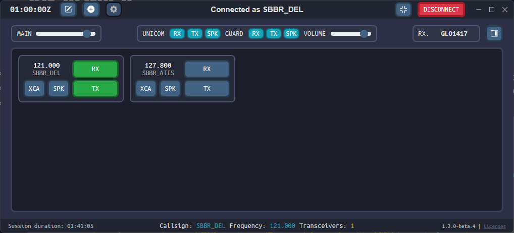

--8<-- "includes/abreviacoes.md"

TrackAudio is the newest audio client for air traffic control on the VATSIM network, compatible with macOS, Linux and Windows. It fully replaces the AFV (Audio For Vatsim) client, but requires a few extra steps to be used correctly.

{ : style="display:block; margin:auto; height:300px; border:2px solid #999" }
