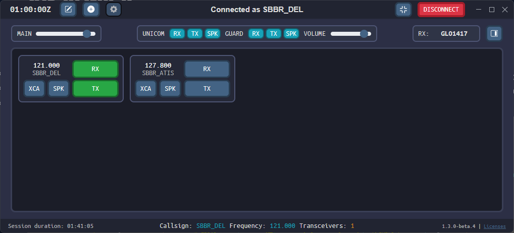

--8<-- "includes/abreviacoes.md"

TrackAudio é o mais novo cliente de áudio para controle de tráfego aéreo na rede VATSIM, compatível com macOS, Linux e Windows. Ele substitui completamente o cliente AFV (Audio For Vatsim), mas requer alguns passos extras para ser utilizado corretamente.

{ : style="display:block; margin:auto; height:300px; border:2px solid #999" }