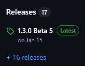
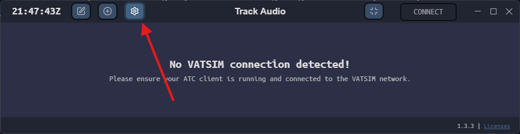
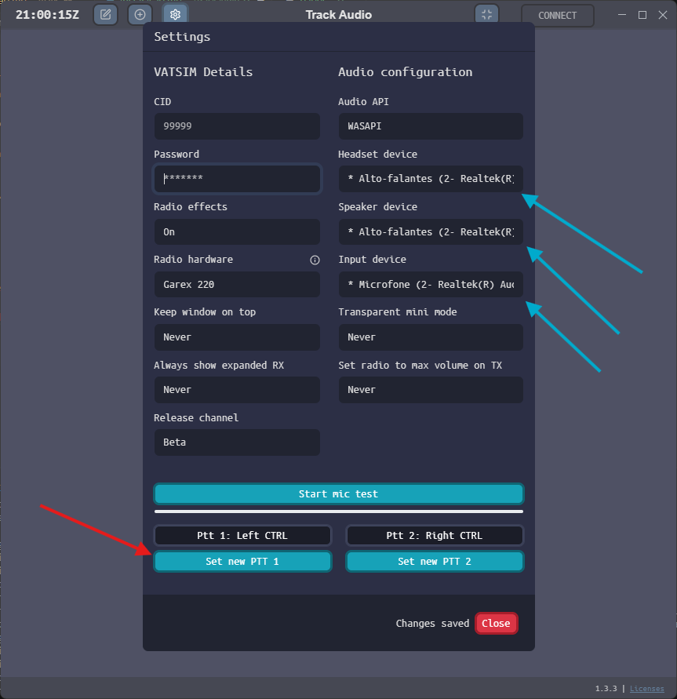

--8<-- "includes/abreviacoes.md"

## Download and Installation

1. Go to the [TrackAudio repository on GitHub](https://github.com/pierr3/TrackAudio).
2. Open the latest version by clicking the most recent entry under Releases on the right-hand side.

{ : style="display:block; margin:auto; border:2px solid #999" }

3. In the list at the bottom of the page, under **Assets**, look for the latest version available for your operating system.

!!! warning "Windows"
    The Windows version ends in *.exe*.

4. Install as usual.

## Configuration

1. When you open TrackAudio, access the settings by clicking the gear icon in the top-left corner.

{ : style="display:block; margin:auto; width:800px; border:2px solid #999" }

2. Configure it by entering your Vatsim CID and password, paying close attention to the following items:

* Blue arrows: audio outputs (primary [headset] and secondary [speaker]) and audio input;
* Red arrow: push-to-talk buttons.

{ : style="display:block; margin:auto; height:500px; border:2px solid #999" }
