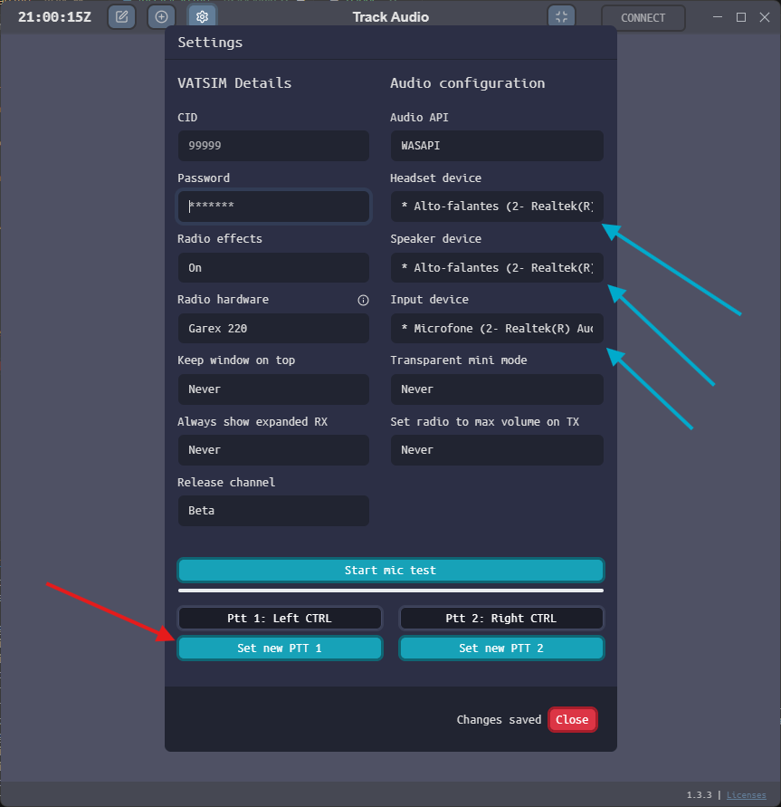

--8<-- "includes/abreviacoes.md"

## Download e Instalação

1. Acesse o [repositório do TrackAudio no GitHub](https://github.com/pierr3/TrackAudio).
2. Acesse a versão mais recente clicando no último Releases do lado direito.

{ : style="display:block; margin:auto; border:2px solid #999" }

3. Procure na lista ao fim da página, no grupo **Assets**, a última versão disponível para o seu sistema operacional.

!!! warning "Windows"
    A versão para Windows termina em *.exe*.

4. Instale normalmente.

## Configuração

1. Ao abrir o TrackAudio, acesse as configurações clicando na engrenagem no canto superior esquerdo.

{ : style="display:block; margin:auto; width:800px; border:2px solid #999" }

2. Configure inserindo sua CID e senha da Vatsim, configurando com atenção os seguintes pontos:

* Setas azuis: saídas de áudio (primária [headset] e secundária [speaker]) e entrada de áudio (input);
* Seta vermelha: botões para push-to-talk.

{ : style="display:block; margin:auto; height:500px; border:2px solid #999" }

#

---

<a href="../">
←
Página anterior
|
TrackAudio | Visão Geral
</a>

<a href="../utilizacao/">
Próxima página
|
TrackAudio | Utilização
→
</a>

