--8<-- "includes/abreviacoes.md"

# Usage

## Before connecting to Euroscope

When you open TrackAudio without Euroscope connected, the message _"No VATSIM connection detected!"_ will be displayed.

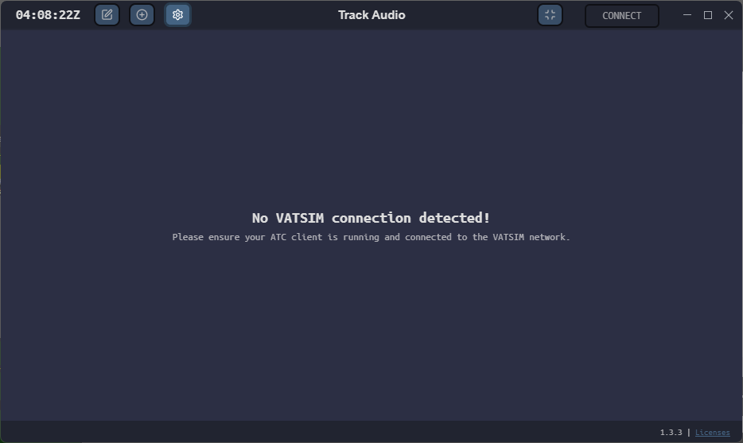{ : style="display:block; margin:auto; border:2px solid #999; height:300px;" }

???+ warning "Attention!"
    Make sure EuroScope is running and connected to VATSIM with your control position.

## After connecting to EuroScope

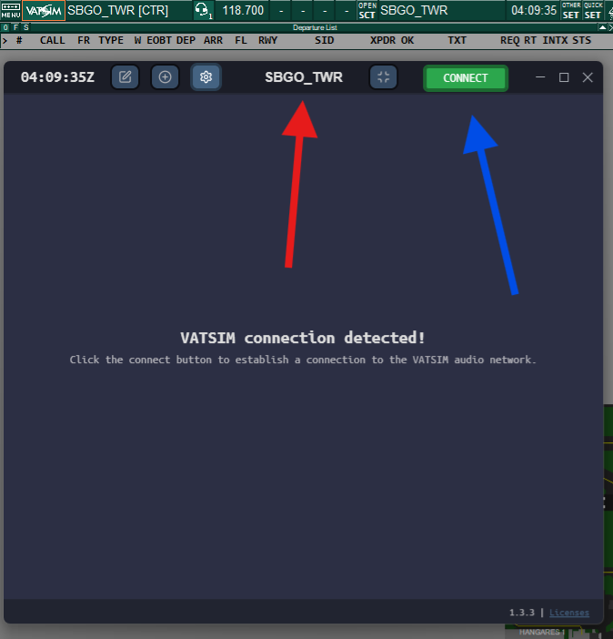{ : style="display:block; margin:auto; border:2px solid #999; height:300px;" }

As soon as Euroscope is properly connected:

1. Your callsign (in this example, `SBGO_TWR`) will appear at the top.
2. The **CONNECT** button will become active in green, indicating that you can click it to connect to the VATSIM audio server.

## Connected to the audio server

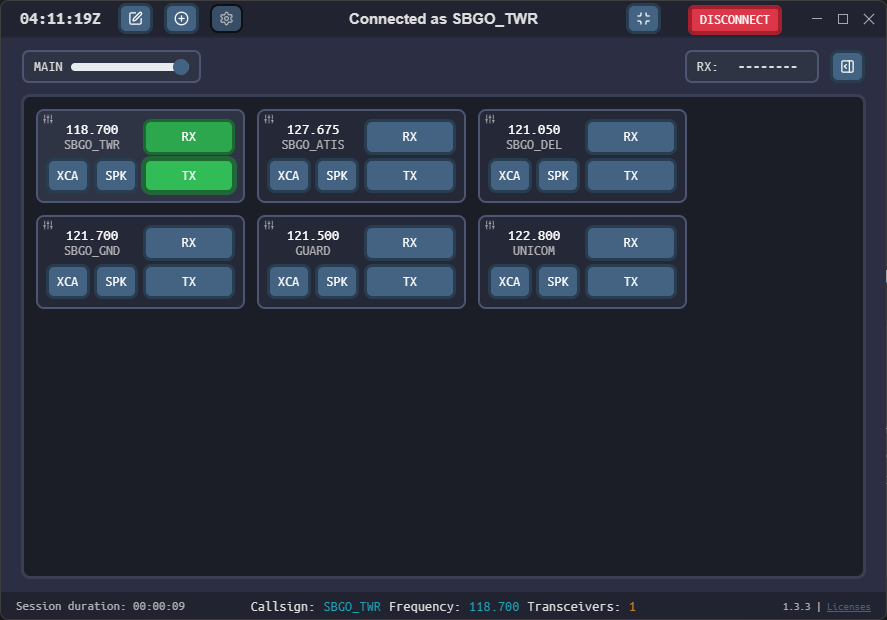{ : style="display:block; margin:auto; border:2px solid #999; height:300px;" }

After clicking `CONNECT`, the system connects automatically and displays the **available frequencies based on your position**.

???+ warning "Important!"
    The system **does not enable frequencies automatically**. You need to **manually select the RX and TX buttons** of the frequency you want to use.

    **Example:** frequency 118.700 MHz (`SBGO_TWR`).

**Available buttons:**

* **RX (green):** you are listening to the frequency. It turns **ORANGE** when there is an active transmission.

* **TX (green):** ready to transmit. It turns **ORANGE** while you are talking.

* **SPK:** plays the frequency audio through the speaker.

* **XCA:** enables transceiver *cross-coupling* (explained below).

## During Transmission (TX)

{ : style="display:block; margin:auto; border:2px solid #999; height:300px;" }

When you press the PTT (Push-To-Talk) button, the TX button of the selected frequency will turn orange, indicating that you are transmitting.

## XCA and XC Functions

🖱️ **Right**-click the XCA button:  
- Enables cross-coupling between transceivers on the **same frequency**.
- Allows pilots in different areas of the FIR to hear each other.

🖱️ **Left**-click the XCA button:  
- Enables cross-coupling between **different frequencies** (XC).  
- Allows different frequencies to be joined, but **must be used with caution**.

✅ Always use XCA when controlling with multiple active transceivers to ensure optimal voice coverage.

## Frequency Edit Mode

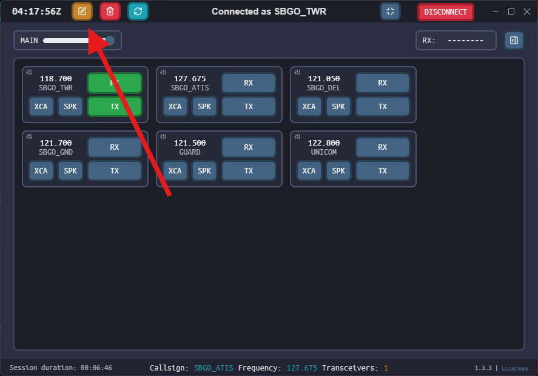{ : style="display:block; margin:auto; border:2px solid #999; height:300px;" }

When you click the pencil icon at the top, the button will turn orange, indicating that **edit mode** is active in TrackAudio.

This mode allows you to **select frequencies you want to delete** from your current list.

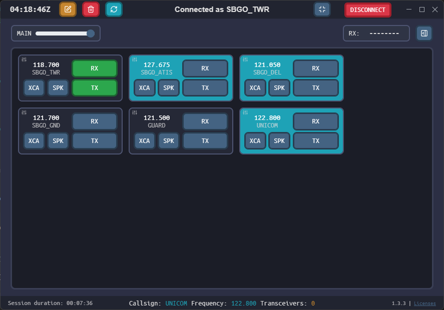{ : style="display:block; margin:auto; border:2px solid #999; height:300px;" } 

Frequencies selected for deletion are highlighted in **light blue**. Just click the red trash can to remove them from your interface.

🔹 This function is useful for **organizing** and **clearing out frequencies that are not in use**, especially when multiple positions are loaded automatically.

## Listening to Multiple Frequencies Simultaneously

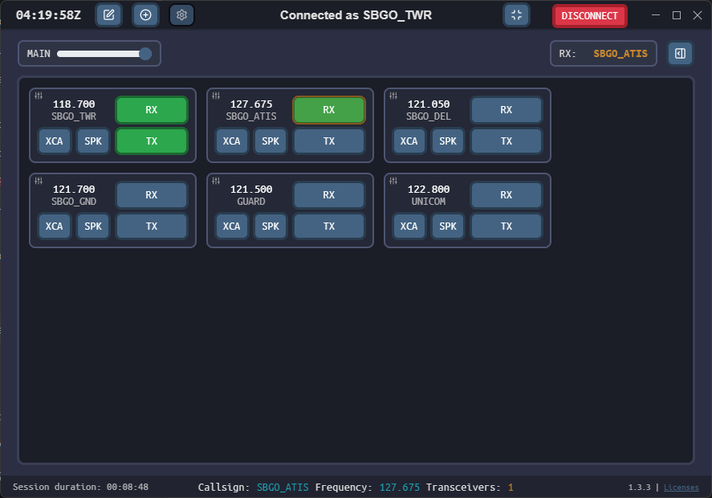{ : style="display:block; margin:auto; border:2px solid #999; height:300px;" } 

Track Audio allows you to listen to multiple frequencies at the same time. In this example, the controller is listening to:

\- SBGO\_TWR (118.700 MHz)  
\- SBGO\_ATIS (127.675 MHz)

🔸 The **RX** button of the ATIS frequency is orange, indicating that there is an active transmission on that channel.

✅ This function is useful for controllers who need to monitor adjacent sectors or auxiliary frequencies, or who want to listen to the local ATIS during operations.

## Main Volume Control

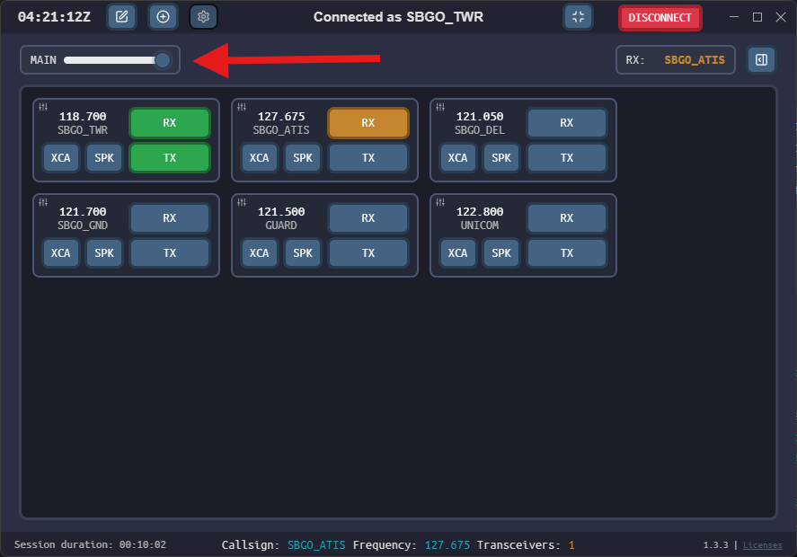{ : style="display:block; margin:auto; border:2px solid #999; height:300px;" } 

The slider shown above adjusts the **main volume (MAIN)** of Track Audio.

🔊 Moving the slider to the left will proportionally reduce the volume of **all frequencies**.  
🔊 Moving it to the right will increase the overall volume.

This function is useful for making quick adjustments without having to set the individual volume of each RX frequency.

## Minimized Mode (Docking)

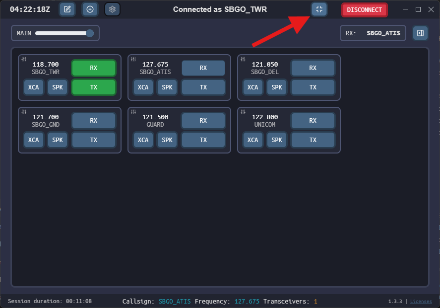{ : style="display:block; margin:auto; border:2px solid #999; height:300px;" } 

By clicking the button in the top-right corner, as shown in the image above, Track Audio enters **minimized (docking)** mode.

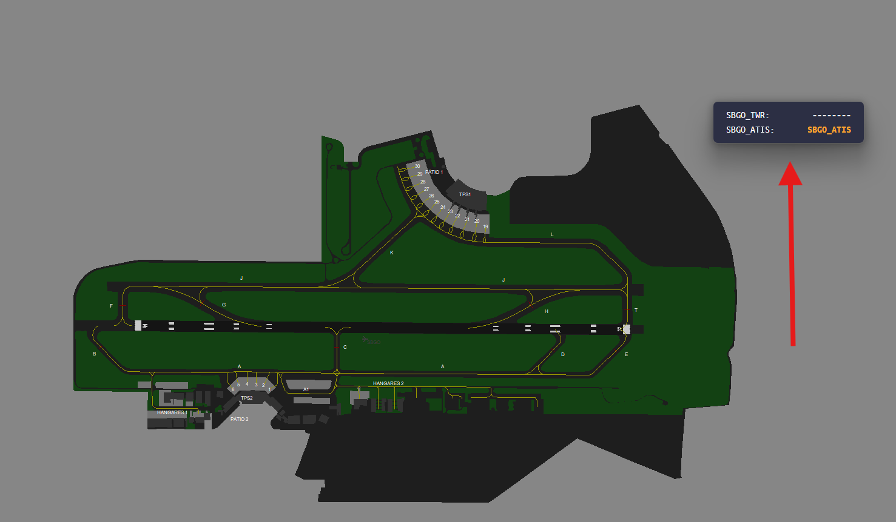{ : style="display:block; margin:auto; border:2px solid #999; height:300px;" } 

In this mode, TrackAudio appears as a small, unobtrusive floating window, usually placed over the EuroScope radar. It keeps working normally, displaying the active RX frequency (in this example: SBGO\_ATIS).

✅ Ideal for keeping the interface clean while controlling, without losing track of the current frequency.

## Frequency Monitoring in Minimized Mode

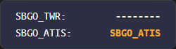{ : style="display:block; margin:auto; border:2px solid #999;" } 

Even in minimized mode, TrackAudio displays important information about the monitored frequencies:

🔸 On the left, the configured frequencies are listed (such as SBGO\_TWR and SBGO\_ATIS).  
🔸 On the right, the **callsigns** of the traffic that is transmitting are shown.

🟧 When the callsign is shown in **orange**, as in the SBGO\_ATIS example, it means that **there is an active transmission** on that frequency.  
➖ If only dashes "------" appear, it means that **nobody has spoken** on the main frequency yet.

✅ After the transmission ends, the callsign of the last station that spoke remains visible in white, showing the recent history.

## Transmission Indicators and Session Footer

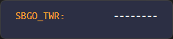{ : style="display:block; margin:auto; border:2px solid #999;" } 

When you transmit on a frequency, your **callsign** will appear in **orange**, in both the minimized and maximized views. It turns white again at the end of the transmission and remains visible as history.

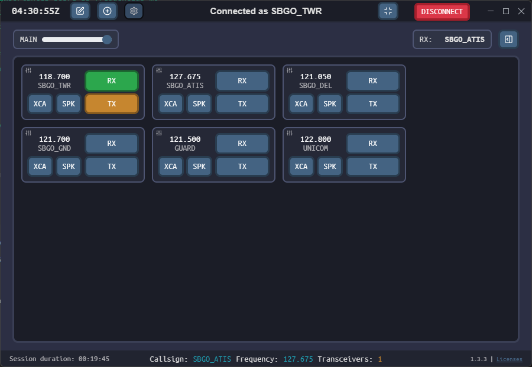{ : style="display:block; margin:auto; border:2px solid #999; height:300px;" } 

In the main interface, the **TX** button will also turn orange while you are talking (Push-To-Talk pressed).

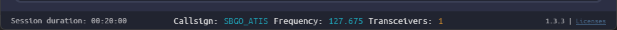{ : style="display:block; margin:auto; border:2px solid #999;" } 

In the Track Audio footer, you can see:  
\- ⏱️ Duration of the current session  
\- 📛 Your **callsign**  
\- 📡 The active frequency  
\- 📶 The number of transceivers in use on that frequency

This information helps you keep technical track of your session and check whether audio is being routed correctly.

## Adding Frequencies Manually

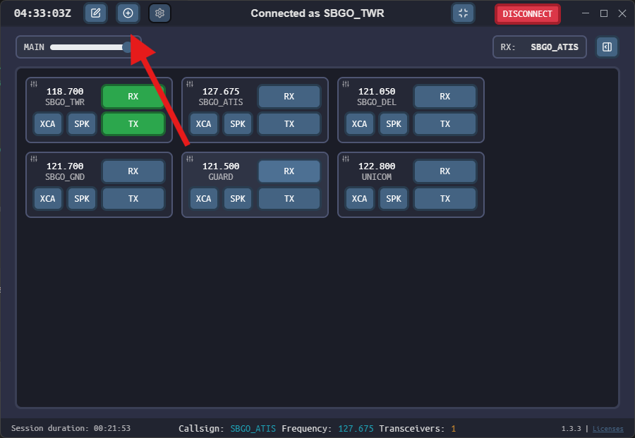{ : style="display:block; margin:auto; border:2px solid #999; height:300px;" } 

To add a new frequency to the Track Audio panel, click the **"+"** button located in the top-left corner, next to the edit and settings buttons.

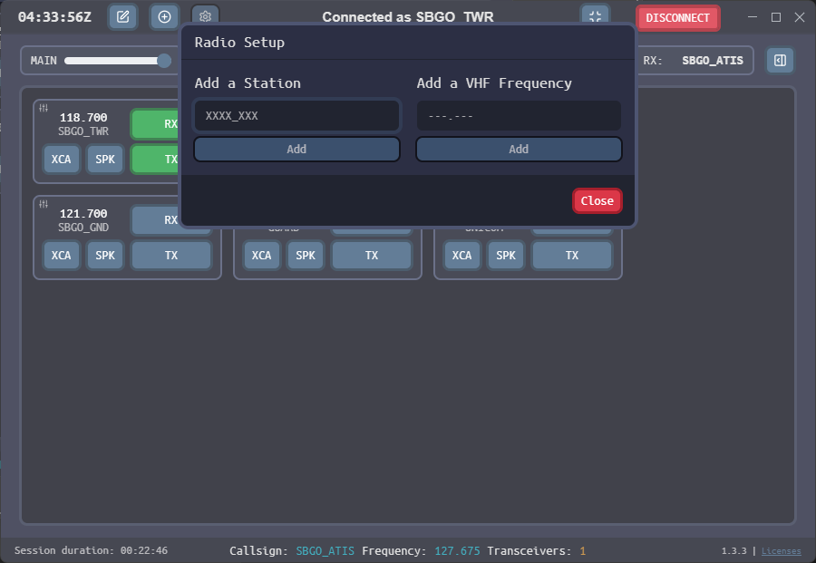{ : style="display:block; margin:auto; border:2px solid #999; height:300px;" } 

The configuration window will allow you to add:  
\- A station, such as \`SBGO\_GND\`, \`SBXP\_APP\`, \`SBRE\_W\_CTR\` etc.  
\- Or a VHF frequency directly, in the \`XXX.XXX\` format.

✅ This function is mainly useful for **APP or CTR controllers** who want to operate with more than one frequency or keep track of adjacent sectors within the same FIR.

## Frequency Activity List (RX LIST)

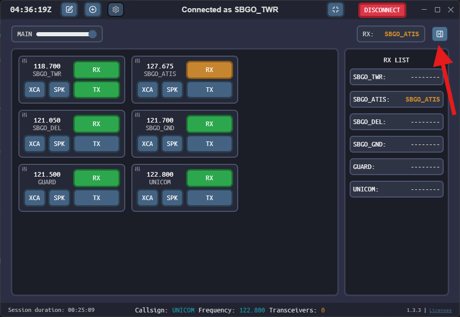{ : style="display:block; margin:auto; border:2px solid #999; height:300px;" } 

When you click the button next to the 'RX:' field, a side panel will open displaying the **RX LIST**.

This list shows all the frequencies you are monitoring, with the **callsigns** of the last stations that spoke on each of them.

🔸 Frequencies with currently active calls appear in **orange**.  
🔸 Frequencies with no recent activity are marked with dashes \`--------\`.

✅ This view is useful for keeping track of multiple frequencies at the same time, especially in APP/CTR operations.

## Ending your Control Session

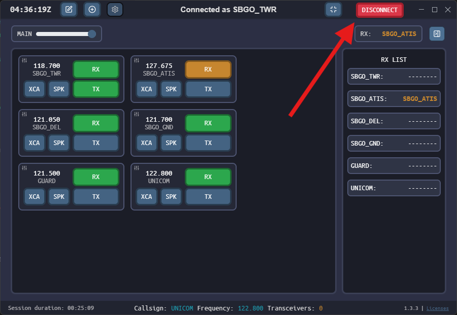{ : style="display:block; margin:auto; border:2px solid #999; height:300px;" } 

To end your audio session in Track Audio, just click the red **DISCONNECT** button in the top-right corner of the interface.

🔸 This will disconnect the controller from the VATSIM voice server and close the frequencies automatically.

🧠 Alternatively, when you **disconnect from EuroScope**, Track Audio itself will detect that your position has closed and will end the session automatically.

## Disconnection Warning and Session Failure

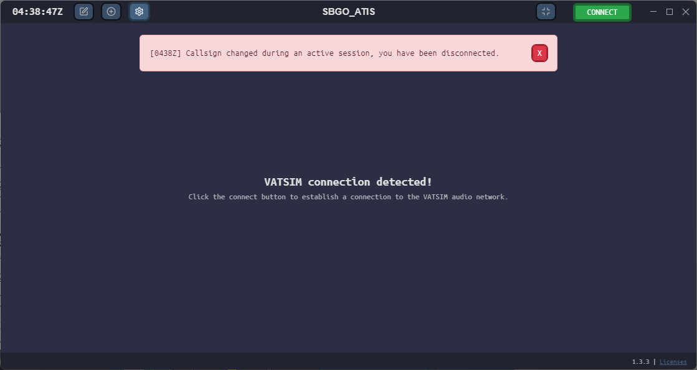{ : style="display:block; margin:auto; border:2px solid #999; height: 300px;" } 

If you change your **callsign** during an active session or lose your connection to the VATSIM network, Track Audio will automatically end the voice session and display a prominent (red) error message.

🔴 The example above shows the warning: \`\[HHMMZ\] Callsign changed during an active session, you have been disconnected.\`

⚠️ In addition, loss of internet connection or of the EuroScope connection will also cause the session to end.  
✅ Pay attention to the **audible alerts** emitted by the software to quickly identify any loss of connection.
