--8<-- "includes/abreviacoes.md"

## Antes de conectar ao Euroscope

Ao abrir o TrackAudio sem o Euroscope conectado, será exibida a mensagem _"No VATSIM connection detected!"_.

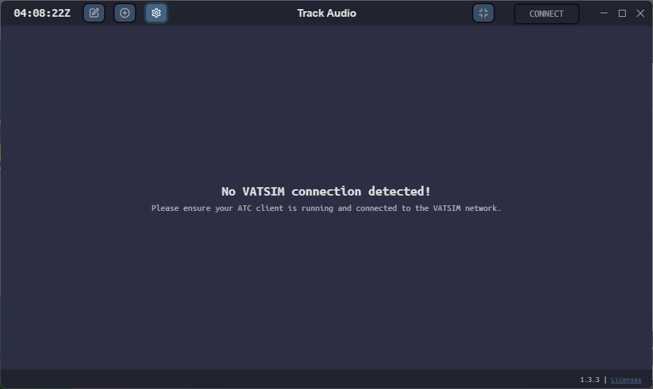{ : style="display:block; margin:auto; border:2px solid #999; height:300px;" }

???+ warning "Atenção!"
    Certifique-se de que o EuroScope esteja rodando e conectado à VATSIM com sua posição de controle.

## Após conectar ao EuroScope

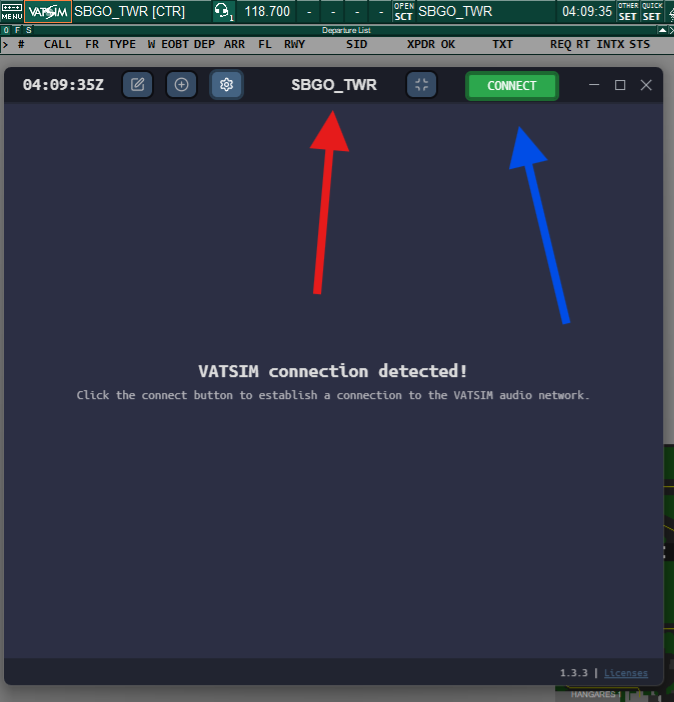{ : style="display:block; margin:auto; border:2px solid #999; height:300px;" }

Assim que o Euroscope estiver conectado corretamente:

1. Seu indicativo de chamada (neste exemplo, `SBGO_TWR`) aparecerá no topo.
2. O botão **CONNECT** ficará ativo em verde, indicando que você pode clicar para se conectar ao servidor de áudio da VATSIM.

## Conectado ao servidor de áudio

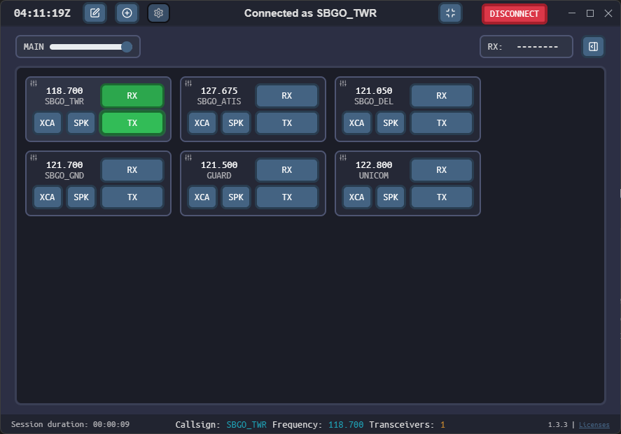{ : style="display:block; margin:auto; border:2px solid #999; height:300px;" }

Após clicar em `CONNECT`, o sistema conecta-se automaticamente e exibe as **frequências disponíveis com base na sua posição**.

???+ warning "Importante!"
    O sistema **não habilita automaticamente as frequências**. Você precisa **marcar manualmente os botões RX e TX** da frequência que deseja utilizar.

    **Exemplo:** frequência 118.700 MHz (`SBGO_TWR`).

**Botões disponíveis:**

* **RX (verde):** você está ouvindo a frequência. Fica **LARANJA** quando há uma transmissão ativa.

* **TX (verde):** pronto para transmitir. Fica **LARANJA** enquanto você estiver falando.

* **SPK:** emite o áudio da frequência no alto-falante.

* **XCA:** ativa o *cross-coupling* de transceptores (explicado a seguir).

## Durante a Transmissão (TX)

{ : style="display:block; margin:auto; border:2px solid #999; height:300px;" }

Quando você pressiona o botão PTT (Push-To-Talk), o botão TX da frequência selecionada ficará laranja, indicando que você está transmitindo.

## Funções XCA e XC

🖱️ Clique com o botão **direito** no botão XCA:  
- Ativa o cross-coupling entre transceptores da **mesma frequência**.
- Permite que pilotos em diferentes áreas da FIR consigam se ouvir.

🖱️ Clique com o botão **esquerdo** no botão XCA:  
- Ativa o cross-coupling entre **diferentes frequências** (XC).  
- Permite juntar frequências diferentes, mas **deve ser usado com cautela**.

✅ Utilize sempre o XCA quando estiver controlando com múltiplos transceptores ativos para garantir a cobertura ideal de voz.

## Modo de Edição de Frequências

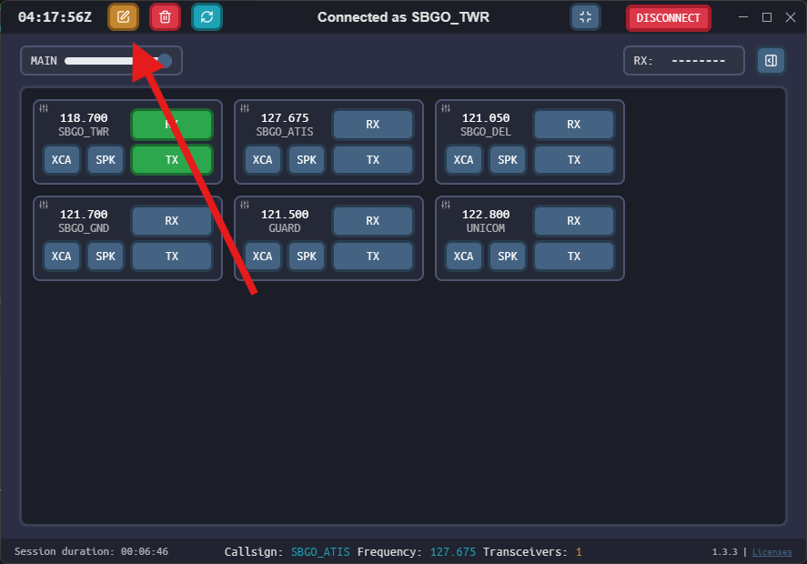{ : style="display:block; margin:auto; border:2px solid #999; height:300px;" }

Ao clicar no ícone do lápis no canto superior, o botão ficará laranja, indicando que o **modo de edição** está ativo no TrackAudio.

Este modo permite **selecionar frequências que você deseja excluir** da sua lista atual.

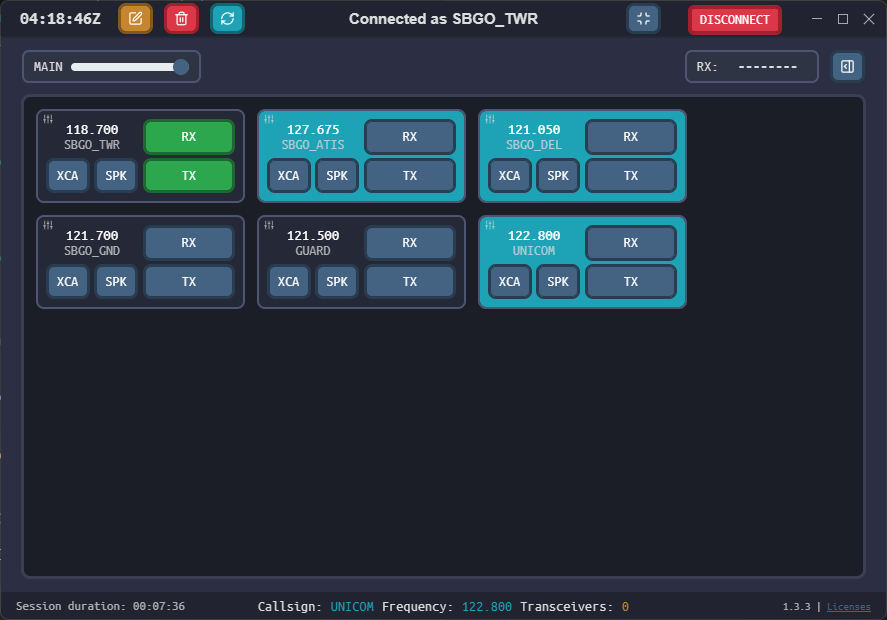{ : style="display:block; margin:auto; border:2px solid #999; height:300px;" } 

As frequências selecionadas para exclusão ficam destacadas em **azul claro**. Basta clicar na lixeira vermelha para removê-las da sua interface.

🔹 Esta função é útil para **organizar** e **limpar frequências que não estão em uso**, especialmente quando múltiplas posições são carregadas automaticamente.

## Ouvindo Múltiplas Frequências Simultaneamente

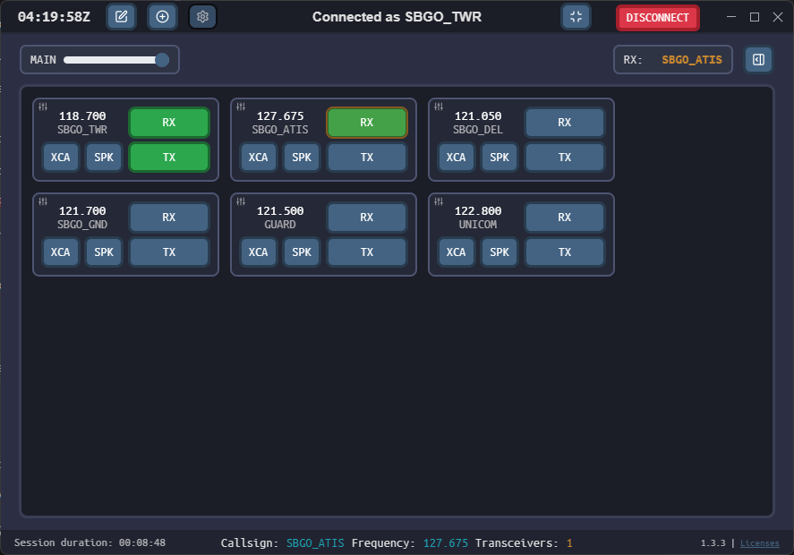{ : style="display:block; margin:auto; border:2px solid #999; height:300px;" } 

O Track Audio permite ouvir múltiplas frequências ao mesmo tempo. Neste exemplo, o controlador está ouvindo:

\- SBGO\_TWR (118.700 MHz)  
\- SBGO\_ATIS (127.675 MHz)

🔸 O botão **RX** da frequência ATIS está laranja, indicando que há uma transmissão ativa naquele canal.

✅ Essa função é útil para controladores que precisam monitorar setores adjacentes, frequências auxiliares, ou quando desejam escutar o ATIS local durante a operação.

## Controle de Volume Principal

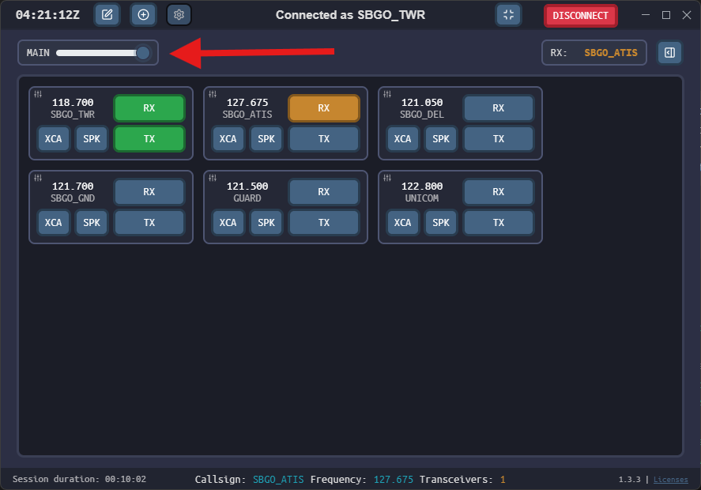{ : style="display:block; margin:auto; border:2px solid #999; height:300px;" } 

O controle deslizante indicado acima ajusta o **volume principal (MAIN)** do Track Audio.

🔊 Ao mover o controle para a esquerda, o volume de **todas as frequências** será reduzido proporcionalmente.  
🔊 Ao mover para a direita, o volume geral será aumentado.

Esta função é útil para fazer ajustes rápidos sem precisar configurar o volume individual de cada frequência RX.

## Modo Minimizado (Docking)

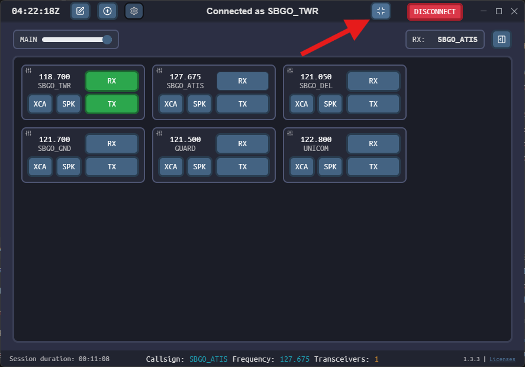{ : style="display:block; margin:auto; border:2px solid #999; height:300px;" } 

Clicando no botão no canto superior direito, conforme indicado na imagem acima, o Track Audio entra no modo **minimizado (docking)**.

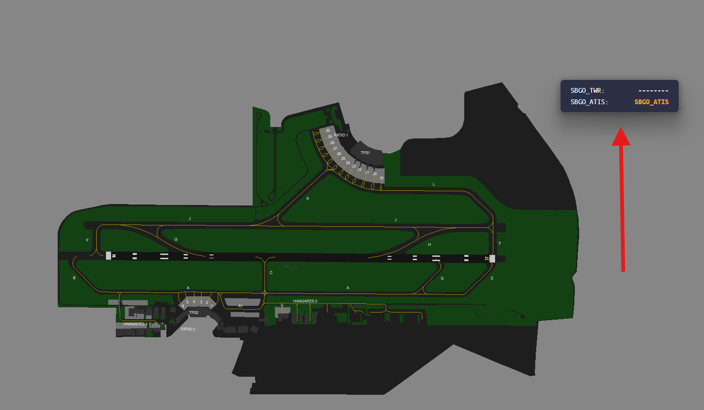{ : style="display:block; margin:auto; border:2px solid #999; height:300px;" } 

Neste modo, o TrackAudio aparece como uma pequena janela flutuante discreta, normalmente posicionada sobre o radar do EuroScope. Ele continua funcionando normalmente, exibindo a frequência RX ativa (neste exemplo: SBGO\_ATIS).

✅ Ideal para manter a interface limpa durante o controle, sem perder o acompanhamento da frequência atual.

## Monitoramento de Frequências no Modo Minimizado

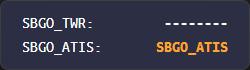{ : style="display:block; margin:auto; border:2px solid #999;" } 

Mesmo no modo minimizado, o TrackAudio exibe informações importantes sobre as frequências monitoradas:

🔸 À esquerda, são listadas as frequências configuradas (como SBGO\_TWR e SBGO\_ATIS).  
🔸 À direita, são mostrados os **indicativos de chamada (callsigns)** dos tráfegos que estão transmitindo.

🟧 Quando o callsign está em **laranja**, como no exemplo SBGO\_ATIS, significa que **há uma transmissão ativa** nesta frequência.  
➖ Caso apareçam apenas traços "------", significa que **ninguém falou** na frequência principal ainda.

✅ Após o fim da transmissão, o callsign do último tráfego que falou permanece visível em branco, informando o histórico recente.

## Indicadores de Transmissão e Rodapé de Sessão

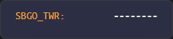{ : style="display:block; margin:auto; border:2px solid #999;" } 

Ao transmitir em uma frequência, seu indicativo de chamada (**callsign**) aparecerá em **laranja**, tanto na visualização minimizada quanto na maximizada. Esse indicativo volta a branco ao fim da transmissão, permanecendo visível como histórico.

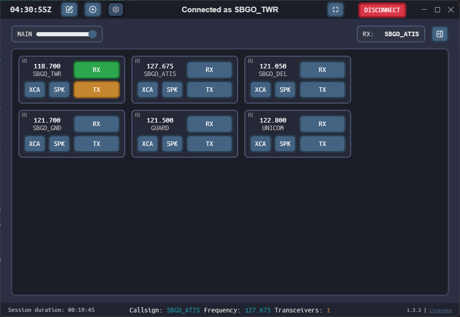{ : style="display:block; margin:auto; border:2px solid #999; height:300px;" } 

Na interface principal, o botão **TX** também ficará laranja enquanto você estiver falando (Push-To-Talk pressionado).

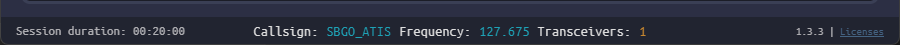{ : style="display:block; margin:auto; border:2px solid #999;" } 

No rodapé do Track Audio, você pode visualizar:  
\- ⏱️ Duração da sessão atual  
\- 📛 Seu **indicativo de chamada** (Callsign)  
\- 📡 A frequência ativa  
\- 📶 O número de transceivers em uso naquela frequência

Essas informações ajudam a manter o controle técnico da sua sessão e identificar se o áudio está sendo roteado corretamente.

## Adicionando Frequências Manualmente

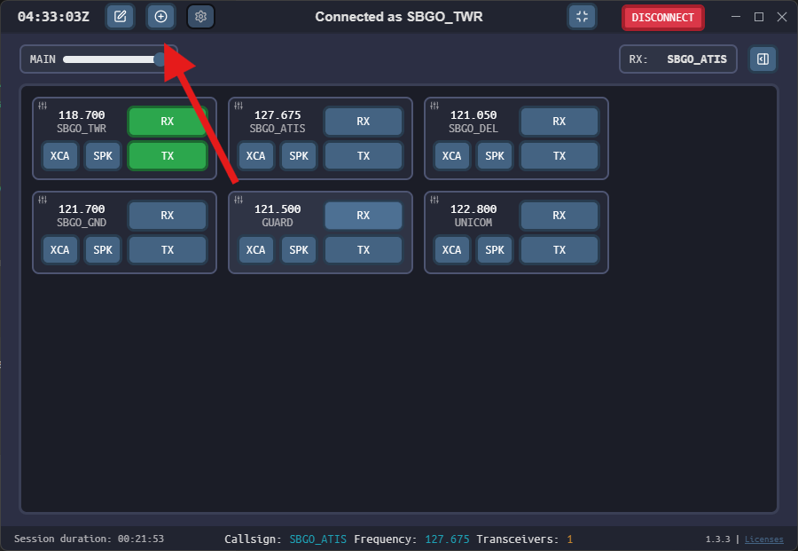{ : style="display:block; margin:auto; border:2px solid #999; height:300px;" } 

Para adicionar uma nova frequência ao painel do Track Audio, clique no botão de **"+"** localizado no canto superior esquerdo, ao lado dos botões de edição e configurações.

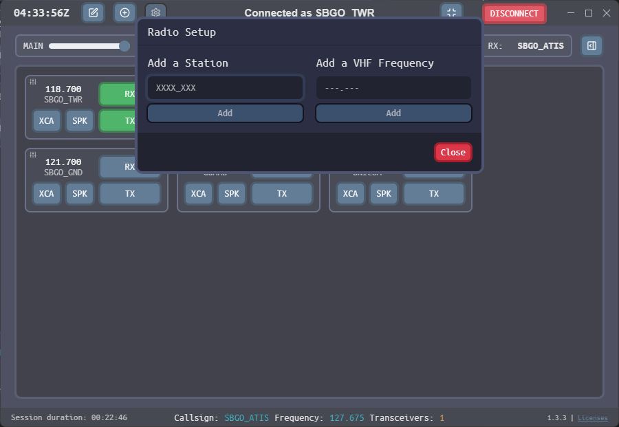{ : style="display:block; margin:auto; border:2px solid #999; height:300px;" } 

A janela de configuração permitirá que você adicione:  
\- Uma estação, como \`SBGO\_GND\`, \`SBXP\_APP\`, \`SBRE\_W\_CTR\` etc.  
\- Ou diretamente uma frequência VHF no formato \`XXX.XXX\`.

✅ Essa função é útil principalmente para **controladores de APP ou CTR**, que desejam operar com mais de uma frequência ou manter controle sobre setores adjacentes dentro da mesma FIR.

## Lista de Atividade de Frequências (RX LIST)

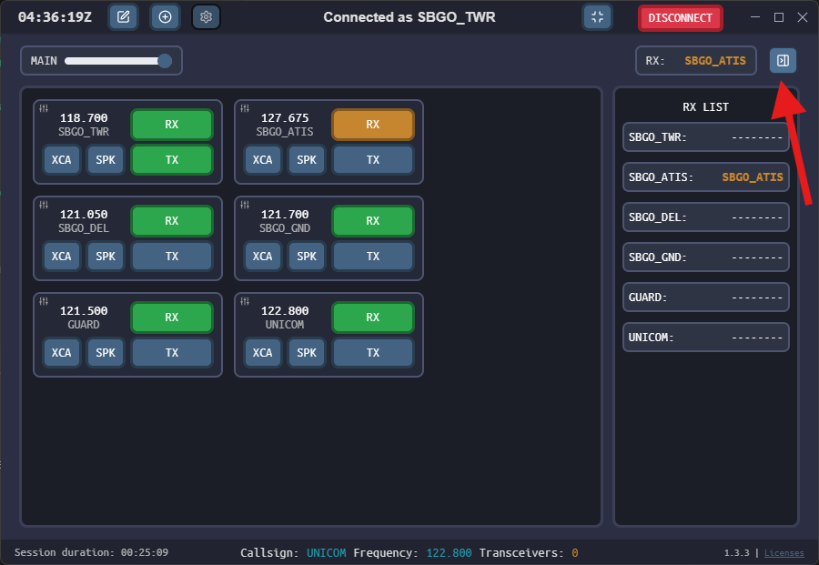{ : style="display:block; margin:auto; border:2px solid #999; height:300px;" } 

Ao clicar no botão ao lado do campo 'RX:', uma aba lateral será aberta exibindo a **RX LIST**.

Essa lista mostra todas as frequências que você está monitorando, com os respectivos **indicativos de chamada (callsigns)** dos últimos tráfegos que falaram em cada uma delas.

🔸 Frequências com chamadas ativas no momento aparecem em **laranja**.  
🔸 Frequências sem atividade recente são marcadas com traços \`--------\`.

✅ Essa visualização é útil para manter o controle sobre múltiplas frequências ao mesmo tempo, especialmente em operações APP/CTR.

## Encerrando sua Sessão de Controle

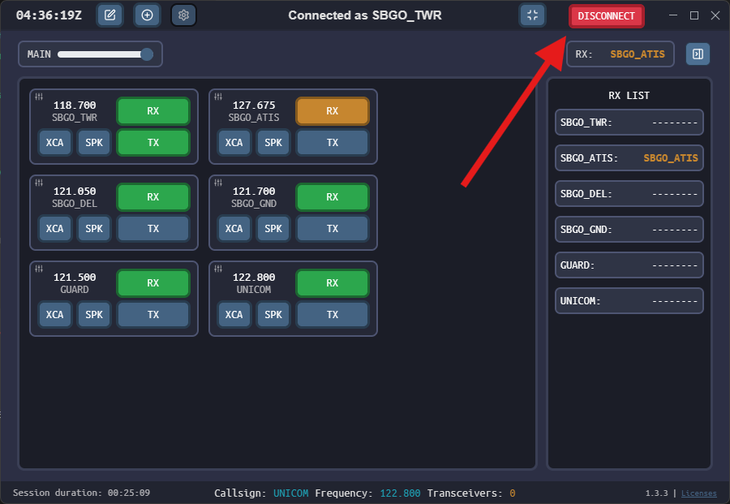{ : style="display:block; margin:auto; border:2px solid #999; height:300px;" } 

Para encerrar sua sessão de áudio no Track Audio, basta clicar no botão vermelho **DISCONNECT** no canto superior direito da interface.

🔸 Isso irá desconectar o controlador do servidor de voz da VATSIM e fechar as frequências automaticamente.

🧠 Alternativamente, ao **desconectar-se do EuroScope**, o próprio Track Audio identificará o encerramento da sua posição e finalizará a sessão de forma automática.

## Aviso de Desconexão e Falha de Sessão

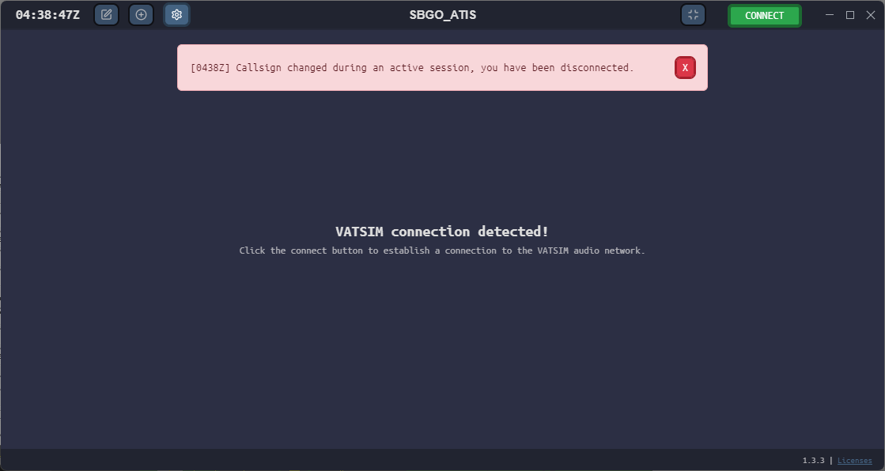{ : style="display:block; margin:auto; border:2px solid #999; height: 300px;" } 

Caso você altere seu **callsign** durante uma sessão ativa ou perca a conexão com a rede VATSIM, o Track Audio irá automaticamente encerrar a sessão de voz e exibirá uma mensagem de erro em destaque (vermelha).

🔴 O exemplo acima mostra o aviso: \`\[HHMMZ\] Callsign changed during an active session, you have been disconnected.\`

⚠️ Além disso, quedas de conexão com a internet ou o EuroScope também causarão o encerramento da sessão.  
✅ Fique atento aos **avisos sonoros** emitidos pelo software para identificar rapidamente qualquer perda de conexão.

#

---

<a href="../instalacao/">
←
Página anterior
|
TrackAudio | Instalação
</a>

<a href="../../vatis/">
Próxima página
|
vATIS |  Instalação
→
</a>

