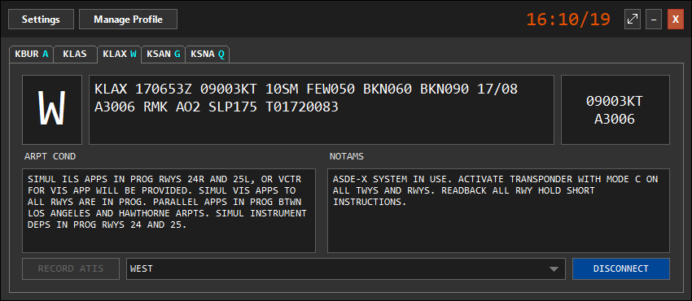

--8<-- "includes/abreviacoes.md"

O [vATIS](https://vatis.app) é o programa onde são criadas e difundidas as informações ATIS dos aeroportos onde o controlador se conectar.

A VATSIM Brasil disponibiliza um perfil pronto para cada FIR, com as estações, os presets de pista e o formato das mensagens já configurados. Veja como importá-los em [Instalação](instalacao.pt.md) e como operar o ATIS em [Utilização](utilizacao.pt.md).

{ loading=lazy }