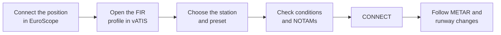

--8<-- "includes/abreviacoes.md"


This page shows how to prepare, publish and maintain an ATIS with vATIS using the VATSIM Brasil profiles. It assumes the [installation](instalacao.en.md) and the profile import are already done.

## Overview

The ATIS is published as a connection of its own (`SBCT_ATIS`, for example), separate from your control position. A session goes like this:



!!! warning "Attention!"
    Connect your control position in EuroScope first. The ATIS must go with an active position and must not stay online after you disconnect.

## The main window

<figure markdown>
{ : style="border:2px solid #999" loading=lazy }
<figcaption>Main window. Image: <a href="https://vatis.app/docs/client/main-widnow.html">official vATIS documentation</a>.</figcaption>
</figure>

1. **User Settings.** Credentials and update sounds (see [User settings](instalacao.en.md#user-settings)).
2. **ATIS Configuration.** Profile editing: stations, presets, formatting and contractions. Day to day there is no need to touch it.
3. **Window controls.** Pin on top, switch to the mini-window, minimize and close.
4. **Stations.** One tab per aerodrome in the profile. Connected stations show the ATIS letter next to the identifier.
5. **ATIS letter.** Left-click advances the letter and right-click moves it back.
6. Station's current **METAR**.
7. **Wind and QNH** taken from the METAR.
8. **Airport Conditions.** Expected approach and runways in use.
9. **NOTAMs.** Notices to pilots.
10. **Record ATIS.** Records an ATIS in your own voice. The VATSIM Brasil profiles use a synthesized voice, so the button is disabled.
11. **Presets.** The station's predefined configurations, usually one per runway in use.
12. **Connect.** Connects and disconnects the ATIS from the network.

## Preparing the ATIS

### 1. Choose the station and the preset

Click the aerodrome tab and choose the preset matching the **runway in use**. In the VATSIM Brasil profiles, the preset name tells the configuration. For example:

| Station | Presets |
|---|---|
| SBCT | `15`, `33`, `11`, `29` |
| SBGR | `10`, `28`, `10 CAT II/III`, `SOMENTE 10L`, `SOMENTE 28R` |
| SBBR | `11 OPSI`, `29 OPSI`, `11 NAO OPSI`, `29 NAO OPSI` |
| SBVT | `APENAS 02`, `APENAS 20`, `MIX DEP 20 LDG 24`, ... |

Choosing the preset fills the **Airport Conditions** field with the expected approach and the landing and takeoff runways. SBCT preset `15`, for example, brings:

```text
EXPECT ILS *X RWY 15
LDG RWY 15
TKOF RWY 15
```

!!! tip "Tip"
    The runway in use must be the same as in EuroScope and the one agreed with the other units. When in doubt, check the [aerodrome](../../../MOP/aerodromos/index.en.md) SOP.

### 2. Check the airport conditions and NOTAMs

The **Airport Conditions** and **NOTAMs** fields accept free text. Each station can also have predefined messages that you switch on and off without typing. Click the field title (`AIRPORT CONDITIONS` or `NOTAMS`) to open the list:

<figure markdown>
{ : style="border:2px solid #999; max-width:480px" loading=lazy }
<figcaption>Predefined NOTAM list. Image: <a href="https://vatis.app/docs/client/notams.html">official vATIS documentation</a>.</figcaption>
</figure>

- Tick the messages that should go into the ATIS. They appear in list order, which can be changed with `Up` and `Down`.
- Ticked messages appear in **cyan** in the field and cannot be edited there. The free text comes before or after them, depending on the *Include before free-form* option.
- In the VATSIM Brasil profiles, the predefined NOTAMs cover situations such as a closed runway (`RWY 11/29 CLSD.` at SBCT).

!!! warning "Attention!"
    vATIS remembers the messages ticked in the previous session. Before connecting, check that the conditions and NOTAMs still apply.

### 3. Write text the voice can read

The ATIS is read by a synthesized voice, in English. vATIS recognizes a few conventions to pronounce free text correctly:

| Write | The voice reads | Use |
|---|---|---|
| `RWY 15` or `^15` | *runway one five* | Runways |
| `TWY E16` | *taxiway echo sixteen* | Taxiways |
| `*5058` | *five thousand fifty-eight* | Grouped numbers |
| `+SBCT` | Aerodrome name | Aerodromes and navaids |
| `@` + name | Contraction content | Profile contractions |

**Contractions** are replacements defined in the profile. At SBCT, for example, the `TKOF` contraction is read as *takeoff*. To insert one, type `@` in the field and pick it from the list:

<figure markdown>
{ : style="border:2px solid #999; max-width:480px" loading=lazy }
<figcaption>Inserting a contraction with <code>@</code>. Image: <a href="https://vatis.app/docs/client/notams.html">official vATIS documentation</a>.</figcaption>
</figure>

## Publishing the ATIS

1. With the station, preset, conditions and NOTAMs checked, click `CONNECT`.
2. The button turns into `DISCONNECT` (blue) and the letter turns **cyan** on the station tab.
3. Confirm the letter. To adjust it, left-click (advance) or right-click (back). To type a specific letter, use `Shift` + left double-click.

<figure markdown>
{ : style="border:2px solid #999" loading=lazy }
<figcaption>Connected station: cyan letter on the tab, predefined NOTAM in cyan and <code>DISCONNECT</code> button. Image: <a href="https://vatis.app/docs/client/atis-station.html">official vATIS documentation</a>.</figcaption>
</figure>

### What the profile builds for you

With the ATIS online, vATIS assembles the information in the order set by the preset. At SBCT, the structure is:

```text
SBCT ATIS [ATIS_CODE] [TIME]
[ARPT_COND]
[TL]
[WIND]
[VIS]
[RVR]
[PRESENT_WX]
[CLOUDS]
[TEMP] / [DEW]
[PRESSURE]
[TREND]
[WS]
[NOTAMS]
[CLOSING]
```

Each bracketed field is filled in automatically: the weather comes from the METAR, `[ARPT_COND]` and `[NOTAMS]` come from the fields you checked, and the QNH is read in hectopascals. The **transition level** (`[TL]`) is calculated from the QNH with the TMA's table. For SBCT:

| QNH (hPa) | Transition level |
|---|---|
| 901 to 958 | FL115 |
| 959 to 976 | FL110 |
| 977 to 994 | FL105 |
| 995 to 1012 | FL100 |
| 1013 to 1031 | FL095 |
| 1032 to 1099 | FL090 |

The voice message ends by asking the pilot to acknowledge the information, for example *"acknowledge you received information alfa"*.

## Keeping the ATIS up to date

- **New METAR.** When a METAR is issued, vATIS updates the ATIS and the letter **blinks**. Click the letter once to acknowledge the update.
- **Runway change.** Switch the preset, check conditions and NOTAMs and advance the letter. Tell the traffic on frequency and the adjacent units about the change.
- **Other changes.** When you change conditions or NOTAMs with the ATIS online, advance the letter so pilots know there is new information.

<figure markdown>
{ : style="border:2px solid #999; max-width:480px" loading=lazy }
<figcaption>Acknowledging an update: the letter blinks until it is clicked. Image: <a href="https://vatis.app/docs/client/atis-station.html">official vATIS documentation</a>.</figcaption>
</figure>

!!! info "Shared letter"
    The letter is synchronized between all controllers who have the same station in vATIS. After the ATIS disconnects, it stays synchronized for 5 minutes.

## Mini-window

To save screen space, use the mini-window button (item 3 of the main window). It shows only the letter, wind and QNH of the connected stations: yours in **cyan** and other controllers' in **red**.

<figure markdown>
{ : style="border:2px solid #999; max-width:280px" loading=lazy }
<figcaption>Mini-window. Image: <a href="https://vatis.app/docs/client/mini-window.html">official vATIS documentation</a>.</figcaption>
</figure>

- Click a blinking letter to acknowledge the update, or middle-click to acknowledge all of them at once.
- Right-click to pin the window on top, choose which stations to show or return to the full window.

## Closing

1. Click `DISCONNECT` on the station.
2. Only then disconnect your position in EuroScope.

If another controller will take over the aerodrome, agree beforehand on who publishes the ATIS, so there are never two ATIS for the same station.

## Learn more

- [Official vATIS documentation](https://vatis.app/docs/).
- Each aerodrome's frequencies and `_ATIS` callsigns are in the [aerodrome](../../../MOP/aerodromos/index.en.md) SOPs.
