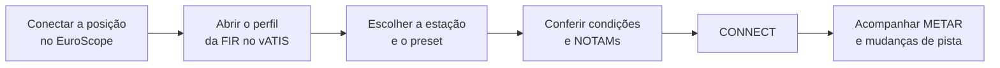

--8<-- "includes/abreviacoes.md"

# Utilização

Esta página mostra como preparar, publicar e manter um ATIS com o vATIS usando os perfis da VATSIM Brasil. Ela parte do ponto em que a [instalação](instalacao.pt.md) e a importação dos perfis já foram feitas.

## Visão geral

O ATIS é publicado como uma conexão própria (`SBCT_ATIS`, por exemplo), separada da sua posição de controle. O fluxo de uma sessão é este:



!!! warning "Atenção!"
    Conecte primeiro a sua posição de controle no EuroScope. O ATIS deve acompanhar uma posição ativa e não deve ficar no ar depois que você desconectar.

## A janela principal

<figure markdown>
{ : style="border:2px solid #999" loading=lazy }
<figcaption>Janela principal. Imagem: <a href="https://vatis.app/docs/client/main-widnow.html">documentação oficial do vATIS</a>.</figcaption>
</figure>

1. **User Settings.** Dados de acesso e avisos sonoros (veja [Configurações do usuário](instalacao.pt.md#configuracoes-do-usuario)).
2. **ATIS Configuration.** Edição do perfil: estações, presets, formatação e contrações. No dia a dia não é preciso mexer aqui.
3. **Controles da janela.** Fixar no topo, alternar para a mini-janela, minimizar e fechar.
4. **Estações.** Uma aba por aeródromo do perfil. As estações conectadas mostram a letra do ATIS ao lado do indicativo.
5. **Letra do ATIS.** Clique esquerdo avança a letra e clique direito volta.
6. **METAR** atual da estação.
7. **Vento e QNH** extraídos do METAR.
8. **Airport Conditions.** Condições do aeródromo: aproximação esperada e pistas em uso.
9. **NOTAMs.** Avisos aos pilotos.
10. **Record ATIS.** Grava um ATIS com a sua voz. Os perfis da VATSIM Brasil usam voz sintetizada, então o botão fica desabilitado.
11. **Presets.** Configurações pré-definidas da estação, normalmente uma por cabeceira em uso.
12. **Connect.** Conecta e desconecta o ATIS da rede.

## Preparando o ATIS

### 1. Escolha a estação e o preset

Clique na aba do aeródromo e escolha o preset correspondente à **pista em uso**. Nos perfis da VATSIM Brasil, o nome do preset indica a configuração. Por exemplo:

| Estação | Presets |
|---|---|
| SBCT | `15`, `33`, `11`, `29` |
| SBGR | `10`, `28`, `10 CAT II/III`, `SOMENTE 10L`, `SOMENTE 28R` |
| SBBR | `11 OPSI`, `29 OPSI`, `11 NAO OPSI`, `29 NAO OPSI` |
| SBVT | `APENAS 02`, `APENAS 20`, `MIX DEP 20 LDG 24`, ... |

Ao escolher o preset, o campo **Airport Conditions** é preenchido com a aproximação esperada e as pistas de pouso e decolagem. O preset `15` de SBCT, por exemplo, traz:

```text
EXPECT ILS *X RWY 15
LDG RWY 15
TKOF RWY 15
```

!!! tip "Dica"
    A pista em uso deve ser a mesma do EuroScope e a combinada com os demais órgãos. Na dúvida, consulte o MOP do [aeródromo](../../../MOP/aerodromos/index.pt.md).

### 2. Confira as condições do aeródromo e os NOTAMs

Os campos **Airport Conditions** e **NOTAMs** aceitam texto livre. Além disso, cada estação pode ter mensagens pré-definidas, que você liga e desliga sem precisar digitar. Clique no título do campo (`AIRPORT CONDITIONS` ou `NOTAMS`) para abrir a lista:

<figure markdown>
{ : style="border:2px solid #999; max-width:480px" loading=lazy }
<figcaption>Lista de NOTAMs pré-definidos. Imagem: <a href="https://vatis.app/docs/client/notams.html">documentação oficial do vATIS</a>.</figcaption>
</figure>

- Marque as mensagens que devem entrar no ATIS. Elas aparecem na ordem da lista, que pode ser alterada com `Up` e `Down`.
- As mensagens marcadas aparecem em **ciano** no campo e não podem ser editadas ali. O texto livre vem antes ou depois delas, conforme a opção *Include before free-form*.
- Nos perfis da VATSIM Brasil, os NOTAMs pré-definidos tratam de situações como pista fechada (`RWY 11/29 CLSD.` em SBCT).

!!! warning "Atenção!"
    O vATIS lembra as mensagens marcadas na sessão anterior. Antes de conectar, confira se as condições e os NOTAMs ainda valem.

### 3. Escreva textos que a voz consiga ler

O ATIS é lido por voz sintetizada, em inglês. O vATIS reconhece algumas convenções para pronunciar corretamente o texto livre:

| Escreva | A voz lê | Uso |
|---|---|---|
| `RWY 15` ou `^15` | *runway one five* | Pistas |
| `TWY E16` | *taxiway echo sixteen* | Pistas de táxi |
| `*5058` | *five thousand fifty-eight* | Números agrupados |
| `+SBCT` | Nome do aeródromo | Aeródromos e auxílios |
| `@` + nome | Conteúdo da contração | Contrações do perfil |

As **contrações** são substituições definidas no perfil. Em SBCT, por exemplo, a contração `TKOF` é lida como *takeoff*. Para inserir uma, digite `@` no campo e escolha na lista que aparece:

<figure markdown>
{ : style="border:2px solid #999; max-width:480px" loading=lazy }
<figcaption>Inserindo uma contração com <code>@</code>. Imagem: <a href="https://vatis.app/docs/client/notams.html">documentação oficial do vATIS</a>.</figcaption>
</figure>

## Publicando o ATIS

1. Com a estação, o preset, as condições e os NOTAMs conferidos, clique em `CONNECT`.
2. O botão passa a `DISCONNECT` (azul) e a letra fica em **ciano** na aba da estação.
3. Confirme a letra. Para ajustá-la, use clique esquerdo (avança) ou direito (volta). Para digitar uma letra específica, use `Shift` + duplo clique esquerdo.

<figure markdown>
{ : style="border:2px solid #999" loading=lazy }
<figcaption>Estação conectada: letra em ciano na aba, NOTAM pré-definido em ciano e botão <code>DISCONNECT</code>. Imagem: <a href="https://vatis.app/docs/client/atis-station.html">documentação oficial do vATIS</a>.</figcaption>
</figure>

### O que o perfil monta sozinho

Com o ATIS no ar, o vATIS junta as informações na ordem definida pelo preset. Em SBCT, a estrutura é:

```text
SBCT ATIS [ATIS_CODE] [TIME]
[ARPT_COND]
[TL]
[WIND]
[VIS]
[RVR]
[PRESENT_WX]
[CLOUDS]
[TEMP] / [DEW]
[PRESSURE]
[TREND]
[WS]
[NOTAMS]
[CLOSING]
```

Cada campo entre colchetes é preenchido automaticamente: as informações meteorológicas vêm do METAR, `[ARPT_COND]` e `[NOTAMS]` vêm dos campos que você conferiu, e o QNH é lido em hectopascais. O **nível de transição** (`[TL]`) é calculado pelo QNH com a tabela da TMA. Para SBCT:

| QNH (hPa) | Nível de transição |
|---|---|
| 901 a 958 | FL115 |
| 959 a 976 | FL110 |
| 977 a 994 | FL105 |
| 995 a 1012 | FL100 |
| 1013 a 1031 | FL095 |
| 1032 a 1099 | FL090 |

A mensagem de voz termina pedindo ao piloto que confirme o recebimento da informação, por exemplo *"acknowledge you received information alfa"*.

## Mantendo o ATIS atualizado

- **METAR novo.** Quando sai um METAR, o vATIS atualiza o ATIS e a letra **pisca**. Clique uma vez na letra para confirmar que viu a atualização.
- **Mudança de pista.** Troque o preset, confira condições e NOTAMs e avance a letra. Avise a mudança aos tráfegos na frequência e aos órgãos adjacentes.
- **Outras mudanças.** Ao alterar condições ou NOTAMs com o ATIS no ar, avance a letra para que os pilotos saibam que há informação nova.

<figure markdown>
{ : style="border:2px solid #999; max-width:480px" loading=lazy }
<figcaption>Confirmando uma atualização: a letra pisca até receber um clique. Imagem: <a href="https://vatis.app/docs/client/atis-station.html">documentação oficial do vATIS</a>.</figcaption>
</figure>

!!! info "Letra compartilhada"
    A letra é sincronizada entre todos os controladores que têm a mesma estação no vATIS. Depois que o ATIS desconecta, ela continua sincronizada por 5 minutos.

## Mini-janela

Para economizar espaço na tela, use o botão de mini-janela (item 3 da janela principal). Ela mostra só a letra, o vento e o QNH das estações conectadas: em **ciano** as suas e em **vermelho** as de outros controladores.

<figure markdown>
{ : style="border:2px solid #999; max-width:280px" loading=lazy }
<figcaption>Mini-janela. Imagem: <a href="https://vatis.app/docs/client/mini-window.html">documentação oficial do vATIS</a>.</figcaption>
</figure>

- Clique na letra que estiver piscando para confirmar a atualização, ou use o botão do meio do mouse para confirmar todas de uma vez.
- Clique com o botão direito para fixar a janela no topo, escolher quais estações exibir ou voltar à janela completa.

## Encerrando

1. Clique em `DISCONNECT` na estação.
2. Só depois desconecte a sua posição no EuroScope.

Se outro controlador for assumir o aeródromo, combine com ele antes quem publica o ATIS, para não haver dois ATIS para a mesma estação.

## Para saber mais

- [Documentação oficial do vATIS](https://vatis.app/docs/) (em inglês).
- As frequências e os indicativos `_ATIS` de cada aeródromo estão nos MOPs de [aeródromos](../../../MOP/aerodromos/index.pt.md).
