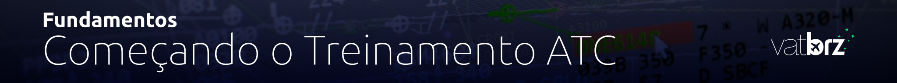

--8<-- "includes/abreviacoes.md"

## Introdução

Interessado em se tornar um Controlador de Tráfego Aéreo na Rede VATSIM, controlando um dos espaços aéreos mais movimentados da América do Sul? Aqui está tudo o que você precisa saber para começar.

## 📌 Requisitos e Expectativas

Tornar-se um controlador exige:

* Compromisso
* Disciplina
* Autoestudo
* Disposição para aprender continuamente

A VATSIM segue um sistema de classificações que determinam as posições que você pode controlar, semelhante ao treinamento de ATC do mundo real.

!!! warning "Importante"
    Você deve ser membro residente da Vatsim Brasil antes de iniciar o treinamento ATC.

Verifique seu status e como ingressar aqui: [Entrando na Vatbrz](https://atc.vatsim.com.br/fundamentos/inscricao/)

## 🧰 Softwares Utilizados

Antes de observar ou treinar, instale os seguintes programas:

- [Euroscope e Sector Files](https://atc.vatsim.com.br/fundamentos/softwares/euroscope/)
- [TrackAudio](https://atc.vatsim.com.br/fundamentos/softwares/trackaudio/)
- [vATIS](https://atc.vatsim.com.br//fundamentos/softwares/vatis/)

## 🎓 Ratings ATC na VATSIM

O sistema de ratings ATC da VATSIM Brasil é dividido em níveis, cada um com suas próprias responsabilidades e permissões:

| Rating | Descrição                         |
|--------|-----------------------------------|
| S1     | Controlador em Desenvolvimento    |
| S2     | Controlador de Aeródromo          |
| S3     | Controlador de Terminal           |
| C1     | Controlador de Setores Em Rota    |
| C3     | Controlador Sênior                |
| I1     | Instrutor                         |
| I3     | Instrutor Sênior                  |

### Requisitos

#### S1 (Developing Controller)
- Aprovação em prova teórica no [Centro de Treinamento da Vatsim Brasil](<https://treinamento.vatsim.com.br>).
- Treinamento com um de nossos mentores para ambientação.
- O rating te habilita a controlar todas as posições **_DEL e _GND** na jurisdição da Vatsim Brasil.

#### S2 (Aerodrome Controller)
- Aprovação em prova teórica no [Centro de Treinamento da Vatsim Brasil](<https://treinamento.vatsim.com.br>).
- Treinamento com um de nossos mentores para aprofundamento.
- Check prático.
- O rating te habilita a controlar todas as posições **_TWR** na jurisdição da Vatsim Brasil.

#### S3 (Terminal Controller)
- Aprovação em prova teórica no [Centro de Treinamento da Vatsim Brasil](<https://treinamento.vatsim.com.br>).
- **10h** horas mínimas de conexão em **_TWR como S2**.
- Treinamento com um de nossos mentores para aprofundamento.
- **10h** horas mínimas de solo trainee como **_APP**.
- Check prático.
- O rating te habilita a controlar todas as posições **_APP** na jurisdição da Vatsim Brasil.

#### C1 (Enroute Controller)
- Aprovação em prova teórica no [Centro de Treinamento da Vatsim Brasil](<https://treinamento.vatsim.com.br>).
- **10h** horas mínimas de conexão em **_APP como S3**.
- Treinamento com um de nossos mentores para aprofundamento.
- **15h** horas mínimas de solo trainee como **_CTR**.
- Check prático.
- O rating te habilita a controlar todas as posições **_CTR** na jurisdição da Vatsim Brasil.

#### I1 (Instructor)
- Os requisitos para o rating I1 podem ser encontrados na seção 4.1 da [Política de Divisão - VATSIM Brasil](<https://vatsim.com.br/documentos/politica-de-divisao>).

#### C3 e I3 (Senior Controller e Senior Instructor)
Os requisitos para os ratings C3 e I3 podem ser encontrados nas seções 3.6 e 4.2, respectivamente, da [Política de Divisão - VATSIM Brasil](<https://vatsim.com.br/documentos/politica-de-divisao>).

## 📖 Inscrição no Treinamento de S1

Para iniciar seu treinamento ATC na Vatsim Brasil, siga estes passos:

* Visite a Central de Treinamento da Vatsim Brasil.
* Cadastre-se e se inscreva no curso de S1.
* Realize o curso e passe no exame teórico.
* Após a aprovação, abra um ticket no Discord da Vatsim Brasil para agendar sua primeira sessão de treinamento prático com um mentor ATC.

## 🛫 Treinamento Prático

O treinamento prático consiste em sessão(ões) individual(is) com um mentor ATC certificado. Durante essas sessões, você praticará o controle de tráfego aéreo em um ambiente simulado, aplicando os conhecimentos adquiridos no curso teórico.

## 🧪 Concessão do Rating

Depois de concluir todas as sessões de treinamento prático, o mentor ATC avaliará seu desempenho e determinará se você está pronto para receber seu rating S1.

✅ Se for julgado apto, o mentor encaminhará sua aprovação para a equipe de treinamento da Vatsim Brasil, que liberará seu rating em tempo hábil.

## 🌐 Próximos Passos

Após obter seu rating S1, você pode continuar seu desenvolvimento como controlador ATC, buscando ratings mais avançados e participando de eventos na rede VATSIM.

#

<!-- ---

<a href="../inscricao/">
←
Página anterior
|
Entrando na Vatbrz
</a>

<a href="../softwares/euroscope/">
Próxima página
|
Euroscope | Visão Geral
→
</a>

 -->