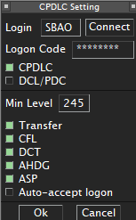

Due to the extensive coverage over the Ocean, the Atlântico ACC lacks radar control and high-quality radio communication, as it is impossible to install antennas. Therefore, controlling the Atlântico requires knowledge of alternative control and communication procedures, which depend on the operational capability of the aircraft flying in the airspace.

It is necessary for the controller to know all these procedures and use them as needed.

## Control Procedures

Atlântico does not operate using radar control. The vertical and lateral position of the aircraft is estimated by two methods: via **ADS-C** or via **position reports**.

### ADS-C

The use of **Automatic Dependent Surveillance - Contract** (ADS-C) is becoming increasingly common as support for exercising Control in the Atlantic. ADS-C is a system where the equipment on board the aircraft automatically transmits navigation system information to the ground system via a data link and in accordance with certain rules (contract) regarding the frequency of transmissions and the content of the information. This information is presented to the air traffic controller in a manner similar to radar-obtained data.

#### Prerequisites

To confirm the feasibility of the ADS-C service for an aircraft that will fly over the Atlantic, the Controller must:

**1. Verify the existence of the equipment on board the aircraft.**

Check the aircraft’s flight plan, especially item 10b, for the presence of the `D1` group.

<table>
<tr>
<td>
<figure markdown="span">
    
    <figcaption>Aircraft enabled to operate ADS-C in the Atlantic (presence of the <b>D1</b> group in item 10b).</figcaption>
</figure>
</td>
<td>
<figure markdown="span">
    
    <figcaption>Aircraft not enabled to operate ADS-C in the Atlantic (absence of the <b>D1</b> group in item 10b).</figcaption>
</figure>
</td>
</tr>
</table>

**2. Confirm the aircraft’s CPDLC connection with the control.**

As the data is transmitted via satellite under contract, this control method can only be adopted when the CPDLC connection is active.

To do this, when using [TopSky](https://forum.vatsim-scandinavia.org/d/34-topsky-plugin-241), ensure that:

 1. Create your login code on the [Hoppie website](https://www.hoppie.nl/acars). 
 2. In TopSky, make your connection, using one of the official codes in *Login* and your key in Logon Code, checking the boxes as shown in the image below.

    <figure markdown="span">
        { height=100% }
        <figcaption>CPDLC connection screen in TopSky.</figcaption>
    </figure>

 3. Monitor the content of the *CPDLC Current Message Window* *(Menu Tools > CPDLC > Current Messages...)* to handle connection requests and message exchanges.
    
    <figure markdown="span">
        { width=100% }
        <figcaption>Message Screen in TopSky.</figcaption>
    </figure>

#### Operationalization

???+ warning "Attention!"
    The request for CPDLC connection must be made 5 to 20 minutes BEFORE entering the FIR, unless a transfer is made from another ACC operating in CPDLC.

1. Upon receiving the CPDLC login request, **evaluate** and **accept**, waiting for the `CONNECTED` message to confirm the connection.
2. Check on the tag if the callsign is in brackets (e.g., `[UAE262]`), confirming data load via CPDLC.
3. Perform a **Selcal Check.**

### Position Reports

Under Construction

## Communication Procedures

Under Construction

<!-- - Centro Atlântico / Atlântico Center
- CPDLC AVBL IN [SBAO] / ADS-C SIMUL / RADAR NOT AVBL / Oceanic Clearance not required
- When ADC-C is not available, position reports are mandatory and shall include: waypoint you're passing now, time when you passed it, flight level and mach speed, next waypoint and ETA and the following waypoint.

- Hello. You're bound to enter SBAO FIR. Please, on initial contact, perform a position report. If you'd like to simulate ADS-C, login to SBAO on CPDLC. Thanks a lot. -->

<!-- <AEA122>
DAKAP ----- 2208Z FL390 .84
VAMUS 2232Z 2232Z FL390 .84
MOTBU 2256Z 2256Z FL390 .84
MOVGA 2312Z
AMDOL -->