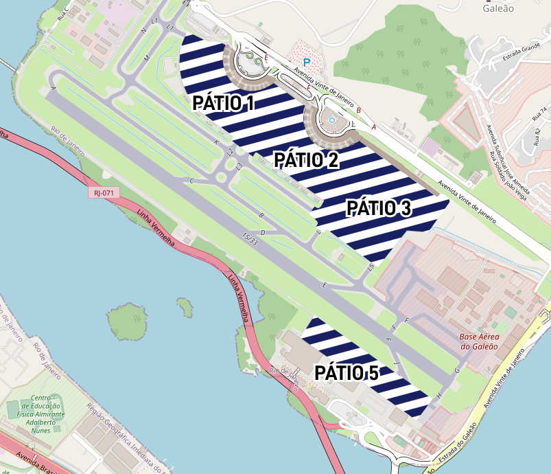

# SBGL - Galeão

## Dados Gerais

|                              | Informações                      |
|------------------------------|----------------------------------|
| **Nome do aeródromo**        | Galeão - Antônio Carlos Jobim    |
| **Tipo de Operação**         | Internacional, Público e Militar |
| **Regras de voo**            | IFR/VFR                          |
| **Horário de Funcionamento** | H24                              |
| **Altitude de transição**    | 7000 pés                         |
| **Elevação**                 | 28 pés (8,51m)                   |

## Pistas

### Descrição

| Pista | Preferencial                                   | ILS                                         | Circuito            |
|-------|------------------------------------------------|---------------------------------------------|---------------------|
| `10`  | Preferencial para **decolagens**               | :fontawesome-solid-circle-check:{.corok}    | Padrão              |
| `28`  | Preferencial para **pousos** quando em uso     | :fontawesome-solid-circle-check:{.corok}    | Não-padrão          | 
| `15`  | Preferencial para **pousos**                   | :fontawesome-solid-circle-check:{.corok}    | Não-padrão          |
| `33`  | Preferencial para **decolagens** quando em uso | :fontawesome-solid-circle-xmark:{ .cornot } | Padrão              |

!!! info "Informação importante!"

    Por conta da baixa demanda de voos no aeroporto, a operação padrão é manter a pista 10/28 {==fechada==}, operando decolagens e pousos pela 15/33, exceto por condições meteorológicas e de circulação no APP Rio.

<!--
### Configurações

| Configuração | Decolagem   | Pouso       | Observações                                                                                     |
| ------------ | ----------- | ----------- | ----------------------------------------------------------------------------------------------- |
| **LESTE**    | `11L` `11R` | `11L` `11R` | Prioriza-se a `11L` nas saídas para o setor **NORTE** e a `11R` nas saídas para o setor **SUL** |
| **OESTE**    | `29L` `29R` | `29L` `29R` | Prioriza-se a `29R` nas saídas para o setor **NORTE** e a `29L` nas saídas para o setor **SUL** |
-->

## Órgãos ATC

| Código     | Abrev. | Indicativo de Chamada | Frequência | Observações            |
| ---------- | ------ | --------------------- | ---------- | ---------------------- |
| SBGL_ATIS  | `AGL`  | ATIS Galeão           | 127.600    |                        |
| SBGL_DEL   | `DGL`  | Tráfego Galeão        | 121.000    | `DCL`                  |
| SBGL_RMP   | `RGL`  | Pátio Galeão          | 121.950    | Apenas durante eventos |
| SBGL_GND   | `GGL`  | Solo Galeão           | 121.650    |                        |
| SBGL_TWR   | `TGL`  | Torre Galeão          | 118.000    |                        |

## Operações

### Gerais

- O uso do transponder em modo *altitude reporting* (ALT RPTG) e ADS-B (se equipado) enquanto estiver nos pátios, taxiways e pista é necessário.
- Os pilotos deverão planejar a TKOF de forma a chegar no ponto de espera prontos para executá-la. Havendo indisponibilidade de TKOF imediata, informar ao órgão ATC com antecedência.
- Espera-se que ao receber autorização de TKOF, o piloto inicie a corrida imediatamente (o tempo de reação esperado é de até 10 segundos).
- A TWR Galeão não informará a hora de TKOF às ACFT. A instrução quanto à FREQ do próximo órgão a ser chamado AFT TKOF e, se necessárias, instruções complementares, serão emitidas juntamente com a AUTH de TKOF.
- Nas OPS de LDG, os pilotos não reportarão para TWR Galeão a COND de trem de pouso, EXC nas situações de EMERG com referência ao seu baixamento e/ou travamento.
- Todas as decolagens deverão empregar procedimento de abatimento de ruído, conforme manual de cada aeronave.
- O AD pode ser utilizado regularmente por quaisquer ACFT compatíveis com o RCD 4E ou inferior.

### Específicas

#### Tráfego VFR

- OBS VAC para entrada ou saída do circuito de TFC.
- Permitido treinamento de toque e arremetida de ACFT CIVIL conforme disponibilidade de tráfego.
- Há restrição às seguintes classes e tipos de ACFT:
    * ACFT WO EQPT RDO;
    * GLD;
    * ACFT WO transponder ou com falha neste EQPT;
    * FLT de ultraleves motorizados.
- Há restrição aos seguintes serviços aéreos:
    * Lançamento de objetos ou pulverização;
    * Reboque de ACFT;
    * Lançamento de paraquedas;
    * FLT acrobático.

#### Controle de Pátio

- Essa posição deverá ser aberta apenas durante eventos da Vatsim Brasil, sendo vedada a operação no dia a dia.
- Com RMP em serviço, ACFT DEST pátios `1`, `2`, `3` e `5` devem estabelecer CTC com o Controle de Pátio antes de ingressar.

??? info "Clique aqui para ver a área de atuação do Pátio Galeão"
    { loading=lazy }

#### Pátios e Pistas de Taxi

- TWY `B` BTN `F` e `G` exclusiva para ACFT com no máximo 36m de envergadura.

???+ warning "Atenção!"
    ACFT com mais de 36m de envergadura que irão decolar pela RWY 33 devem:

    - ingressar na TWY `F`;
    - cruzar a RWY 15/33;
    - livrar na TWY `J`;
    - continuar até a TWY `H`.

- TWY `Y1`, `Y2`, `Y3` e `Y4` exclusivas para ACFT com no máximo 36m de envergadura.
- `PÁTIO 1` exclusivo para ACFT com no máximo 36m de envergadura.

???+ warning "Atenção!"
    ACFT com mais de 36m de envergadura que irão decolar pela RWY 10 devem usar a TWY `L3` para sair do `PÁTIO 2` e seguirão via `K`, `N` e `P`.

    ACFT com menos de 36m de envergadura que irão decolar pela RWY 10 devem usar a TWY `L1` para sair do `PÁTIO 2` e seguirão via `N` e `P`.

- O `PÁTIO 1` é destinado às ACFT em voo internacional, comerciais em voo doméstico, executivas, de órgãos do governo, táxis aéreos e, em situações excepcionais, helicópteros para transbordo de passageiros de e para voos comerciais.
- O `PÁTIO 5` é destinado às ACFT de aviação geral doméstica, de aviação comercial para manutenção ou estadia prolongada, cargueiros, de transporte militar; do CAN; helicópteros; desviadas de outros aeroportos por motivos técnicos ou meteorológicos, exceto as previstas para o `PÁTIO 1`; da ponte aérea Rio/São Paulo, em caráter eventual.
- Devido inexistência de área para cheque de motores, será utilizado, em casos
excepcionais, trecho da TWY `M` entre a TWY `S` e TWY `V`.

#### Operações Simultâneas Dependentes em Pistas Convergentes

- Poderão ser empregadas operações simultâneas no conjunto de pistas 28 e 33, sendo que essas operações serão ativadas pela Torre Galeão e serão exclusivamente segregadas, com decolagens da pista 33 e pousos na pista 28.
- As operações dar-se-ão com o uso de cartas de aproximação específicas, contendo em suas identificações a palavra *Converging* (por exemplo, *IAC ILS U (Converging) RWY 28*) e terão os seus pontos de aproximação perdida recuados em relação à cabeceira.
- A informação de {==*operações simultâneas em pistas convergentes em andamento / simultaneous operations on converging runways in progress*==} será provida por meio do ATIS quando o tráfego ingressar na TMA.

??? warning "Atenção!"
    Caso o piloto identifique a impossibilidade de executar os procedimentos de aproximação específicos para as operações em pistas convergentes, deverá informar ao APP no primeiro contato.

- Em caso de arremetida após o MAPT, o piloto deverá curvar antes da radial limite publicada na carta. Não havendo possibilidade de tal manobra, informar ao APP/TWR.
- Os pilotos devem iniciar a decolagem do início da pista, sem a necessidade de taxiar até à cabeceira deslocada.
- Os pilotos deverão ajustar o pouso e a decolagem de modo a garantir o Tempo Mínimo de Ocupação de Pista (MROT).

A Torre Galeão poderá empregar as operações descritas acima[^3] em **duas** situações distintas, variando apenas o ponto de corte, estando satisfeitas as seguintes restrições:

[^3]: [AIP Brasil, AD 2 SBGL](https://aisweb.decea.mil.br/?i=publicacoes&p=aip) 

=== "IMC"

    !!! info "Nesse caso, o ponto de corte é de **3 nm**."

    1. As condições meteorológicas sejam tais que a visibilidade esteja igual ou superior à tabela de mínimos do procedimento, sendo que o teto deverá ser de pelo menos 100 FT acima da DH do procedimento;

    2. A informação de operação simultânea em pistas convergentes em andamento seja provida por meio do ATIS;

    3. A carta de aproximação por instrumentos específica para esse tipo de operação esteja em uso.

=== "VMC"

    !!! info "Já nesse caso, o ponto de corte é de **1,4 nm**."

    1. As condições meteorológicas sejam tais que, o teto esteja igual ou superior a 1500 FT e a visibilidade esteja igual ou superior à 5000 m;

    2. A informação de operação simultânea em pistas convergentes em andamento seja provida por meio do ATIS;

    3. A carta de aproximação por instrumentos específica para esse tipo de operação esteja em uso.

??? question "E o que é o ponto de corte?"
    Ponto de corte é o ponto limite onde uma aeronave na final da RWY 28 deve estar para que uma decolagem da RWY 33 seja autorizada. Por exemplo:

    - Em condições IMC, enquanto uma ACFT em aproximação para a RWY 28 não tiver passado 3 nm antes da cabeceira, uma ACFT pode receber autorização para TKOF da RWY 33. Se ela tiver passado esse ponto, nenhuma ACFT pode receber autorização para a TKOF enquanto a aeronave em aproximação não tiver pousado ou arremetido, sem haver violado a RDL limite do procedimento.
    - Em condições VMC esse ponto limite diminui para 1,4 nm da cabeceira da RWY 28.

##### Fraseologia específica

Em uma eventual arremetida após o MAPT na pista 28 é possível que a separação com as aeronaves decolando da pista 33 seja reduzida, de forma que, estando VMC, a aplicação de separação visual pode ser viável. Neste caso, uma informação de tráfego essencial deve ser detalhada e fornecida o quanto antes aos pilotos.

=== "Informação a ser provida para a aeronave aproximando"

    Exemplos de fraseologia a ser aplicada pelo controlador:

    | Estrutura | Exemplo |
    |-----------|---------|
    | (Ident. do Tráfego) curve a direita, para procedimento de aproximação perdida, tráfego essencial local, (Tipo), iniciando a decolagem da pista 33. | PTATC, curve a direita, para o procedimento de aproximação perdida, tráfego essencial local, B737 iniciando a decolagem da pista 33. |
    | (Ident. do Tráfego), curve a direita para o procedimento de aproximação perdida, tráfego essencial local, (Tipo), decolando da pista 33, passando o ponto médio da pista. | PTATC, curve a direita, para o procedimento de aproximação perdida, tráfego essencial local, B737 decolando da pista 33, passando o ponto médio da pista. |
    | (Ident. do Tráfego), curve a direita para o procedimento de aproximação perdida, tráfego essencial local, (Tipo), decolando da pista 33, cruzando a cabeceira 15. | PTATC, curve a direita, para o procedimento de aproximação perdida, tráfego essencial local, B737 decolando da pista 33, cruzando a cabeceira 15. |

=== "Informação a ser provida para a aeronave decolando"

    Exemplos de fraseologia a ser aplicada pelo controlador:

    | Estrutura | Exemplo |
    |-----------|---------|
    | (Ident. do Tráfego) tráfego, (Tipo), iniciando arremetida pista (28), atenção tráfego essencial local, passando a cabeceira 28. | PTATC, tráfego, B737 iniciando arremetida da pista 28, atenção tráfego essencial local, passando a cabeceira 28. |
    | (Ident. do Tráfego) tráfego, (Tipo), iniciando arremetida pista (28), atenção tráfego essencial local, passando o ponto médio da pista. | PTATC, tráfego, B737 iniciando arremetida da pista 28, atenção tráfego essencial local, passando o ponto médio da pista. |

#### Locais

`NIL`

## Posições de Parada

| Pátio       | Posições | Classificação                    |
|:-----------:| :------: | -------------------------------- |
| `1` `2` `3` |  1 - 22  | Sem uso                          |
| `1` `2` `3` | 23 - 45  | Domésticos                       |
| `1` `2` `3` | 46 - 84  | Internacionais                   |
| `1` `2` `3` | 85 - 149 | Remotas                          |
|     `5`     |  1 - 31  | Cargas                           |
|     `6`     |   ANY    | Manutenção - United              |
|     `7`     |   ANY    | Militar - Operacional            |
|     `8`     |   ANY    | Militar - Correio Aéreo Nacional |