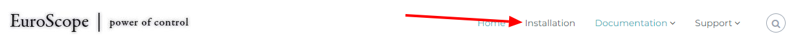
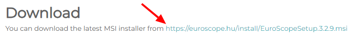

--8<-- "includes/abreviacoes.md"

## Download

!!! info "Informação"
    O Euroscope está disponível apenas para *Microsoft Windows*.

1. Acesse o [site do Euroscope](https://www.euroscope.hu) e acesse a página de downloads clicando em `Installation` na barra superior.

{ : style="border:2px solid #999" }

2. Clique no link disponível na seção "Download" para baixar o EuroScope. Após o download, siga as etapas do instalador normalmente.

{ : style="border:2px solid #999" }

!!! warning "Uma dica!"
    Recomendamos fortemente a leitura do manual do Euroscope, que pode ser facilmente encontrado no site em `Documentation` > `Download User's Guide`.

## *Sectorfiles* e Arquivos de Configuração

Os arquivos de setor são baixados e instalados **pelo [Aeronav GNG](https://files.aero-nav.com/SBXX)**. Para isso, siga os passos demonstrados no vídeo abaixo:

<iframe width="560" height="315" src="https://www.youtube.com/embed/odyaBXAEkhg?si=tEQH_ATFucSrw8ZY" title="YouTube video player" frameborder="0" allow="accelerometer; autoplay; clipboard-write; encrypted-media; gyroscope; picture-in-picture; web-share" referrerpolicy="strict-origin-when-cross-origin" allowfullscreen></iframe>

!!! warning "Atenção!"
    Se a caixa de diálogo não aparecer, você esqueceu de desmarcar a opção `Auto load last profile on startup` da etapa anterior. Desmarque a opção, e abra novamente o Euroscope.

??? question "Qual a diferença do perfil `radar` para o perfil `solo`?"
    O perfil `solo` contém um esquema de cores e tags otimizado para o controle nas posições `DEL`, `RMP`, `GND` e `TWR`.

    Já o perfil `radar` está otimizado para as posições `APP` e `CTR`.

!!! info "Uma informação importante"
    Se desejar mudar de posição e esta se encontrar em uma FIR diferente, você deverá reiniciar o Euroscope e abrir o perfil correto para a nova posição. Simplesmente carregar o novo setor/ASR não é suficiente.