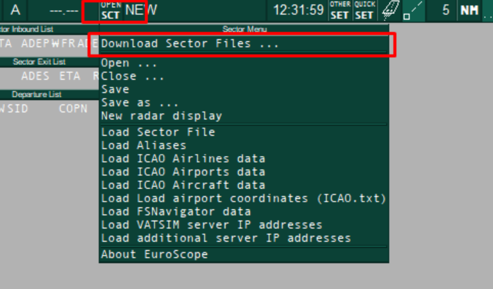
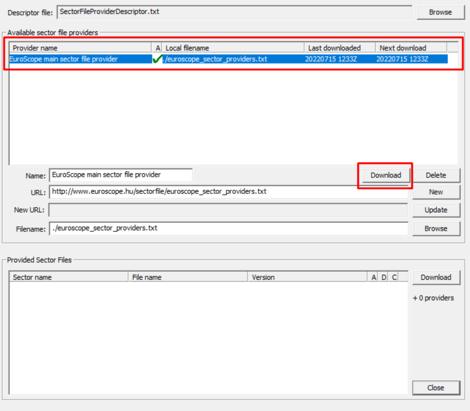
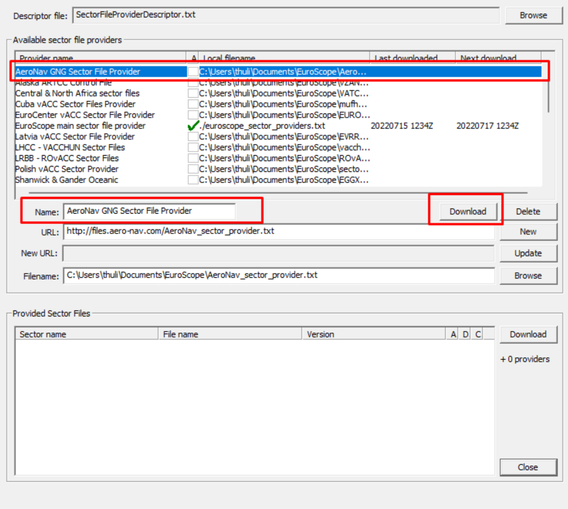
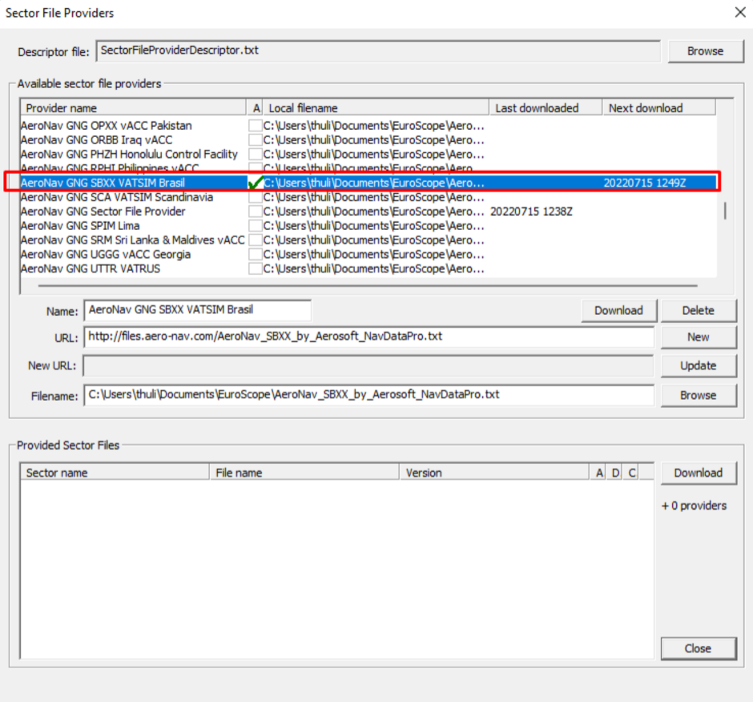
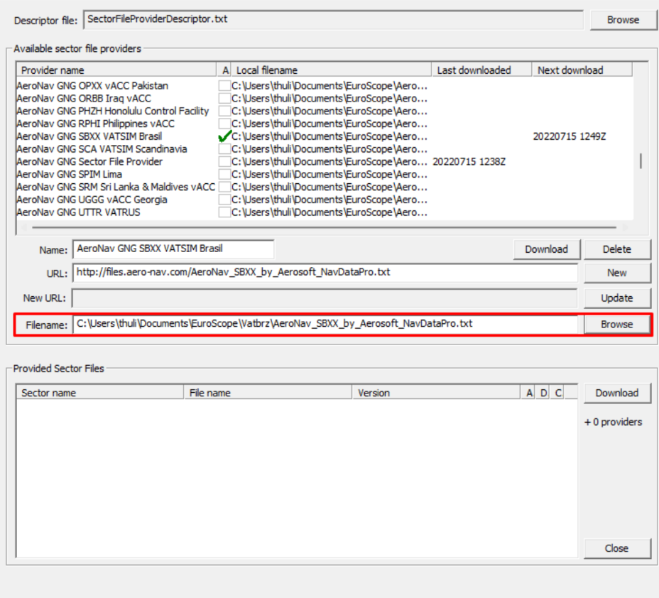
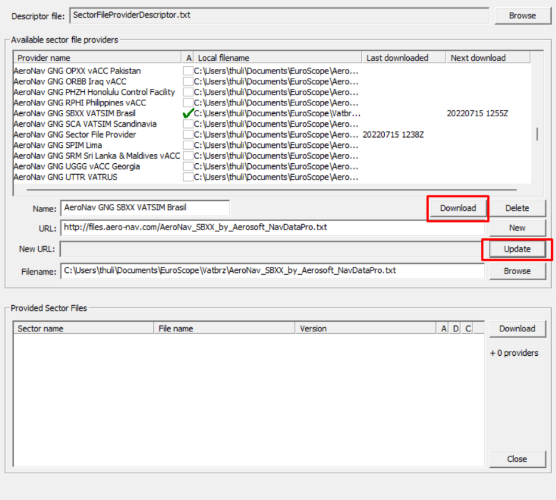
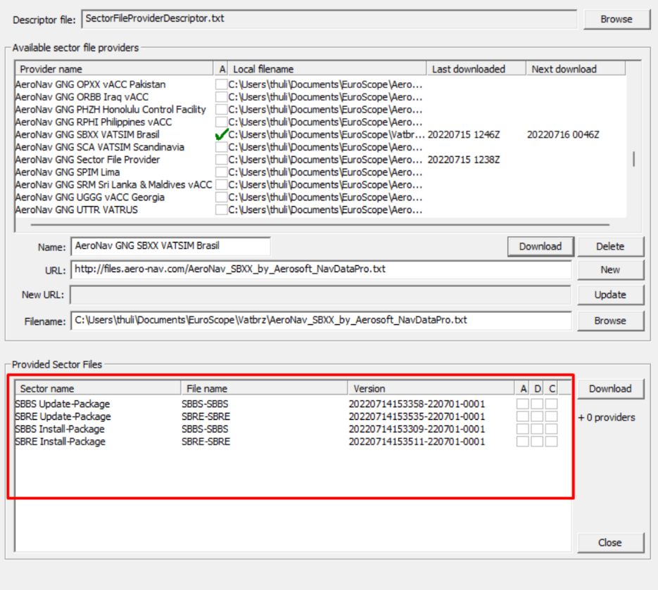
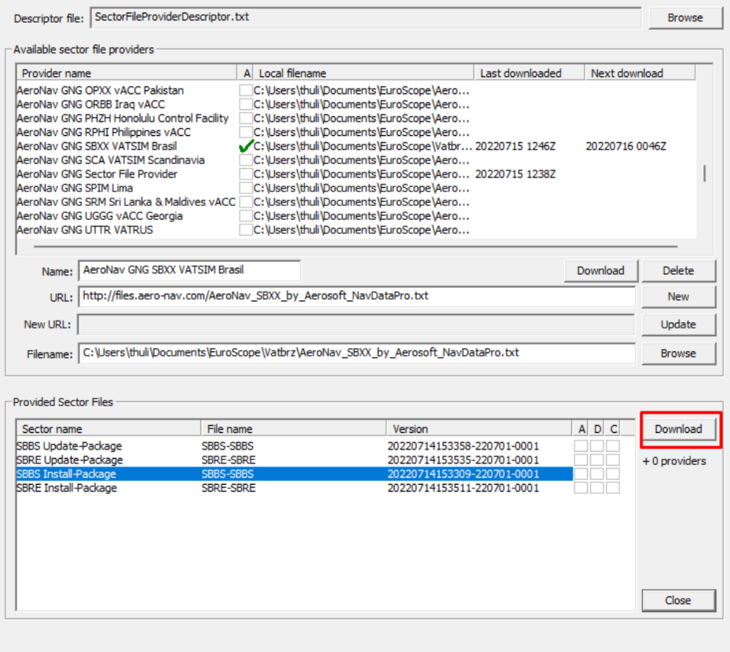
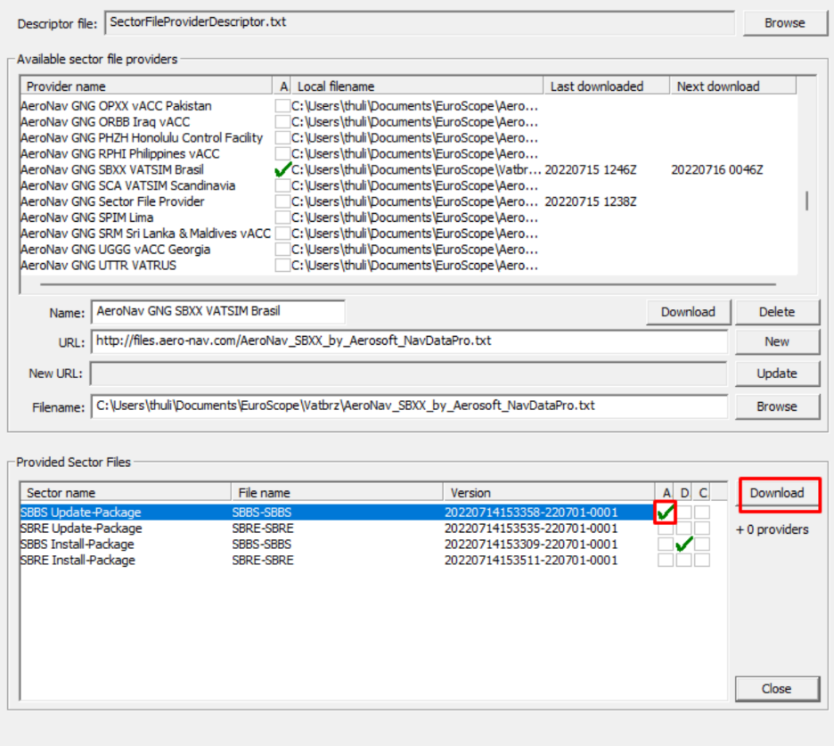
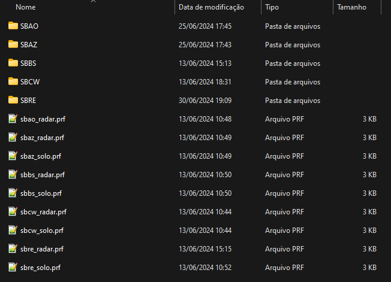

--8<-- "includes/abreviacoes.md"

## Download

!!! info "Informação"
    O Euroscope está disponível apenas para *Microsoft Windows*.

1. Acesse o [site do Euroscope](https://www.euroscope.hu) e acesse a página de downloads clicando em `Installation` na barra superior.

{ : style="border:2px solid #999" }

2. Clique no link disponível na seção "Download" para baixar o EuroScope. Após o download, siga as etapas do instalador normalmente.

{ : style="border:2px solid #999" }

!!! warning "Uma dica!"
    Recomendamos fortemente a leitura do manual do Euroscope, que pode ser facilmente encontrado no site em `Documentation` > `Download User's Guide`.

## *Sectorfiles* e Arquivos de Configuração

Os arquivos de setor são baixados e instalados **diretamente pelo EuroScope**. Para isso, siga os passos abaixo.

1. Abra o EuroScope, e selecione `Open SCT` > `Download Sector Files` na barra superior.

{ : style="height:300px" }

2. Selecione a opção `Download Sector Files`.

3. Localize e selecione a linha `EuroScope main sector file provider`, e clique no primeiro botão de `Download`.

{ : style="height:500px" }

4. Ao terminar esse download, **várias novas linhas irão aparecer**, com setores de todo o mundo. Localize e selecione a linha `AeroNav GNG Sector File Provider`, e clicque no primeiro botão de `Download` novamente.

{ : style="height:500px"}

5. Novas linhas vão aparecer. Agora selecione a linha `AeroNav GNG SBXX VATSIM Brasil`, marque a caixa na coluna `A` na lista superior, e clique novamente no primeiro botão de `Download`.

{ : style="height:500px" }

6. Vamos escolher agora a pasta onde serão colocados os arquivos de setor e configurações. Ainda com a linha `AeroNav GNG SBXX VATSIM Brasil` selecionada, selecione a opção `Browse`. Escolha a pasta onde deseja salvar seus arquivos de setor e configurações da VATBRZ, e selecione `Save`.

!!! warning "Atenção!"
    Não altere o nome do arquivo de texto. Recomendamos a pasta `Euroscope\Vatbrz`.

{ : style="height:500px" }

!!! info "Uma observação"
    A partir da versão 3.2.2 do Euroscope, a pasta padrão passou a ser `%appdata%\Euroscope`. A pasta `Documentos\Euroscope` não será mais criada por padrão, mas pode ser utilizada se preferir. Se preferir utilizar a pasta `%appdata%\Euroscope` criada pelo instalador, recomendamos utilizar o caminho `%appdata%\Euroscope\Vatbrz` para seus arquivos de setor na opção acima.

7. Depois de selecionar a pasta, clique no botão `Update` em cima de `Browse`. Em seguida, selecione novamente o primeiro botão de Download.

{ : style="height:500px" }

8. Agora, na parte inferior da janela de Download, você verá as opções de setores disponíveis para o Brasil. Existem 2 versões disponíveis para cada FIR:

    * **Install-Package**, que é o pacote completo com todos os arquivos necessários para a correta operação do Sector File, e
    * **Update-Package**, que é o pacote de atualização dos dados de navegação (fixos, aerovias, procedimentos etc.), sem alterar as configurações originais.

{ : style="height:500px" }

9. Selecione a opção *Install-Package* da FIR desejada, e clique na opção de `Download` ao lado.

!!! error "Se liga!"
    Não selecione a coluna `A` na linha **Install-Package**.

{ : style="height:500px" }

10. Após o download do **Install-Package**, selecione a linha **Update-Package** da mesma FIR, e marque a coluna `A` apenas do **Update-Package**. Isso garante que seus arquivos de setor sejam atualizados automaticamente.

{ : style="height:500px" }

11. Repita as etapas 9 e 10 para cada FIR que deseja realizar o download.

Por fim, desmarque a opção `Auto load last profile on startup`, no menu `Other SET`. São utilizados arquivos de perfil separados para cada FIR.

Feito isso, finalizamos a parte de downloads e instalações. Feche o Euroscope, e prossiga para o tópico "Configuração Inicial".

## Configuração Inicial

1. Agora, ao abrir o Euroscope, você será apresentado com um diálogo para selecionar o arquivo de perfil que deseja utilizar, conforme abaixo:

{ : style="height:500px" }

!!! warning "Atenção!"
    Se a caixa de diálogo não aparecer, você esqueceu de desmarcar a opção `Auto load last profile on startup` da etapa anterior. Desmarque a opção, e abra novamente o Euroscope.

2. No novo formato, você deve utilizar um arquivo de perfil diferente para cada posição de controle para cada FIR. Navegue para a pasta que você escolheu para seus arquivos de setor no item 6 da etapa anterior, selecione o arquivo de perfil onde se encontra a posição que você pretende controlar, e clique em `Open`.

??? question "Qual a diferença do perfil `radar` para o perfil `solo`?"
    O perfil `solo` contém um esquema de cores e tags otimizado para o controle nas posições `DEL`, `RMP`, `GND` e `TWR`.

    Já o perfil `radar` está otimizado para as posições `APP` e `CTR`.

!!! info "Uma informação importante"
    Se desejar mudar de posição e esta se encontrar em uma FIR diferente, você deverá reiniciar o Euroscope e abrir o perfil correto para a nova posição. Simplesmente carregar o novo setor/ASR não é suficiente.

3. Ao abrir o perfil da FIR correspondente, você verá uma tela similar a essa *(no exemplo, a FIR Curitiba)*, indicando que o carregamento está correto e tudo está corretamente instalado.