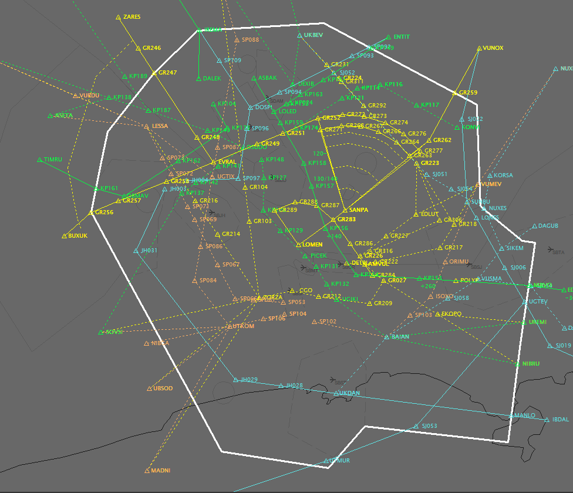

--8<-- "includes/abreviacoes.md"

A ferramenta principal é o [Euroscope](https://www.euroscope.hu). Nela são realizadas todas as atividades de controle de tráfego aéreo, seja em operação radar ou convencional, bem como informações meteorológicas, canais de coordenação com outros órgãos de controle e emissão de relatórios operacionais.

{ loading=lazy }