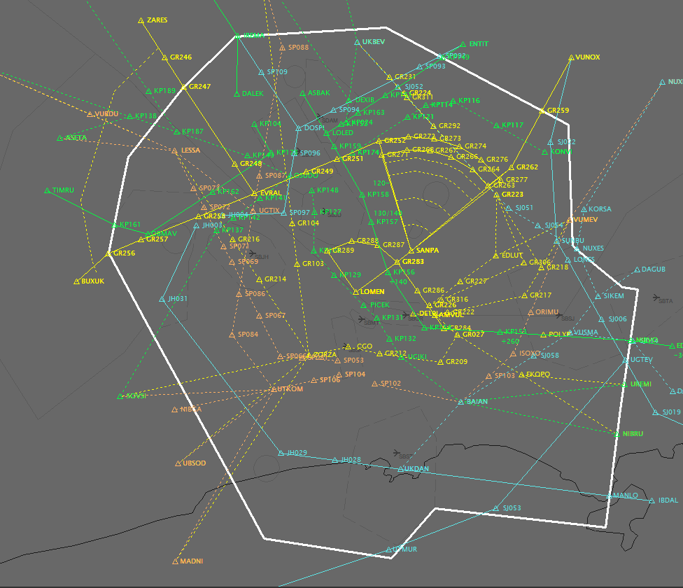
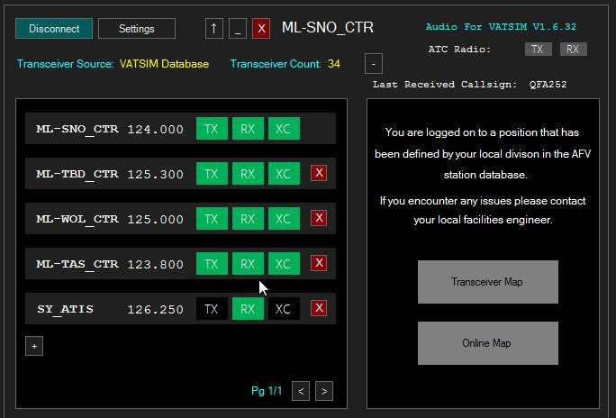
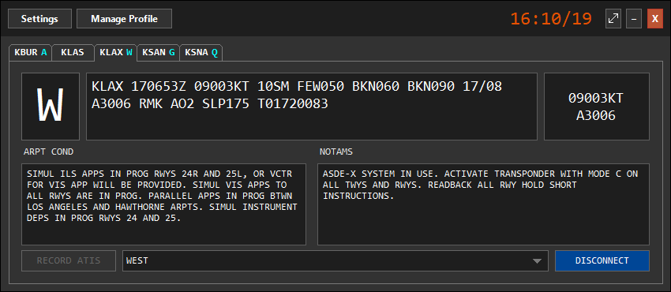

--8<-- "includes/abreviacoes.md"

A Vatsim Brasil utiliza os seguintes softwares para a execução do serviço ATC.

## Euroscope

A ferramenta principal é o [Euroscope](https://www.euroscope.hu). Nela são realizadas todas as atividades de controle de tráfego aéreo, seja em operação radar ou convencional, bem como informações meteorológicas, canais de coordenação com outros órgãos de controle e emissão de relatórios operacionais.

{ loading=lazy }

## AFV

O Audio For Vatsim, também conhecido como [AFV](https://audio.vatsim.net), é a plataforma de comunicação via voz da Vatsim. Trata-se de uma simulação avançada de antenas e frequências que permitem a comunicação entre todos os pilotos e controladores.

{ loading=lazy }

## vATIS

O [vATIS](https://docs.vatis.clowd.io) é o programa onde são criadas e difundidas as informações ATIS dos aeroportos onde o controlador se conectar.

{ loading=lazy }